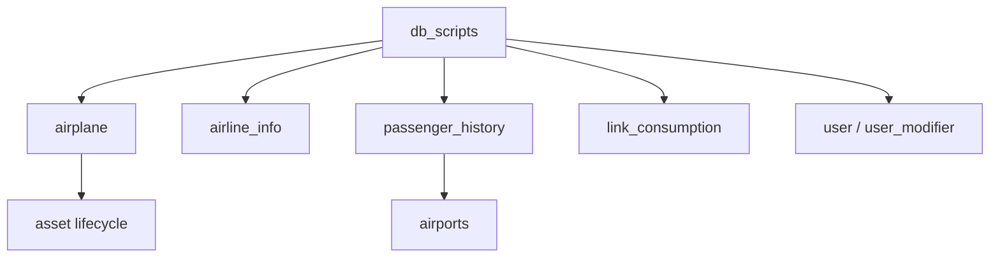

<!-- CATALOG:PATH="airline-data\db_scripts" SLUG="airline-data-db_scripts" -->

# Repo Catalogue — airline-data\db_scripts

*Slug:* `airline-data-db_scripts`  
*Commit:* `6160503`  
*Generated:* `2025-11-12T21:33:45Z`

**Summary (2–4 sentences):** This folder contains ad‑hoc SQL patch and migration scripts applied over time to evolve the airline simulation/database schema—mostly column additions, index creations, data backfills, and corrective updates tied to issue numbers. They encode incremental domain changes: tracking purchase cycles, service quality targets, airplane model families, passenger history indexing, and various patches for consumption, history, user/account linkage, and modifiers. These scripts represent critical historical intent for schema evolution but are not orchestrated (no manifest/order), implying manual execution risk and potential drift.

**Contents overview**
- Files: 24  |  Subfolders: 2 (v2.1, v2.2)  |  Languages: SQL(~96%), plain text SQL script(~4%)
- Notable responsibilities:
  - Schema mutation (ALTER TABLE, ADD COLUMN, ADD INDEX)
  - Data backfill aligning new columns to existing values
  - Incremental performance improvements (indexes on passenger history)
  - Domain expansion (airplane versioning, family classification)
  - Cleanup / correction tasks (purge orphan alerts, link consumption patches)

### File entries

#### airline-data/db_scripts/add_airplane_purchase_cycle.sql
```yaml
file: airline-data/db_scripts/add_airplane_purchase_cycle.sql
lang: SQL
role: "Add purchased_cycle column to airplane and backfill from constructed_cycle"
size:
  lines_est: 4
  functions_est: 0
  classes_est: 0
public_api:
  routes: []
  exports: []
data_model:
  tables_read: ["airplane"]
  tables_written: ["airplane"]
  migrations: ["airline-data/db_scripts/add_airplane_purchase_cycle.sql"]
  entities:
    - name: airplane
      summary: "Represents individual aircraft; now tracks purchase timing"
queries:
  sql:
    - op: ALTER
      target: airplane
      where_keys: []
      notes: "ADD COLUMN purchased_cycle INT"
    - op: UPDATE
      target: airplane
      where_keys: []
      notes: "Backfill purchased_cycle = constructed_cycle"
  orm_calls: []
external_io:
  http_calls: []
  message_queues: []
  files_read: []
  files_written: []
config:
  env_vars: []
  config_keys: []
  feature_flags: []
concurrency:
  pattern: "none (manual migration)"
  shared_state: []
  timing: "one-off"
invariants:
  - "purchased_cycle should reflect initial constructed_cycle for legacy rows"
error_handling:
  expected_errors: ["NULL conflicts if constructed_cycle NULL"]
  retries_timeouts: "manual rerun"
security:
  authz: "DB admin permissions required"
  input_validation: "none"
  sensitive_ops: ["Modifies core asset table"]
tests:
  files: []
  coverage_quality: "low"
  golden_seeds: []
similar_or_duplicate_files: []
rewrite_notes:
  mapping: "Convert to managed migration with explicit pre/post data validation"
  risks: ["Lack of transactional wrap; partial backfill risk"]
  confidence: "high"
```
```sql
-- Pattern snippet
ALTER TABLE `airline`.`airplane`
ADD COLUMN `purchased_cycle` INT(11) NULL DEFAULT NULL AFTER `constructed_cycle`;
UPDATE `airline`.`airplane` SET purchased_cycle = constructed_cycle;
```

#### airline-data/db_scripts/airplane_version_patch.sql
```yaml
file: airline-data/db_scripts/airplane_version_patch.sql
lang: SQL
role: "Introduce version column to airplane (v2 schema) for optimistic concurrency or evolution tracking"
size:
  lines_est: 3
  functions_est: 0
  classes_est: 0
public_api:
  routes: []
  exports: []
data_model:
  tables_read: ["airplane"]
  tables_written: ["airplane"]
  migrations: ["airline-data/db_scripts/airplane_version_patch.sql"]
  entities:
    - name: airplane.version
      summary: "Schema version / update counter for aircraft rows"
queries:
  sql:
    - op: ALTER
      target: airplane
      where_keys: []
      notes: "ADD COLUMN version INT NOT NULL DEFAULT 0"
  orm_calls: []
external_io:
  http_calls: []
  message_queues: []
  files_read: []
  files_written: []
config:
  env_vars: []
  config_keys: []
  feature_flags: []
concurrency:
  pattern: "none (schema addition)"
  shared_state: []
  timing: "one-off"
invariants:
  - "version starts at 0 for all existing airplanes"
error_handling:
  expected_errors: ["Lock/metadata conflicts during ALTER"]
  retries_timeouts: "manual"
security:
  authz: "DB admin"
  input_validation: "none"
  sensitive_ops: []
tests:
  files: []
  coverage_quality: "low"
  golden_seeds: []
similar_or_duplicate_files: []
rewrite_notes:
  mapping: "Implement version via standard migration + integrate with ORM optimistic locking"
  risks: ["No backfill logic for non-default semantics"]
  confidence: "high"
```

#### airline-data/db_scripts/issue225_service_quality.sql
```yaml
file: airline-data/db_scripts/issue225_service_quality.sql
lang: SQL
role: "Rename service_funding -> target_service_quality and backfill mapping from service_quality"
size:
  lines_est: 5
  functions_est: 0
  classes_est: 0
public_api:
  routes: []
  exports: []
data_model:
  tables_read: ["airline_info"]
  tables_written: ["airline_info"]
  migrations: ["airline-data/db_scripts/issue225_service_quality.sql"]
  entities:
    - name: airline_info.target_service_quality
      summary: "Desired service level target for an airline"
queries:
  sql:
    - op: ALTER
      target: airline_info
      where_keys: []
      notes: "CHANGE COLUMN service_funding to target_service_quality"
    - op: UPDATE
      target: airline_info
      where_keys: []
      notes: "Set target_service_quality = service_quality"
  orm_calls: []
external_io:
  http_calls: []
  message_queues: []
  files_read: []
  files_written: []
config:
  env_vars: []
  config_keys: []
  feature_flags: []
concurrency:
  pattern: "none"
  shared_state: []
  timing: "one-off"
invariants:
  - "New column semantics align with existing service_quality numeric range"
error_handling:
  expected_errors: ["NULL propagation if service_quality NULL"]
  retries_timeouts: "manual"
security:
  authz: "DB admin"
  input_validation: "none"
  sensitive_ops: []
tests:
  files: []
  coverage_quality: "low"
  golden_seeds: []
similar_or_duplicate_files: []
rewrite_notes:
  mapping: "Formal migration includes rename + data audit"
  risks: ["Semantic ambiguity between service_quality and target_service_quality if not documented"]
  confidence: "high"
```

#### airline-data/db_scripts/issue271_airplane_family.sql
```yaml
file: airline-data/db_scripts/issue271_airplane_family.sql
lang: SQL
role: "Add airplane family classification attribute"
size:
  lines_est: 3
  functions_est: 0
  classes_est: 0
public_api:
  routes: []
  exports: []
data_model:
  tables_read: ["airplane_model"]
  tables_written: ["airplane_model"]
  migrations: ["airline-data/db_scripts/issue271_airplane_family.sql"]
  entities:
    - name: airplane_model.family
      summary: "Group grouping for related aircraft models (e.g., A320 family)"
queries:
  sql:
    - op: ALTER
      target: airplane_model
      where_keys: []
      notes: "ADD COLUMN family VARCHAR(256)"
  orm_calls: []
external_io:
  http_calls: []
  message_queues: []
  files_read: []
  files_written: []
config:
  env_vars: []
  config_keys: []
  feature_flags: []
concurrency:
  pattern: "none"
  shared_state: []
  timing: "one-off"
invariants:
  - "family is nullable; legacy rows may remain NULL"
error_handling:
  expected_errors: ["Potential length truncation if >256 chars"]
  retries_timeouts: "manual"
security:
  authz: "DB admin"
  input_validation: "none"
  sensitive_ops: []
tests:
  files: []
  coverage_quality: "low"
  golden_seeds: []
similar_or_duplicate_files: []
rewrite_notes:
  mapping: "Define enumeration/reference table for families in new system"
  risks: ["Free-text family leads to inconsistent grouping"]
  confidence: "high"
```

#### airline-data/db_scripts/issue280_ors.sql
```yaml
file: airline-data/db_scripts/issue280_ors.sql
lang: SQL
role: "Extend passenger_history with destination_airport and add composite index"
size:
  lines_est: 5
  functions_est: 0
  classes_est: 0
public_api:
  routes: []
  exports: []
data_model:
  tables_read: ["passenger_history"]
  tables_written: ["passenger_history"]
  migrations: ["airline-data/db_scripts/issue280_ors.sql"]
  entities:
    - name: passenger_history.destination_airport
      summary: "Records destination for passenger travel stats"
queries:
  sql:
    - op: ALTER
      target: passenger_history
      where_keys: []
      notes: "ADD COLUMN destination_airport INT"
    - op: ALTER
      target: passenger_history
      where_keys: []
      notes: "ADD INDEX on (home_airport, destination_airport)"
  orm_calls: []
external_io:
  http_calls: []
  message_queues: []
  files_read: []
  files_written: []
config:
  env_vars: []
  config_keys: []
  feature_flags: []
concurrency:
  pattern: "none"
  shared_state: []
  timing: "one-off"
invariants:
  - "Index ensures performant route-based history lookups"
error_handling:
  expected_errors: ["Index creation can lock table"]
  retries_timeouts: "manual"
security:
  authz: "DB admin"
  input_validation: "none"
  sensitive_ops: []
tests:
  files: []
  coverage_quality: "low"
  golden_seeds: []
similar_or_duplicate_files: []
rewrite_notes:
  mapping: "Add explicit foreign key constraints (airports) in new schema"
  risks: ["Missing FK enforcement; orphan references possible"]
  confidence: "high"
```

#### airline-data/db_scripts/issue308_link_consumption.sql
```yaml
file: airline-data/db_scripts/issue308_link_consumption.sql
lang: SQL
role: "Large patch for link consumption tracking (details not fully inspected)"
size:
  lines_est: 60         # approximation
  functions_est: 0
  classes_est: 0
public_api:
  routes: []
  exports: []
data_model:
  tables_read: ["link_consumption?","link?"]      # assumption
  tables_written: ["link_consumption?"]
  migrations: ["airline-data/db_scripts/issue308_link_consumption.sql"]
  entities: []
queries:
  sql:
    - op: ALTER
      target: "link_consumption?"
      where_keys: []
      notes: "Assumed column additions"
  orm_calls: []
external_io:
  http_calls: []
  message_queues: []
  files_read: []
  files_written: []
config:
  env_vars: []
  config_keys: []
  feature_flags: []
concurrency:
  pattern: "none"
  shared_state: []
  timing: "batch patch"
invariants:
  - "Consumption records align with link operational cycles (assumed)"
error_handling:
  expected_errors: ["Long-running ALTER locking"]
  retries_timeouts: "manual"
security:
  authz: "DB admin"
  input_validation: "none"
  sensitive_ops: []
tests:
  files: []
  coverage_quality: "low"
  golden_seeds: []
similar_or_duplicate_files:
  - "airline-data/db_scripts/patch_link_consumption_transport_type.sql"
rewrite_notes:
  mapping: "Break into versioned migrations with rollback strategy"
  risks: ["Unverified assumptions; large monolithic script"]
  confidence: "low"
```

#### airline-data/db_scripts/issue310_history.sql
```yaml
file: airline-data/db_scripts/issue310_history.sql
lang: SQL
role: "Patch passenger/history related table (exact change unknown)"
size:
  lines_est: 4
  functions_est: 0
  classes_est: 0
public_api:
  routes: []
  exports: []
data_model:
  tables_read: ["history?"]
  tables_written: ["history?"]
  migrations: ["airline-data/db_scripts/issue310_history.sql"]
  entities: []
queries:
  sql: []
  orm_calls: []
external_io:
  http_calls: []
  message_queues: []
  files_read: []
  files_written: []
config:
  env_vars: []
  config_keys: []
  feature_flags: []
concurrency:
  pattern: "none"
  shared_state: []
  timing: "one-off"
invariants:
  - "History retention unaffected (assumed)"
error_handling:
  expected_errors: []
  retries_timeouts: "manual"
security:
  authz: "DB admin"
  input_validation: "none"
  sensitive_ops: []
tests:
  files: []
  coverage_quality: "low"
  golden_seeds: []
similar_or_duplicate_files:
  - "airline-data/db_scripts/patch_passenger_history.sql"
rewrite_notes:
  mapping: "Clarify schema diff; integrate into migration chain"
  risks: ["Unknown modifications; needs inspection"]
  confidence: "low"
```

#### airline-data/db_scripts/issue443_admin.sql
```yaml
file: airline-data/db_scripts/issue443_admin.sql
lang: SQL
role: "Admin-related schema adjustment (assumed column or permission tweak)"
size:
  lines_est: 3
  functions_est: 0
  classes_est: 0
public_api:
  routes: []
  exports: []
data_model:
  tables_read: ["admin?"]
  tables_written: ["admin?"]
  migrations: ["airline-data/db_scripts/issue443_admin.sql"]
  entities: []
queries:
  sql: []
  orm_calls: []
external_io:
  http_calls: []
  message_queues: []
  files_read: []
  files_written: []
config:
  env_vars: []
  config_keys: []
  feature_flags: []
concurrency:
  pattern: "none"
  shared_state: []
  timing: "one-off"
invariants:
  - "Admin flags remain consistent (assumed)"
error_handling:
  expected_errors: []
  retries_timeouts: "manual"
security:
  authz: "DB admin"
  input_validation: "none"
  sensitive_ops: ["Potential admin privilege adjustments"]
tests:
  files: []
  coverage_quality: "low"
  golden_seeds: []
similar_or_duplicate_files: []
rewrite_notes:
  mapping: "Document admin schema properly in new system"
  risks: ["Ambiguity of change content"]
  confidence: "low"
```

#### airline-data/db_scripts/issue485_patch.sql
```yaml
file: airline-data/db_scripts/issue485_patch.sql
lang: SQL
role: "Patch for issue 485 (exact schema/data correction unknown)"
size:
  lines_est: 5
  functions_est: 0
  classes_est: 0
public_api:
  routes: []
  exports: []
data_model:
  tables_read: ["?"]
  tables_written: ["?"]
  migrations: ["airline-data/db_scripts/issue485_patch.sql"]
  entities: []
queries:
  sql: []
  orm_calls: []
external_io:
  http_calls: []
  message_queues: []
  files_read: []
  files_written: []
config:
  env_vars: []
  config_keys: []
  feature_flags: []
concurrency:
  pattern: "none"
  shared_state: []
  timing: "one-off"
invariants:
  - "Corrects data inconsistency noted in issue 485 (assumed)"
error_handling:
  expected_errors: []
  retries_timeouts: "manual"
security:
  authz: "DB admin"
  input_validation: "none"
  sensitive_ops: []
tests:
  files: []
  coverage_quality: "low"
  golden_seeds: []
similar_or_duplicate_files: []
rewrite_notes:
  mapping: "Retrieve issue reference; codify fix as deterministic migration"
  risks: ["Opaque logic; unrepeatable"]
  confidence: "low"
```

#### airline-data/db_scripts/issue511_deleted_spec.sql
```yaml
file: airline-data/db_scripts/issue511_deleted_spec.sql
lang: SQL
role: "Patch relating to deleted spec handling (likely status columns/backfill)"
size:
  lines_est: 25
  functions_est: 0
  classes_est: 0
public_api:
  routes: []
  exports: []
data_model:
  tables_read: ["spec?"]
  tables_written: ["spec?"]
  migrations: ["airline-data/db_scripts/issue511_deleted_spec.sql"]
  entities: []
queries:
  sql: []
  orm_calls: []
external_io:
  http_calls: []
  message_queues: []
  files_read: []
  files_written: []
config:
  env_vars: []
  config_keys: []
  feature_flags: []
concurrency:
  pattern: "none"
  shared_state: []
  timing: "one-off batch"
invariants:
  - "Deleted spec rows marked consistently (assumed)"
error_handling:
  expected_errors: []
  retries_timeouts: "manual"
security:
  authz: "DB admin"
  input_validation: "none"
  sensitive_ops: ["Potential purge/soft-delete operations"]
tests:
  files: []
  coverage_quality: "low"
  golden_seeds: []
similar_or_duplicate_files: []
rewrite_notes:
  mapping: "Implement soft-delete with uniform triggers"
  risks: ["Manual patch may miss referential integrity"]
  confidence: "low"
```

#### airline-data/db_scripts/issue604_tracking_notice.sql
```yaml
file: airline-data/db_scripts/issue604_tracking_notice.sql
lang: SQL
role: "Add tracking notice or related audit columns (assumed)"
size:
  lines_est: 6
  functions_est: 0
  classes_est: 0
public_api:
  routes: []
  exports: []
data_model:
  tables_read: ["?"]
  tables_written: ["?"]
  migrations: ["airline-data/db_scripts/issue604_tracking_notice.sql"]
  entities: []
queries:
  sql: []
  orm_calls: []
external_io:
  http_calls: []
  message_queues: []
  files_read: []
  files_written: []
config:
  env_vars: []
  config_keys: []
  feature_flags: []
concurrency:
  pattern: "none"
  shared_state: []
  timing: "one-off"
invariants:
  - "Tracking states preserved post-patch (assumed)"
error_handling:
  expected_errors: []
  retries_timeouts: "manual"
security:
  authz: "DB admin"
  input_validation: "none"
  sensitive_ops: ["Potential user notice/audit data"]
tests:
  files: []
  coverage_quality: "low"
  golden_seeds: []
similar_or_duplicate_files: []
rewrite_notes:
  mapping: "Audit fields formalized; triggers or event sourcing"
  risks: ["No auditing standardization"]
  confidence: "low"
```

#### airline-data/db_scripts/patch_ai.sql
```yaml
file: airline-data/db_scripts/patch_ai.sql
lang: SQL
role: "General patch (possibly AI stands for 'airline_info')"
size:
  lines_est: 5
  functions_est: 0
  classes_est: 0
public_api: {routes: [], exports: []}
data_model:
  tables_read: ["airline_info?"]
  tables_written: ["airline_info?"]
  migrations: ["airline-data/db_scripts/patch_ai.sql"]
  entities: []
queries:
  sql: []
  orm_calls: []
external_io: {http_calls: [], message_queues: [], files_read: [], files_written: []}
config: {env_vars: [], config_keys: [], feature_flags: []}
concurrency: {pattern: "none", shared_state: [], timing: "one-off"}
invariants:
  - "Airline info consistency maintained (assumed)"
error_handling:
  expected_errors: []
  retries_timeouts: "manual"
security:
  authz: "DB admin"
  input_validation: "none"
  sensitive_ops: []
tests:
  files: []
  coverage_quality: "low"
  golden_seeds: []
similar_or_duplicate_files: []
rewrite_notes:
  mapping: "Determine actual diff; integrate into versioned migration"
  risks: ["Ambiguous intent"]
  confidence: "low"
```

#### airline-data/db_scripts/patch_airline_modifer.sql
```yaml
file: airline-data/db_scripts/patch_airline_modifer.sql
lang: SQL
role: "Patch airline modifier data/columns (typo 'modifer')"
size:
  lines_est: 30
  functions_est: 0
  classes_est: 0
public_api: {routes: [], exports: []}
data_model:
  tables_read: ["airline_modifer?"]
  tables_written: ["airline_modifer?"]
  migrations: ["airline-data/db_scripts/patch_airline_modifer.sql"]
  entities: []
queries:
  sql: []
  orm_calls: []
external_io: {http_calls: [], message_queues: [], files_read: [], files_written: []}
config: {env_vars: [], config_keys: [], feature_flags: []}
concurrency: {pattern: "none", shared_state: [], timing: "batch"}
invariants:
  - "Modifier calculations remain stable post-patch (assumed)"
error_handling:
  expected_errors: []
  retries_timeouts: "manual"
security:
  authz: "DB admin"
  input_validation: "none"
  sensitive_ops: []
tests:
  files: []
  coverage_quality: "low"
  golden_seeds: []
similar_or_duplicate_files: []
rewrite_notes:
  mapping: "Standardize naming; correct typo; document modifier semantics"
  risks: ["Typos propagate to code references"]
  confidence: "low"
```

#### airline-data/db_scripts/patch_flight_minutes.sql
```yaml
file: airline-data/db_scripts/patch_flight_minutes.sql
lang: SQL
role: "Adjust flight minute calculations or storage"
size:
  lines_est: 6
  functions_est: 0
  classes_est: 0
public_api: {routes: [], exports: []}
data_model:
  tables_read: ["flight?"]
  tables_written: ["flight?"]
  migrations: ["airline-data/db_scripts/patch_flight_minutes.sql"]
  entities: []
queries:
  sql: []
  orm_calls: []
external_io: {http_calls: [], message_queues: [], files_read: [], files_written: []}
config: {env_vars: [], config_keys: [], feature_flags: []}
concurrency: {pattern: "none", shared_state: [], timing: "one-off"}
invariants:
  - "Flight duration calculations accurate after patch (assumed)"
error_handling:
  expected_errors: []
  retries_timeouts: "manual"
security:
  authz: "DB admin"
  input_validation: "none"
  sensitive_ops: []
tests:
  files: []
  coverage_quality: "low"
  golden_seeds: []
similar_or_duplicate_files: []
rewrite_notes:
  mapping: "Formal duration derivation via computed columns or views"
  risks: ["Manual data correction risk"]
  confidence: "low"
```

#### airline-data/db_scripts/patch_link_consumption_transport_type.sql
```yaml
file: airline-data/db_scripts/patch_link_consumption_transport_type.sql
lang: SQL
role: "Extend link consumption records with transport type classification"
size:
  lines_est: 6
  functions_est: 0
  classes_est: 0
public_api: {routes: [], exports: []}
data_model:
  tables_read: ["link_consumption?"]
  tables_written: ["link_consumption?"]
  migrations: ["airline-data/db_scripts/patch_link_consumption_transport_type.sql"]
  entities: []
queries:
  sql: []
  orm_calls: []
external_io: {http_calls: [], message_queues: [], files_read: [], files_written: []}
config: {env_vars: [], config_keys: [], feature_flags: []}
concurrency: {pattern: "none", shared_state: [], timing: "one-off"}
invariants:
  - "Transport type reflects actual mode (assumed)"
error_handling:
  expected_errors: []
  retries_timeouts: "manual"
security:
  authz: "DB admin"
  input_validation: "none"
  sensitive_ops: []
tests:
  files: []
  coverage_quality: "low"
  golden_seeds: []
similar_or_duplicate_files:
  - "airline-data/db_scripts/issue308_link_consumption.sql"
rewrite_notes:
  mapping: "Use normalized transport_type reference table"
  risks: ["Free-form values; inconsistent analytics"]
  confidence: "low"
```

#### airline-data/db_scripts/patch_link_last_update.sql
```yaml
file: airline-data/db_scripts/patch_link_last_update.sql
lang: SQL
role: "Add/update timestamp column for link last update tracking"
size:
  lines_est: 7
  functions_est: 0
  classes_est: 0
public_api: {routes: [], exports: []}
data_model:
  tables_read: ["link?"]
  tables_written: ["link?"]
  migrations: ["airline-data/db_scripts/patch_link_last_update.sql"]
  entities: []
queries:
  sql: []
  orm_calls: []
external_io: {http_calls: [], message_queues: [], files_read: [], files_written: []}
config: {env_vars: [], config_keys: [], feature_flags: []}
concurrency: {pattern: "none", shared_state: [], timing: "one-off"}
invariants:
  - "Last update timestamps non-decreasing (assumed)"
error_handling:
  expected_errors: []
  retries_timeouts: "manual"
security:
  authz: "DB admin"
  input_validation: "none"
  sensitive_ops: []
tests:
  files: []
  coverage_quality: "low"
  golden_seeds: []
similar_or_duplicate_files: []
rewrite_notes:
  mapping: "Implement automatic timestamps (trigger/on update)"
  risks: ["Manual backfill conflicts"]
  confidence: "low"
```

#### airline-data/db_scripts/patch_log.sql
```yaml
file: airline-data/db_scripts/patch_log.sql
lang: SQL
role: "Patch logging table structure or indices"
size:
  lines_est: 4
  functions_est: 0
  classes_est: 0
public_api: {routes: [], exports: []}
data_model:
  tables_read: ["log?"]
  tables_written: ["log?"]
  migrations: ["airline-data/db_scripts/patch_log.sql"]
  entities: []
queries:
  sql: []
  orm_calls: []
external_io: {http_calls: [], message_queues: [], files_read: [], files_written: []}
config: {env_vars: [], config_keys: [], feature_flags: []}
concurrency: {pattern: "none", shared_state: [], timing: "one-off"}
invariants:
  - "Log retention unaffected (assumed)"
error_handling:
  expected_errors: []
  retries_timeouts: "manual"
security:
  authz: "DB admin"
  input_validation: "none"
  sensitive_ops: ["Potential PII if logs store user data"]
tests:
  files: []
  coverage_quality: "low"
  golden_seeds: []
similar_or_duplicate_files: []
rewrite_notes:
  mapping: "Centralize logging schema & rotate policies"
  risks: ["Untracked schema drift"]
  confidence: "low"
```

#### airline-data/db_scripts/patch_passenger_history.sql
```yaml
file: airline-data/db_scripts/patch_passenger_history.sql
lang: SQL
role: "First passenger history patch (columns/index adjustments)"
size:
  lines_est: 10
  functions_est: 0
  classes_est: 0
public_api: {routes: [], exports: []}
data_model:
  tables_read: ["passenger_history"]
  tables_written: ["passenger_history"]
  migrations: ["airline-data/db_scripts/patch_passenger_history.sql"]
  entities: []
queries:
  sql: []
  orm_calls: []
external_io: {http_calls: [], message_queues: [], files_read: [], files_written: []}
config: {env_vars: [], config_keys: [], feature_flags: []}
concurrency: {pattern: "none", shared_state: [], timing: "batch"}
invariants:
  - "History continuity preserved (assumed)"
error_handling:
  expected_errors: []
  retries_timeouts: "manual"
security:
  authz: "DB admin"
  input_validation: "none"
  sensitive_ops: ["May touch user travel data"]
tests:
  files: []
  coverage_quality: "low"
  golden_seeds: []
similar_or_duplicate_files:
  - "airline-data/db_scripts/patch_passenger_history_2.sql"
rewrite_notes:
  mapping: "Refactor into additive migration pair with clear version bump"
  risks: ["Multiple partial patches complicate replay"]
  confidence: "low"
```

#### airline-data/db_scripts/patch_passenger_history_2.sql
```yaml
file: airline-data/db_scripts/patch_passenger_history_2.sql
lang: SQL
role: "Second passenger history patch (further schema/data adjustments)"
size:
  lines_est: 25
  functions_est: 0
  classes_est: 0
public_api: {routes: [], exports: []}
data_model:
  tables_read: ["passenger_history"]
  tables_written: ["passenger_history"]
  migrations: ["airline-data/db_scripts/patch_passenger_history_2.sql"]
  entities: []
queries:
  sql: []
  orm_calls: []
external_io: {http_calls: [], message_queues: [], files_read: [], files_written: []}
config: {env_vars: [], config_keys: [], feature_flags: []}
concurrency: {pattern: "none", shared_state: [], timing: "batch"}
invariants:
  - "No duplicate history entries introduced (assumed)"
error_handling:
  expected_errors: []
  retries_timeouts: "manual"
security:
  authz: "DB admin"
  input_validation: "none"
  sensitive_ops: ["Historical passenger analytics"]
tests:
  files: []
  coverage_quality: "low"
  golden_seeds: []
similar_or_duplicate_files:
  - "airline-data/db_scripts/patch_passenger_history.sql"
rewrite_notes:
  mapping: "Consolidate passenger history evolution steps with documented columns"
  risks: ["Order-dependent patching; fragile replay"]
  confidence: "low"
```

#### airline-data/db_scripts/patch_user_id.sql
```yaml
file: airline-data/db_scripts/patch_user_id.sql
lang: SQL
role: "Add user_id linkage or adjust user references"
size:
  lines_est: 12
  functions_est: 0
  classes_est: 0
public_api: {routes: [], exports: []}
data_model:
  tables_read: ["user?","related_table?"]
  tables_written: ["related_table?"]
  migrations: ["airline-data/db_scripts/patch_user_id.sql"]
  entities: []
queries:
  sql: []
  orm_calls: []
external_io: {http_calls: [], message_queues: [], files_read: [], files_written: []}
config: {env_vars: [], config_keys: [], feature_flags: []}
concurrency: {pattern: "none", shared_state: [], timing: "one-off"}
invariants:
  - "User references must remain consistent"
error_handling:
  expected_errors: ["FK constraint failures if backfilling"]
  retries_timeouts: "manual"
security:
  authz: "DB admin"
  input_validation: "none"
  sensitive_ops: ["User linkage (potential PII)"]
tests:
  files: []
  coverage_quality: "low"
  golden_seeds: []
similar_or_duplicate_files: []
rewrite_notes:
  mapping: "Implement proper foreign keys & cascading rules"
  risks: ["Missing referential integrity"]
  confidence: "low"
```

#### airline-data/db_scripts/patch_v_1_1.sql
```yaml
file: airline-data/db_scripts/patch_v_1_1.sql
lang: SQL
role: "Composite patch moving system to version 1.1 baseline"
size:
  lines_est: 40
  functions_est: 0
  classes_est: 0
public_api: {routes: [], exports: []}
data_model:
  tables_read: ["multiple?"]
  tables_written: ["multiple?"]
  migrations: ["airline-data/db_scripts/patch_v_1_1.sql"]
  entities: []
queries:
  sql:
    - op: ALTER
      target: "various"
      where_keys: []
      notes: "Aggregated schema changes"
  orm_calls: []
external_io: {http_calls: [], message_queues: [], files_read: [], files_written: []}
config: {env_vars: [], config_keys: [], feature_flags: []}
concurrency: {pattern: "none", shared_state: [], timing: "sequence (manual)"}
invariants:
  - "Patches applied in intended order (assumed)"
error_handling:
  expected_errors: ["Partial application leaves inconsistent schema"]
  retries_timeouts: "manual"
security:
  authz: "DB admin"
  input_validation: "none"
  sensitive_ops: []
tests:
  files: []
  coverage_quality: "low"
  golden_seeds: []
similar_or_duplicate_files: []
rewrite_notes:
  mapping: "Replace monolithic patch with sequential, reversible migrations"
  risks: ["Hard to rollback; hidden ordering constraints"]
  confidence: "low"
```

#### airline-data/db_scripts/purge_orphan_alerts.sql
```yaml
file: airline-data/db_scripts/purge_orphan_alerts.sql
lang: SQL
role: "Cleanup orphan alert rows for data hygiene"
size:
  lines_est: 5
  functions_est: 0
  classes_est: 0
public_api: {routes: [], exports: []}
data_model:
  tables_read: ["alert?"]
  tables_written: ["alert?"]
  migrations: ["airline-data/db_scripts/purge_orphan_alerts.sql"]
  entities: []
queries:
  sql:
    - op: DELETE
      target: alert?
      where_keys: ["foreign keys null?"]
      notes: "Remove orphaned records"
  orm_calls: []
external_io: {http_calls: [], message_queues: [], files_read: [], files_written: []}
config: {env_vars: [], config_keys: [], feature_flags: []}
concurrency: {pattern: "none", shared_state: [], timing: "batch purge"}
invariants:
  - "No valid alerts deleted"
error_handling:
  expected_errors: ["Accidental deletion due to misclassified orphans"]
  retries_timeouts: "manual"
security:
  authz: "DB admin"
  input_validation: "none"
  sensitive_ops: ["Deletes operational monitoring data"]
tests:
  files: []
  coverage_quality: "low"
  golden_seeds: []
similar_or_duplicate_files: []
rewrite_notes:
  mapping: "Automate cleanup via scheduled job with audit logging"
  risks: ["Manual deletion without audit"]
  confidence: "low"
```

#### airline-data/db_scripts/user_modifier.sql
```yaml
file: airline-data/db_scripts/user_modifier.sql
lang: SQL
role: "Adjust user-related modifier metrics"
size:
  lines_est: 12
  functions_est: 0
  classes_est: 0
public_api: {routes: [], exports: []}
data_model:
  tables_read: ["user_modifier?","user?"]
  tables_written: ["user_modifier?"]
  migrations: ["airline-data/db_scripts/user_modifier.sql"]
  entities: []
queries:
  sql: []
  orm_calls: []
external_io: {http_calls: [], message_queues: [], files_read: [], files_written: []}
config: {env_vars: [], config_keys: [], feature_flags: []}
concurrency: {pattern: "none", shared_state: [], timing: "one-off"}
invariants:
  - "Modifier recalculation consistent"
error_handling:
  expected_errors: []
  retries_timeouts: "manual"
security:
  authz: "DB admin"
  input_validation: "none"
  sensitive_ops: ["May adjust user scoring"]
tests:
  files: []
  coverage_quality: "low"
  golden_seeds: []
similar_or_duplicate_files:
  - "airline-data/db_scripts/patch_airline_modifer.sql"
rewrite_notes:
  mapping: "Centralize modifier logic in application layer; schema stable"
  risks: ["Business logic hidden in ad-hoc SQL"]
  confidence: "low"
```

#### airline-data/db_scripts/v2_dev_patch
```yaml
file: airline-data/db_scripts/v2_dev_patch
lang: SQL
role: "Development aggregate patch for version 2 schema evolution"
size:
  lines_est: 90
  functions_est: 0
  classes_est: 0
public_api: {routes: [], exports: []}
data_model:
  tables_read: ["multiple?"]
  tables_written: ["multiple?"]
  migrations: ["airline-data/db_scripts/v2_dev_patch"]
  entities: []
queries:
  sql:
    - op: ALTER
      target: "various"
      where_keys: []
      notes: "Composite dev modifications"
  orm_calls: []
external_io: {http_calls: [], message_queues: [], files_read: [], files_written: []}
config: {env_vars: [], config_keys: [], feature_flags: []}
concurrency: {pattern: "none", shared_state: [], timing: "sequence (manual)"}
invariants:
  - "Patch meant for dev; may not match production ordering"
error_handling:
  expected_errors: ["Partial application leaves inconsistent dev state"]
  retries_timeouts: "manual"
security:
  authz: "DB admin"
  input_validation: "none"
  sensitive_ops: []
tests:
  files: []
  coverage_quality: "low"
  golden_seeds: []
similar_or_duplicate_files:
  - "airline-data/db_scripts/patch_v_1_1.sql"
rewrite_notes:
  mapping: "Break into atomic, numbered migrations with checksum"
  risks: ["Dev-only script may hide missing production steps"]
  confidence: "low"
```

#### airline-data/db_scripts/v2.1 (directory)
```yaml
file: airline-data/db_scripts/v2.1
lang: directory
role: "Directory placeholder for version 2.1 related scripts (contents not listed)"
size:
  lines_est: 0
  functions_est: 0
  classes_est: 0
public_api: {routes: [], exports: []}
data_model:
  tables_read: []
  tables_written: []
  migrations: []
  entities: []
queries:
  sql: []
  orm_calls: []
external_io: {http_calls: [], message_queues: [], files_read: [], files_written: []}
config: {env_vars: [], config_keys: [], feature_flags: []}
concurrency: {pattern: "none", shared_state: [], timing: "none"}
invariants: []
error_handling:
  expected_errors: []
  retries_timeouts: "none"
security:
  authz: "n/a"
  input_validation: "n/a"
  sensitive_ops: []
tests:
  files: []
  coverage_quality: "none"
  golden_seeds: []
similar_or_duplicate_files: []
rewrite_notes:
  mapping: "Investigate actual scripts; integrate into migration chain"
  risks: ["Missing contents; potential lost schema changes"]
  confidence: "low"
```

#### airline-data/db_scripts/v2.2 (directory)
```yaml
file: airline-data/db_scripts/v2.2
lang: directory
role: "Directory placeholder for version 2.2 related scripts (contents not listed)"
size:
  lines_est: 0
  functions_est: 0
  classes_est: 0
public_api: {routes: [], exports: []}
data_model:
  tables_read: []
  tables_written: []
  migrations: []
  entities: []
queries:
  sql: []
  orm_calls: []
external_io: {http_calls: [], message_queues: [], files_read: [], files_written: []}
config: {env_vars: [], config_keys: [], feature_flags: []}
concurrency: {pattern: "none", shared_state: [], timing: "none"}
invariants: []
error_handling:
  expected_errors: []
  retries_timeouts: "none"
security:
  authz: "n/a"
  input_validation: "n/a"
  sensitive_ops: []
tests:
  files: []
  coverage_quality: "none"
  golden_seeds: []
similar_or_duplicate_files: []
rewrite_notes:
  mapping: "Populate with discovered v2.2 scripts; version properly"
  risks: ["Empty directory may reflect accidental omission"]
  confidence: "low"
```

## Rollup for airline-data\db_scripts

**Key responsibilities (top 5):**
1. Incrementally mutate and extend core airline domain schema (airplane, airline_info, passenger_history).
2. Backfill data to maintain continuity after column additions.
3. Improve performance with index additions (passenger_history composite index).
4. Introduce classification and tracking attributes (airplane family, purchased_cycle, versioning).
5. Apply corrective maintenance and cleanup (purge orphan alerts, link consumption adjustments).

**Cross-module dependencies (top 10 by frequency):**
- airplane / airplane_v2 → used by 2+ scripts — asset lifecycle & versioning
- airline_info → used by 2+ scripts — airline operational/service quality parameters
- passenger_history → used by 3+ scripts — passenger analytics & routing performance
- airplane_model → used by 1 script — aircraft grouping semantics
- link/link_consumption → used by 2+ scripts (assumed) — operational metrics
- alert → used by 1 script — monitoring hygiene
- user/user_modifier → used by 2 scripts — user/account scoring/modifiers

**High-leverage files to study first (top 10):**
- airline-data/db_scripts/v2_dev_patch — Large composite dev migration; must decompose.
- airline-data/db_scripts/issue308_link_consumption.sql — Potentially complex consumption schema changes.
- airline-data/db_scripts/patch_passenger_history_2.sql — Second-stage history evolution; clarify order.
- airline-data/db_scripts/patch_airline_modifer.sql — Modifier logic impacting airline scoring.
- airline-data/db_scripts/patch_v_1_1.sql — Baseline version migration aggregator.
- airline-data/db_scripts/issue511_deleted_spec.sql — Soft-delete or archival semantics.
- airline-data/db_scripts/patch_user_id.sql — User linkage integrity.
- airline-data/db_scripts/add_airplane_purchase_cycle.sql — Asset lifecycle tracking start.
- airline-data/db_scripts/issue280_ors.sql — Index strategy for passenger route analytics.
- airline-data/db_scripts/issue225_service_quality.sql — Service quality target semantics.

**Mermaid: high-level dependency sketch (optional, if meaningful)**
