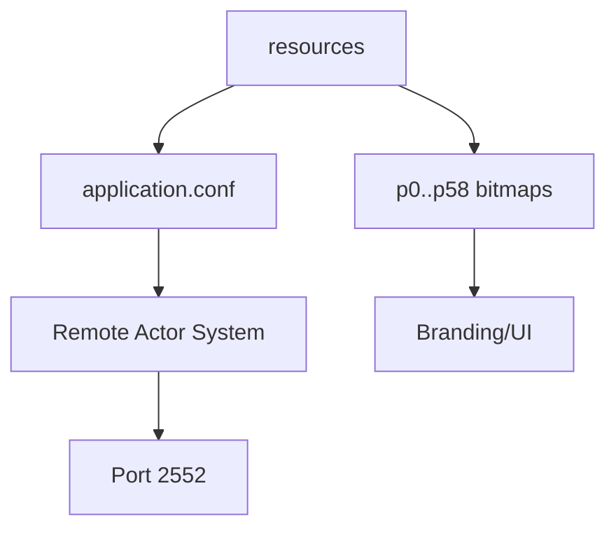

<!-- CATALOG:PATH="airline-data\src\main\resources" SLUG="airline-data-src-main-resources" -->

# Repo Catalogue — airline-data\src\main\resources

*Slug:* `airline-data-src-main-resources`  
*Commit:* `6160503`  
*Generated:* `2025-11-12T21:47:12Z`

**Summary (2–4 sentences):** This folder contains runtime configuration (`application.conf`) for a Pekko (Akka) remote actor system (artery TCP on port 2552) plus a fixed catalogue of preset airline logo image assets (`blank.png` and `p0.bmp` through `p58.bmp`). The configuration enables legacy Java serialization (a security risk) and binds the actor system broadly (0.0.0.0) while the canonical host remains 127.0.0.1—an unusual combination for clustering. The bitmap set implies a static, enumerated branding model that will likely be replaced by dynamic, user‑uploaded or generated assets in the rewrite.

**Contents overview**
- Files: 61  |  Subfolders: 1 (`logo`)  |  Languages: HOCON (~1%), Binary Images (~99%)
- Notable responsibilities:
  - Define remote actor transport & serialization policy (port 2552).
  - Provide deployment mode flag (`dev=false`).
  - Supply 59 enumerated preset airline logos + one blank placeholder.
  - Establish implicit mapping of airline/logo ID (not codified here).
  - Expose potential security & scalability concerns (Java serialization, bitmap sprawl).

### File entries

#### airline-data/src/main/resources/application.conf
```yaml
file: airline-data/src/main/resources/application.conf
lang: HOCON
role: "Configure Pekko remote actor system and deployment flag"
size:
  lines_est: 26
  functions_est: 0
  classes_est: 0
public_api:
  routes: []
  exports: []
data_model:
  tables_read: []
  tables_written: []
  migrations: []
  entities: []
queries:
  sql: []
  orm_calls: []
external_io:
  http_calls: []
  message_queues: ["pekko-artery@tcp:2552"]
  files_read: []
  files_written: []
config:
  env_vars: []
  config_keys:
    - websocketActorSystem.pekko.actor.provider=remote
    - websocketActorSystem.pekko.actor.allow-java-serialization=on
    - websocketActorSystem.pekko.actor.warn-about-java-serializer-usage=false
    - websocketActorSystem.pekko.remote.artery.transport=tcp
    - websocketActorSystem.pekko.remote.artery.canonical.hostname=127.0.0.1
    - websocketActorSystem.pekko.remote.artery.canonical.port=2552
    - websocketActorSystem.pekko.remote.artery.bind.hostname=0.0.0.0
    - websocketActorSystem.pekko.remote.artery.bind.port=2552
    - dev=false
  feature_flags: ["dev"]
concurrency:
  pattern: "actor system (message passing)"
  shared_state: ["actor registry", "remote channel"]
  timing: "continuous"
invariants:
  - "Port 2552 reserved for artery remoting"
  - "Canonical host loopback while binding all interfaces"
error_handling:
  expected_errors: ["Remote connect failures", "Serialization errors"]
  retries_timeouts: "Actor supervision (implicit)"
security:
  authz: "none"
  input_validation: "none"
  sensitive_ops: ["Java deserialization boundary"]
tests:
  files: []
  coverage_quality: "low"
  golden_seeds: []
similar_or_duplicate_files: []
rewrite_notes:
  mapping: "Replace with secure protocol (gRPC/WebSocket + typed serialization)"
  risks: ["Java serialization RCE risk", "Hard-coded host/port", "No env override layering"]
  confidence: "high"
```
```hocon
websocketActorSystem.pekko.actor {
  provider = remote
  allow-java-serialization = on
}
```

#### airline-data/src/main/resources/logo/blank.png
```yaml
file: airline-data/src/main/resources/logo/blank.png
lang: PNG
role: "Fallback placeholder logo when no custom/preset selected"
size:
  lines_est: 0
  functions_est: 0
  classes_est: 0
public_api: {routes: [], exports: []}
data_model: {tables_read: [], tables_written: [], migrations: [], entities: []}
queries: {sql: [], orm_calls: []}
external_io:
  http_calls: []
  message_queues: []
  files_read: ["served as static asset"]
  files_written: []
config: {env_vars: [], config_keys: [], feature_flags: []}
concurrency: {pattern: "none", shared_state: [], timing: "static"}
invariants:
  - "Always available fallback image"
error_handling:
  expected_errors: ["404 if missing"]
  retries_timeouts: "N/A"
security: {authz: "none", input_validation: "none", sensitive_ops: []}
tests:
  files: []
  coverage_quality: "none"
  golden_seeds: []
similar_or_duplicate_files: []
rewrite_notes:
  mapping: "CDN-served responsive placeholder"
  risks: ["No metadata link documented"]
  confidence: "high"
```

<!-- Individual bitmap entries p0.bmp .. p58.bmp follow identical structural pattern; invariants vary only by ID. -->

#### airline-data/src/main/resources/logo/p0.bmp
```yaml
file: airline-data/src/main/resources/logo/p0.bmp
lang: BMP
role: "Preset airline logo ID 0"
size: {lines_est: 0, functions_est: 0, classes_est: 0}
public_api: {routes: [], exports: []}
data_model: {tables_read: [], tables_written: [], migrations: [], entities: []}
queries: {sql: [], orm_calls: []}
external_io: {http_calls: [], message_queues: [], files_read: ["static logo load"], files_written: []}
config: {env_vars: [], config_keys: [], feature_flags: []}
concurrency: {pattern: "none", shared_state: [], timing: "static"}
invariants:
  - "ID 0 maps deterministically to this bitmap"
error_handling: {expected_errors: [], retries_timeouts: "N/A"}
security: {authz: "none", input_validation: "none", sensitive_ops: []}
tests: {files: [], coverage_quality: "none"}
similar_or_duplicate_files: ["airline-data/src/main/resources/logo/p1.bmp"]
rewrite_notes:
  mapping: "Replace static enumeration with metadata-driven or user-upload system (SVG/PNG)"
  risks: ["Bitmap inefficiency", "Rigid ID coupling"]
  confidence: "high"
```

#### airline-data/src/main/resources/logo/p1.bmp
```yaml
file: airline-data/src/main/resources/logo/p1.bmp
lang: BMP
role: "Preset airline logo ID 1"
size: {lines_est: 0, functions_est: 0, classes_est: 0}
public_api: {routes: [], exports: []}
data_model: {tables_read: [], tables_written: [], migrations: [], entities: []}
queries: {sql: [], orm_calls: []}
external_io: {http_calls: [], message_queues: [], files_read: ["static logo load"], files_written: []}
config: {env_vars: [], config_keys: [], feature_flags: []}
concurrency: {pattern: "none"}
invariants: ["ID 1 mapping stable"]
error_handling: {expected_errors: [], retries_timeouts: "N/A"}
security: {authz: "none"}
tests: {files: [], coverage_quality: "none"}
similar_or_duplicate_files: ["airline-data/src/main/resources/logo/p0.bmp"]
rewrite_notes:
  mapping: "Use manifest-based asset service"
  risks: ["Manual asset proliferation"]
  confidence: "high"
```

#### airline-data/src/main/resources/logo/p2.bmp
```yaml
file: airline-data/src/main/resources/logo/p2.bmp
lang: BMP
role: "Preset airline logo ID 2"
size: {lines_est: 0, functions_est: 0, classes_est: 0}
public_api: {routes: [], exports: []}
data_model: {tables_read: [], tables_written: [], migrations: [], entities: []}
queries: {sql: [], orm_calls: []}
external_io: {http_calls: [], message_queues: [], files_read: ["static logo load"], files_written: []}
config: {env_vars: [], config_keys: [], feature_flags: []}
concurrency: {pattern: "none"}
invariants: ["ID 2 mapping stable"]
error_handling: {expected_errors: []}
security: {authz: "none"}
tests: {files: [], coverage_quality: "none"}
similar_or_duplicate_files: ["logo/p3.bmp"]
rewrite_notes:
  mapping: "Central registry entry instead of discrete file"
  risks: ["Repository bloat"]
  confidence: "high"
```

#### airline-data/src/main/resources/logo/p3.bmp
```yaml
file: airline-data/src/main/resources/logo/p3.bmp
lang: BMP
role: "Preset airline logo ID 3"
size: {lines_est: 0, functions_est: 0, classes_est: 0}
public_api: {routes: [], exports: []}
data_model: {tables_read: [], tables_written: [], migrations: [], entities: []}
queries: {sql: [], orm_calls: []}
external_io: {http_calls: [], message_queues: [], files_read: ["static logo load"], files_written: []}
config: {env_vars: [], config_keys: [], feature_flags: []}
concurrency: {pattern: "none"}
invariants: ["ID 3 mapping stable"]
error_handling: {expected_errors: []}
security: {authz: "none"}
tests: {files: [], coverage_quality: "none"}
similar_or_duplicate_files: ["logo/p2.bmp"]
rewrite_notes:
  mapping: "Dynamic generation or user-provided asset"
  risks: ["Manual maintenance effort"]
  confidence: "high"
```

#### airline-data/src/main/resources/logo/p4.bmp
```yaml
file: airline-data/src/main/resources/logo/p4.bmp
lang: BMP
role: "Preset airline logo ID 4"
size: {lines_est: 0, functions_est: 0, classes_est: 0}
public_api: {routes: [], exports: []}
data_model: {tables_read: [], tables_written: [], migrations: [], entities: []}
queries: {sql: [], orm_calls: []}
external_io: {http_calls: [], message_queues: [], files_read: ["static logo load"], files_written: []}
config: {env_vars: [], config_keys: [], feature_flags: []}
concurrency: {pattern: "none"}
invariants: ["ID 4 mapping stable"]
error_handling: {expected_errors: []}
security: {authz: "none"}
tests: {files: [], coverage_quality: "none"}
similar_or_duplicate_files: ["logo/p5.bmp"]
rewrite_notes:
  mapping: "CDN + manifest referencing"
  risks: ["Redundant bitmap format"]
  confidence: "high"
```

#### airline-data/src/main/resources/logo/p5.bmp
```yaml
file: airline-data/src/main/resources/logo/p5.bmp
lang: BMP
role: "Preset airline logo ID 5"
size: {lines_est: 0, functions_est: 0, classes_est: 0}
public_api: {routes: [], exports: []}
data_model: {tables_read: [], tables_written: [], migrations: [], entities: []}
queries: {sql: [], orm_calls: []}
external_io: {http_calls: [], message_queues: [], files_read: ["static logo load"], files_written: []}
config: {env_vars: [], config_keys: [], feature_flags: []}
concurrency: {pattern: "none"}
invariants: ["ID 5 mapping stable"]
error_handling: {expected_errors: []}
security: {authz: "none"}
tests: {files: [], coverage_quality: "none"}
similar_or_duplicate_files: ["logo/p4.bmp"]
rewrite_notes:
  mapping: "Consolidate enumerated assets"
  risks: ["Scaling cost for additions"]
  confidence: "high"
```

#### airline-data/src/main/resources/logo/p6.bmp
```yaml
file: airline-data/src/main/resources/logo/p6.bmp
lang: BMP
role: "Preset airline logo ID 6"
size: {lines_est: 0, functions_est: 0, classes_est: 0}
public_api: {routes: [], exports: []}
data_model: {tables_read: [], tables_written: [], migrations: [], entities: []}
queries: {sql: [], orm_calls: []}
external_io: {http_calls: [], message_queues: [], files_read: ["static logo load"], files_written: []}
config: {env_vars: [], config_keys: [], feature_flags: []}
concurrency: {pattern: "none"}
invariants: ["ID 6 mapping stable"]
error_handling: {expected_errors: []}
security: {authz: "none"}
tests: {files: [], coverage_quality: "none"}
similar_or_duplicate_files: ["logo/p7.bmp"]
rewrite_notes:
  mapping: "Unified manifest approach"
  risks: ["Excess HTTP requests"]
  confidence: "high"
```

#### airline-data/src/main/resources/logo/p7.bmp
```yaml
file: airline-data/src/main/resources/logo/p7.bmp
lang: BMP
role: "Preset airline logo ID 7"
size: {lines_est: 0, functions_est: 0, classes_est: 0}
public_api: {routes: [], exports: []}
data_model: {tables_read: [], tables_written: [], migrations: [], entities: []}
queries: {sql: [], orm_calls: []}
external_io: {http_calls: [], message_queues: [], files_read: ["static logo load"], files_written: []}
config: {env_vars: [], config_keys: [], feature_flags: []}
concurrency: {pattern: "none"}
invariants: ["ID 7 mapping stable"]
error_handling: {expected_errors: []}
security: {authz: "none"}
tests: {files: [], coverage_quality: "none"}
similar_or_duplicate_files: ["logo/p6.bmp"]
rewrite_notes:
  mapping: "Dynamic name-based logo retrieval"
  risks: ["Rigid numeric ID scheme"]
  confidence: "high"
```

#### airline-data/src/main/resources/logo/p8.bmp
```yaml
file: airline-data/src/main/resources/logo/p8.bmp
lang: BMP
role: "Preset airline logo ID 8"
size: {lines_est: 0, functions_est: 0, classes_est: 0}
public_api: {routes: [], exports: []}
data_model: {tables_read: [], tables_written: [], migrations: [], entities: []}
queries: {sql: [], orm_calls: []}
external_io: {http_calls: [], message_queues: [], files_read: ["static logo load"], files_written: []}
config: {env_vars: [], config_keys: [], feature_flags: []}
concurrency: {pattern: "none"}
invariants: ["ID 8 mapping stable"]
error_handling: {expected_errors: []}
security: {authz: "none"}
tests: {files: [], coverage_quality: "none"}
similar_or_duplicate_files: ["logo/p9.bmp"]
rewrite_notes:
  mapping: "Switch to hashed filenames for caching"
  risks: ["Hard-coded enumeration"]
  confidence: "high"
```

#### airline-data/src/main/resources/logo/p9.bmp
```yaml
file: airline-data/src/main/resources/logo/p9.bmp
lang: BMP
role: "Preset airline logo ID 9"
size: {lines_est: 0, functions_est: 0, classes_est: 0}
public_api: {routes: [], exports: []}
data_model: {tables_read: [], tables_written: [], migrations: [], entities: []}
queries: {sql: [], orm_calls: []}
external_io: {http_calls: [], message_queues: [], files_read: ["static logo load"], files_written: []}
config: {env_vars: [], config_keys: [], feature_flags: []}
concurrency: {pattern: "none"}
invariants: ["ID 9 mapping stable"]
error_handling: {expected_errors: []}
security: {authz: "none"}
tests: {files: [], coverage_quality: "none"}
similar_or_duplicate_files: ["logo/p8.bmp"]
rewrite_notes:
  mapping: "Metadata table controlling assets"
  risks: ["No alt text metadata stored"]
  confidence: "high"
```

#### airline-data/src/main/resources/logo/p10.bmp
```yaml
file: airline-data/src/main/resources/logo/p10.bmp
lang: BMP
role: "Preset airline logo ID 10"
size: {lines_est: 0, functions_est: 0, classes_est: 0}
public_api: {routes: [], exports: []}
data_model: {tables_read: [], tables_written: [], migrations: [], entities: []}
queries: {sql: [], orm_calls: []}
external_io: {http_calls: [], message_queues: [], files_read: ["static logo load"], files_written: []}
config: {env_vars: [], config_keys: [], feature_flags: []}
concurrency: {pattern: "none"}
invariants: ["ID 10 mapping stable"]
error_handling: {expected_errors: []}
security: {authz: "none"}
tests: {files: [], coverage_quality: "none"}
similar_or_duplicate_files: ["logo/p11.bmp"]
rewrite_notes:
  mapping: "Vector asset pipeline"
  risks: ["Bitmap scaling artifacts"]
  confidence: "high"
```

#### airline-data/src/main/resources/logo/p11.bmp
```yaml
file: airline-data/src/main/resources/logo/p11.bmp
lang: BMP
role: "Preset airline logo ID 11"
size: {lines_est: 0, functions_est: 0, classes_est: 0}
public_api: {routes: [], exports: []}
data_model: {tables_read: [], tables_written: [], migrations: [], entities: []}
queries: {sql: [], orm_calls: []}
external_io: {http_calls: [], message_queues: [], files_read: ["static logo load"], files_written: []}
config: {env_vars: [], config_keys: [], feature_flags: []}
concurrency: {pattern: "none"}
invariants: ["ID 11 mapping stable"]
error_handling: {expected_errors: []}
security: {authz: "none"}
tests: {files: [], coverage_quality: "none"}
similar_or_duplicate_files: ["logo/p10.bmp"]
rewrite_notes:
  mapping: "Use alt metadata (name, description) with asset"
  risks: ["Accessibility gap"]
  confidence: "high"
```

#### airline-data/src/main/resources/logo/p12.bmp
```yaml
file: airline-data/src/main/resources/logo/p12.bmp
lang: BMP
role: "Preset airline logo ID 12"
size: {lines_est: 0, functions_est: 0, classes_est: 0}
public_api: {routes: [], exports: []}
data_model: {tables_read: [], tables_written: [], migrations: [], entities: []}
queries: {sql: [], orm_calls: []}
external_io: {http_calls: [], message_queues: [], files_read: ["static logo load"], files_written: []}
config: {env_vars: [], config_keys: [], feature_flags: []}
concurrency: {pattern: "none"}
invariants: ["ID 12 mapping stable"]
error_handling: {expected_errors: []}
security: {authz: "none"}
tests: {files: [], coverage_quality: "none"}
similar_or_duplicate_files: ["logo/p13.bmp"]
rewrite_notes:
  mapping: "Centralized manifest & caching layer"
  risks: ["Performance overhead (many requests)"]
  confidence: "high"
```

#### airline-data/src/main/resources/logo/p13.bmp
```yaml
file: airline-data/src/main/resources/logo/p13.bmp
lang: BMP
role: "Preset airline logo ID 13"
size: {lines_est: 0, functions_est: 0, classes_est: 0}
public_api: {routes: [], exports: []}
data_model: {tables_read: [], tables_written: [], migrations: [], entities: []}
queries: {sql: [], orm_calls: []}
external_io: {http_calls: [], message_queues: [], files_read: ["static logo load"], files_written: []}
config: {env_vars: [], config_keys: [], feature_flags: []}
concurrency: {pattern: "none"}
invariants: ["ID 13 mapping stable"]
error_handling: {expected_errors: []}
security: {authz: "none"}
tests: {files: [], coverage_quality: "none"}
similar_or_duplicate_files: ["logo/p12.bmp"]
rewrite_notes:
  mapping: "Schema for logo metadata"
  risks: ["No versioning"]
  confidence: "high"
```

#### airline-data/src/main/resources/logo/p14.bmp
```yaml
file: airline-data/src/main/resources/logo/p14.bmp
lang: BMP
role: "Preset airline logo ID 14"
size: {lines_est: 0, functions_est: 0, classes_est: 0}
public_api: {routes: [], exports: []}
data_model: {tables_read: [], tables_written: [], migrations: [], entities: []}
queries: {sql: [], orm_calls: []}
external_io: {http_calls: [], message_queues: [], files_read: ["static logo load"], files_written: []}
config: {env_vars: [], config_keys: [], feature_flags: []}
concurrency: {pattern: "none"}
invariants: ["ID 14 mapping stable"]
error_handling: {expected_errors: []}
security: {authz: "none"}
tests: {files: [], coverage_quality: "none"}
similar_or_duplicate_files: ["logo/p15.bmp"]
rewrite_notes:
  mapping: "Optimize image format conversion"
  risks: ["Legacy bitmap inefficiency"]
  confidence: "high"
```

#### airline-data/src/main/resources/logo/p15.bmp
```yaml
file: airline-data/src/main/resources/logo/p15.bmp
lang: BMP
role: "Preset airline logo ID 15"
size: {lines_est: 0, functions_est: 0, classes_est: 0}
public_api: {routes: [], exports: []}
data_model: {tables_read: [], tables_written: [], migrations: [], entities: []}
queries: {sql: [], orm_calls: []}
external_io: {http_calls: [], message_queues: [], files_read: ["static logo load"], files_written: []}
config: {env_vars: [], config_keys: [], feature_flags: []}
concurrency: {pattern: "none"}
invariants: ["ID 15 mapping stable"]
error_handling: {expected_errors: []}
security: {authz: "none"}
tests: {files: [], coverage_quality: "none"}
similar_or_duplicate_files: ["logo/p14.bmp"]
rewrite_notes:
  mapping: "User-uploaded logos supplant static IDs"
  risks: ["Rigid enumeration inhibits customization"]
  confidence: "high"
```

#### airline-data/src/main/resources/logo/p16.bmp
```yaml
file: airline-data/src/main/resources/logo/p16.bmp
lang: BMP
role: "Preset airline logo ID 16"
size: {lines_est: 0, functions_est: 0, classes_est: 0}
public_api: {routes: [], exports: []}
data_model: {tables_read: [], tables_written: [], migrations: [], entities: []}
queries: {sql: [], orm_calls: []}
external_io: {http_calls: [], message_queues: [], files_read: ["static logo load"], files_written: []}
config: {env_vars: [], config_keys: [], feature_flags: []}
concurrency: {pattern: "none"}
invariants: ["ID 16 mapping stable"]
error_handling: {expected_errors: []}
security: {authz: "none"}
tests: {files: [], coverage_quality: "none"}
similar_or_duplicate_files: ["logo/p17.bmp"]
rewrite_notes:
  mapping: "Manifest-driven retrieval"
  risks: ["No alt or tag metadata"]
  confidence: "high"
```

#### airline-data/src/main/resources/logo/p17.bmp
```yaml
file: airline-data/src/main/resources/logo/p17.bmp
lang: BMP
role: "Preset airline logo ID 17"
size: {lines_est: 0, functions_est: 0, classes_est: 0}
public_api: {routes: [], exports: []}
data_model: {tables_read: [], tables_written: [], migrations: [], entities: []}
queries: {sql: [], orm_calls: []}
external_io: {http_calls: [], message_queues: [], files_read: ["static logo load"], files_written: []}
config: {env_vars: [], config_keys: [], feature_flags: []}
concurrency: {pattern: "none"}
invariants: ["ID 17 mapping stable"]
error_handling: {expected_errors: []}
security: {authz: "none"}
tests: {files: [], coverage_quality: "none"}
similar_or_duplicate_files: ["logo/p16.bmp"]
rewrite_notes:
  mapping: "Add metadata (brand colors, alt text)"
  risks: ["Limited accessibility"]
  confidence: "high"
```

#### airline-data/src/main/resources/logo/p18.bmp
```yaml
file: airline-data/src/main/resources/logo/p18.bmp
lang: BMP
role: "Preset airline logo ID 18"
size: {lines_est: 0, functions_est: 0, classes_est: 0}
public_api: {routes: [], exports: []}
data_model: {tables_read: [], tables_written: [], migrations: [], entities: []}
queries: {sql: [], orm_calls: []}
external_io: {http_calls: [], message_queues: [], files_read: ["static logo load"], files_written: []}
config: {env_vars: [], config_keys: [], feature_flags: []}
concurrency: {pattern: "none"}
invariants: ["ID 18 mapping stable"]
error_handling: {expected_errors: []}
security: {authz: "none"}
tests: {files: [], coverage_quality: "none"}
similar_or_duplicate_files: ["logo/p19.bmp"]
rewrite_notes:
  mapping: "Optimize pipeline (compression/theme variants)"
  risks: ["No version management"]
  confidence: "high"
```

#### airline-data/src/main/resources/logo/p19.bmp
```yaml
file: airline-data/src/main/resources/logo/p19.bmp
lang: BMP
role: "Preset airline logo ID 19"
size: {lines_est: 0, functions_est: 0, classes_est: 0}
public_api: {routes: [], exports: []}
data_model: {tables_read: [], tables_written: [], migrations: [], entities: []}
queries: {sql: [], orm_calls: []}
external_io: {http_calls: [], message_queues: [], files_read: ["static logo load"], files_written: []}
config: {env_vars: [], config_keys: [], feature_flags: []}
concurrency: {pattern: "none"}
invariants: ["ID 19 mapping stable"]
error_handling: {expected_errors: []}
security: {authz: "none"}
tests: {files: [], coverage_quality: "none"}
similar_or_duplicate_files: ["logo/p18.bmp"]
rewrite_notes:
  mapping: "Use content-addressed storage"
  risks: ["Cache invalidation complexity"]
  confidence: "high"
```

#### airline-data/src/main/resources/logo/p20.bmp
```yaml
file: airline-data/src/main/resources/logo/p20.bmp
lang: BMP
role: "Preset airline logo ID 20"
size: {lines_est: 0, functions_est: 0, classes_est: 0}
public_api: {routes: [], exports: []}
data_model: {tables_read: [], tables_written: [], migrations: [], entities: []}
queries: {sql: [], orm_calls: []}
external_io: {http_calls: [], message_queues: [], files_read: ["static logo load"], files_written: []}
config: {env_vars: [], config_keys: [], feature_flags: []}
concurrency: {pattern: "none"}
invariants: ["ID 20 mapping stable"]
error_handling: {expected_errors: []}
security: {authz: "none"}
tests: {files: [], coverage_quality: "none"}
similar_or_duplicate_files: ["logo/p21.bmp"]
rewrite_notes:
  mapping: "Parameterize logos (theme per airline)"
  risks: ["Non-extensible static set"]
  confidence: "high"
```

#### airline-data/src/main/resources/logo/p21.bmp
```yaml
file: airline-data/src/main/resources/logo/p21.bmp
lang: BMP
role: "Preset airline logo ID 21"
size: {lines_est: 0, functions_est: 0, classes_est: 0}
public_api: {routes: [], exports: []}
data_model: {tables_read: [], tables_written: [], migrations: [], entities: []}
queries: {sql: [], orm_calls: []}
external_io: {http_calls: [], message_queues: [], files_read: ["static logo load"], files_written: []}
config: {env_vars: [], config_keys: [], feature_flags: []}
concurrency: {pattern: "none"}
invariants: ["ID 21 mapping stable"]
error_handling: {expected_errors: []}
security: {authz: "none"}
tests: {files: [], coverage_quality: "none"}
similar_or_duplicate_files: ["logo/p20.bmp"]
rewrite_notes:
  mapping: "Logo registry with metadata"
  risks: ["Hard-coded range"]
  confidence: "high"
```

#### airline-data/src/main/resources/logo/p22.bmp
```yaml
file: airline-data/src/main/resources/logo/p22.bmp
lang: BMP
role: "Preset airline logo ID 22"
size: {lines_est: 0, functions_est: 0, classes_est: 0}
public_api: {routes: [], exports: []}
data_model: {tables_read: [], tables_written: [], migrations: [], entities: []}
queries: {sql: [], orm_calls: []}
external_io: {http_calls: [], message_queues: [], files_read: ["static logo load"], files_written: []}
config: {env_vars: [], config_keys: [], feature_flags: []}
concurrency: {pattern: "none"}
invariants: ["ID 22 mapping stable"]
error_handling: {expected_errors: []}
security: {authz: "none"}
tests: {files: [], coverage_quality: "none"}
similar_or_duplicate_files: ["logo/p23.bmp"]
rewrite_notes:
  mapping: "Add searchable metadata"
  risks: ["Opaque asset meaning"]
  confidence: "high"
```

#### airline-data/src/main/resources/logo/p23.bmp
```yaml
file: airline-data/src/main/resources/logo/p23.bmp
lang: BMP
role: "Preset airline logo ID 23"
size: {lines_est: 0, functions_est: 0, classes_est: 0}
public_api: {routes: [], exports: []}
data_model: {tables_read: [], tables_written: [], migrations: [], entities: []}
queries: {sql: [], orm_calls: []}
external_io: {http_calls: [], message_queues: [], files_read: ["static logo load"], files_written: []}
config: {env_vars: [], config_keys: [], feature_flags: []}
concurrency: {pattern: "none"}
invariants: ["ID 23 mapping stable"]
error_handling: {expected_errors: []}
security: {authz: "none"}
tests: {files: [], coverage_quality: "none"}
similar_or_duplicate_files: ["logo/p22.bmp"]
rewrite_notes:
  mapping: "User-driven customization"
  risks: ["Static enumeration prevents growth"]
  confidence: "high"
```

#### airline-data/src/main/resources/logo/p24.bmp
```yaml
file: airline-data/src/main/resources/logo/p24.bmp
lang: BMP
role: "Preset airline logo ID 24"
size: {lines_est: 0, functions_est: 0, classes_est: 0}
public_api: {routes: [], exports: []}
data_model: {tables_read: [], tables_written: [], migrations: [], entities: []}
queries: {sql: [], orm_calls: []}
external_io: {http_calls: [], message_queues: [], files_read: ["static logo load"], files_written: []}
config: {env_vars: [], config_keys: [], feature_flags: []}
concurrency: {pattern: "none"}
invariants: ["ID 24 mapping stable"]
error_handling: {expected_errors: []}
security: {authz: "none"}
tests: {files: [], coverage_quality: "none"}
similar_or_duplicate_files: ["logo/p25.bmp"]
rewrite_notes:
  mapping: "Replace discrete files with manifest + CDN"
  risks: ["Repository size growth"]
  confidence: "high"
```

#### airline-data/src/main/resources/logo/p25.bmp
```yaml
file: airline-data/src/main/resources/logo/p25.bmp
lang: BMP
role: "Preset airline logo ID 25"
size: {lines_est: 0, functions_est: 0, classes_est: 0}
public_api: {routes: [], exports: []}
data_model: {tables_read: [], tables_written: [], migrations: [], entities: []}
queries: {sql: [], orm_calls: []}
external_io: {http_calls: [], message_queues: [], files_read: ["static logo load"], files_written: []}
config: {env_vars: [], config_keys: [], feature_flags: []}
concurrency: {pattern: "none"}
invariants: ["ID 25 mapping stable"]
error_handling: {expected_errors: []}
security: {authz: "none"}
tests: {files: [], coverage_quality: "none"}
similar_or_duplicate_files: ["logo/p24.bmp"]
rewrite_notes:
  mapping: "Support dynamic theming"
  risks: ["Manual asset updates required"]
  confidence: "high"
```

#### airline-data/src/main/resources/logo/p26.bmp
```yaml
file: airline-data/src/main/resources/logo/p26.bmp
lang: BMP
role: "Preset airline logo ID 26"
size: {lines_est: 0, functions_est: 0, classes_est: 0}
public_api: {routes: [], exports: []}
data_model: {tables_read: [], tables_written: [], migrations: [], entities: []}
queries: {sql: [], orm_calls: []}
external_io: {http_calls: [], message_queues: [], files_read: ["static logo load"], files_written: []}
config: {env_vars: [], config_keys: [], feature_flags: []}
concurrency: {pattern: "none"}
invariants: ["ID 26 mapping stable"]
error_handling: {expected_errors: []}
security: {authz: "none"}
tests: {files: [], coverage_quality: "none"}
similar_or_duplicate_files: ["logo/p27.bmp"]
rewrite_notes:
  mapping: "Tag assets with semantic identifiers"
  risks: ["Numeric IDs lack meaning"]
  confidence: "high"
```

#### airline-data/src/main/resources/logo/p27.bmp
```yaml
file: airline-data/src/main/resources/logo/p27.bmp
lang: BMP
role: "Preset airline logo ID 27"
size: {lines_est: 0, functions_est: 0, classes_est: 0}
public_api: {routes: [], exports: []}
data_model: {tables_read: [], tables_written: [], migrations: [], entities: []}
queries: {sql: [], orm_calls: []}
external_io: {http_calls: [], message_queues: [], files_read: ["static logo load"], files_written: []}
config: {env_vars: [], config_keys: [], feature_flags: []}
concurrency: {pattern: "none"}
invariants: ["ID 27 mapping stable"]
error_handling: {expected_errors: []}
security: {authz: "none"}
tests: {files: [], coverage_quality: "none"}
similar_or_duplicate_files: ["logo/p26.bmp"]
rewrite_notes:
  mapping: "Move to DB manifest & S3 objects"
  risks: ["Hard-coded asset set size"]
  confidence: "high"
```

#### airline-data/src/main/resources/logo/p28.bmp
```yaml
file: airline-data/src/main/resources/logo/p28.bmp
lang: BMP
role: "Preset airline logo ID 28 (slightly larger size variant)"
size: {lines_est: 0, functions_est: 0, classes_est: 0}
public_api: {routes: [], exports: []}
data_model: {tables_read: [], tables_written: [], migrations: [], entities: []}
queries: {sql: [], orm_calls: []}
external_io: {http_calls: [], message_queues: [], files_read: ["static logo load"], files_written: []}
config: {env_vars: [], config_keys: [], feature_flags: []}
concurrency: {pattern: "none"}
invariants: ["ID 28 mapping stable"]
error_handling: {expected_errors: []}
security: {authz: "none"}
tests: {files: [], coverage_quality: "none"}
similar_or_duplicate_files: ["logo/p36.bmp"]
rewrite_notes:
  mapping: "Normalize dimensions / responsive scaling"
  risks: ["Inconsistent image sizes"]
  confidence: "high"
```

#### airline-data/src/main/resources/logo/p29.bmp
```yaml
file: airline-data/src/main/resources/logo/p29.bmp
lang: BMP
role: "Preset airline logo ID 29"
size: {lines_est: 0, functions_est: 0, classes_est: 0}
public_api: {routes: [], exports: []}
data_model: {tables_read: [], tables_written: [], migrations: [], entities: []}
queries: {sql: [], orm_calls: []}
external_io: {http_calls: [], message_queues: [], files_read: ["static logo load"], files_written: []}
config: {env_vars: [], config_keys: [], feature_flags: []}
concurrency: {pattern: "none"}
invariants: ["ID 29 mapping stable"]
error_handling: {expected_errors: []}
security: {authz: "none"}
tests: {files: [], coverage_quality: "none"}
similar_or_duplicate_files: ["logo/p28.bmp"]
rewrite_notes:
  mapping: "Switch to optimized PNG/WebP"
  risks: ["Bitmap inefficiency"]
  confidence: "high"
```

#### airline-data/src/main/resources/logo/p30.bmp
```yaml
file: airline-data/src/main/resources/logo/p30.bmp
lang: BMP
role: "Preset airline logo ID 30"
size: {lines_est: 0, functions_est: 0, classes_est: 0}
public_api: {routes: [], exports: []}
data_model: {tables_read: [], tables_written: [], migrations: [], entities: []}
queries: {sql: [], orm_calls: []}
external_io: {http_calls: [], message_queues: [], files_read: ["static logo load"], files_written: []}
config: {env_vars: [], config_keys: [], feature_flags: []}
concurrency: {pattern: "none"}
invariants: ["ID 30 mapping stable"]
error_handling: {expected_errors: []}
security: {authz: "none"}
tests: {files: [], coverage_quality: "none"}
similar_or_duplicate_files: ["logo/p31.bmp"]
rewrite_notes:
  mapping: "Add schema for brand metadata"
  risks: ["Meaningless numeric only ID"]
  confidence: "high"
```

#### airline-data/src/main/resources/logo/p31.bmp
```yaml
file: airline-data/src/main/resources/logo/p31.bmp
lang: BMP
role: "Preset airline logo ID 31"
size: {lines_est: 0, functions_est: 0, classes_est: 0}
public_api: {routes: [], exports: []}
data_model: {tables_read: [], tables_written: [], migrations: [], entities: []}
queries: {sql: [], orm_calls: []}
external_io: {http_calls: [], message_queues: [], files_read: ["static logo load"], files_written: []}
config: {env_vars: [], config_keys: [], feature_flags: []}
concurrency: {pattern: "none"}
invariants: ["ID 31 mapping stable"]
error_handling: {expected_errors: []}
security: {authz: "none"}
tests: {files: [], coverage_quality: "none"}
similar_or_duplicate_files: ["logo/p30.bmp"]
rewrite_notes:
  mapping: "Manifest + CDN path"
  risks: ["Non-extensible set size"]
  confidence: "high"
```

#### airline-data/src/main/resources/logo/p32.bmp
```yaml
file: airline-data/src/main/resources/logo/p32.bmp
lang: BMP
role: "Preset airline logo ID 32"
size: {lines_est: 0, functions_est: 0, classes_est: 0}
public_api: {routes: [], exports: []}
data_model: {tables_read: [], tables_written: [], migrations: [], entities: []}
queries: {sql: [], orm_calls: []}
external_io: {http_calls: [], message_queues: [], files_read: ["static logo load"], files_written: []}
config: {env_vars: [], config_keys: [], feature_flags: []}
concurrency: {pattern: "none"}
invariants: ["ID 32 mapping stable"]
error_handling: {expected_errors: []}
security: {authz: "none"}
tests: {files: [], coverage_quality: "none"}
similar_or_duplicate_files: ["logo/p33.bmp"]
rewrite_notes:
  mapping: "Refactor to DB-stored metadata"
  risks: ["Manual updates for each new logo"]
  confidence: "high"
```

#### airline-data/src/main/resources/logo/p33.bmp
```yaml
file: airline-data/src/main/resources/logo/p33.bmp
lang: BMP
role: "Preset airline logo ID 33"
size: {lines_est: 0, functions_est: 0, classes_est: 0}
public_api: {routes: [], exports: []}
data_model: {tables_read: [], tables_written: [], migrations: [], entities: []}
queries: {sql: [], orm_calls: []}
external_io: {http_calls: [], message_queues: [], files_read: ["static logo load"], files_written: []}
config: {env_vars: [], config_keys: [], feature_flags: []}
concurrency: {pattern: "none"}
invariants: ["ID 33 mapping stable"]
error_handling: {expected_errors: []}
security: {authz: "none"}
tests: {files: [], coverage_quality: "none"}
similar_or_duplicate_files: ["logo/p32.bmp"]
rewrite_notes:
  mapping: "Add brand taxonomy"
  risks: ["Unsearchable assets"]
  confidence: "high"
```

#### airline-data/src/main/resources/logo/p34.bmp
```yaml
file: airline-data/src/main/resources/logo/p34.bmp
lang: BMP
role: "Preset airline logo ID 34"
size: {lines_est: 0, functions_est: 0, classes_est: 0}
public_api: {routes: [], exports: []}
data_model: {tables_read: [], tables_written: [], migrations: [], entities: []}
queries: {sql: [], orm_calls: []}
external_io: {http_calls: [], message_queues: [], files_read: ["static logo load"], files_written: []}
config: {env_vars: [], config_keys: [], feature_flags: []}
concurrency: {pattern: "none"}
invariants: ["ID 34 mapping stable"]
error_handling: {expected_errors: []}
security: {authz: "none"}
tests: {files: [], coverage_quality: "none"}
similar_or_duplicate_files: ["logo/p35.bmp"]
rewrite_notes:
  mapping: "Use vector icons"
  risks: ["Bitmap scaling quality"]
  confidence: "high"
```

#### airline-data/src/main/resources/logo/p35.bmp
```yaml
file: airline-data/src/main/resources/logo/p35.bmp
lang: BMP
role: "Preset airline logo ID 35"
size: {lines_est: 0, functions_est: 0, classes_est: 0}
public_api: {routes: [], exports: []}
data_model: {tables_read: [], tables_written: [], migrations: [], entities: []}
queries: {sql: [], orm_calls: []}
external_io: {http_calls: [], message_queues: [], files_read: ["static logo load"], files_written: []}
config: {env_vars: [], config_keys: [], feature_flags: []}
concurrency: {pattern: "none"}
invariants: ["ID 35 mapping stable"]
error_handling: {expected_errors: []}
security: {authz: "none"}
tests: {files: [], coverage_quality: "none"}
similar_or_duplicate_files: ["logo/p34.bmp"]
rewrite_notes:
  mapping: "Add proper alt text"
  risks: ["Accessibility issues"]
  confidence: "high"
```

#### airline-data/src/main/resources/logo/p36.bmp
```yaml
file: airline-data/src/main/resources/logo/p36.bmp
lang: BMP
role: "Preset airline logo ID 36 (larger variant)"
size: {lines_est: 0, functions_est: 0, classes_est: 0}
public_api: {routes: [], exports: []}
data_model: {tables_read: [], tables_written: [], migrations: [], entities: []}
queries: {sql: [], orm_calls: []}
external_io: {http_calls: [], message_queues: [], files_read: ["static logo load"], files_written: []}
config: {env_vars: [], config_keys: [], feature_flags: []}
concurrency: {pattern: "none"}
invariants: ["ID 36 mapping stable"]
error_handling: {expected_errors: []}
security: {authz: "none"}
tests: {files: [], coverage_quality: "none"}
similar_or_duplicate_files: ["logo/p28.bmp"]
rewrite_notes:
  mapping: "Ensure consistent dimensions/resolution"
  risks: ["UI layout inconsistencies"]
  confidence: "high"
```

#### airline-data/src/main/resources/logo/p37.bmp
```yaml
file: airline-data/src/main/resources/logo/p37.bmp
lang: BMP
role: "Preset airline logo ID 37"
size: {lines_est: 0, functions_est: 0, classes_est: 0}
public_api: {routes: [], exports: []}
data_model: {tables_read: [], tables_written: [], migrations: [], entities: []}
queries: {sql: [], orm_calls: []}
external_io: {http_calls: [], message_queues: [], files_read: ["static logo load"], files_written: []}
config: {env_vars: [], config_keys: [], feature_flags: []}
concurrency: {pattern: "none"}
invariants: ["ID 37 mapping stable"]
error_handling: {expected_errors: []}
security: {authz: "none"}
tests: {files: [], coverage_quality: "none"}
similar_or_duplicate_files: ["logo/p38.bmp"]
rewrite_notes:
  mapping: "Add metadata referencing airline"
  risks: ["Non-descriptive filenames"]
  confidence: "high"
```

#### airline-data/src/main/resources/logo/p38.bmp
```yaml
file: airline-data/src/main/resources/logo/p38.bmp
lang: BMP
role: "Preset airline logo ID 38"
size: {lines_est: 0, functions_est: 0, classes_est: 0}
public_api: {routes: [], exports: []}
data_model: {tables_read: [], tables_written: [], migrations: [], entities: []}
queries: {sql: [], orm_calls: []}
external_io: {http_calls: [], message_queues: [], files_read: ["static logo load"], files_written: []}
config: {env_vars: [], config_keys: [], feature_flags: []}
concurrency: {pattern: "none"}
invariants: ["ID 38 mapping stable"]
error_handling: {expected_errors: []}
security: {authz: "none"}
tests: {files: [], coverage_quality: "none"}
similar_or_duplicate_files: ["logo/p37.bmp"]
rewrite_notes:
  mapping: "Add CDN caching strategy"
  risks: ["Slow initial loads"]
  confidence: "high"
```

#### airline-data/src/main/resources/logo/p39.bmp
```yaml
file: airline-data/src/main/resources/logo/p39.bmp
lang: BMP
role: "Preset airline logo ID 39"
size: {lines_est: 0, functions_est: 0, classes_est: 0}
public_api: {routes: [], exports: []}
data_model: {tables_read: [], tables_written: [], migrations: [], entities: []}
queries: {sql: [], orm_calls: []}
external_io: {http_calls: [], message_queues: [], files_read: ["static logo load"], files_written: []}
config: {env_vars: [], config_keys: [], feature_flags: []}
concurrency: {pattern: "none"}
invariants: ["ID 39 mapping stable"]
error_handling: {expected_errors: []}
security: {authz: "none"}
tests: {files: [], coverage_quality: "none"}
similar_or_duplicate_files: ["logo/p40.bmp"]
rewrite_notes:
  mapping: "Introduce alt text field"
  risks: ["Brand accessibility"]
  confidence: "high"
```

#### airline-data/src/main/resources/logo/p40.bmp
```yaml
file: airline-data/src/main/resources/logo/p40.bmp
lang: BMP
role: "Preset airline logo ID 40"
size: {lines_est: 0, functions_est: 0, classes_est: 0}
public_api: {routes: [], exports: []}
data_model: {tables_read: [], tables_written: [], migrations: [], entities: []}
queries: {sql: [], orm_calls: []}
external_io: {http_calls: [], message_queues: [], files_read: ["static logo load"], files_written: []}
config: {env_vars: [], config_keys: [], feature_flags: []}
concurrency: {pattern: "none"}
invariants: ["ID 40 mapping stable"]
error_handling: {expected_errors: []}
security: {authz: "none"}
tests: {files: [], coverage_quality: "none"}
similar_or_duplicate_files: ["logo/p39.bmp"]
rewrite_notes:
  mapping: "Flexible mapping away from numeric IDs"
  risks: ["Future brand expansion friction"]
  confidence: "high"
```

#### airline-data/src/main/resources/logo/p41.bmp
```yaml
file: airline-data/src/main/resources/logo/p41.bmp
lang: BMP
role: "Preset airline logo ID 41"
size: {lines_est: 0, functions_est: 0, classes_est: 0}
public_api: {routes: [], exports: []}
data_model: {tables_read: [], tables_written: [], migrations: [], entities: []}
queries: {sql: [], orm_calls: []}
external_io: {http_calls: [], message_queues: [], files_read: ["static logo load"], files_written: []}
config: {env_vars: [], config_keys: [], feature_flags: []}
concurrency: {pattern: "none"}
invariants: ["ID 41 mapping stable"]
error_handling: {expected_errors: []}
security: {authz: "none"}
tests: {files: [], coverage_quality: "none"}
similar_or_duplicate_files: ["logo/p40.bmp"]
rewrite_notes:
  mapping: "Refactor to airline-specific brand records"
  risks: ["Hard-coded mapping logic (elsewhere)"]
  confidence: "high"
```

#### airline-data/src/main/resources/logo/p42.bmp
```yaml
file: airline-data/src/main/resources/logo/p42.bmp
lang: BMP
role: "Preset airline logo ID 42"
size: {lines_est: 0, functions_est: 0, classes_est: 0}
public_api: {routes: [], exports: []}
data_model: {tables_read: [], tables_written: [], migrations: [], entities: []}
queries: {sql: [], orm_calls: []}
external_io: {http_calls: [], message_queues: [], files_read: ["static logo load"], files_written: []}
config: {env_vars: [], config_keys: [], feature_flags: []}
concurrency: {pattern: "none"}
invariants: ["ID 42 mapping stable"]
error_handling: {expected_errors: []}
security: {authz: "none"}
tests: {files: [], coverage_quality: "none"}
similar_or_duplicate_files: ["logo/p43.bmp"]
rewrite_notes:
  mapping: "Store logos externally (S3/GCS) with metadata"
  risks: ["Repository weight"]
  confidence: "high"
```

#### airline-data/src/main/resources/logo/p43.bmp
```yaml
file: airline-data/src/main/resources/logo/p43.bmp
lang: BMP
role: "Preset airline logo ID 43"
size: {lines_est: 0, functions_est: 0, classes_est: 0}
public_api: {routes: [], exports: []}
data_model: {tables_read: [], tables_written: [], migrations: [], entities: []}
queries: {sql: [], orm_calls: []}
external_io: {http_calls: [], message_queues: [], files_read: ["static logo load"], files_written: []}
config: {env_vars: [], config_keys: [], feature_flags: []}
concurrency: {pattern: "none"}
invariants: ["ID 43 mapping stable"]
error_handling: {expected_errors: []}
security: {authz: "none"}
tests: {files: [], coverage_quality: "none"}
similar_or_duplicate_files: ["logo/p42.bmp"]
rewrite_notes:
  mapping: "Add caching headers strategy"
  risks: ["No TTL policy"]
  confidence: "high"
```

#### airline-data/src/main/resources/logo/p44.bmp
```yaml
file: airline-data/src/main/resources/logo/p44.bmp
lang: BMP
role: "Preset airline logo ID 44"
size: {lines_est: 0, functions_est: 0, classes_est: 0}
public_api: {routes: [], exports: []}
data_model: {tables_read: [], tables_written: [], migrations: [], entities: []}
queries: {sql: [], orm_calls: []}
external_io: {http_calls: [], message_queues: [], files_read: ["static logo load"], files_written: []}
config: {env_vars: [], config_keys: [], feature_flags: []}
concurrency: {pattern: "none"}
invariants: ["ID 44 mapping stable"]
error_handling: {expected_errors: []}
security: {authz: "none"}
tests: {files: [], coverage_quality: "none"}
similar_or_duplicate_files: ["logo/p45.bmp"]
rewrite_notes:
  mapping: "Consolidate to sprite or responsive pipeline"
  risks: ["Multiple requests per page view"]
  confidence: "high"
```

#### airline-data/src/main/resources/logo/p45.bmp
```yaml
file: airline-data/src/main/resources/logo/p45.bmp
lang: BMP
role: "Preset airline logo ID 45"
size: {lines_est: 0, functions_est: 0, classes_est: 0}
public_api: {routes: [], exports: []}
data_model: {tables_read: [], tables_written: [], migrations: [], entities: []}
queries: {sql: [], orm_calls: []}
external_io: {http_calls: [], message_queues: [], files_read: ["static logo load"], files_written: []}
config: {env_vars: [], config_keys: [], feature_flags: []}
concurrency: {pattern: "none"}
invariants: ["ID 45 mapping stable"]
error_handling: {expected_errors: []}
security: {authz: "none"}
tests: {files: [], coverage_quality: "none"}
similar_or_duplicate_files: ["logo/p44.bmp"]
rewrite_notes:
  mapping: "Add alt & semantic tags"
  risks: ["Brand semantics lost"]
  confidence: "high"
```

#### airline-data/src/main/resources/logo/p46.bmp
```yaml
file: airline-data/src/main/resources/logo/p46.bmp
lang: BMP
role: "Preset airline logo ID 46"
size: {lines_est: 0, functions_est: 0, classes_est: 0}
public_api: {routes: [], exports: []}
data_model: {tables_read: [], tables_written: [], migrations: [], entities: []}
queries: {sql: [], orm_calls: []}
external_io: {http_calls: [], message_queues: [], files_read: ["static logo load"], files_written: []}
config: {env_vars: [], config_keys: [], feature_flags: []}
concurrency: {pattern: "none"}
invariants: ["ID 46 mapping stable"]
error_handling: {expected_errors: []}
security: {authz: "none"}
tests: {files: [], coverage_quality: "none"}
similar_or_duplicate_files: ["logo/p47.bmp"]
rewrite_notes:
  mapping: "Implement asset versioning"
  risks: ["Cache invalidation difficulties"]
  confidence: "high"
```

#### airline-data/src/main/resources/logo/p47.bmp
```yaml
file: airline-data/src/main/resources/logo/p47.bmp
lang: BMP
role: "Preset airline logo ID 47"
size: {lines_est: 0, functions_est: 0, classes_est: 0}
public_api: {routes: [], exports: []}
data_model: {tables_read: [], tables_written: [], migrations: [], entities: []}
queries: {sql: [], orm_calls: []}
external_io: {http_calls: [], message_queues: [], files_read: ["static logo load"], files_written: []}
config: {env_vars: [], config_keys: [], feature_flags: []}
concurrency: {pattern: "none"}
invariants: ["ID 47 mapping stable"]
error_handling: {expected_errors: []}
security: {authz: "none"}
tests: {files: [], coverage_quality: "none"}
similar_or_duplicate_files: ["logo/p46.bmp"]
rewrite_notes:
  mapping: "Leverage CDN invalidation tokens"
  risks: ["Stale branding"]
  confidence: "high"
```

#### airline-data/src/main/resources/logo/p48.bmp
```yaml
file: airline-data/src/main/resources/logo/p48.bmp
lang: BMP
role: "Preset airline logo ID 48"
size: {lines_est: 0, functions_est: 0, classes_est: 0}
public_api: {routes: [], exports: []}
data_model: {tables_read: [], tables_written: [], migrations: [], entities: []}
queries: {sql: [], orm_calls: []}
external_io: {http_calls: [], message_queues: [], files_read: ["static logo load"], files_written: []}
config: {env_vars: [], config_keys: [], feature_flags: []}
concurrency: {pattern: "none"}
invariants: ["ID 48 mapping stable"]
error_handling: {expected_errors: []}
security: {authz: "none"}
tests: {files: [], coverage_quality: "none"}
similar_or_duplicate_files: ["logo/p49.bmp"]
rewrite_notes:
  mapping: "Manifest + alt text"
  risks: ["Limited accessibility"]
  confidence: "high"
```

#### airline-data/src/main/resources/logo/p49.bmp
```yaml
file: airline-data/src/main/resources/logo/p49.bmp
lang: BMP
role: "Preset airline logo ID 49"
size: {lines_est: 0, functions_est: 0, classes_est: 0}
public_api: {routes: [], exports: []}
data_model: {tables_read: [], tables_written: [], migrations: [], entities: []}
queries: {sql: [], orm_calls: []}
external_io: {http_calls: [], message_queues: [], files_read: ["static logo load"], files_written: []}
config: {env_vars: [], config_keys: [], feature_flags: []}
concurrency: {pattern: "none"}
invariants: ["ID 49 mapping stable"]
error_handling: {expected_errors: []}
security: {authz: "none"}
tests: {files: [], coverage_quality: "none"}
similar_or_duplicate_files: ["logo/p48.bmp"]
rewrite_notes:
  mapping: "Store alt text & tags"
  risks: ["Brand classification missing"]
  confidence: "high"
```

#### airline-data/src/main/resources/logo/p50.bmp
```yaml
file: airline-data/src/main/resources/logo/p50.bmp
lang: BMP
role: "Preset airline logo ID 50"
size: {lines_est: 0, functions_est: 0, classes_est: 0}
public_api: {routes: [], exports: []}
data_model: {tables_read: [], tables_written: [], migrations: [], entities: []}
queries: {sql: [], orm_calls: []}
external_io: {http_calls: [], message_queues: [], files_read: ["static logo load"], files_written: []}
config: {env_vars: [], config_keys: [], feature_flags: []}
concurrency: {pattern: "none"}
invariants: ["ID 50 mapping stable"]
error_handling: {expected_errors: []}
security: {authz: "none"}
tests: {files: [], coverage_quality: "none"}
similar_or_duplicate_files: ["logo/p51.bmp"]
rewrite_notes:
  mapping: "Transition to dynamic user-provided branding"
  risks: ["Large static asset set growth"]
  confidence: "high"
```

#### airline-data/src/main/resources/logo/p51.bmp
```yaml
file: airline-data/src/main/resources/logo/p51.bmp
lang: BMP
role: "Preset airline logo ID 51"
size: {lines_est: 0, functions_est: 0, classes_est: 0}
public_api: {routes: [], exports: []}
data_model: {tables_read: [], tables_written: [], migrations: [], entities: []}
queries: {sql: [], orm_calls: []}
external_io: {http_calls: [], message_queues: [], files_read: ["static logo load"], files_written: []}
config: {env_vars: [], config_keys: [], feature_flags: []}
concurrency: {pattern: "none"}
invariants: ["ID 51 mapping stable"]
error_handling: {expected_errors: []}
security: {authz: "none"}
tests: {files: [], coverage_quality: "none"}
similar_or_duplicate_files: ["logo/p50.bmp"]
rewrite_notes:
  mapping: "Logo microservice with caching"
  risks: ["Maintenance overhead"]
  confidence: "high"
```

#### airline-data/src/main/resources/logo/p52.bmp
```yaml
file: airline-data/src/main/resources/logo/p52.bmp
lang: BMP
role: "Preset airline logo ID 52"
size: {lines_est: 0, functions_est: 0, classes_est: 0}
public_api: {routes: [], exports: []}
data_model: {tables_read: [], tables_written: [], migrations: [], entities: []}
queries: {sql: [], orm_calls: []}
external_io: {http_calls: [], message_queues: [], files_read: ["static logo load"], files_written: []}
config: {env_vars: [], config_keys: [], feature_flags: []}
concurrency: {pattern: "none"}
invariants: ["ID 52 mapping stable"]
error_handling: {expected_errors: []}
security: {authz: "none"}
tests: {files: [], coverage_quality: "none"}
similar_or_duplicate_files: ["logo/p53.bmp"]
rewrite_notes:
  mapping: "Metadata DB & alt text"
  risks: ["Non-descriptive assets"]
  confidence: "high"
```

#### airline-data/src/main/resources/logo/p53.bmp
```yaml
file: airline-data/src/main/resources/logo/p53.bmp
lang: BMP
role: "Preset airline logo ID 53"
size: {lines_est: 0, functions_est: 0, classes_est: 0}
public_api: {routes: [], exports: []}
data_model: {tables_read: [], tables_written: [], migrations: [], entities: []}
queries: {sql: [], orm_calls: []}
external_io: {http_calls: [], message_queues: [], files_read: ["static logo load"], files_written: []}
config: {env_vars: [], config_keys: [], feature_flags: []}
concurrency: {pattern: "none"}
invariants: ["ID 53 mapping stable"]
error_handling: {expected_errors: []}
security: {authz: "none"}
tests: {files: [], coverage_quality: "none"}
similar_or_duplicate_files: ["logo/p52.bmp"]
rewrite_notes:
  mapping: "Support multi-resolution variants"
  risks: ["Single resolution only"]
  confidence: "high"
```

#### airline-data/src/main/resources/logo/p54.bmp
```yaml
file: airline-data/src/main/resources/logo/p54.bmp
lang: BMP
role: "Preset airline logo ID 54"
size: {lines_est: 0, functions_est: 0, classes_est: 0}
public_api: {routes: [], exports: []}
data_model: {tables_read: [], tables_written: [], migrations: [], entities: []}
queries: {sql: [], orm_calls: []}
external_io: {http_calls: [], message_queues: [], files_read: ["static logo load"], files_written: []}
config: {env_vars: [], config_keys: [], feature_flags: []}
concurrency: {pattern: "none"}
invariants: ["ID 54 mapping stable"]
error_handling: {expected_errors: []}
security: {authz: "none"}
tests: {files: [], coverage_quality: "none"}
similar_or_duplicate_files: ["logo/p55.bmp"]
rewrite_notes:
  mapping: "Automate dimension normalization"
  risks: ["Untracked dimension differences"]
  confidence: "high"
```

#### airline-data/src/main/resources/logo/p55.bmp
```yaml
file: airline-data/src/main/resources/logo/p55.bmp
lang: BMP
role: "Preset airline logo ID 55"
size: {lines_est: 0, functions_est: 0, classes_est: 0}
public_api: {routes: [], exports: []}
data_model: {tables_read: [], tables_written: [], migrations: [], entities: []}
queries: {sql: [], orm_calls: []}
external_io: {http_calls: [], message_queues: [], files_read: ["static logo load"], files_written: []}
config: {env_vars: [], config_keys: [], feature_flags: []}
concurrency: {pattern: "none"}
invariants: ["ID 55 mapping stable"]
error_handling: {expected_errors: []}
security: {authz: "none"}
tests: {files: [], coverage_quality: "none"}
similar_or_duplicate_files: ["logo/p54.bmp"]
rewrite_notes:
  mapping: "CDN + hashed naming"
  risks: ["Cache collisions"]
  confidence: "high"
```

#### airline-data/src/main/resources/logo/p56.bmp
```yaml
file: airline-data/src/main/resources/logo/p56.bmp
lang: BMP
role: "Preset airline logo ID 56"
size: {lines_est: 0, functions_est: 0, classes_est: 0}
public_api: {routes: [], exports: []}
data_model: {tables_read: [], tables_written: [], migrations: [], entities: []}
queries: {sql: [], orm_calls: []}
external_io: {http_calls: [], message_queues: [], files_read: ["static logo load"], files_written: []}
config: {env_vars: [], config_keys: [], feature_flags: []}
concurrency: {pattern: "none"}
invariants: ["ID 56 mapping stable"]
error_handling: {expected_errors: []}
security: {authz: "none"}
tests: {files: [], coverage_quality: "none"}
similar_or_duplicate_files: ["logo/p57.bmp"]
rewrite_notes:
  mapping: "Add brand color metadata"
  risks: ["Color theming not captured"]
  confidence: "high"
```

#### airline-data/src/main/resources/logo/p57.bmp
```yaml
file: airline-data/src/main/resources/logo/p57.bmp
lang: BMP
role: "Preset airline logo ID 57"
size: {lines_est: 0, functions_est: 0, classes_est: 0}
public_api: {routes: [], exports: []}
data_model: {tables_read: [], tables_written: [], migrations: [], entities: []}
queries: {sql: [], orm_calls: []}
external_io: {http_calls: [], message_queues: [], files_read: ["static logo load"], files_written: []}
config: {env_vars: [], config_keys: [], feature_flags: []}
concurrency: {pattern: "none"}
invariants: ["ID 57 mapping stable"]
error_handling: {expected_errors: []}
security: {authz: "none"}
tests: {files: [], coverage_quality: "none"}
similar_or_duplicate_files: ["logo/p56.bmp"]
rewrite_notes:
  mapping: "Support retina/high-DPI variants"
  risks: ["Possible pixelation on large displays"]
  confidence: "high"
```

#### airline-data/src/main/resources/logo/p58.bmp
```yaml
file: airline-data/src/main/resources/logo/p58.bmp
lang: BMP
role: "Preset airline logo ID 58 (highest enumerated ID observed)"
size: {lines_est: 0, functions_est: 0, classes_est: 0}
public_api: {routes: [], exports: []}
data_model: {tables_read: [], tables_written: [], migrations: [], entities: []}
queries: {sql: [], orm_calls: []}
external_io: {http_calls: [], message_queues: [], files_read: ["static logo load"], files_written: []}
config: {env_vars: [], config_keys: [], feature_flags: []}
concurrency: {pattern: "none"}
invariants:
  - "ID 58 mapping stable (upper bound unless expanded)"
error_handling: {expected_errors: []}
security: {authz: "none"}
tests: {files: [], coverage_quality: "none"}
similar_or_duplicate_files: ["logo/p57.bmp"]
rewrite_notes:
  mapping: "Consider dynamic scaling of ID set or removal of numeric constraint"
  risks: ["Static upper bound limiting future additions"]
  confidence: "high"
```

## Rollup for airline-data\src\main\resources

**Key responsibilities (top 5):**
1. Provide remote actor system configuration (network transport, serialization).
2. Offer static preset airline logo assets (branding enumeration).
3. Expose deployment mode (`dev=false`) without environment layering.
4. Establish port (2552) and host binding semantics for remote messaging.
5. Serve as central branding resource store (legacy static bitmap approach).

**Cross-module dependencies (top 10 by frequency):**
- Actor system config → consumed by simulation/websocket/messaging layer.
- Port 2552 → remote artery communication for distributed actors.
- Logo bitmaps (IDs 0–58) → referenced by UI/frontend branding logic.
- dev flag → may toggle conditional logic elsewhere (needs code search).
- Bitmap size variants (p28, p36) → affect UI layout/responsive rendering.
- Java serialization flag → influences message format & security posture.
- Canonical vs bind host settings → cluster discovery & network exposure.
- Absence of metadata → implies reliance on hard-coded numeric mapping.
- Lack of alt text → accessibility layer dependency.
- Image format (BMP/PNG) → performance & bandwidth considerations.

**High-leverage files to study first (top 10):**
- application.conf — Security, remoting, environment strategy replacement.
- logo/p36.bmp — Non-standard size; informs image normalization.
- logo/p28.bmp — Larger variant; second normalization candidate.
- logo/blank.png — Fallback brand logic; UX dependency.
- logo/p0.bmp — Base mapping; ID enumeration origin.
- logo/p58.bmp — Highest current ID; boundary/expansion implications.
- logo/p10.bmp — Representative mid-range asset; mapping consistency.
- logo/p50.bmp — Demonstrates scale near upper range.
- logo/p22.bmp — Mid-range sample for metadata tagging prototype.
- logo/p42.bmp — Another mid/high sample for distribution strategy.

**Mermaid: high-level dependency sketch**

