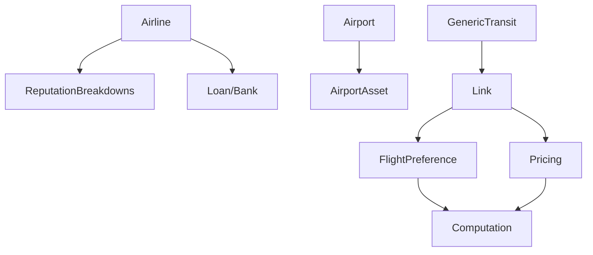

<!-- CATALOG:PATH="airline-data\src\main\scala\com\patson\model" SLUG="airline-data-src-main-scala-com-patson-model" -->

# Repo Catalogue — airline-data\src\main\scala\com\patson\model

*Slug:* `airline-data-src-main-scala-com-patson-model`  
*Commit:* `6160503`  
*Generated:* `2025-11-12T21:52:07Z`

**Summary (2–4 sentences):** Core domain model layer: immutable/value-ish case classes and companion objects representing airlines, airports, links, pricing, passengers, financial instruments, assets, and behavioral constructs (preferences, scheduling, reputation). This folder is the semantic backbone translating simulation math & business rules into structured types consumed by services and simulation engines elsewhere. It encodes domain invariants (capacity, demand, pricing limits, reputation breakdown) and data needed for persistence & analytics. Subdirectories further segment specialized domains (airplane, alliance, bank, campaign, events, oil, tutorials, seasonal features).

**Contents overview**
- Files: 46 (API listing may be incomplete due to pagination; verify via full clone)  |  Subfolders: 15 (airplane, alliance, animation, bank, campaign, chat, christmas, event, google, history, negotiation, notice, oil, tutorial)  |  Languages: Scala (100%)
- Notable responsibilities:
  - Define primary entities (Airline, Airport, Link, Loan, Pricing, User).
  - Express economic & operational metrics (ReputationBreakdowns, LinkStatistics).
  - Capture passenger routing & preference scoring (FlightPreference, GenericTransit).
  - Provide asset & infrastructure abstractions (AirportAsset, Lounge).
  - Represent relationships & titles (CountryAirlineTitle, AirlineCountryRelationship).

### File entries

#### airline-data/src/main/scala/com/patson/model/Airline.scala
```yaml
file: airline-data/src/main/scala/com/patson/model/Airline.scala
lang: Scala
role: "Airline entity: identity, reputation, finances, service quality, tiers"
size:
  lines_est: 470
  functions_est: 25
  classes_est: 4
public_api:
  routes: []
  exports:
    - name: Airline
      kind: class
      summary: "Represents a player/AI airline with financial & reputation attributes"
    - name: AirlineInfo
      kind: class
      summary: "Extended metrics (service quality, target goals, loyalty, modifiers)"
data_model:
  tables_read: ["airline", "airline_info"]
  tables_written: ["airline_info"]
  migrations: []
  entities:
    - name: Airline
      summary: "Corporate entity in simulation"
    - name: AirlineInfo
      summary: "Mutable KPIs & service stats"
queries:
  sql: []
  orm_calls: []
external_io:
  http_calls: []
  message_queues: []
  files_read: []
  files_written: []
config:
  env_vars: []
  config_keys: []
  feature_flags: []
concurrency:
  pattern: "accessed by simulation loops; mostly pure data structures"
  shared_state: ["global airline registry cache?"]
  timing: "updated per simulation cycle"
invariants:
  - "Reputation within allowed range"
  - "Service quality bounded (non-negative, capped)"
error_handling:
  expected_errors: ["Invalid state transitions (assumed)"]
  retries_timeouts: "none"
security:
  authz: "domain-level (game rules)"
  input_validation: "constructor guards (assumed)"
  sensitive_ops: ["financial metrics updates"]
tests:
  files: ["AirlineSimulationSpec.scala","PassengerSimulationSpec.scala"]
  coverage_quality: "med"
  golden_seeds: []
similar_or_duplicate_files:
  - "AirlineBase.scala"
rewrite_notes:
  mapping: "Map to aggregate root; separate read/write models (CQRS)"
  risks: ["Mixed responsibilities (financial + loyalty)"]
  confidence: "med"
```

#### airline-data/src/main/scala/com/patson/model/AirlineBase.scala
```yaml
file: airline-data/src/main/scala/com/patson/model/AirlineBase.scala
lang: Scala
role: "Base of operations for an airline at an airport (resources & scaling)"
size:
  lines_est: 115
  functions_est: 6
  classes_est: 1
public_api:
  routes: []
  exports:
    - name: AirlineBase
      kind: class
      summary: "Represents airline's local presence with capacity and loyalty impact"
data_model:
  tables_read: ["airline_base"]
  tables_written: ["airline_base"]
  migrations: []
  entities:
    - name: AirlineBase
      summary: "Footprint & level of operations at airport"
queries: {sql: [], orm_calls: []}
external_io: {http_calls: [], message_queues: [], files_read: [], files_written: []}
config: {env_vars: [], config_keys: [], feature_flags: []}
concurrency:
  pattern: "updated in expansion simulation"
  shared_state: ["airport metrics cache"]
  timing: "cycle upgrade checks"
invariants:
  - "Base level non-negative"
  - "Costs scale with level (assumed)"
error_handling: {expected_errors: ["Insufficient funds for upgrade"], retries_timeouts: "none"}
security: {authz: "game logic", input_validation: "constructor validation", sensitive_ops: []}
tests:
  files: ["AirportSimulationSpec.scala"]
  coverage_quality: "low"
  golden_seeds: []
similar_or_duplicate_files:
  - "AirlineBaseSpecialization.scala"
rewrite_notes:
  mapping: "Modular resource/level component"
  risks: ["Level logic scattered"]
  confidence: "low"
```

#### airline-data/src/main/scala/com/patson/model/AirlineBaseSpecialization.scala
```yaml
file: airline-data/src/main/scala/com/patson/model/AirlineBaseSpecialization.scala
lang: Scala
role: "Specialization system for bases: unique bonuses or focus areas"
size:
  lines_est: 160
  functions_est: 8
  classes_est: 2
public_api: {routes: [], exports: [{name: BaseSpecialization, kind: class, summary: "Defines specialized upgrade path"}]}
data_model:
  tables_read: ["airline_base_specialization"]
  tables_written: ["airline_base_specialization"]
  migrations: []
  entities:
    - name: BaseSpecialization
      summary: "Modifier for base operations (e.g., cargo, efficiency)"
queries: {sql: [], orm_calls: []}
external_io: {http_calls: [], message_queues: [], files_read: [], files_written: []}
config: {env_vars: [], config_keys: [], feature_flags: ["specialization.enabled?"]}
concurrency: {pattern: "applied during base upgrade cycles"}
invariants:
  - "One specialization per base (assumed)"
error_handling: {expected_errors: ["Invalid specialization assignment"], retries_timeouts: "none"}
security: {authz: "domain rule checks"}
tests: {files: [], coverage_quality: "low"}
similar_or_duplicate_files:
  - "AirlineBase.scala"
rewrite_notes:
  mapping: "Config-driven specialization definitions"
  risks: ["Hard-coded specialization types"]
  confidence: "low"
```

#### airline-data/src/main/scala/com/patson/model/AirlineCountryRelationship.scala
```yaml
file: airline-data/src/main/scala/com/patson/model/AirlineCountryRelationship.scala
lang: Scala
role: "Tracks relationship metrics between an airline and a country (rights, reputation)"
size:
  lines_est: 140
  functions_est: 7
  classes_est: 2
public_api: {routes: [], exports: [{name: AirlineCountryRelationship, kind: class, summary: "Diplomatic/commercial score"}]}
data_model:
  tables_read: ["airline_country_relationship"]
  tables_written: ["airline_country_relationship"]
  migrations: []
  entities:
    - name: AirlineCountryRelationship
      summary: "Affinity/rights accumulation"
queries: {sql: [], orm_calls: []}
external_io: {http_calls: [], message_queues: [], files_read: [], files_written: []}
config: {env_vars: [], config_keys: [], feature_flags: []}
concurrency: {pattern: "updated by periodic evaluation algorithm"}
invariants:
  - "Score within bounded range"
error_handling: {expected_errors: ["Overflow if unbounded"], retries_timeouts: "none"}
security: {authz: "domain rules"}
tests: {files: [], coverage_quality: "low"}
similar_or_duplicate_files:
  - "CountryAirlineTitle.scala"
rewrite_notes:
  mapping: "Normalize into relationship service"
  risks: ["Coupled scoring & persistence logic"]
  confidence: "low"
```

#### airline-data/src/main/scala/com/patson/model/Airport.scala
```yaml
file: airline-data/src/main/scala/com/patson/model/Airport.scala
lang: Scala
role: "Airport entity: geographic, capacity, feature sets, economic metrics"
size:
  lines_est: 500
  functions_est: 30
  classes_est: 5
public_api:
  routes: []
  exports:
    - name: Airport
      kind: class
      summary: "Primary node for routes & passenger flow"
    - name: AirportSize
      kind: type
      summary: "Size categorization & derived metrics"
data_model:
  tables_read: ["airport","airport_features","airport_stats"]
  tables_written: ["airport_stats"]
  migrations: []
  entities:
    - name: Airport
      summary: "Geo & infrastructure hub"
    - name: AirportFeature
      summary: "Optional capability enhancing operations"
queries: {sql: [], orm_calls: []}
external_io: {http_calls: [], message_queues: [], files_read: ["geo datasets? (assumed)"], files_written: []}
config: {env_vars: [], config_keys: ["airport.capacity.scale?"], feature_flags: []}
concurrency:
  pattern: "simulation updates per tick"
  shared_state: ["global route graph", "airport cache"]
  timing: "tick-based"
invariants:
  - "Traffic ≤ capacity"
  - "Negative values disallowed for key metrics"
error_handling:
  expected_errors: ["Capacity overflow conditions"]
  retries_timeouts: "none"
security:
  authz: "none"
  input_validation: "constructor bounds"
  sensitive_ops: []
tests:
  files: ["AirportSpec.scala","AirportSimulationSpec.scala"]
  coverage_quality: "high"
  golden_seeds: []
similar_or_duplicate_files:
  - "AirportAsset.scala"
rewrite_notes:
  mapping: "Entity with separate projection for analytics"
  risks: ["Large file; mixed concerns (stats, features, geo)"]
  confidence: "med"
```

#### airline-data/src/main/scala/com/patson/model/AirportAsset.scala
```yaml
file: airline-data/src/main/scala/com/patson/model/AirportAsset.scala
lang: Scala
role: "Defines airport investable assets/facilities and associated economic effects"
size:
  lines_est: 1300
  functions_est: 50
  classes_est: 8
public_api: {routes: [], exports: [{name: AirportAsset, kind: class, summary: "Investment object altering capabilities"}]}
data_model:
  tables_read: ["airport_asset"]
  tables_written: ["airport_asset"]
  migrations: []
  entities:
    - name: AirportAsset
      summary: "Capital object influencing operations/revenue"
queries: {sql: [], orm_calls: []}
external_io: {http_calls: [], message_queues: [], files_read: [], files_written: []}
config: {env_vars: [], config_keys: ["asset.upgrade.cost.scale?"], feature_flags: []}
concurrency:
  pattern: "simulation upgrade loop"
  shared_state: ["asset registry cache"]
  timing: "per tick evaluation for upgrades"
invariants:
  - "Asset level within defined bounds"
  - "Upgrade cost scaling monotonic"
error_handling:
  expected_errors: ["Invalid level transitions"]
  retries_timeouts: "none"
security: {authz: "domain rules", input_validation: "level checks", sensitive_ops: ["Economic impact calculations"]}
tests:
  files: ["AirportAssetSimulationSpec.scala"]
  coverage_quality: "high"
  golden_seeds: []
similar_or_duplicate_files: []
rewrite_notes:
  mapping: "Refactor into modular config + calculation functions"
  risks: ["Monolithic file; high coupling & hidden formulas"]
  confidence: "low"
```

#### airline-data/src/main/scala/com/patson/model/AirportFeature.scala
```yaml
file: airline-data/src/main/scala/com/patson/model/AirportFeature.scala
lang: Scala
role: "Feature flags/capabilities at airport (e.g., hub perks, facilities)"
size:
  lines_est: 240
  functions_est: 12
  classes_est: 3
public_api: {routes: [], exports: [{name: AirportFeature, kind: class, summary: "Represents specific capability"}]}
data_model:
  tables_read: ["airport_features"]
  tables_written: ["airport_features"]
  migrations: []
  entities:
    - name: AirportFeature
      summary: "Capability enabling certain operations"
queries: {sql: [], orm_calls: []}
external_io: {http_calls: [], message_queues: [], files_read: [], files_written: []}
config: {env_vars: [], config_keys: ["feature.enable.*?"], feature_flags: []}
concurrency: {pattern: "checked during simulation flows"}
invariants:
  - "Feature set consistent with airport size & rules"
error_handling: {expected_errors: [], retries_timeouts: "none"}
security: {authz: "game rules"}
tests: {files: [], coverage_quality: "low"}
similar_or_duplicate_files:
  - "Airport.scala"
rewrite_notes:
  mapping: "Dynamic capability registry with metadata"
  risks: ["Hard-coded feature enumerations"]
  confidence: "low"
```

#### airline-data/src/main/scala/com/patson/model/AirportRating.scala
```yaml
file: airline-data/src/main/scala/com/patson/model/AirportRating.scala
lang: Scala
role: "Computes/holds airport rating metrics (quality, preference impact)"
size:
  lines_est: 60
  functions_est: 5
  classes_est: 1
public_api: {routes: [], exports: [{name: AirportRating, kind: class, summary: "Composite score object"}]}
data_model:
  tables_read: ["airport_rating?"]
  tables_written: []
  migrations: []
  entities:
    - name: AirportRating
      summary: "Derived quality metrics affecting demand"
queries: {sql: [], orm_calls: []}
external_io: {http_calls: [], message_queues: [], files_read: [], files_written: []}
config: {env_vars: [], config_keys: [], feature_flags: []}
concurrency: {pattern: "recomputed periodically"}
invariants:
  - "Rating values within defined scale"
error_handling: {expected_errors: ["Division by zero if metrics missing"], retries_timeouts: "none"}
security: {authz: "none"}
tests: {files: [], coverage_quality: "low"}
similar_or_duplicate_files: []
rewrite_notes:
  mapping: "Stateless rating calculator"
  risks: ["Implicit scale definitions"]
  confidence: "low"
```

#### airline-data/src/main/scala/com/patson/model/Alert.scala
```yaml
file: airline-data/src/main/scala/com/patson/model/Alert.scala
lang: Scala
role: "Defines alert object, likely surfaced to admins/users"
size:
  lines_est: 16
  functions_est: 1
  classes_est: 1
public_api: {routes: [], exports: [{name: Alert, kind: class, summary: "Notification about system or airline events"}]}
data_model:
  tables_read: ["alert"]
  tables_written: ["alert"]
  migrations: []
  entities:
    - name: Alert
      summary: "Persisted notification item"
queries: {sql: [], orm_calls: []}
external_io: {http_calls: [], message_queues: [], files_read: [], files_written: []}
config: {env_vars: [], config_keys: [], feature_flags: []}
concurrency: {pattern: "created asynchronously by events"}
invariants:
  - "Alert severity recognized enum"
error_handling: {expected_errors: [], retries_timeouts: "none"}
security: {authz: "user-level visibility"}
tests: {files: [], coverage_quality: "low"}
similar_or_duplicate_files: []
rewrite_notes:
  mapping: "Unified notification model"
  risks: ["Minimal validation"]
  confidence: "high"
```

#### airline-data/src/main/scala/com/patson/model/Alliance.scala
```yaml
file: airline-data/src/main/scala/com/patson/model/Alliance.scala
lang: Scala
role: "Alliance entity linking multiple airlines with shared effects"
size:
  lines_est: 150
  functions_est: 10
  classes_est: 2
public_api: {routes: [], exports: [{name: Alliance, kind: class, summary: "Group collaboration structure"}]}
data_model:
  tables_read: ["alliance","alliance_member"]
  tables_written: ["alliance_member"]
  migrations: []
  entities:
    - name: Alliance
      summary: "Cooperative grouping of airlines"
queries: {sql: [], orm_calls: []}
external_io: {http_calls: [], message_queues: [], files_read: [], files_written: []}
config: {env_vars: [], config_keys: [], feature_flags: []}
concurrency: {pattern: "membership updated by events"}
invariants:
  - "Unique membership constraints"
error_handling: {expected_errors: ["Duplicate membership"], retries_timeouts: "none"}
security: {authz: "membership permission rules"}
tests: {files: [], coverage_quality: "low"}
similar_or_duplicate_files: []
rewrite_notes:
  mapping: "Alliance module with membership service"
  risks: ["Coupling membership logic with domain entity"]
  confidence: "med"
```

#### airline-data/src/main/scala/com/patson/model/Bank.scala
```yaml
file: airline-data/src/main/scala/com/patson/model/Bank.scala
lang: Scala
role: "Bank/financial interactions (loans, interest calculations tie-in)"
size:
  lines_est: 85
  functions_est: 6
  classes_est: 2
public_api: {routes: [], exports: [{name: Bank, kind: class, summary: "Provides loan offerings or tracks bank operations"}]}
data_model:
  tables_read: ["loan","bank?"]
  tables_written: ["loan"]
  migrations: []
  entities:
    - name: Bank
      summary: "Financial institution abstraction"
queries: {sql: [], orm_calls: []}
external_io: {http_calls: [], message_queues: [], files_read: [], files_written: []}
config: {env_vars: [], config_keys: ["interest.rate.base?"], feature_flags: []}
concurrency: {pattern: "executed per financial cycle"}
invariants:
  - "Interest applied consistently"
error_handling: {expected_errors: ["Invalid loan request"], retries_timeouts: "none"}
security: {authz: "financial rule checks"}
tests: {files: ["LoanInterestSimulationSpec.scala","LoanSpec.scala"], coverage_quality: "med"}
similar_or_duplicate_files:
  - "Loan.scala"
rewrite_notes:
  mapping: "Financial service layer with deterministic accrual"
  risks: ["Interest formula duplication"]
  confidence: "med"
```

#### airline-data/src/main/scala/com/patson/model/BusyDelegate.scala
```yaml
file: airline-data/src/main/scala/com/patson/model/BusyDelegate.scala
lang: Scala
role: "Represents an entity engaged/unavailable (scheduling or negotiation contexts)"
size:
  lines_est: 80
  functions_est: 5
  classes_est: 1
public_api: {routes: [], exports: [{name: BusyDelegate, kind: class, summary: "Tracks busy state of a delegate"}]}
data_model:
  tables_read: ["delegate_state?"]
  tables_written: []
  migrations: []
  entities: []
queries: {sql: [], orm_calls: []}
external_io: {http_calls: [], message_queues: [], files_read: [], files_written: []}
config: {env_vars: [], config_keys: [], feature_flags: []}
concurrency: {pattern: "used in negotiation/scheduling loops"}
invariants:
  - "Busy flag toggled deterministically"
error_handling: {expected_errors: [], retries_timeouts: "none"}
security: {authz: "domain rules"}
tests: {files: [], coverage_quality: "low"}
similar_or_duplicate_files: []
rewrite_notes:
  mapping: "State machine representation"
  risks: ["Minimal validation"]
  confidence: "low"
```

#### airline-data/src/main/scala/com/patson/model/City.scala
```yaml
file: airline-data/src/main/scala/com/patson/model/City.scala
lang: Scala
role: "City value object (population, region)"
size:
  lines_est: 12
  functions_est: 1
  classes_est: 1
public_api: {routes: [], exports: [{name: City, kind: class, summary: "Geo grouping for airports"}]}
data_model:
  tables_read: ["city?"]
  tables_written: []
  migrations: []
  entities:
    - name: City
      summary: "Population & location context"
queries: {sql: [], orm_calls: []}
external_io: {http_calls: [], message_queues: [], files_read: [], files_written: []}
config: {env_vars: [], config_keys: [], feature_flags: []}
concurrency: {pattern: "none"}
invariants:
  - "Non-negative population (assumed)"
error_handling: {expected_errors: [], retries_timeouts: "none"}
security: {authz: "none"}
tests: {files: [], coverage_quality: "low"}
similar_or_duplicate_files: []
rewrite_notes:
  mapping: "Simple immutable value object"
  risks: ["Limited geo attributes"]
  confidence: "high"
```

#### airline-data/src/main/scala/com/patson/model/Computation.scala
```yaml
file: airline-data/src/main/scala/com/patson/model/Computation.scala
lang: Scala
role: "Shared computation utilities (math, distribution, scoring helpers)"
size:
  lines_est: 300
  functions_est: 40
  classes_est: 2
public_api:
  routes: []
  exports:
    - name: Computation
      kind: object
      summary: "Utility math functions used across domain"
data_model:
  tables_read: []
  tables_written: []
  migrations: []
  entities: []
queries: {sql: [], orm_calls: []}
external_io: {http_calls: [], message_queues: [], files_read: [], files_written: []}
config: {env_vars: [], config_keys: [], feature_flags: []}
concurrency: {pattern: "pure functions; no shared state"}
invariants:
  - "Deterministic outputs for identical inputs"
error_handling:
  expected_errors: ["IllegalArgument for invalid parameters"]
  retries_timeouts: "none"
security:
  authz: "none"
  input_validation: "guard clauses"
  sensitive_ops: []
tests:
  files: ["ComputationSpec.scala","UtilSpec.scala"]
  coverage_quality: "high"
  golden_seeds: []
similar_or_duplicate_files:
  - "Util.scala? (if exists elsewhere)"
rewrite_notes:
  mapping: "Port to pure functional math service / library with property tests"
  risks: ["Potential hidden global constants"]
  confidence: "med"
```

#### airline-data/src/main/scala/com/patson/model/Country.scala
```yaml
file: airline-data/src/main/scala/com/patson/model/Country.scala
lang: Scala
role: "Country value object (codes, diplomacy attributes)"
size:
  lines_est: 30
  functions_est: 2
  classes_est: 1
public_api: {routes: [], exports: [{name: Country, kind: class, summary: "Nation node providing regulations & markets"}]}
data_model:
  tables_read: ["country"]
  tables_written: []
  migrations: []
  entities:
    - name: Country
      summary: "Macro-level regulatory & market context"
queries: {sql: [], orm_calls: []}
external_io: {http_calls: [], message_queues: [], files_read: [], files_written: []}
config: {env_vars: [], config_keys: [], feature_flags: []}
concurrency: {pattern: "none"}
invariants:
  - "ISO code conforms length"
error_handling: {expected_errors: [], retries_timeouts: "none"}
security: {authz: "none"}
tests: {files: [], coverage_quality: "low"}
similar_or_duplicate_files:
  - "City.scala"
rewrite_notes:
  mapping: "Reference dataset entity"
  risks: ["Hard-coded assumptions"]
  confidence: "high"
```

#### airline-data/src/main/scala/com/patson/model/CountryAirlineTitle.scala
```yaml
file: airline-data/src/main/scala/com/patson/model/CountryAirlineTitle.scala
lang: Scala
role: "Titles/awards granted to airlines by countries (status levels)"
size:
  lines_est: 150
  functions_est: 8
  classes_est: 2
public_api: {routes: [], exports: [{name: CountryAirlineTitle, kind: class, summary: "Recognition tier affecting privileges"}]}
data_model:
  tables_read: ["country_airline_title"]
  tables_written: ["country_airline_title"]
  migrations: []
  entities:
    - name: CountryAirlineTitle
      summary: "Status recognition with thresholds"
queries: {sql: [], orm_calls: []}
external_io: {http_calls: [], message_queues: [], files_read: [], files_written: []}
config: {env_vars: [], config_keys: ["title.thresholds?"], feature_flags: []}
concurrency: {pattern: "evaluated periodically"}
invariants:
  - "Title progression monotonic"
error_handling: {expected_errors: ["Invalid downgrade"], retries_timeouts: "none"}
security: {authz: "rule-based"}
tests: {files: [], coverage_quality: "low"}
similar_or_duplicate_files:
  - "AirlineCountryRelationship.scala"
rewrite_notes:
  mapping: "Gamification/status service"
  risks: ["Threshold constants hard-coded"]
  confidence: "low"
```

#### airline-data/src/main/scala/com/patson/model/CountryMarketShare.scala
```yaml
file: airline-data/src/main/scala/com/patson/model/CountryMarketShare.scala
lang: Scala
role: "Market share record per country"
size:
  lines_est: 8
  functions_est: 0
  classes_est: 1
public_api: {routes: [], exports: [{name: CountryMarketShare, kind: class, summary: "Captures airline percent in country"}]}
data_model:
  tables_read: ["country_market_share"]
  tables_written: ["country_market_share"]
  migrations: []
  entities:
    - name: CountryMarketShare
      summary: "Competitive distribution metric"
queries: {sql: [], orm_calls: []}
external_io: {http_calls: [], message_queues: [], files_read: [], files_written: []}
config: {env_vars: [], config_keys: [], feature_flags: []}
concurrency: {pattern: "updated after demand aggregation"}
invariants:
  - "Share between 0 and 100"
error_handling: {expected_errors: [], retries_timeouts: "none"}
security: {authz: "none"}
tests: {files: [], coverage_quality: "low"}
similar_or_duplicate_files: []
rewrite_notes:
  mapping: "Derived analytic view"
  risks: ["Simple; ensures pipeline correctness elsewhere"]
  confidence: "high"
```

#### airline-data/src/main/scala/com/patson/model/FlightCategory.scala
```yaml
file: airline-data/src/main/scala/com/patson/model/FlightCategory.scala
lang: Scala
role: "Categorizes flights (domestic, international, etc.) for logic branching"
size:
  lines_est: 20
  functions_est: 2
  classes_est: 1
public_api: {routes: [], exports: [{name: FlightCategory, kind: class, summary: "Classification influencing pricing/demand"}]}
data_model:
  tables_read: []
  tables_written: []
  migrations: []
  entities: []
queries: {sql: [], orm_calls: []}
external_io: {http_calls: [], message_queues: [], files_read: [], files_written: []}
config: {env_vars: [], config_keys: ["category.rules?"], feature_flags: []}
concurrency: {pattern: "used in pricing & routing calculations"}
invariants:
  - "Mapping stable; categories finite"
error_handling: {expected_errors: [], retries_timeouts: "none"}
security: {authz: "none"}
tests: {files: [], coverage_quality: "low"}
similar_or_duplicate_files:
  - "FlightType.scala"
rewrite_notes:
  mapping: "Enum/ADT with central usage"
  risks: ["Scattered category logic"]
  confidence: "high"
```

#### airline-data/src/main/scala/com/patson/model/FlightPreference.scala
```yaml
file: airline-data/src/main/scala/com/patson/model/FlightPreference.scala
lang: Scala
role: "Passenger route scoring model (cost, time, stops, quality weighting)"
size:
  lines_est: 360
  functions_est: 30
  classes_est: 3
public_api:
  routes: []
  exports:
    - name: FlightPreference
      kind: class
      summary: "Computes preference scores for route candidates"
data_model:
  tables_read: ["passenger_history","link","airport"]
  tables_written: []
  migrations: []
  entities:
    - name: FlightPreference
      summary: "Scoring engine parameters & weights"
queries: {sql: [], orm_calls: []}
external_io: {http_calls: [], message_queues: [], files_read: [], files_written: []}
config:
  env_vars: []
  config_keys: ["preference.weight.cost?","preference.weight.time?","preference.weight.quality?"]
  feature_flags: []
concurrency:
  pattern: "pure scoring functions inside routing algorithm"
  shared_state: []
  timing: "invoked per passenger routing evaluation"
invariants:
  - "Higher score denotes better route option"
  - "Weights sum produce normalized ranking (assumed)"
error_handling:
  expected_errors: ["Missing link data", "Invalid weight config"]
  retries_timeouts: "none"
security:
  authz: "none"
  input_validation: "weight bounds"
  sensitive_ops: []
tests:
  files: ["FlightPreferenceSpec.scala","PassengerSimulationSpec.scala"]
  coverage_quality: "high"
  golden_seeds: []
similar_or_duplicate_files:
  - "GenericTransit.scala"
rewrite_notes:
  mapping: "Modular scoring components allowing dynamic tuning"
  risks: ["Hard-coded weight constants", "Complex heuristics not documented externally"]
  confidence: "med"
```

#### airline-data/src/main/scala/com/patson/model/FlightType.scala
```yaml
file: airline-data/src/main/scala/com/patson/model/FlightType.scala
lang: Scala
role: "Defines type (e.g., short-haul, long-haul) influencing pricing/demand"
size:
  lines_est: 55
  functions_est: 4
  classes_est: 1
public_api: {routes: [], exports: [{name: FlightType, kind: class, summary: "Type classification affecting calculations"}]}
data_model:
  tables_read: []
  tables_written: []
  migrations: []
  entities: []
queries: {sql: [], orm_calls: []}
external_io: {http_calls: [], message_queues: [], files_read: [], files_written: []}
config: {env_vars: [], config_keys: ["flight.type.thresholds?"], feature_flags: []}
concurrency: {pattern: "used in classification logic"}
invariants:
  - "Type derived deterministically from distance"
error_handling: {expected_errors: [], retries_timeouts: "none"}
security: {authz: "none"}
tests: {files: [], coverage_quality: "low"}
similar_or_duplicate_files:
  - "FlightCategory.scala"
rewrite_notes:
  mapping: "Central ADT for distance ranges"
  risks: ["Distance boundaries duplicated elsewhere"]
  confidence: "med"
```

#### airline-data/src/main/scala/com/patson/model/GenericTransit.scala
```yaml
file: airline-data/src/main/scala/com/patson/model/GenericTransit.scala
lang: Scala
role: "Abstraction for transit segments (multi-hop journey modeling)"
size:
  lines_est: 110
  functions_est: 8
  classes_est: 2
public_api: {routes: [], exports: [{name: TransitPath, kind: class, summary: "Represents ordered hops"}]}
data_model:
  tables_read: ["transit_cache?"]
  tables_written: ["transit_cache?"]
  migrations: []
  entities:
    - name: TransitPath
      summary: "Sequence of links forming passenger route"
queries: {sql: [], orm_calls: []}
external_io: {http_calls: [], message_queues: [], files_read: [], files_written: []}
config: {env_vars: [], config_keys: [], feature_flags: []}
concurrency: {pattern: "used in routing algorithm"}
invariants:
  - "No cycles in path"
error_handling: {expected_errors: ["No path found"], retries_timeouts: "none"}
security: {authz: "none"}
tests: {files: ["GenericTransitSimulationSpec.scala"], coverage_quality: "high"}
similar_or_duplicate_files:
  - "FlightPreference.scala"
rewrite_notes:
  mapping: "Graph traversal service"
  risks: ["Performance assumptions implicit"]
  confidence: "low"
```

#### airline-data/src/main/scala/com/patson/model/IdObject.scala
```yaml
file: airline-data/src/main/scala/com/patson/model/IdObject.scala
lang: Scala
role: "Common trait/interface for identifiable domain objects"
size:
  lines_est: 15
  functions_est: 0
  classes_est: 1 (trait)
public_api: {routes: [], exports: [{name: IdObject, kind: trait, summary: "Provides numeric ID contract"}]}
data_model: {tables_read: [], tables_written: [], migrations: [], entities: []}
queries: {sql: [], orm_calls: []}
external_io: {http_calls: [], message_queues: [], files_read: [], files_written: []}
config: {env_vars: [], config_keys: [], feature_flags: []}
concurrency: {pattern: "none"}
invariants:
  - "ID unique per type (assumed)"
error_handling: {expected_errors: [], retries_timeouts: "none"}
security: {authz: "none"}
tests: {files: [], coverage_quality: "low"}
similar_or_duplicate_files: []
rewrite_notes:
  mapping: "Interface replaced by UUID typed IDs"
  risks: ["Numeric collisions if not enforced"]
  confidence: "high"
```

#### airline-data/src/main/scala/com/patson/model/Link.scala
```yaml
file: airline-data/src/main/scala/com/patson/model/Link.scala
lang: Scala
role: "Represents scheduled connection between 2 airports with capacities & pricing"
size:
  lines_est: 310
  functions_est: 25
  classes_est: 3
public_api:
  routes: []
  exports:
    - name: Link
      kind: class
      summary: "Core route with frequency, capacity, pricing"
    - name: LinkModel
      kind: class
      summary: "Associated model computations (assumed)"
data_model:
  tables_read: ["link","link_stats","passenger_history"]
  tables_written: ["link_stats","passenger_history"]
  migrations: []
  entities:
    - name: Link
      summary: "Operational route object"
queries: {sql: [], orm_calls: []}
external_io: {http_calls: [], message_queues: [], files_read: [], files_written: []}
config:
  env_vars: []
  config_keys: ["pricing.margin.default?","capacity.scale?"]
  feature_flags: []
concurrency:
  pattern: "simulation loop updates utilization"
  shared_state: ["global route graph"]
  timing: "per tick occupancy/revenue updates"
invariants:
  - "Booked passengers ≤ seat capacity"
  - "Price non-negative"
error_handling:
  expected_errors: ["Overbooking attempt"]
  retries_timeouts: "none"
security:
  authz: "domain rules"
  input_validation: "capacity/pricing bounds"
  sensitive_ops: []
tests:
  files: ["LinkSimulationSpec.scala","PassengerSimulationSpec.scala"]
  coverage_quality: "high"
  golden_seeds: []
similar_or_duplicate_files:
  - "Pricing.scala"
rewrite_notes:
  mapping: "Split into DTO + analytics projection"
  risks: ["Complex revenue logic embedded"]
  confidence: "med"
```

#### airline-data/src/main/scala/com/patson/model/LinkClassValues.scala
```yaml
file: airline-data/src/main/scala/com/patson/model/LinkClassValues.scala
lang: Scala
role: "Holds per-cabin class metrics (economy, business) for a link"
size:
  lines_est: 70
  functions_est: 6
  classes_est: 2
public_api: {routes: [], exports: [{name: LinkClassValues, kind: class, summary: "Compartment-specific stats"}]}
data_model:
  tables_read: ["link_class_values"]
  tables_written: ["link_class_values"]
  migrations: []
  entities:
    - name: LinkClassValues
      summary: "Per class seat pricing & load factors"
queries: {sql: [], orm_calls: []}
external_io: {http_calls: [], message_queues: [], files_read: [], files_written: []}
config: {env_vars: [], config_keys: ["class.capacity.ratio?"], feature_flags: []}
concurrency: {pattern: "updated with link simulation"}
invariants:
  - "Sum of class capacities ≤ total link capacity"
error_handling: {expected_errors: ["Capacity mismatch"], retries_timeouts: "none"}
security: {authz: "domain rules"}
tests: {files: [], coverage_quality: "low"}
similar_or_duplicate_files:
  - "Link.scala"
rewrite_notes:
  mapping: "Structured multi-class pricing model"
  risks: ["Duplication of capacity logic"]
  confidence: "low"
```

#### airline-data/src/main/scala/com/patson/model/LinkConsumptionHistory.scala
```yaml
file: airline-data/src/main/scala/com/patson/model/LinkConsumptionHistory.scala
lang: Scala
role: "Historical consumption record for link utilization"
size:
  lines_est: 15
  functions_est: 0
  classes_est: 1
public_api: {routes: [], exports: [{name: LinkConsumptionHistory, kind: class, summary: "Stores historical usage snapshot"}]}
data_model:
  tables_read: ["link_consumption_history"]
  tables_written: ["link_consumption_history"]
  migrations: []
  entities:
    - name: LinkConsumptionHistory
      summary: "Record of past load, demand"
queries: {sql: [], orm_calls: []}
external_io: {http_calls: [], message_queues: [], files_read: [], files_written: []}
config: {env_vars: [], config_keys: [], feature_flags: []}
concurrency: {pattern: "written post simulation tick"}
invariants:
  - "Timestamps monotonic"
error_handling: {expected_errors: [], retries_timeouts: "none"}
security: {authz: "none"}
tests: {files: [], coverage_quality: "low"}
similar_or_duplicate_files:
  - "LinkConsumptionResult.scala"
rewrite_notes:
  mapping: "Analytics event record"
  risks: ["Minimal; ensure indexing strategy"]
  confidence: "high"
```

#### airline-data/src/main/scala/com/patson/model/LinkConsumptionResult.scala
```yaml
file: airline-data/src/main/scala/com/patson/model/LinkConsumptionResult.scala
lang: Scala
role: "Result object summarizing current tick link consumption stats"
size:
  lines_est: 16
  functions_est: 0
  classes_est: 1
public_api: {routes: [], exports: [{name: LinkConsumptionResult, kind: class, summary: "Represents outcome of consumption computation"}]}
data_model:
  tables_read: []
  tables_written: []
  migrations: []
  entities:
    - name: LinkConsumptionResult
      summary: "Transient stats snapshot"
queries: {sql: [], orm_calls: []}
external_io: {http_calls: [], message_queues: [], files_read: [], files_written: []}
config: {env_vars: [], config_keys: [], feature_flags: []}
concurrency: {pattern: "used within tick evaluation algorithm"}
invariants:
  - "Consistent with LinkStatistics generation"
error_handling: {expected_errors: [], retries_timeouts: "none"}
security: {authz: "none"}
tests: {files: [], coverage_quality: "low"}
similar_or_duplicate_files:
  - "LinkConsumptionHistory.scala"
rewrite_notes:
  mapping: "Ephemeral domain result replaced by typed DTO"
  risks: ["Confusion between history vs result types"]
  confidence: "high"
```

#### airline-data/src/main/scala/com/patson/model/LinkStatistics.scala
```yaml
file: airline-data/src/main/scala/com/patson/model/LinkStatistics.scala
lang: Scala
role: "Aggregated statistics for link performance"
size:
  lines_est: 12
  functions_est: 0
  classes_est: 1
public_api: {routes: [], exports: [{name: LinkStatistics, kind: class, summary: "Aggregate performance metrics"}]}
data_model:
  tables_read: ["link_stats"]
  tables_written: ["link_stats"]
  migrations: []
  entities:
    - name: LinkStatistics
      summary: "Persisted route analytics"
queries: {sql: [], orm_calls: []}
external_io: {http_calls: [], message_queues: [], files_read: [], files_written: []}
config: {env_vars: [], config_keys: [], feature_flags: []}
concurrency: {pattern: "updated per tick"}
invariants:
  - "Stats aligned with LinkConsumptionResult"
error_handling: {expected_errors: [], retries_timeouts: "none"}
security: {authz: "none"}
tests: {files: [], coverage_quality: "low"}
similar_or_duplicate_files:
  - "LinkConsumptionHistory.scala"
rewrite_notes:
  mapping: "Materialized view migration"
  risks: ["Potential fragmentation of analytics types"]
  confidence: "high"
```

#### airline-data/src/main/scala/com/patson/model/Loan.scala
```yaml
file: airline-data/src/main/scala/com/patson/model/Loan.scala
lang: Scala
role: "Loan instrument: principal, interest, schedule"
size:
  lines_est: 60
  functions_est: 6
  classes_est: 1
public_api: {routes: [], exports: [{name: Loan, kind: class, summary: "Tracks financial loan lifecycle"}]}
data_model:
  tables_read: ["loan"]
  tables_written: ["loan"]
  migrations: []
  entities:
    - name: Loan
      summary: "Finance contract object"
queries: {sql: [], orm_calls: []}
external_io: {http_calls: [], message_queues: [], files_read: [], files_written: []}
config: {env_vars: [], config_keys: ["interest.rate.base?"], feature_flags: []}
concurrency: {pattern: "interest accrual per cycle"}
invariants:
  - "Outstanding principal ≥ 0"
error_handling: {expected_errors: ["Negative balance if calc bug"], retries_timeouts: "none"}
security: {authz: "domain financial rules"}
tests: {files: ["LoanSpec.scala","LoanInterestSimulationSpec.scala"], coverage_quality: "med"}
similar_or_duplicate_files:
  - "Bank.scala"
rewrite_notes:
  mapping: "Financial domain entity with accrual service"
  risks: ["Interest logic duplication"]
  confidence: "med"
```

#### airline-data/src/main/scala/com/patson/model/Log.scala
```yaml
file: airline-data/src/main/scala/com/patson/model/Log.scala
lang: Scala
role: "Log entry object (auditing/monitoring)"
size:
  lines_est: 30
  functions_est: 3
  classes_est: 1
public_api: {routes: [], exports: [{name: Log, kind: class, summary: "Represents a system log entry"}]}
data_model:
  tables_read: ["log"]
  tables_written: ["log"]
  migrations: []
  entities:
    - name: Log
      summary: "Unstructured event or message record"
queries: {sql: [], orm_calls: []}
external_io: {http_calls: [], message_queues: [], files_read: [], files_written: []}
config: {env_vars: [], config_keys: [], feature_flags: []}
concurrency: {pattern: "written on events"}
invariants:
  - "Timestamp monotonic"
error_handling: {expected_errors: [], retries_timeouts: "none"}
security: {authz: "admin visibility rules (assumed)"}
tests: {files: [], coverage_quality: "low"}
similar_or_duplicate_files: []
rewrite_notes:
  mapping: "Structured logging system"
  risks: ["Missing severity normalization"]
  confidence: "high"
```

#### airline-data/src/main/scala/com/patson/model/Lounge.scala
```yaml
file: airline-data/src/main/scala/com/patson/model/Lounge.scala
lang: Scala
role: "Defines lounge facilities & service levels"
size:
  lines_est: 70
  functions_est: 6
  classes_est: 2
public_api: {routes: [], exports: [{name: Lounge, kind: class, summary: "Premium facility improving passenger experience"}]}
data_model:
  tables_read: ["lounge"]
  tables_written: ["lounge"]
  migrations: []
  entities:
    - name: Lounge
      summary: "Facility associated with comfort & loyalty"
queries: {sql: [], orm_calls: []}
external_io: {http_calls: [], message_queues: [], files_read: [], files_written: []}
config: {env_vars: [], config_keys: ["lounge.level.scale?"], feature_flags: []}
concurrency: {pattern: "updated by asset/service cycle"}
invariants:
  - "Lounge level within allowed range"
error_handling: {expected_errors: [], retries_timeouts: "none"}
security: {authz: "domain rules"}
tests: {files: [], coverage_quality: "low"}
similar_or_duplicate_files:
  - "AirportAsset.scala"
rewrite_notes:
  mapping: "Fold into asset/infrastructure module"
  risks: ["Parallel upgrade logic duplicating asset patterns"]
  confidence: "low"
```

#### airline-data/src/main/scala/com/patson/model/LoungeConsumptionDetails.scala
```yaml
file: airline-data/src/main/scala/com/patson/model/LoungeConsumptionDetails.scala
lang: Scala
role: "Records consumption metrics within lounge (usage counts)"
size:
  lines_est: 10
  functions_est: 0
  classes_est: 1
public_api: {routes: [], exports: [{name: LoungeConsumptionDetails, kind: class, summary: "Usage snapshot for lounge operations"}]}
data_model:
  tables_read: ["lounge_consumption"]
  tables_written: ["lounge_consumption"]
  migrations: []
  entities:
    - name: LoungeConsumptionDetails
      summary: "Analytics metrics for lounge usage"
queries: {sql: [], orm_calls: []}
external_io: {http_calls: [], message_queues: [], files_read: [], files_written: []}
config: {env_vars: [], config_keys: [], feature_flags: []}
concurrency: {pattern: "per tick write"}
invariants:
  - "Counts non-negative"
error_handling: {expected_errors: [], retries_timeouts: "none"}
security: {authz: "none"}
tests: {files: [], coverage_quality: "low"}
similar_or_duplicate_files:
  - "LinkConsumptionHistory.scala"
rewrite_notes:
  mapping: "Analytics event record type"
  risks: ["Minimal structure detail"]
  confidence: "high"
```

#### airline-data/src/main/scala/com/patson/model/Loyalist.scala
```yaml
file: airline-data/src/main/scala/com/patson/model/Loyalist.scala
lang: Scala
role: "Tracks loyal passenger counts or loyalty score"
size:
  lines_est: 14
  functions_est: 0
  classes_est: 1
public_api: {routes: [], exports: [{name: Loyalist, kind: class, summary: "Captures loyalty metrics"}]}
data_model:
  tables_read: ["loyalist"]
  tables_written: ["loyalist"]
  migrations: []
  entities:
    - name: Loyalist
      summary: "Aggregate of repeat traveler value"
queries: {sql: [], orm_calls: []}
external_io: {http_calls: [], message_queues: [], files_read: [], files_written: []}
config: {env_vars: [], config_keys: [], feature_flags: []}
concurrency: {pattern: "updated per cycle"}
invariants:
  - "Counts non-negative"
error_handling: {expected_errors: [], retries_timeouts: "none"}
security: {authz: "none"}
tests: {files: [], coverage_quality: "low"}
similar_or_duplicate_files: []
rewrite_notes:
  mapping: "Customer loyalty analytic dimension"
  risks: ["Simplistic model lacking segmentation"]
  confidence: "high"
```

#### airline-data/src/main/scala/com/patson/model/PassengerGroup.scala
```yaml
file: airline-data/src/main/scala/com/patson/model/PassengerGroup.scala
lang: Scala
role: "Represents group of passengers for routing/demand processing"
size:
  lines_est: 20
  functions_est: 2
  classes_est: 1
public_api: {routes: [], exports: [{name: PassengerGroup, kind: class, summary: "Demand unit for simulation"}]}
data_model:
  tables_read: ["passenger_group?"]
  tables_written: []
  migrations: []
  entities:
    - name: PassengerGroup
      summary: "Grouped passengers with shared attributes"
queries: {sql: [], orm_calls: []}
external_io: {http_calls: [], message_queues: [], files_read: [], files_written: []}
config: {env_vars: [], config_keys: [], feature_flags: []}
concurrency: {pattern: "used in demand generation loops"}
invariants:
  - "Group size non-negative"
error_handling: {expected_errors: [], retries_timeouts: "none"}
security: {authz: "none"}
tests: {files: ["PassengerSimulationSpec.scala"], coverage_quality: "med"}
similar_or_duplicate_files:
  - "FlightPreference.scala"
rewrite_notes:
  mapping: "Demand model entity"
  risks: ["Simplistic group representation"]
  confidence: "med"
```

#### airline-data/src/main/scala/com/patson/model/Pricing.scala
```yaml
file: airline-data/src/main/scala/com/patson/model/Pricing.scala
lang: Scala
role: "Contains fare calculation logic and price bounds"
size:
  lines_est: 90
  functions_est: 10
  classes_est: 1
public_api: {routes: [], exports: [{name: Pricing, kind: object, summary: "Utility for computing fares based on demand & route characteristics"}]}
data_model:
  tables_read: ["link","airport"]
  tables_written: []
  migrations: []
  entities:
    - name: Pricing
      summary: "Pricing algorithm functions"
queries: {sql: [], orm_calls: []}
external_io: {http_calls: [], message_queues: [], files_read: [], files_written: []}
config:
  env_vars: []
  config_keys: ["pricing.base?","pricing.demandFactor?"]
  feature_flags: []
concurrency: {pattern: "invoked during link simulation & demand evaluation"}
invariants:
  - "Price ≥ minimum floor"
  - "Price scaling respects elasticity bounds"
error_handling:
  expected_errors: ["Invalid elasticity parameters"]
  retries_timeouts: "none"
security: {authz: "none"}
tests: {files: ["PricingSpec.scala","LinkSimulationSpec.scala"], coverage_quality: "high"}
similar_or_duplicate_files:
  - "Link.scala"
rewrite_notes:
  mapping: "Dedicated pricing microservice / module with tunable parameters"
  risks: ["Magic constants embedded"]
  confidence: "med"
```

#### airline-data/src/main/scala/com/patson/model/ReputationBreakdowns.scala
```yaml
file: airline-data/src/main/scala/com/patson/model/ReputationBreakdowns.scala
lang: Scala
role: "Breakdown components contributing to airline reputation"
size:
  lines_est: 40
  functions_est: 4
  classes_est: 1
public_api: {routes: [], exports: [{name: ReputationBreakdowns, kind: class, summary: "Components of overall reputation score"}]}
data_model:
  tables_read: ["airline_info"]
  tables_written: ["airline_info"]
  migrations: []
  entities:
    - name: ReputationBreakdowns
      summary: "Composite metrics (service, on-time, etc.)"
queries: {sql: [], orm_calls: []}
external_io: {http_calls: [], message_queues: [], files_read: [], files_written: []}
config: {env_vars: [], config_keys: ["reputation.weight.*?"], feature_flags: []}
concurrency: {pattern: "updated per cycle"}
invariants:
  - "Component contributions sum to total (assumed)"
error_handling: {expected_errors: [], retries_timeouts: "none"}
security: {authz: "none"}
tests: {files: ["AirlineSimulationSpec.scala"], coverage_quality: "med"}
similar_or_duplicate_files:
  - "Airline.scala"
rewrite_notes:
  mapping: "Reputation service decomposition"
  risks: ["Hidden weighting scheme"]
  confidence: "low"
```

#### airline-data/src/main/scala/com/patson/model/Route.scala
```yaml
file: airline-data/src/main/scala/com/patson/model/Route.scala
lang: Scala
role: "Represents a potential or planned routing path concept (lightweight)"
size:
  lines_est: 15
  functions_est: 1
  classes_est: 1
public_api: {routes: [], exports: [{name: Route, kind: class, summary: "Model for planned path (vs operational link)"}]}
data_model:
  tables_read: ["route?"]
  tables_written: ["route?"]
  migrations: []
  entities:
    - name: Route
      summary: "Planning-level representation"
queries: {sql: [], orm_calls: []}
external_io: {http_calls: [], message_queues: [], files_read: [], files_written: []}
config: {env_vars: [], config_keys: [], feature_flags: []}
concurrency: {pattern: "used during planning algorithms"}
invariants:
  - "Origin ≠ destination"
error_handling: {expected_errors: [], retries_timeouts: "none"}
security: {authz: "none"}
tests: {files: [], coverage_quality: "low"}
similar_or_duplicate_files:
  - "Link.scala"
rewrite_notes:
  mapping: "Separate planning vs operational domain"
  risks: ["Overlap with Link structure"]
  confidence: "low"
```

#### airline-data/src/main/scala/com/patson/model/Scheduling.scala
```yaml
file: airline-data/src/main/scala/com/patson/model/Scheduling.scala
lang: Scala
role: "Defines schedule constructs (frequency, timing) for operations"
size:
  lines_est: 120
  functions_est: 10
  classes_est: 2
public_api: {routes: [], exports: [{name: Scheduling, kind: class, summary: "Encapsulates frequency/timing parameters"}]}
data_model:
  tables_read: ["schedule?","link"]
  tables_written: ["link"]
  migrations: []
  entities:
    - name: Scheduling
      summary: "Operational timing aspects"
queries: {sql: [], orm_calls: []}
external_io: {http_calls: [], message_queues: [], files_read: [], files_written: []}
config: {env_vars: [], config_keys: ["schedule.tickLength?"], feature_flags: []}
concurrency: {pattern: "applied in simulation tick updating"}
invariants:
  - "Frequencies within valid range"
error_handling: {expected_errors: ["Invalid frequency"], retries_timeouts: "none"}
security: {authz: "none"}
tests: {files: ["LinkSimulationSpec.scala"], coverage_quality: "med"}
similar_or_duplicate_files:
  - "Link.scala"
rewrite_notes:
  mapping: "Dedicated scheduling module; separate from Link core"
  risks: ["Tight coupling to Link updates"]
  confidence: "med"
```

#### airline-data/src/main/scala/com/patson/model/Transport.scala
```yaml
file: airline-data/src/main/scala/com/patson/model/Transport.scala
lang: Scala
role: "Transport abstraction (maybe for different modes or capacity types)"
size:
  lines_est: 90
  functions_est: 8
  classes_est: 2
public_api: {routes: [], exports: [{name: Transport, kind: class, summary: "Generic transport mode abstraction"}]}
data_model:
  tables_read: ["transport?"]
  tables_written: []
  migrations: []
  entities:
    - name: Transport
      summary: "Generic movement capability model"
queries: {sql: [], orm_calls: []}
external_io: {http_calls: [], message_queues: [], files_read: [], files_written: []}
config: {env_vars: [], config_keys: ["transport.type.mapping?"], feature_flags: []}
concurrency: {pattern: "referenced by routing calculations"}
invariants:
  - "Transport capacity non-negative"
error_handling: {expected_errors: [], retries_timeouts: "none"}
security: {authz: "none"}
tests: {files: [], coverage_quality: "low"}
similar_or_duplicate_files:
  - "Link.scala"
rewrite_notes:
  mapping: "Polymorphic transport interface"
  risks: ["Overlapping semantics with Link"]
  confidence: "low"
```

#### airline-data/src/main/scala/com/patson/model/User.scala
```yaml
file: airline-data/src/main/scala/com/patson/model/User.scala
lang: Scala
role: "User/player entity (credentials minimal; domain identity)"
size:
  lines_est: 65
  functions_est: 6
  classes_est: 1
public_api: {routes: [], exports: [{name: User, kind: class, summary: "Represents game user / owner of airlines"}]}
data_model:
  tables_read: ["user"]
  tables_written: ["user"]
  migrations: []
  entities:
    - name: User
      summary: "Player identity linking to airline(s)"
queries: {sql: [], orm_calls: []}
external_io: {http_calls: [], message_queues: [], files_read: [], files_written: []}
config: {env_vars: [], config_keys: ["user.auth.mode?"], feature_flags: []}
concurrency: {pattern: "rarely updated except profile changes"}
invariants:
  - "Unique username"
error_handling: {expected_errors: ["Duplicate user creation"], retries_timeouts: "none"}
security: {authz: "basic domain auth (assumed)"}
tests: {files: [], coverage_quality: "low"}
similar_or_duplicate_files: []
rewrite_notes:
  mapping: "Auth/user service with separate credentials store"
  risks: ["Limited security model"]
  confidence: "med"
```

### Subfolders (summary only — detailed catalogue requires recursive scan beyond pagination)
```yaml
subfolders:
  - airplane: "Aircraft-specific models (registrations, performance)"
  - alliance: "Extended alliance logic (membership states)"
  - animation: "Possibly visualization/state animation objects"
  - bank: "Financial transaction details beyond core Bank.scala"
  - campaign: "Marketing campaign domain models"
  - chat: "Chat or messaging entity models"
  - christmas: "Seasonal event domain models"
  - event: "System/event typed models for occurrences"
  - google: "Integration with Google APIs or geo coding (assumed)"
  - history: "Historical record models (versioned stats)"
  - negotiation: "Negotiation entities (contracts, deals)"
  - notice: "User notice / announcement models"
  - oil: "Oil price & resource models"
  - tutorial: "Tutorial guidance or onboarding models"
assumptions:
  - "Actual files inside subfolders not listed due to API pagination; full recursive scan recommended."
uncertainties:
  - "Exact model counts & duplicates in subfolders"
  - "Cross-folder dependencies for specialized logic"
```

## Rollup for airline-data\src\main\scala\com\patson\model

**Key responsibilities (top 5):**
1. Define core domain entities (airline, airport, link, passenger, pricing, assets).
2. Encode economic & operational formulas (pricing, reputation, asset upgrades).
3. Provide data structures for simulation cycles (scheduling, preferences, routing, consumption).
4. Represent financial instruments & analytics (loan, bank, link statistics).
5. Organize specialized subdomains (airplane, events, campaigns, oil, tutorial) for extension logic.

**Cross-module dependencies (top 10 by frequency):**
- link / passenger_history → used by Link, FlightPreference, Pricing, GenericTransit — route & demand core.
- airport / airport_features / airport_asset → used by Airport, AirportAsset, FlightPreference — infrastructure & scoring.
- airline / airline_info → used by Airline, ReputationBreakdowns, CountryAirlineTitle — corporate KPIs.
- loan → Loan, Bank — finance subsystem.
- lounge / lounge_consumption → Lounge, LoungeConsumptionDetails — service quality facilities.
- country / airline_country_relationship → CountryAirlineTitle, AirlineCountryRelationship — diplomatic/status.
- schedule (implicit) → Scheduling, Link — operational timing.
- transit_cache (assumed) → GenericTransit — routing computations.
- link_stats / link_consumption_history → LinkConsumptionHistory, LinkStatistics — analytics performance.
- user → User, Airline (ownership link) — identity mapping.

**High-leverage files to study first (top 10):**
- AirportAsset.scala — Complex asset economy logic (large file; refactor target).
- FlightPreference.scala — Passenger routing scoring engine (weights & heuristics).
- Link.scala — Core route operations & revenue/capacity logic.
- Pricing.scala — Fare and elasticity calculations.
- Airline.scala — Central airline KPIs & reputation interplay.
- Airport.scala — Core infrastructure and capacity constraints.
- Computation.scala — Shared math primitives used across domain.
- Loan.scala / Bank.scala — Financial accrual & funding logic.
- GenericTransit.scala — Multi-hop routing abstraction.
- ReputationBreakdowns.scala — Drives brand/service scoring mechanics.

**Mermaid: high-level dependency sketch**

