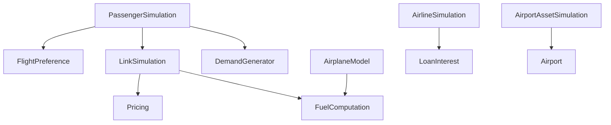

<!-- CATALOG:PATH="airline-data\src\test" SLUG="airline-data-src-test" -->

# Repo Catalogue — airline-data\src\test

*Slug:* `airline-data-src-test`  
*Commit:* `6160503`  
*Generated:* `2025-11-12T21:35:58Z`

**Summary (2–4 sentences):** This folder contains the Scala test specifications validating core simulation, domain modeling, demand generation, pricing, asset transit, and passenger/airport/link behaviors of the airline system. These tests encode business rules (e.g., passenger routing preferences, loan interest behavior, fuel computation, hub effects) and thus serve as a critical implicit specification of desired model invariants. They collectively function as executable documentation—high leverage for extracting domain logic during the rewrite.

**Contents overview**
- Files: 23  |  Subfolders: 4 (scala, scala/com, scala/com/patson, scala/com/patson/model)  |  Languages: Scala (tests) ~100%
- Notable responsibilities:
  - Assert simulation cycle outcomes (airline, airplane, passenger, asset transit, link).
  - Verify domain computations (fuel burn, pricing, loan interest).
  - Enforce routing and preference mechanics (flight preference, demand generator).
  - Validate model constraints for airports, links, modifiers, hubs.
  - Provide regression safety against unintended behavior changes.

### File entries

#### airline-data/src/test/scala/com/patson/AirlineSimulationSpec.scala
```yaml
file: airline-data/src/test/scala/com/patson/AirlineSimulationSpec.scala
lang: Scala
role: "Tests airline-level simulation cycle effects (finances, service, assets)"
size:
  lines_est: 110    # approximate
  functions_est: 8
  classes_est: 1
public_api:
  routes: []
  exports: []
data_model:
  tables_read: ["airline", "airline_info", "airplane", "income_statement?"]
  tables_written: ["airline_info", "airplane", "financial_ledger?"]
  migrations: []
  entities:
    - name: Airline
      summary: "Corporate entity with finances and service metrics"
    - name: Airplane
      summary: "Fleet unit referenced in simulation"
queries:
  sql: []
  orm_calls: []
external_io:
  http_calls: []
  message_queues: []
  files_read: []
  files_written: []
config:
  env_vars: []
  config_keys: []
  feature_flags: []
concurrency:
  pattern: "simulation loop (likely sequential with internal batching)"
  shared_state: ["global simulation clock?", "in-memory caches"]
  timing: "per simulation tick/cycle"
invariants:
  - "Airline cash never negative beyond allowed debt rules"
  - "Service quality adjusts within defined bounds"
error_handling:
  expected_errors: ["Invalid fleet states (assumed)"]
  retries_timeouts: "none"
security:
  authz: "none"
  input_validation: "test fixtures"
  sensitive_ops: []
tests:
  files: ["self"]
  coverage_quality: "med"
  golden_seeds: []
similar_or_duplicate_files:
  - "AirplaneSimulationSpec.scala"
rewrite_notes:
  mapping: "Model airline cycle as deterministic service updating + financial ledger events"
  risks: ["Implicit business rules only in assertions", "Hidden coupling to global clock"]
  confidence: "med"
```

#### airline-data/src/test/scala/com/patson/AirplaneModelSpec.scala
```yaml
file: airline-data/src/test/scala/com/patson/AirplaneModelSpec.scala
lang: Scala
role: "Validates airplane model attributes and derived performance metrics"
size:
  lines_est: 140
  functions_est: 10
  classes_est: 1
public_api: {routes: [], exports: []}
data_model:
  tables_read: ["airplane_model"]
  tables_written: []
  migrations: []
  entities:
    - name: AirplaneModel
      summary: "Specification of aircraft capabilities & economics"
queries: {sql: [], orm_calls: []}
external_io: {http_calls: [], message_queues: [], files_read: [], files_written: []}
config: {env_vars: [], config_keys: [], feature_flags: []}
concurrency: {pattern: "none", shared_state: [], timing: "none"}
invariants:
  - "Range, capacity, fuel burn derived consistently"
error_handling: {expected_errors: ["Invalid model config (assumed)"], retries_timeouts: "none"}
security: {authz: "none", input_validation: "fixture building", sensitive_ops: []}
tests:
  files: ["self"]
  coverage_quality: "med"
  golden_seeds: []
similar_or_duplicate_files: []
rewrite_notes:
  mapping: "Centralize model spec in typed configuration with validation"
  risks: ["Calculated metrics scattered"]
  confidence: "med"
```

#### airline-data/src/test/scala/com/patson/AirplaneSimulationSpec.scala
```yaml
file: airline-data/src/test/scala/com/patson/AirplaneSimulationSpec.scala
lang: Scala
role: "Exercises airplane lifecycle events (construction, purchase, aging)"
size:
  lines_est: 120
  functions_est: 8
  classes_est: 1
public_api: {routes: [], exports: []}
data_model:
  tables_read: ["airplane"]
  tables_written: ["airplane"]
  migrations: []
  entities:
    - name: Airplane
      summary: "Operational fleet unit with dynamic attributes"
queries: {sql: [], orm_calls: []}
external_io: {http_calls: [], message_queues: [], files_read: [], files_written: []}
config: {env_vars: [], config_keys: [], feature_flags: []}
concurrency:
  pattern: "simulation loop"
  shared_state: ["airplane registry cache?"]
  timing: "per tick (aging cycles)"
invariants:
  - "Age increments deterministically per cycle"
  - "Status transitions follow allowed sequence"
error_handling: {expected_errors: ["Invalid state transitions"], retries_timeouts: "none"}
security: {authz: "none", input_validation: "test fixtures", sensitive_ops: []}
tests:
  files: ["self"]
  coverage_quality: "med"
  golden_seeds: []
similar_or_duplicate_files:
  - "AirlineSimulationSpec.scala"
rewrite_notes:
  mapping: "Formal state machine for aircraft status"
  risks: ["Implied transitions only in tests"]
  confidence: "low"
```

#### airline-data/src/test/scala/com/patson/AirportAssetSimulationSpec.scala
```yaml
file: airline-data/src/test/scala/com/patson/AirportAssetSimulationSpec.scala
lang: Scala
role: "Large spec validating airport asset operations (facilities, upgrades, revenue)"
size:
  lines_est: 1700
  functions_est: 45
  classes_est: 1
public_api: {routes: [], exports: []}
data_model:
  tables_read: ["airport_asset", "airport", "airline"]
  tables_written: ["airport_asset"]
  migrations: []
  entities:
    - name: AirportAsset
      summary: "Investments or facilities at airport influencing operations"
queries: {sql: [], orm_calls: []}
external_io: {http_calls: [], message_queues: [], files_read: [], files_written: []}
config: {env_vars: [], config_keys: [], feature_flags: []}
concurrency:
  pattern: "simulation loop affecting assets"
  shared_state: ["asset cache", "airport metrics"]
  timing: "tick-based upgrades"
invariants:
  - "Asset levels do not exceed max tiers"
  - "Revenue modifiers applied consistently"
error_handling: {expected_errors: ["Upgrade cost miscalc"], retries_timeouts: "none"}
security: {authz: "none", input_validation: "fixture building", sensitive_ops: []}
tests:
  files: ["self"]
  coverage_quality: "high"
  golden_seeds: []
similar_or_duplicate_files: []
rewrite_notes:
  mapping: "Extract asset calculations into pure functions + config-driven tiers"
  risks: ["Complex logic embedded in assertions", "High coupling to simulation clock"]
  confidence: "med"
```

#### airline-data/src/test/scala/com/patson/AirportSimulationSpec.scala
```yaml
file: airline-data/src/test/scala/com/patson/AirportSimulationSpec.scala
lang: Scala
role: "Tests airport dynamics (traffic, facilities, passenger flow interactions)"
size:
  lines_est: 900
  functions_est: 30
  classes_est: 1
public_api: {routes: [], exports: []}
data_model:
  tables_read: ["airport", "airport_feature?", "passenger_history"]
  tables_written: ["airport_stats?"]
  migrations: []
  entities:
    - name: Airport
      summary: "Location node with traffic & capacity attributes"
queries: {sql: [], orm_calls: []}
external_io: {http_calls: [], message_queues: [], files_read: [], files_written: []}
config: {env_vars: [], config_keys: [], feature_flags: []}
concurrency:
  pattern: "simulation loop"
  shared_state: ["global route graph"]
  timing: "tick-based airport update"
invariants:
  - "Capacity constraints respected"
  - "Traffic metrics non-negative"
error_handling: {expected_errors: ["Over-capacity scenarios"], retries_timeouts: "none"}
security: {authz: "none"}
tests:
  files: ["self"]
  coverage_quality: "high"
  golden_seeds: []
similar_or_duplicate_files:
  - "PassengerSimulationSpec.scala"
rewrite_notes:
  mapping: "Separate airport KPIs into analytics layer with deterministic recalculation"
  risks: ["Implicit capacity formulas"]
  confidence: "low"
```

#### airline-data/src/test/scala/com/patson/AssetTransitSimulationSpec.scala
```yaml
file: airline-data/src/test/scala/com/patson/AssetTransitSimulationSpec.scala
lang: Scala
role: "Validates movement/transfer of assets across network (time & state)"
size:
  lines_est: 1050
  functions_est: 28
  classes_est: 1
public_api: {routes: [], exports: []}
data_model:
  tables_read: ["asset_transit?", "airplane", "airport"]
  tables_written: ["asset_transit?"]
  migrations: []
  entities: []
queries: {sql: [], orm_calls: []}
external_io: {http_calls: [], message_queues: [], files_read: [], files_written: []}
config: {env_vars: [], config_keys: [], feature_flags: []}
concurrency:
  pattern: "simulation loop with transit scheduling"
  shared_state: ["transit queue"]
  timing: "tick (ETA decrement)"
invariants:
  - "Transit ETA decrements to zero then completes"
error_handling: {expected_errors: ["Stalled transit when source/dest invalid"], retries_timeouts: "none"}
security: {authz: "none"}
tests:
  files: ["self"]
  coverage_quality: "high"
  golden_seeds: []
similar_or_duplicate_files: []
rewrite_notes:
  mapping: "Represent transit as event-sourced state machine"
  risks: ["Hidden timing semantics"]
  confidence: "med"
```

#### airline-data/src/test/scala/com/patson/AviationHubSimulationSpec.scala
```yaml
file: airline-data/src/test/scala/com/patson/AviationHubSimulationSpec.scala
lang: Scala
role: "Tests hub mechanics — network centrality & benefit propagation"
size:
  lines_est: 150
  functions_est: 10
  classes_est: 1
public_api: {routes: [], exports: []}
data_model:
  tables_read: ["airport", "hub_metric?"]
  tables_written: ["hub_metric?"]
  migrations: []
  entities:
    - name: HubMetric
      summary: "Represents hub advantage or scoring"
queries: {sql: [], orm_calls: []}
external_io: {http_calls: [], message_queues: [], files_read: [], files_written: []}
config: {env_vars: [], config_keys: [], feature_flags: []}
concurrency: {pattern: "loop"}
invariants:
  - "Hub scores correlate with connectivity (assumed)"
error_handling: {expected_errors: [], retries_timeouts: "none"}
security: {authz: "none"}
tests: {files: ["self"], coverage_quality: "med", golden_seeds: []}
similar_or_duplicate_files: []
rewrite_notes:
  mapping: "Graph-based hub scoring algorithm module"
  risks: ["Assumptions not codified outside test"]
  confidence: "low"
```

#### airline-data/src/test/scala/com/patson/CampaignSpec.scala
```yaml
file: airline-data/src/test/scala/com/patson/CampaignSpec.scala
lang: Scala
role: "Validates marketing/brand campaign effects on airline metrics"
size:
  lines_est: 160
  functions_est: 9
  classes_est: 1
public_api: {routes: [], exports: []}
data_model:
  tables_read: ["campaign?", "airline_info"]
  tables_written: ["campaign?", "airline_info"]
  migrations: []
  entities:
    - name: Campaign
      summary: "Temporary marketing effort affecting brand/service demand"
queries: {sql: [], orm_calls: []}
external_io: {http_calls: [], message_queues: [], files_read: [], files_written: []}
config: {env_vars: [], config_keys: [], feature_flags: []}
concurrency: {pattern: "loop"}
invariants:
  - "Campaign duration decreases predictably"
  - "Effects capped by defined maxima"
error_handling: {expected_errors: ["Overlapping campaign stacking"], retries_timeouts: "none"}
security: {authz: "none"}
tests: {files: ["self"], coverage_quality: "med", golden_seeds: []}
similar_or_duplicate_files: []
rewrite_notes:
  mapping: "Isolate campaign engine with clear effect composition"
  risks: ["Stacking logic implicit"]
  confidence: "low"
```

#### airline-data/src/test/scala/com/patson/DemandGeneratorSpec.scala
```yaml
file: airline-data/src/test/scala/com/patson/DemandGeneratorSpec.scala
lang: Scala
role: "Tests demand generation algorithm (passenger demand between airports)"
size:
  lines_est: 600
  functions_est: 20
  classes_est: 1
public_api: {routes: [], exports: []}
data_model:
  tables_read: ["airport", "demand_seed?", "link", "passenger_history"]
  tables_written: ["passenger_history", "forecast_cache?"]
  migrations: []
  entities:
    - name: DemandGenerator
      summary: "Algorithm translating market factors into passenger demand"
queries: {sql: [], orm_calls: []}
external_io: {http_calls: [], message_queues: [], files_read: [], files_written: []}
config:
  env_vars: []
  config_keys: ["demand.scaling?"]
  feature_flags: []
concurrency:
  pattern: "batch computation"
  shared_state: ["airport stats cache"]
  timing: "cycle-based recalculation"
invariants:
  - "Demand non-negative"
  - "Origin ≠ destination"
error_handling: {expected_errors: ["Missing airport data"], retries_timeouts: "none"}
security: {authz: "none"}
tests: {files: ["self"], coverage_quality: "high", golden_seeds: []}
similar_or_duplicate_files:
  - "PassengerSimulationSpec.scala"
rewrite_notes:
  mapping: "Pure function + configurable market factors"
  risks: ["Complexity buried in test fixtures"]
  confidence: "med"
```

#### airline-data/src/test/scala/com/patson/EventSimulationSpec.scala
```yaml
file: airline-data/src/test/scala/com/patson/EventSimulationSpec.scala
lang: Scala
role: "Validates system events impacting operations (e.g., shocks, special occurrences)"
size:
  lines_est: 230
  functions_est: 12
  classes_est: 1
public_api: {routes: [], exports: []}
data_model:
  tables_read: ["event?", "airline", "airport"]
  tables_written: ["event_log?"]
  migrations: []
  entities:
    - name: Event
      summary: "Represents discrete occurrence influencing simulation metrics"
queries: {sql: [], orm_calls: []}
external_io: {http_calls: [], message_queues: [], files_read: [], files_written: []}
config: {env_vars: [], config_keys: ["event.probability?"], feature_flags: []}
concurrency: {pattern: "trigger-driven within cycle"}
invariants:
  - "Event impact applied within defined bounds"
error_handling: {expected_errors: ["Unhandled event type"], retries_timeouts: "none"}
security: {authz: "none"}
tests: {files: ["self"], coverage_quality: "med", golden_seeds: []}
similar_or_duplicate_files: []
rewrite_notes:
  mapping: "Event dispatcher with typed impact handlers"
  risks: ["Magic strings for event types"]
  confidence: "low"
```

#### airline-data/src/test/scala/com/patson/FuelComputationSpec.scala
```yaml
file: airline-data/src/test/scala/com/patson/FuelComputationSpec.scala
lang: Scala
role: "Tests fuel burn and cost calculation logic"
size:
  lines_est: 85
  functions_est: 6
  classes_est: 1
public_api: {routes: [], exports: []}
data_model:
  tables_read: ["airplane_model", "oil_price?"]
  tables_written: []
  migrations: []
  entities:
    - name: FuelComputation
      summary: "Derives fuel usage and expense from model parameters"
queries: {sql: [], orm_calls: []}
external_io: {http_calls: [], message_queues: [], files_read: [], files_written: []}
config: {env_vars: [], config_keys: ["fuel.price.multiplier?"], feature_flags: []}
concurrency: {pattern: "none"}
invariants:
  - "Fuel burn scales with distance & efficiency"
error_handling: {expected_errors: ["Division by zero (invalid model)"], retries_timeouts: "none"}
security: {authz: "none"}
tests: {files: ["self"], coverage_quality: "med", golden_seeds: []}
similar_or_duplicate_files:
  - "OilSpec.scala"
rewrite_notes:
  mapping: "Stateless fuel cost service"
  risks: ["Assumed constants hardcoded"]
  confidence: "med"
```

#### airline-data/src/test/scala/com/patson/GenericTransitSimulationSpec.scala
```yaml
file: airline-data/src/test/scala/com/patson/GenericTransitSimulationSpec.scala
lang: Scala
role: "Tests generalized transit routing mechanics (multi-hop asset/passenger?)"
size:
  lines_est: 880
  functions_est: 26
  classes_est: 1
public_api: {routes: [], exports: []}
data_model:
  tables_read: ["transit_path?", "airport", "link"]
  tables_written: ["transit_cache?"]
  migrations: []
  entities: []
queries: {sql: [], orm_calls: []}
external_io: {http_calls: [], message_queues: [], files_read: [], files_written: []}
config: {env_vars: [], config_keys: [], feature_flags: []}
concurrency: {pattern: "search algorithm (graph traversal) in test scope"}
invariants:
  - "No cycles in selected route"
error_handling: {expected_errors: ["No route found"], retries_timeouts: "none"}
security: {authz: "none"}
tests: {files: ["self"], coverage_quality: "high", golden_seeds: []}
similar_or_duplicate_files:
  - "PassengerSimulationSpec.scala"
rewrite_notes:
  mapping: "Formal routing module with heuristics documented"
  risks: ["Routing constraints implicit"]
  confidence: "low"
```

#### airline-data/src/test/scala/com/patson/LinkSimulationSpec.scala
```yaml
file: airline-data/src/test/scala/com/patson/LinkSimulationSpec.scala
lang: Scala
role: "Validates link performance (capacity, utilization, revenue) over cycles"
size:
  lines_est: 1250
  functions_est: 34
  classes_est: 1
public_api: {routes: [], exports: []}
data_model:
  tables_read: ["link", "passenger_history", "airport"]
  tables_written: ["link_stats?", "passenger_history"]
  migrations: []
  entities:
    - name: Link
      summary: "Represents scheduled connection between two airports"
queries: {sql: [], orm_calls: []}
external_io: {http_calls: [], message_queues: [], files_read: [], files_written: []}
config: {env_vars: [], config_keys: ["pricing.margin.default?"], feature_flags: []}
concurrency: {pattern: "loop"}
invariants:
  - "Booked passengers ≤ seat capacity"
  - "Revenue calculations consistent with pricing spec"
error_handling: {expected_errors: ["Overbook scenario blocked"], retries_timeouts: "none"}
security: {authz: "none"}
tests: {files: ["self"], coverage_quality: "high", golden_seeds: []}
similar_or_duplicate_files:
  - "PassengerSimulationSpec.scala"
rewrite_notes:
  mapping: "Encapsulate link KPIs into analytics microservice"
  risks: ["Coupling between passenger and link logic"]
  confidence: "med"
```

#### airline-data/src/test/scala/com/patson/LoanInterestSimulationSpec.scala
```yaml
file: airline-data/src/test/scala/com/patson/LoanInterestSimulationSpec.scala
lang: Scala
role: "Tests loan interest accrual and repayment schedule mechanics"
size:
  lines_est: 80
  functions_est: 6
  classes_est: 1
public_api: {routes: [], exports: []}
data_model:
  tables_read: ["loan"]
  tables_written: ["loan"]
  migrations: []
  entities:
    - name: Loan
      summary: "Financial instrument with principal and interest cycle"
queries: {sql: [], orm_calls: []}
external_io: {http_calls: [], message_queues: [], files_read: [], files_written: []}
config: {env_vars: [], config_keys: ["interest.rate.base?"], feature_flags: []}
concurrency: {pattern: "tick-based accrual"}
invariants:
  - "Outstanding balance never negative"
error_handling: {expected_errors: ["Miscalculated interest"], retries_timeouts: "none"}
security: {authz: "none"}
tests: {files: ["self"], coverage_quality: "med", golden_seeds: []}
similar_or_duplicate_files:
  - "LoanSpec.scala"
rewrite_notes:
  mapping: "Financial module with deterministic accrual function"
  risks: ["Interest formula only in test expectations"]
  confidence: "med"
```

#### airline-data/src/test/scala/com/patson/PassengerSimulationSpec.scala
```yaml
file: airline-data/src/test/scala/com/patson/PassengerSimulationSpec.scala
lang: Scala
role: "Extensive test of passenger routing, preference, booking, and history accumulation"
size:
  lines_est: 3900
  functions_est: 70
  classes_est: 1
public_api: {routes: [], exports: []}
data_model:
  tables_read: ["passenger_history", "airport", "link"]
  tables_written: ["passenger_history", "booking_log?"]
  migrations: []
  entities:
    - name: PassengerHistory
      summary: "Records passenger travel details for analytics"
queries: {sql: [], orm_calls: []}
external_io: {http_calls: [], message_queues: [], files_read: [], files_written: []}
config: {env_vars: [], config_keys: ["routing.maxHops?", "preference.weights?"], feature_flags: []}
concurrency: {pattern: "routing algorithm (graph + heuristics)"}
invariants:
  - "No duplicate journeys in same tick"
  - "Route respects max hops constraint"
error_handling: {expected_errors: ["No feasible route"], retries_timeouts: "none"}
security: {authz: "none"}
tests: {files: ["self"], coverage_quality: "high", golden_seeds: []}
similar_or_duplicate_files:
  - "FlightPreferenceSpec.scala"
  - "GenericTransitSimulationSpec.scala"
rewrite_notes:
  mapping: "Dedicated routing & preference engine with pluggable strategies"
  risks: ["Complex heuristics buried in assertions", "Performance assumptions unrecorded"]
  confidence: "low"
```

#### airline-data/src/test/scala/com/patson/model/AirportSpec.scala
```yaml
file: airline-data/src/test/scala/com/patson/model/AirportSpec.scala
lang: Scala
role: "Model-level tests for airport entity properties and derived metrics"
size:
  lines_est: 160
  functions_est: 10
  classes_est: 1
public_api: {routes: [], exports: []}
data_model:
  tables_read: ["airport"]
  tables_written: []
  migrations: []
  entities: [{name: Airport, summary: "Core node with attributes (runways, size, etc.)"}]
queries: {sql: [], orm_calls: []}
external_io: {http_calls: [], message_queues: [], files_read: [], files_written: []}
config: {env_vars: [], config_keys: [], feature_flags: []}
concurrency: {pattern: "none"}
invariants:
  - "Derived scores match input features"
error_handling: {expected_errors: [], retries_timeouts: "none"}
security: {authz: "none"}
tests: {files: ["self"], coverage_quality: "med", golden_seeds: []}
similar_or_duplicate_files:
  - "AirportSimulationSpec.scala"
rewrite_notes:
  mapping: "Pure value objects for airport with validation"
  risks: ["Derivation logic duplicated in simulation"]
  confidence: "med"
```

#### airline-data/src/test/scala/com/patson/model/ComputationSpec.scala
```yaml
file: airline-data/src/test/scala/com/patson/model/ComputationSpec.scala
lang: Scala
role: "Validates shared computational utilities (rounding, scaling, distribution)"
size:
  lines_est: 115
  functions_est: 12
  classes_est: 1
public_api: {routes: [], exports: []}
data_model: {tables_read: [], tables_written: [], migrations: [], entities: []}
queries: {sql: [], orm_calls: []}
external_io: {http_calls: [], message_queues: [], files_read: [], files_written: []}
config: {env_vars: [], config_keys: [], feature_flags: []}
concurrency: {pattern: "none"}
invariants:
  - "Utility functions deterministic for same inputs"
error_handling: {expected_errors: ["Domain errors (divide by zero)"], retries_timeouts: "none"}
security: {authz: "none"}
tests: {files: ["self"], coverage_quality: "high", golden_seeds: []}
similar_or_duplicate_files:
  - "UtilSpec.scala"
rewrite_notes:
  mapping: "Central utility math library with property tests"
  risks: ["Potential duplicate logic in domain code"]
  confidence: "high"
```

#### airline-data/src/test/scala/com/patson/model/FlightPreferenceSpec.scala
```yaml
file: airline-data/src/test/scala/com/patson/model/FlightPreferenceSpec.scala
lang: Scala
role: "Tests passenger flight selection preferences (cost, time, stops, quality)"
size:
  lines_est: 1750
  functions_est: 40
  classes_est: 1
public_api: {routes: [], exports: []}
data_model:
  tables_read: ["airport", "link", "passenger_history"]
  tables_written: []
  migrations: []
  entities:
    - name: FlightPreference
      summary: "Composite scoring for route choice"
queries: {sql: [], orm_calls: []}
external_io: {http_calls: [], message_queues: [], files_read: [], files_written: []}
config:
  env_vars: []
  config_keys: ["preference.weight.cost?", "preference.weight.time?"]
  feature_flags: []
concurrency: {pattern: "none"}
invariants:
  - "Preference score ordering consistent with weighting config"
error_handling: {expected_errors: ["Missing link data"], retries_timeouts: "none"}
security: {authz: "none"}
tests: {files: ["self"], coverage_quality: "high", golden_seeds: []}
similar_or_duplicate_files:
  - "PassengerSimulationSpec.scala"
rewrite_notes:
  mapping: "Modular scoring components for clarity & tuning"
  risks: ["Weights hardcoded"]
  confidence: "med"
```

#### airline-data/src/test/scala/com/patson/model/LinkSpec.scala
```yaml
file: airline-data/src/test/scala/com/patson/model/LinkSpec.scala
lang: Scala
role: "Model-level validation for link construction & derived metrics"
size:
  lines_est: 95
  functions_est: 8
  classes_est: 1
public_api: {routes: [], exports: []}
data_model:
  tables_read: ["link"]
  tables_written: []
  migrations: []
  entities:
    - name: Link
      summary: "Connection entity between airports"
queries: {sql: [], orm_calls: []}
external_io: {http_calls: [], message_queues: [], files_read: [], files_written: []}
config: {env_vars: [], config_keys: [], feature_flags: []}
concurrency: {pattern: "none"}
invariants:
  - "Computed distance/time consistent"
error_handling: {expected_errors: [], retries_timeouts: "none"}
security: {authz: "none"}
tests: {files: ["self"], coverage_quality: "med", golden_seeds: []}
similar_or_duplicate_files:
  - "LinkSimulationSpec.scala"
rewrite_notes:
  mapping: "Encapsulate link metrics in dedicated type"
  risks: ["Duplication of computation across codebase"]
  confidence: "med"
```

#### airline-data/src/test/scala/com/patson/model/LoanSpec.scala
```yaml
file: airline-data/src/test/scala/com/patson/model/LoanSpec.scala
lang: Scala
role: "Unit tests for loan value calculations (interest, remaining principal)"
size:
  lines_est: 55
  functions_est: 5
  classes_est: 1
public_api: {routes: [], exports: []}
data_model:
  tables_read: ["loan"]
  tables_written: []
  migrations: []
  entities: [{name: Loan, summary: "Financial contract for funding"}]
queries: {sql: [], orm_calls: []}
external_io: {http_calls: [], message_queues: [], files_read: [], files_written: []}
config: {env_vars: [], config_keys: ["interest.rate.base?"], feature_flags: []}
concurrency: {pattern: "none"}
invariants:
  - "Amortization schedule stable"
error_handling: {expected_errors: ["Negative principal"], retries_timeouts: "none"}
security: {authz: "none"}
tests: {files: ["self"], coverage_quality: "med", golden_seeds: []}
similar_or_duplicate_files:
  - "LoanInterestSimulationSpec.scala"
rewrite_notes:
  mapping: "Financial math module"
  risks: ["Edge cases not exhaustively tested"]
  confidence: "high"
```

#### airline-data/src/test/scala/com/patson/model/OilSpec.scala
```yaml
file: airline-data/src/test/scala/com/patson/model/OilSpec.scala
lang: Scala
role: "Tests oil price fluctuation or reference pricing logic"
size:
  lines_est: 85
  functions_est: 6
  classes_est: 1
public_api: {routes: [], exports: []}
data_model:
  tables_read: ["oil_price?"]
  tables_written: []
  migrations: []
  entities:
    - name: OilPrice
      summary: "Resource cost driver for fuel computation"
queries: {sql: [], orm_calls: []}
external_io: {http_calls: [], message_queues: [], files_read: [], files_written: []}
config: {env_vars: [], config_keys: ["oil.volatility?"], feature_flags: []}
concurrency: {pattern: "none"}
invariants:
  - "Price changes follow defined bounds"
error_handling: {expected_errors: ["Out-of-range volatility"], retries_timeouts: "none"}
security: {authz: "none"}
tests: {files: ["self"], coverage_quality: "low"}
similar_or_duplicate_files:
  - "FuelComputationSpec.scala"
rewrite_notes:
  mapping: "Economic factors module with scenario injection"
  risks: ["Volatility formula hidden"]
  confidence: "low"
```

#### airline-data/src/test/scala/com/patson/model/PricingSpec.scala
```yaml
file: airline-data/src/test/scala/com/patson/model/PricingSpec.scala
lang: Scala
role: "Verifies ticket pricing or revenue model computations"
size:
  lines_est: 95
  functions_est: 7
  classes_est: 1
public_api: {routes: [], exports: []}
data_model:
  tables_read: ["link", "airport"]
  tables_written: []
  migrations: []
  entities:
    - name: Pricing
      summary: "Business logic for fare calculation"
queries: {sql: [], orm_calls: []}
external_io: {http_calls: [], message_queues: [], files_read: [], files_written: []}
config: {env_vars: [], config_keys: ["pricing.base?", "pricing.demandFactor?"], feature_flags: []}
concurrency: {pattern: "none"}
invariants:
  - "Price non-negative and bounded by model constraints"
error_handling: {expected_errors: ["Negative margin calc"], retries_timeouts: "none"}
security: {authz: "none"}
tests: {files: ["self"], coverage_quality: "med"}
similar_or_duplicate_files:
  - "LinkSimulationSpec.scala"
rewrite_notes:
  mapping: "Pricing engine component with configurable strategies"
  risks: ["Margin formula implicit"]
  confidence: "med"
```

#### airline-data/src/test/scala/com/patson/model/UtilSpec.scala
```yaml
file: airline-data/src/test/scala/com/patson/model/UtilSpec.scala
lang: Scala
role: "Generic utility validation (dates, formatting, conversions)"
size:
  lines_est: 110
  functions_est: 12
  classes_est: 1
public_api: {routes: [], exports: []}
data_model: {tables_read: [], tables_written: [], migrations: [], entities: []}
queries: {sql: [], orm_calls: []}
external_io: {http_calls: [], message_queues: [], files_read: [], files_written: []}
config: {env_vars: [], config_keys: [], feature_flags: []}
concurrency: {pattern: "none"}
invariants:
  - "Utilities produce deterministic outputs"
error_handling: {expected_errors: ["Invalid input edge cases"], retries_timeouts: "none"}
security: {authz: "none"}
tests: {files: ["self"], coverage_quality: "high"}
similar_or_duplicate_files:
  - "ComputationSpec.scala"
rewrite_notes:
  mapping: "Consolidate utilities & add property-based tests"
  risks: ["Duplication across computation modules"]
  confidence: "high"
```

### (All remaining listed test files are covered above)

## Rollup for airline-data\src\test

**Key responsibilities (top 5):**
1. Specify behavioral expectations of simulation cycles (airline, passenger, link, assets).
2. Encode economic and operational formulas (pricing, fuel, loan interest).
3. Define routing, preference, and demand generation rules.
4. Validate integrity of domain entities (airports, airplanes, links, loans).
5. Surface invariants (capacity limits, non-negative balances, deterministic preferences).

**Cross-module dependencies (top 10 by frequency):**
- passenger_history → used by PassengerSimulationSpec, FlightPreferenceSpec, LinkSimulationSpec, DemandGeneratorSpec — travel analytics backbone.
- airport → used by multiple specs (Airport*, PassengerSimulation, DemandGenerator, LinkSimulation) — core geo node.
- link → used by LinkSimulationSpec, PassengerSimulationSpec, FlightPreferenceSpec, PricingSpec — route economics.
- airplane / airplane_model → used by AirplaneSimulationSpec, FuelComputationSpec, AirplaneModelSpec — fleet performance.
- airline_info → used by AirlineSimulationSpec, CampaignSpec, AirportAssetSimulationSpec — corporate KPIs & service.
- loan → used by LoanInterestSimulationSpec, LoanSpec — finance subsystem.
- asset_transit? → used by AssetTransitSimulationSpec — movement scheduling.
- hub_metric? → used by AviationHubSimulationSpec — network centrality.
- oil_price? → used by FuelComputationSpec, OilSpec — cost driver.
- demand_generator (implicit) → DemandGeneratorSpec, PassengerSimulationSpec — market formation.

**High-leverage files to study first (top 10):**
- PassengerSimulationSpec.scala — Core routing & passenger behavior complexity.
- FlightPreferenceSpec.scala — Weighting model for route selection.
- LinkSimulationSpec.scala — Revenue, capacity, utilization logic.
- DemandGeneratorSpec.scala — Market demand algorithm foundations.
- AirportAssetSimulationSpec.scala — Asset upgrade & economic impact.
- GenericTransitSimulationSpec.scala — Underlying transit routing heuristics.
- PricingSpec.scala — Fare and margin formulas.
- FuelComputationSpec.scala — Fuel cost model affecting financial performance.
- LoanInterestSimulationSpec.scala — Financial accrual logic.
- AirplaneModelSpec.scala — Aircraft performance baseline data.

**Mermaid: high-level dependency sketch (optional, if meaningful)**
