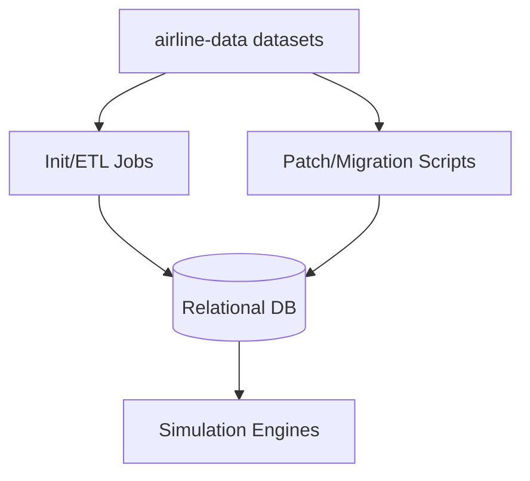

<!-- CATALOG:PATH="airline-data" SLUG="airline-data" -->

# Repo Catalogue — airline-data

*Slug:* `airline-data`  
*Commit:* `6160503`  
*Generated:* `2025-11-13T00:19:36Z`

Important note about listing completeness:
- The directory listing was retrieved via the GitHub Contents API, which pages results. Some items might not appear here due to pagination limits. For a complete view, browse the folder in GitHub: https://github.com/joshuac-dev/airline/tree/master/airline-data

**Summary (2–4 sentences):** Top-level data and utility assets for the airline simulation. Contains canonical geo and airport datasets (airports, runways, weather, cities), country relationship matrices, economic parameter files, ad-hoc SQL patch scripts, project build metadata, and startup helpers. These static files serve as authoritative sources for initial import (init/patch jobs), periodic recalibration, and reproducible world-state construction. Subfolders like db, db_scripts, project, and src are catalogued separately.

**Contents overview**
- Files: 29  |  Subfolders: 4 (db, db_scripts, project, src)  |  Languages: CSV/TXT (≈92%), SQL (≈3%), Markdown (≈3%), Shell (≈1%), SBT (≈1%)
- Notable responsibilities:
  - Provide authoritative datasets for airports, runways, cities, and airport weather used by init/import/patchers.
  - Include policy/relationship matrices (country mutual relationships, openness) influencing simulation rules.
  - Supply SQL patches for targeted schema/data fixes.
  - Document conversion/migration steps and repository metadata (README, LICENSE).
  - Provide project build (SBT) and startup script.

### File entries

#### airline-data/.gitignore
```yaml
file: airline-data/.gitignore
lang: text
role: "Ignore patterns for this module"
size:
  lines_est: 8
  functions_est: 0
  classes_est: 0
public_api:
  routes: []
  exports: []
data_model:
  tables_read: []
  tables_written: []
  migrations: []
  entities: []
queries: {sql: [], orm_calls: []}
external_io: {http_calls: [], message_queues: [], files_read: [], files_written: []}
config: {env_vars: [], config_keys: [], feature_flags: []}
concurrency: {pattern: "N/A", shared_state: [], timing: "N/A"}
invariants: []
error_handling: {expected_errors: [], retries_timeouts: "N/A"}
security: {authz: "N/A", input_validation: "N/A", sensitive_ops: []}
tests: {files: [], coverage_quality: "low", golden_seeds: []}
similar_or_duplicate_files: []
rewrite_notes:
  mapping: "Carry over ignore patterns to new build system"
  risks: ["Minor; ensure alignment with new artifact structure"]
  confidence: "high"
```

#### airline-data/LICENSE
```yaml
file: airline-data/LICENSE
lang: text
role: "Module-level license file"
size:
  lines_est: 20
  functions_est: 0
  classes_est: 0
public_api: {routes: [], exports: []}
data_model: {tables_read: [], tables_written: [], migrations: [], entities: []}
queries: {sql: [], orm_calls: []}
external_io: {http_calls: [], message_queues: [], files_read: [], files_written: []}
config: {env_vars: [], config_keys: [], feature_flags: []}
concurrency: {pattern: "N/A"}
invariants: []
error_handling: {}
security: {}
tests: {}
similar_or_duplicate_files: []
rewrite_notes:
  mapping: "Preserve or update license in new repo"
  risks: []
  confidence: "high"
```

#### airline-data/README.md
```yaml
file: airline-data/README.md
lang: Markdown
role: "Module readme; basic instructions/notes"
size:
  lines_est: 20
  functions_est: 0
  classes_est: 0
public_api: {routes: [], exports: []}
data_model: {tables_read: [], tables_written: [], migrations: [], entities: []}
queries: {sql: [], orm_calls: []}
external_io: {http_calls: [], message_queues: [], files_read: [], files_written: []}
config: {env_vars: [], config_keys: [], feature_flags: []}
concurrency: {pattern: "N/A"}
invariants: []
error_handling: {}
security: {}
tests: {}
similar_or_duplicate_files: []
rewrite_notes:
  mapping: "Fold content into top-level docs; keep pointers to datasets"
  risks: []
  confidence: "high"
```

#### airline-data/additional-airports.csv
```yaml
file: airline-data/additional-airports.csv
lang: CSV
role: "Supplemental airport records to augment the main airports dataset"
size:
  lines_est: 10
  functions_est: 0
  classes_est: 0
public_api: {routes: [], exports: []}
data_model:
  tables_read: []
  tables_written: ["airport (via init loaders)"]
  migrations: []
  entities:
    - name: Airport
      summary: "Additional airports missing from base source"
queries: {sql: [], orm_calls: []}
external_io: {http_calls: [], message_queues: [], files_read: ["airline-data/additional-airports.csv"], files_written: []}
config: {env_vars: [], config_keys: ["geo.custom.airports.file?"], feature_flags: []}
concurrency: {pattern: "batch import (init)"}
invariants:
  - "Unique airport codes (IATA/ICAO) where applicable"
error_handling: {expected_errors: ["Duplicate code or invalid row"], retries_timeouts: "N/A"}
security: {}
tests: {}
similar_or_duplicate_files:
  - "airline-data/airports.csv"
rewrite_notes:
  mapping: "Combine with primary dataset via ETL with dedupe rules"
  risks: ["Conflicting records vs. main dataset"]
  confidence: "med"
```

#### airline-data/additional-cities.csv
```yaml
file: airline-data/additional-cities.csv
lang: CSV
role: "Supplemental city records beyond GeoNames base files"
size:
  lines_est: 140
  functions_est: 0
  classes_est: 0
public_api: {}
data_model:
  tables_read: []
  tables_written: ["city (via init)"]
  migrations: []
  entities:
    - name: City
      summary: "Additional city/population coordinates"
queries: {}
external_io: {http_calls: [], message_queues: [], files_read: ["airline-data/additional-cities.csv"], files_written: []}
config: {env_vars: [], config_keys: ["geo.custom.cities.file?"], feature_flags: []}
concurrency: {pattern: "batch load"}
invariants:
  - "Population ≥ 0"
  - "Coordinates valid"
error_handling: {expected_errors: ["Malformed CSV"], retries_timeouts: "N/A"}
security: {}
tests: {}
similar_or_duplicate_files:
  - "airline-data/cities500.txt"
  - "airline-data/cities1000.txt"
rewrite_notes:
  mapping: "Single canonical city ETL with precedence rules"
  risks: ["Duplicate place entries"]
  confidence: "med"
```

#### airline-data/airport-weather.csv
```yaml
file: airline-data/airport-weather.csv
lang: CSV
role: "Weather/climate dataset mapped to airports (large)"
size:
  lines_est: 300000  # very large
  functions_est: 0
  classes_est: 0
public_api: {}
data_model:
  tables_read: []
  tables_written: ["airport_weather? (via init or importer)"]
  migrations: []
  entities:
    - name: AirportWeather
      summary: "Derived climate metrics per airport"
queries: {}
external_io:
  http_calls: []
  message_queues: []
  files_read: ["airline-data/airport-weather.csv"]
  files_written: []
config: {env_vars: [], config_keys: ["weather.source.path"], feature_flags: []}
concurrency: {pattern: "batch import"}
invariants:
  - "Station-airport mapping deterministic"
error_handling: {expected_errors: ["Unmatched stations"], retries_timeouts: "N/A"}
security: {}
tests: {}
similar_or_duplicate_files:
  - "src/main/scala/com/patson/init/AirportWeatherData.scala"
  - "src/main/scala/com/patson/init/WeatherImporter.java"
rewrite_notes:
  mapping: "External data source registry with schema and checksums"
  risks: ["Heavy file; memory constraints during import"]
  confidence: "med"
```

#### airline-data/airports.csv
```yaml
file: airline-data/airports.csv
lang: CSV
role: "Primary airport dataset (OpenFlights-like schema)"
size:
  lines_est: 200000  # large
  functions_est: 0
  classes_est: 0
public_api: {}
data_model:
  tables_read: []
  tables_written: ["airport"]
  migrations: []
  entities:
    - name: Airport
      summary: "Core airport reference rows"
queries: {}
external_io: {http_calls: [], message_queues: [], files_read: ["airline-data/airports.csv"], files_written: []}
config: {env_vars: [], config_keys: ["airport.data.path"], feature_flags: []}
concurrency: {pattern: "batch import"}
invariants:
  - "IATA/ICAO uniqueness rules per dataset policy"
  - "Coordinates within valid bounds"
error_handling: {expected_errors: ["Malformed rows"], retries_timeouts: "N/A"}
security: {}
tests: {}
similar_or_duplicate_files:
  - "airline-data/runways.csv"
  - "airline-data/special-airport-names.csv"
rewrite_notes:
  mapping: "Ingest via schema-mapped ETL with validation & diffs"
  risks: ["Field mismatches vs domain model expectations"]
  confidence: "med"
```

#### airline-data/build.sbt
```yaml
file: airline-data/build.sbt
lang: SBT
role: "Scala build definition for this module"
size:
  lines_est: 30
  functions_est: 0
  classes_est: 0
public_api: {}
data_model: {}
queries: {}
external_io: {}
config:
  env_vars: []
  config_keys: ["scalaVersion","libraryDependencies","resolvers"]
  feature_flags: []
concurrency: {pattern: "N/A"}
invariants: []
error_handling: {}
security: {}
tests: {}
similar_or_duplicate_files: []
rewrite_notes:
  mapping: "Translate to new build system (Gradle/Maven or JS/TS if porting)"
  risks: ["Dependency parity; version conflicts"]
  confidence: "high"
```

#### airline-data/cities1000.txt
```yaml
file: airline-data/cities1000.txt
lang: TSV
role: "GeoNames cities (≥1000 population) base dataset"
size:
  lines_est: 1000000  # very large
  functions_est: 0
  classes_est: 0
public_api: {}
data_model:
  tables_read: []
  tables_written: ["city"]
  migrations: []
  entities:
    - name: City
      summary: "City reference import from GeoNames"
queries: {}
external_io: {http_calls: [], message_queues: [], files_read: ["airline-data/cities1000.txt"], files_written: []}
config: {env_vars: [], config_keys: ["geonames.cities.file"], feature_flags: []}
concurrency: {pattern: "batch import"}
invariants:
  - "ISO country codes valid"
error_handling: {expected_errors: ["Encoding issues"], retries_timeouts: "N/A"}
security: {}
tests: {}
similar_or_duplicate_files:
  - "airline-data/cities500.txt"
rewrite_notes:
  mapping: "Standardize on single GeoNames version; checksum-verified"
  risks: ["Version drift; different field layouts"]
  confidence: "med"
```

#### airline-data/cities500.txt
```yaml
file: airline-data/cities500.txt
lang: TSV
role: "GeoNames cities (≥500 population) base dataset"
size:
  lines_est: 1500000  # very large
  functions_est: 0
  classes_est: 0
public_api: {}
data_model:
  tables_read: []
  tables_written: ["city"]
  migrations: []
  entities:
    - name: City
      summary: "Extended city coverage"
queries: {}
external_io: {http_calls: [], message_queues: [], files_read: ["airline-data/cities500.txt"], files_written: []}
config: {env_vars: [], config_keys: ["geonames.cities.file"], feature_flags: []}
concurrency: {pattern: "batch import"}
invariants:
  - "Coordinates and population valid"
error_handling: {}
security: {}
tests: {}
similar_or_duplicate_files:
  - "airline-data/cities1000.txt"
  - "airline-data/additional-cities.csv"
rewrite_notes:
  mapping: "Choose one baseline; reconcile duplicates"
  risks: ["Duplicates across different population thresholds"]
  confidence: "med"
```

#### airline-data/country-code.txt
```yaml
file: airline-data/country-code.txt
lang: text
role: "Country code mapping (ISO) reference"
size:
  lines_est: 600
  functions_est: 0
  classes_est: 0
public_api: {}
data_model:
  tables_read: []
  tables_written: ["country"]
  migrations: []
  entities:
    - name: Country
      summary: "Reference codes and names"
queries: {}
external_io: {http_calls: [], message_queues: [], files_read: ["airline-data/country-code.txt"], files_written: []}
config: {env_vars: [], config_keys: ["country.codes.file"], feature_flags: []}
concurrency: {pattern: "batch import"}
invariants:
  - "ISO alpha-2/alpha-3 validity"
error_handling: {}
security: {}
tests: {}
similar_or_duplicate_files: []
rewrite_notes:
  mapping: "Load into normalized reference table"
  risks: ["Code mismatches with other datasets"]
  confidence: "high"
```

#### airline-data/country-mutual-relationship.csv
```yaml
file: airline-data/country-mutual-relationship.csv
lang: CSV
role: "Baseline bilateral country relationship scores"
size:
  lines_est: 1200
  functions_est: 0
  classes_est: 0
public_api: {}
data_model:
  tables_read: []
  tables_written: ["country_mutual_relationship"]
  migrations: []
  entities:
    - name: CountryRelationship
      summary: "Affinity matrix entries"
queries: {}
external_io: {http_calls: [], message_queues: [], files_read: ["airline-data/country-mutual-relationship.csv"], files_written: []}
config: {env_vars: [], config_keys: ["relationship.weights.source?"], feature_flags: []}
concurrency: {pattern: "batch import"}
invariants:
  - "Symmetry (a,b) == (b,a) expected"
  - "Score bounded, e.g., [-1,1]"
error_handling: {}
security: {}
tests: {}
similar_or_duplicate_files:
  - "airline-data/country-mutual-relationship-patch.csv"
  - "src/main/scala/com/patson/init/CountryMutualRelationshipGenerator.scala"
rewrite_notes:
  mapping: "Store provenance & version; validate symmetry"
  risks: ["Patch drift vs generator output"]
  confidence: "med"
```

#### airline-data/country-mutual-relationship-patch.csv
```yaml
file: airline-data/country-mutual-relationship-patch.csv
lang: CSV
role: "Overrides/patches to the mutual relationship matrix"
size:
  lines_est: 15
  functions_est: 0
  classes_est: 0
public_api: {}
data_model:
  tables_read: ["country_mutual_relationship"]
  tables_written: ["country_mutual_relationship"]
  migrations: []
  entities: []
queries: {}
external_io: {http_calls: [], message_queues: [], files_read: ["airline-data/country-mutual-relationship-patch.csv"], files_written: []}
config: {env_vars: [], config_keys: ["relationship.patch.file"], feature_flags: []}
concurrency: {pattern: "applied in patch step"}
invariants:
  - "Patched scores remain within bounds"
error_handling: {}
security: {}
tests: {}
similar_or_duplicate_files:
  - "airline-data/country-mutual-relationship.csv"
rewrite_notes:
  mapping: "Versioned diffs; automated application with audit"
  risks: ["Manual patch without audit history"]
  confidence: "med"
```

#### airline-data/country-mutual-relationship-readme.md
```yaml
file: airline-data/country-mutual-relationship-readme.md
lang: Markdown
role: "Documentation of relationship dataset semantics"
size:
  lines_est: 60
  functions_est: 0
  classes_est: 0
public_api: {}
data_model: {}
queries: {}
external_io: {}
config: {}
concurrency: {}
invariants: []
error_handling: {}
security: {}
tests: {}
similar_or_duplicate_files: []
rewrite_notes:
  mapping: "Port essential rules into config/docs for new system"
  risks: []
  confidence: "high"
```

#### airline-data/income-data.txt
```yaml
file: airline-data/income-data.txt
lang: text
role: "Reference categories/weights for income statement aggregation"
size:
  lines_est: 1600
  functions_est: 0
  classes_est: 0
public_api: {}
data_model:
  tables_read: []
  tables_written: ["income (category mapping during aggregation)"]
  migrations: []
  entities:
    - name: IncomeCategory
      summary: "Domain labels for revenue/cost buckets"
queries: {}
external_io: {http_calls: [], message_queues: [], files_read: ["airline-data/income-data.txt"], files_written: []}
config: {env_vars: [], config_keys: ["income.categories.config"], feature_flags: []}
concurrency: {pattern: "used during cycle aggregation"}
invariants:
  - "Category keys must match code mappings"
error_handling: {}
security: {}
tests: {}
similar_or_duplicate_files:
  - "airline-data/income-data.txt.bak"
rewrite_notes:
  mapping: "Externalize to typed config with schema validation"
  risks: ["Silent drift between file and code"]
  confidence: "med"
```

#### airline-data/income-data.txt.bak
```yaml
file: airline-data/income-data.txt.bak
lang: text
role: "Backup of income categories"
size:
  lines_est: 1550
  functions_est: 0
  classes_est: 0
public_api: {}
data_model: {}
queries: {}
external_io: {http_calls: [], message_queues: [], files_read: ["airline-data/income-data.txt.bak"], files_written: []}
config: {}
concurrency: {}
invariants: []
error_handling: {}
security: {}
tests: {}
similar_or_duplicate_files:
  - "airline-data/income-data.txt"
rewrite_notes:
  mapping: "Avoid stray .bak in repo; maintain versioned config"
  risks: ["Confusion over source of truth"]
  confidence: "high"
```

#### airline-data/openness.csv
```yaml
file: airline-data/openness.csv
lang: CSV
role: "Country openness index (e.g., visa, policy openness) affecting routes/demand"
size:
  lines_est: 3000
  functions_est: 0
  classes_est: 0
public_api: {}
data_model:
  tables_read: []
  tables_written: ["country_openness? (derived)"]
  migrations: []
  entities:
    - name: CountryOpenness
      summary: "Modifier on demand/regulatory mechanics"
queries: {}
external_io: {http_calls: [], message_queues: [], files_read: ["airline-data/openness.csv"], files_written: []}
config: {env_vars: [], config_keys: ["openness.source.file"], feature_flags: []}
concurrency: {pattern: "batch import"}
invariants:
  - "Scores within configured range"
error_handling: {}
security: {}
tests: {}
similar_or_duplicate_files: []
rewrite_notes:
  mapping: "Document weightings and downstream usage"
  risks: ["Opaque influence in demand/permission logic"]
  confidence: "low"
```

#### airline-data/patch_lounge.sql
```yaml
file: airline-data/patch_lounge.sql
lang: SQL
role: "SQL patch for lounge-related schema/data corrections"
size:
  lines_est: 60
  functions_est: 0
  classes_est: 0
public_api: {}
data_model:
  tables_read: ["lounge","lounge_consumption?"]
  tables_written: ["lounge","lounge_consumption?"]
  migrations: []
  entities:
    - name: Lounge
      summary: "Facility rows corrected/normalized"
queries:
  sql:
    - op: UPDATE
      target: lounge
      where_keys: ["id"]
      notes: "Fix attributes or normalize values"
    - op: DELETE
      target: lounge_consumption
      where_keys: ["invalid rows"]
      notes: "Cleanup orphan/inconsistent data"
  orm_calls: []
external_io: {}
config: {}
concurrency: {pattern: "one-off patch"}
invariants:
  - "FK integrity preserved"
error_handling: {expected_errors: ["Constraint violations on bad data"], retries_timeouts: "N/A"}
security: {authz: "DB admin"}
tests: {}
similar_or_duplicate_files:
  - "airline-data/patch_passenger_history.sql"
rewrite_notes:
  mapping: "Fold into versioned migrations with pre/post checks"
  risks: ["Manual execution variance"]
  confidence: "med"
```

#### airline-data/patch_oil.sql
```yaml
file: airline-data/patch_oil.sql
lang: SQL
role: "SQL patch for oil pricing/contract data adjustments"
size:
  lines_est: 15
  functions_est: 0
  classes_est: 0
public_api: {}
data_model:
  tables_read: ["oil_price","oil_contract"]
  tables_written: ["oil_price","oil_contract"]
  migrations: []
  entities:
    - name: OilPrice
      summary: "Market price corrections"
queries:
  sql:
    - op: UPDATE
      target: oil_contract
      where_keys: ["id"]
      notes: "Contract duration/price corrections"
  orm_calls: []
external_io: {}
config: {}
concurrency: {pattern: "one-off patch"}
invariants:
  - "Price ≥ 0; durations non-negative"
error_handling: {}
security: {authz: "DB admin"}
tests: {}
similar_or_duplicate_files: []
rewrite_notes:
  mapping: "Migration step with audit"
  risks: ["No audit trail if run ad hoc"]
  confidence: "med"
```

#### airline-data/patch_passenger_history.sql
```yaml
file: airline-data/patch_passenger_history.sql
lang: SQL
role: "SQL patch for passenger history corrections (stats alignment)"
size:
  lines_est: 12
  functions_est: 0
  classes_est: 0
public_api: {}
data_model:
  tables_read: ["passenger_history"]
  tables_written: ["passenger_history"]
  migrations: []
  entities:
    - name: PassengerHistory
      summary: "Historical link allocations"
queries:
  sql:
    - op: UPDATE
      target: passenger_history
      where_keys: ["cycle range","link_id"]
      notes: "Fix mis-posted values"
  orm_calls: []
external_io: {}
config: {}
concurrency: {pattern: "one-off patch"}
invariants:
  - "Totals reconcile with link_stats"
error_handling: {}
security: {authz: "DB admin"}
tests: {}
similar_or_duplicate_files: []
rewrite_notes:
  mapping: "Use event-sourced corrections or backfill job"
  risks: ["Manual mismatch corrections"]
  confidence: "med"
```

#### airline-data/removal-airports.csv
```yaml
file: airline-data/removal-airports.csv
lang: CSV
role: "Airport removal list (deprecations/exclusions)"
size:
  lines_est: 8
  functions_est: 0
  classes_est: 0
public_api: {}
data_model:
  tables_read: ["airport (indirect)"]
  tables_written: ["airport (indirect removals/exclusions)"]
  migrations: []
  entities: []
queries: {}
external_io: {http_calls: [], message_queues: [], files_read: ["airline-data/removal-airports.csv"], files_written: []}
config: {env_vars: [], config_keys: ["airport.exclusions.file"], feature_flags: []}
concurrency: {pattern: "applied during ETL"}
invariants:
  - "Referenced airports must exist"
error_handling: {}
security: {}
tests: {}
similar_or_duplicate_files:
  - "airline-data/additional-airports.csv"
rewrite_notes:
  mapping: "Apply via idempotent ETL with audit"
  risks: ["Accidental removal without review"]
  confidence: "high"
```

#### airline-data/runway-patch-2022-dec.csv
```yaml
file: airline-data/runway-patch-2022-dec.csv
lang: CSV
role: "Targeted runway updates (Dec 2022 import patch)"
size:
  lines_est: 40
  functions_est: 0
  classes_est: 0
public_api: {}
data_model:
  tables_read: ["runway"]
  tables_written: ["runway"]
  migrations: []
  entities:
    - name: Runway
      summary: "Physical runway attributes"
queries: {}
external_io: {http_calls: [], message_queues: [], files_read: ["airline-data/runway-patch-2022-dec.csv"], files_written: []}
config: {env_vars: [], config_keys: ["runway.patch.file"], feature_flags: []}
concurrency: {pattern: "one-off patch"}
invariants:
  - "No duplicate runway idents per airport"
error_handling: {}
security: {}
tests: {}
similar_or_duplicate_files:
  - "airline-data/runways-imported-2022-dec.csv"
  - "airline-data/runways.csv"
rewrite_notes:
  mapping: "Consolidate runway dataset and patches with version control"
  risks: ["Patch order dependency"]
  confidence: "med"
```

#### airline-data/runway-proposal.csv
```yaml
file: airline-data/runway-proposal.csv
lang: CSV
role: "Proposed runway additions/changes (staging)"
size:
  lines_est: 130
  functions_est: 0
  classes_est: 0
public_api: {}
data_model: {}
queries: {}
external_io: {http_calls: [], message_queues: [], files_read: ["airline-data/runway-proposal.csv"], files_written: []}
config: {}
concurrency: {}
invariants: []
error_handling: {}
security: {}
tests: {}
similar_or_duplicate_files: []
rewrite_notes:
  mapping: "Track proposals separately with review workflow"
  risks: ["Accidental ingestion of unreviewed proposals"]
  confidence: "med"
```

#### airline-data/runways-imported-2022-dec.csv
```yaml
file: airline-data/runways-imported-2022-dec.csv
lang: CSV
role: "Imported runway dataset snapshot (Dec 2022)"
size:
  lines_est: 150000  # large
  functions_est: 0
  classes_est: 0
public_api: {}
data_model:
  tables_read: []
  tables_written: ["runway"]
  migrations: []
  entities:
    - name: Runway
      summary: "Runway properties per airport"
queries: {}
external_io: {http_calls: [], message_queues: [], files_read: ["airline-data/runways-imported-2022-dec.csv"], files_written: []}
config: {env_vars: [], config_keys: ["runway.data.snapshot.file?"], feature_flags: []}
concurrency: {pattern: "batch import"}
invariants:
  - "Lengths/surfaces normalized"
error_handling: {}
security: {}
tests: {}
similar_or_duplicate_files:
  - "airline-data/runways.csv"
rewrite_notes:
  mapping: "Standardize to a single canonical runway source"
  risks: ["Multiple snapshots causing confusion"]
  confidence: "med"
```

#### airline-data/runways.csv
```yaml
file: airline-data/runways.csv
lang: CSV
role: "Primary runway dataset"
size:
  lines_est: 140000  # large
  functions_est: 0
  classes_est: 0
public_api: {}
data_model:
  tables_read: []
  tables_written: ["runway"]
  migrations: []
  entities:
    - name: Runway
      summary: "Runway details used for capability checks"
queries: {}
external_io: {http_calls: [], message_queues: [], files_read: ["airline-data/runways.csv"], files_written: []}
config: {env_vars: [], config_keys: ["runway.data.path"], feature_flags: []}
concurrency: {pattern: "batch import"}
invariants:
  - "Runway ident uniqueness per airport"
error_handling: {}
security: {}
tests: {}
similar_or_duplicate_files:
  - "airline-data/runways-imported-2022-dec.csv"
  - "src/main/scala/com/patson/init/AirportRunwayPatcher.scala"
rewrite_notes:
  mapping: "ETL with field normalization and units conversion"
  risks: ["Mixed units/surface labels"]
  confidence: "med"
```

#### airline-data/short-airports.csv
```yaml
file: airline-data/short-airports.csv
lang: CSV
role: "List of airports with short runways (constraints feed)"
size:
  lines_est: 15
  functions_est: 0
  classes_est: 0
public_api: {}
data_model:
  tables_read: ["airport","runway (derived)"]
  tables_written: ["airport_features? (derived)"]
  migrations: []
  entities: []
queries: {}
external_io: {http_calls: [], message_queues: [], files_read: ["airline-data/short-airports.csv"], files_written: []}
config: {env_vars: [], config_keys: ["runway.short.threshold"], feature_flags: []}
concurrency: {pattern: "batch apply"}
invariants:
  - "Threshold mapping documented"
error_handling: {}
security: {}
tests: {}
similar_or_duplicate_files:
  - "src/main/scala/com/patson/init/AirportRunwayAnalyzer.scala"
rewrite_notes:
  mapping: "Compute dynamically from runway dataset, not static list"
  risks: ["Staleness vs runway imports"]
  confidence: "med"
```

#### airline-data/special-airport-names.csv
```yaml
file: airline-data/special-airport-names.csv
lang: CSV
role: "Rename/alias mapping for airports with special naming"
size:
  lines_est: 70
  functions_est: 0
  classes_est: 0
public_api: {}
data_model:
  tables_read: []
  tables_written: ["airport (name overrides)"]
  migrations: []
  entities:
    - name: AirportNameAlias
      summary: "Custom display names"
queries: {}
external_io: {http_calls: [], message_queues: [], files_read: ["airline-data/special-airport-names.csv"], files_written: []}
config: {env_vars: [], config_keys: ["airport.naming.overrides.file"], feature_flags: []}
concurrency: {pattern: "applied in init/patch"}
invariants:
  - "Aliases resolve to existing airports"
error_handling: {}
security: {}
tests: {}
similar_or_duplicate_files: []
rewrite_notes:
  mapping: "Centralize aliasing in config with audit"
  risks: ["Locale/display name inconsistencies"]
  confidence: "high"
```

#### airline-data/start.sh
```yaml
file: airline-data/start.sh
lang: Shell
role: "Convenience script to build/run the module"
size:
  lines_est: 20
  functions_est: 0
  classes_est: 0
public_api: {}
data_model: {}
queries: {}
external_io: {}
config:
  env_vars: ["JAVA_HOME?","SBT_OPTS?"]
  config_keys: []
  feature_flags: []
concurrency: {pattern: "N/A"}
invariants: []
error_handling: {}
security: {authz: "shell access", input_validation: "N/A", sensitive_ops: []}
tests: {}
similar_or_duplicate_files: []
rewrite_notes:
  mapping: "Replace with makefile/task runner for new stack"
  risks: ["Assumes local env; not CI-friendly"]
  confidence: "high"
```

#### airline-data/v2.1-conversion-steps
```yaml
file: airline-data/v2.1-conversion-steps
lang: text
role: "Narrative steps for converting to version 2.1"
size:
  lines_est: 30
  functions_est: 0
  classes_est: 0
public_api: {}
data_model: {}
queries: {}
external_io: {}
config: {}
concurrency: {}
invariants: []
error_handling: {}
security: {}
tests: {}
similar_or_duplicate_files:
  - "src/main/scala/com/patson/patch/Version2_1Patcher.scala"
rewrite_notes:
  mapping: "Convert to automated, versioned migration with changelog"
  risks: ["Manual steps error-prone"]
  confidence: "high"
```

### Subfolders (catalogued elsewhere)
- airline-data/db — see repo-catalogue/airline-data-db.md
- airline-data/db_scripts — see repo-catalogue/airline-data-db_scripts.md
- airline-data/project — see repo-catalogue/airline-data-project.md
- airline-data/src — see repo-catalogue/airline-data-src-main-resources.md and per-subfolder catalogues under src/main/scala

## Rollup for airline-data

**Key responsibilities (top 5):**
1. House canonical data files for airports, runways, cities, and weather used to seed and patch the simulation world.
2. Provide policy/relationship matrices (openness, country relationships) that affect demand and regulatory logic.
3. Include SQL patch scripts for targeted data remediation outside the code-driven migrations.
4. Maintain project build metadata and simple startup scripts.
5. Document manual conversion steps and dataset semantics.

**Cross-module dependencies (top 10 by frequency):**
- src/main/scala/com/patson/init/* → consumes airports.csv, runways.csv, cities*.txt, airport-weather.csv to seed DB.
- src/main/scala/com/patson/init/CountryMutualRelationshipGenerator.scala → consumes country-mutual-relationship*.csv.
- src/main/scala/com/patson/init/AirportRunwayPatcher.scala / Analyzer.scala → uses runway datasets and short-airports.csv.
- src/main/scala/com/patson/init/AirportWeatherData.scala / WeatherImporter.java → reads airport-weather.csv.
- src/main/scala/com/patson/init/GeoDataGenerator.scala → reads cities500/1000 and country-code.txt.
- src/main/scala/com/patson/data/IncomeSource.scala → category mapping guided by income-data.txt.
- src/main/scala/com/patson/patch/* → SQL patches/CSV patches for targeted fixes.
- src/main/scala/com/patson/CountrySimulation.scala → policy influenced by country openness/relationships.
- src/main/scala/com/patson/AirportSimulation.scala → uses airport/runway data-derived stats.
- src/main/scala/com/patson/AirlineSimulation.scala → references income categories and notices (indirect).

**High-leverage files to study first (top 10):**
- airports.csv — primary airport reference; schema and quality drive routing realism.
- runways.csv — runway capability constraints feeding aircraft compatibility.
- airport-weather.csv — environmental context; verify how it affects demand/operations.
- cities500.txt / cities1000.txt — population/regional demand drivers; choose canonical baseline.
- country-mutual-relationship.csv (+patch) — regulatory/affinity impacts; ensure symmetry and bounds.
- openness.csv — policy factor; document weightings in demand/regulatory models.
- special-airport-names.csv — reconcile naming conventions impacting UI and dedupe logic.
- income-data.txt — category mapping for financial statements; formalize schema.
- patch_*.sql — convert to versioned migrations with tests and rollback plans.
- runoff datasets (runways-imported-2022-dec.csv, runway-patch-2022-dec.csv) — consolidate to one authoritative runway source.

**Mermaid: high-level dependency sketch**
