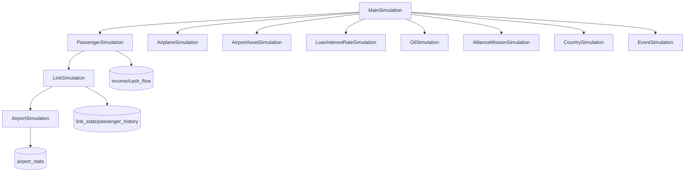

<!-- CATALOG:PATH="airline-data\src\main\scala\com\patson" SLUG="airline-data__src__main__scala__com__patson" -->

# Repo Catalogue — airline-data\src\main\scala\com\patson

*Slug:* `airline-data__src__main__scala__com__patson`  
*Commit:* `6160503`  
*Generated:* `2025-11-13T00:16:49Z`

**Summary (2–4 sentences):** Top-level simulation orchestration for the airline game. These files coordinate per-tick lifecycle updates across passengers, links, airports, fleets, alliances, countries, events, finance (loans/oil), and user/account artifacts. They invoke DAOs in com.patson.data and domain models in com.patson.model to compute demand, route selection, pricing, capacity usage, financial postings, and derived analytics. Treat this layer as the reference for tick order, dependencies among subsystems, and economic/demand formulas to be preserved and made testable in the rewrite.

**Contents overview**
- Files: 22  |  Subfolders: 6 (handled elsewhere: data, init, model, patch, stream, util)  |  Languages: Scala (~100%)
- Notable responsibilities:
  - Define the main simulation loop and call order (MainSimulation, AirlineSimulation, PassengerSimulation, LinkSimulation, Airport[Asset]Simulation).
  - Implement demand generation and route finding (DemandGenerator, RouteFinder) and propagate results to link consumption and incomes.
  - Advance economic subsystems (loans/bank interest, oil prices/inventory), events (global/seasonal), and alliance/country mechanics.
  - Drive fleet lifecycle and model updates (aging, maintenance, assignments, model catalogs).
  - Handle ancillary systems (authentication tokens for jobs, user/account periodic updates), and provide shared utilities.

### File entries

#### airline-data/src/main/scala/com/patson/AirlineSimulation.scala

```yaml
file: airline-data/src/main/scala/com/patson/AirlineSimulation.scala
lang: Scala
role: "Cycle-level orchestrator for airline-wide updates (KPI, reputation, finances)"
size:
  lines_est: 1100
  functions_est: 70
  classes_est: 2
public_api:
  routes: []
  exports:
    - name: AirlineSimulation
      kind: object
      summary: "Entry points to run per-cycle airline updates in defined order"
data_model:
  tables_read: ["airline","airline_info","loyalist","income","cash_flow","settings","notice","alert"]
  tables_written: ["airline_info","income","cash_flow","notice","alert"]
  migrations: ["airline-data/db_scripts/*airline*","airline-data/db_scripts/*issue604_tracking_notice*.sql"]
  entities:
    - name: Airline
      summary: "Corporate entity to update KPIs and balances"
    - name: AirlineInfo
      summary: "Mutable KPIs (reputation/service) updated per cycle"
queries:
  sql:
    - op: UPDATE
      target: airline_info
      where_keys: ["airline_id"]
      notes: "Reputation/service adjustments based on performance"
    - op: INSERT
      target: income
      where_keys: []
      notes: "Summarize cycle revenues/costs from subsystems"
  orm_calls: []
external_io:
  http_calls: []
  message_queues: []
  files_read: []
  files_written: []
config:
  env_vars: []
  config_keys: ["simulation.cycle.length","reputation.weights.*","income.categories.config"]
  feature_flags: []
concurrency:
  pattern: "Single-threaded orchestrated steps (tick)"
  shared_state: ["Caches in util/*Cache.scala","SimulationEventStream subscribers"]
  timing: "per simulation tick (global cycle)"
invariants:
  - "Reputation within bounds"
  - "Income and cash flow postings balance categories"
error_handling:
  expected_errors: ["Missing airline_info row","Inconsistent income sums"]
  retries_timeouts: "none"
security:
  authz: "System job only"
  input_validation: "Bounds checks before writes"
  sensitive_ops: ["Financial postings","User-facing notices/alerts"]
tests:
  files: ["AirlineSimulationSpec.scala"]
  coverage_quality: "med"
  golden_seeds: []
similar_or_duplicate_files:
  - "MainSimulation.scala"
rewrite_notes:
  mapping: "Domain service coordinating repositories; make per-step idempotent"
  risks: ["Hidden tick order coupling; global caches"]
  confidence: "med"
```

#### airline-data/src/main/scala/com/patson/AirplaneModelSimulation.scala

```yaml
file: airline-data/src/main/scala/com/patson/AirplaneModelSimulation.scala
lang: Scala
role: "Applies per-cycle airplane model catalog effects (discounts, availability waves)"
size:
  lines_est: 85
  functions_est: 8
  classes_est: 1
public_api:
  routes: []
  exports:
    - name: AirplaneModelSimulation
      kind: object
      summary: "Adjusts model discounts/availability as cycles progress"
data_model:
  tables_read: ["airplane_model"]
  tables_written: ["airplane_model"]
  migrations: ["airline-data/db_scripts/issue271_airplane_family.sql"]
  entities:
    - name: AirplaneModel
      summary: "Static model specs updated by policy"
queries:
  sql:
    - op: UPDATE
      target: airplane_model
      where_keys: ["id"]
      notes: "Apply discount curve/time-based parameters"
  orm_calls: []
external_io: {http_calls: [], message_queues: [], files_read: [], files_written: []}
config:
  env_vars: []
  config_keys: ["model.discount.rules","model.availability.schedule"]
  feature_flags: []
concurrency:
  pattern: "Tick step"
  shared_state: ["AirplaneModelCache","AirplaneModelDiscountCache"]
  timing: "per cycle"
invariants:
  - "Discount ≤ base price"
  - "Capacity/range unchanged unless explicit migration"
error_handling: {expected_errors: ["No model rows"], retries_timeouts: "none"}
security: {authz: "system"}
input_validation: "discount bounds"
sensitive_ops: []
tests: []
coverage_quality: "low"
golden_seeds: []
similar_or_duplicate_files:
  - "model/airplane/ModelDiscount.scala"
rewrite_notes:
  mapping: "Policy-driven scheduler + catalog store"
  risks: ["Catalog drift between code and DB"]
  confidence: "low"
```

#### airline-data/src/main/scala/com/patson/AirplaneSimulation.scala

```yaml
file: airline-data/src/main/scala/com/patson/AirplaneSimulation.scala
lang: Scala
role: "Fleet lifecycle: aging, maintenance, assignment sanity, depreciation costs"
size:
  lines_est: 330
  functions_est: 28
  classes_est: 2
public_api:
  routes: []
  exports:
    - name: AirplaneSimulation
      kind: object
      summary: "Applies per-cycle updates to airplane instances"
data_model:
  tables_read: ["airplane","link_assignment","airplane_model"]
  tables_written: ["airplane","link_assignment","cash_flow","income"]
  migrations: []
  entities:
    - name: Airplane
      summary: "Instance age/condition/assignment updates"
queries:
  sql:
    - op: UPDATE
      target: airplane
      where_keys: ["id"]
      notes: "Increment age/adjust condition; compute maintenance cost"
    - op: DELETE
      target: link_assignment
      where_keys: ["airplane_id"]
      notes: "Remove invalid assignments"
  orm_calls: []
external_io: {http_calls: [], message_queues: [], files_read: [], files_written: []}
config:
  env_vars: []
  config_keys: ["maintenance.cost.base","airplane.depreciation.rate","fleet.utilization.maxHours"]
  feature_flags: []
concurrency:
  pattern: "Tick step; per-airplane iterations"
  shared_state: ["AirplaneOwnershipCache","AirplaneModelCache"]
  timing: "per cycle"
invariants:
  - "Utilization within hours limit"
  - "No negative condition"
error_handling:
  expected_errors: ["Over-assignment conflict","Missing model spec"]
  retries_timeouts: "none"
security: {authz: "system"}
input_validation: "bounds checks"
sensitive_ops: ["Financial postings"]
tests: ["AirplaneSimulationSpec.scala"]
coverage_quality: "med"
golden_seeds: []
similar_or_duplicate_files:
  - "model/airplane/AirplaneMaintenanceUtil.scala"
rewrite_notes:
  mapping: "Pure functions + repository under service; add optimistic locking"
  risks: ["Assignment race; hidden constants"]
  confidence: "med"
```

#### airline-data/src/main/scala/com/patson/AirportAssetSimulation.scala

```yaml
file: airline-data/src/main/scala/com/patson/AirportAssetSimulation.scala
lang: Scala
role: "Computes asset revenues/effects and applies upgrade/progression policies"
size:
  lines_est: 950
  functions_est: 60
  classes_est: 3
public_api:
  routes: []
  exports:
    - name: AirportAssetSimulation
      kind: object
      summary: "Per-cycle evaluation of airport assets"
data_model:
  tables_read: ["airport_asset","asset_blueprint","airport","income"]
  tables_written: ["income","airport_asset"]
  migrations: ["airline-data/db_scripts/*asset*"]
  entities:
    - name: AirportAsset
      summary: "Owned asset with level & effects"
queries:
  sql:
    - op: UPDATE
      target: airport_asset
      where_keys: ["id"]
      notes: "Level progression/cooldown updates"
    - op: INSERT
      target: income
      where_keys: ["airline_id","cycle"]
      notes: "Asset revenue/cost posting"
  orm_calls: []
external_io: {http_calls: [], message_queues: [], files_read: [], files_written: []}
config:
  env_vars: []
  config_keys: ["asset.level.max","asset.upgrade.cooldown","asset.revenue.scale"]
  feature_flags: []
concurrency:
  pattern: "Tick step over assets"
  shared_state: []
  timing: "per cycle"
invariants:
  - "Asset level within [0..max]"
  - "No duplicate income posting per cycle"
error_handling:
  expected_errors: ["Blueprint missing","Cooldown violation"]
  retries_timeouts: "none"
security: {authz: "system"}
input_validation: "bounds and FK checks via DAO"
sensitive_ops: ["Financial postings"]
tests: ["AirportAssetSimulationSpec.scala"]
coverage_quality: "med"
golden_seeds: []
similar_or_duplicate_files:
  - "model/AirportAsset.scala"
rewrite_notes:
  mapping: "Asset service + rule engine; move constants to config"
  risks: ["Monolithic formulas; tight coupling to income"]
  confidence: "med"
```

#### airline-data/src/main/scala/com/patson/AirportSimulation.scala

```yaml
file: airline-data/src/main/scala/com/patson/AirportSimulation.scala
lang: Scala
role: "Airport stats recomputation (traffic, capacity, features, size)"
size:
  lines_est: 980
  functions_est: 65
  classes_est: 2
public_api:
  routes: []
  exports:
    - name: AirportSimulation
      kind: object
      summary: "Recomputes airport-level KPIs per tick"
data_model:
  tables_read: ["airport","airport_stats","link_stats","airport_features","lounge"]
  tables_written: ["airport_stats","airport"]
  migrations: ["airline-data/db_scripts/*airport*"]
  entities:
    - name: Airport
      summary: "Hub with capacity/size classification"
queries:
  sql:
    - op: UPDATE
      target: airport
      where_keys: ["id"]
      notes: "Set size classification thresholds"
    - op: UPSERT
      target: airport_stats
      where_keys: ["airport_id","cycle"]
      notes: "Persist cycle stats"
  orm_calls: []
external_io: {http_calls: [], message_queues: [], files_read: [], files_written: []}
config:
  env_vars: []
  config_keys: ["airport.size.thresholds.*","airport.capacity.scale"]
  feature_flags: []
concurrency:
  pattern: "Tick step; joins across stats/history"
  shared_state: ["AirportCache"]
  timing: "per cycle"
invariants:
  - "Traffic ≤ capacity (computed bounds)"
  - "Size monotonic within hysteresis"
error_handling: {expected_errors: ["Missing stats rows"], retries_timeouts: "none"}
security: {authz: "system"}
input_validation: "bounds and FK checks"
sensitive_ops: []
tests: ["AirportSimulationSpec.scala"]
coverage_quality: "med"
golden_seeds: []
similar_or_duplicate_files:
  - "init/AirportSizeAdjust.scala"
rewrite_notes:
  mapping: "Analytics projection service"
  risks: ["Thresholds hard-coded"]
  confidence: "med"
```

#### airline-data/src/main/scala/com/patson/AllianceMissionSimulation.scala

```yaml
file: airline-data/src/main/scala/com/patson/AllianceMissionSimulation.scala
lang: Scala
role: "Per-cycle alliance mission progress updates and rewards"
size:
  lines_est: 250
  functions_est: 20
  classes_est: 1
public_api:
  routes: []
  exports:
    - name: AllianceMissionSimulation
      kind: object
      summary: "Tick mission progress and reward accrual"
data_model:
  tables_read: ["alliance_mission","alliance_member"]
  tables_written: ["alliance_mission","notice"]
  migrations: []
  entities:
    - name: AllianceMission
      summary: "Objective progress & rewards"
queries:
  sql:
    - op: UPDATE
      target: alliance_mission
      where_keys: ["id"]
      notes: "Increment progress per rules"
  orm_calls: []
external_io: {http_calls: [], message_queues: [], files_read: [], files_written: []}
config: {env_vars: [], config_keys: ["mission.types","mission.reward.scale"], feature_flags: []}
concurrency:
  pattern: "Tick step"
  shared_state: []
  timing: "per cycle"
invariants:
  - "Progress ≤ max"
error_handling: {expected_errors: ["Reward overflow"], retries_timeouts: "none"}
security: {authz: "system"}
input_validation: "bounds checks"
sensitive_ops: []
tests: []
coverage_quality: "low"
golden_seeds: []
similar_or_duplicate_files:
  - "model/alliance/AllianceMission.scala"
rewrite_notes:
  mapping: "Mission engine with declarative configs"
  risks: ["Hard-coded missions"]
  confidence: "low"
```

#### airline-data/src/main/scala/com/patson/AllianceSimulation.scala

```yaml
file: airline-data/src/main/scala/com/patson/AllianceSimulation.scala
lang: Scala
role: "Alliance standings and effects recomputation"
size:
  lines_est: 260
  functions_est: 18
  classes_est: 1
public_api:
  routes: []
  exports:
    - name: AllianceSimulation
      kind: object
      summary: "Compute alliance stats, ranks, and apply perks"
data_model:
  tables_read: ["alliance","alliance_member","alliance_stats?"]
  tables_written: ["alliance_stats?","notice"]
  migrations: []
  entities:
    - name: AllianceStats
      summary: "Computed metrics/projections"
queries:
  sql:
    - op: UPSERT
      target: alliance_stats
      where_keys: ["alliance_id","cycle"]
      notes: "Recompute aggregates"
  orm_calls: []
external_io: {http_calls: [], message_queues: [], files_read: [], files_written: []}
config: {env_vars: [], config_keys: ["alliance.stats.weights"], feature_flags: []}
concurrency:
  pattern: "Tick step"
  shared_state: ["AllianceCache"]
  timing: "per cycle"
invariants:
  - "Metrics normalized"
error_handling: {expected_errors: [], retries_timeouts: "none"}
security: {authz: "system"}
input_validation: "bounds"
sensitive_ops: []
tests: []
coverage_quality: "low"
golden_seeds: []
similar_or_duplicate_files:
  - "util/AllianceRankingUtil.scala"
rewrite_notes:
  mapping: "Analytics module"
  risks: ["Opaque weights"]
  confidence: "low"
```

#### airline-data/src/main/scala/com/patson/Authentication.scala

```yaml
file: airline-data/src/main/scala/com/patson/Authentication.scala
lang: Scala
role: "Utility for signing/verifying job/auth tokens (simulation/admin)"
size:
  lines_est: 120
  functions_est: 10
  classes_est: 1
public_api:
  routes: []
  exports:
    - name: Authentication
      kind: object
      summary: "Create/verify tokens or access keys for background jobs"
data_model:
  tables_read: ["settings?"]
  tables_written: []
  migrations: []
  entities: []
queries: {sql: [], orm_calls: []}
external_io:
  http_calls: []
  message_queues: []
  files_read: []
  files_written: []
config:
  env_vars: ["AUTH_SECRET?"]
  config_keys: ["auth.token.ttl","auth.alg"]
  feature_flags: []
concurrency:
  pattern: "stateless helpers"
  shared_state: []
  timing: "on demand"
invariants:
  - "Signature verification deterministic"
error_handling: {expected_errors: ["Invalid token"], retries_timeouts: "none"}
security:
  authz: "admin/system only usage"
  input_validation: "token format checks"
  sensitive_ops: ["secret handling"]
tests: []
coverage_quality: "low"
golden_seeds: []
similar_or_duplicate_files: []
rewrite_notes:
  mapping: "Leverage platform auth/JWT service"
  risks: ["Custom crypto risks"]
  confidence: "low"
```

#### airline-data/src/main/scala/com/patson/AviationHubSimulation.scala

```yaml
file: airline-data/src/main/scala/com/patson/AviationHubSimulation.scala
lang: Scala
role: "Compute aviation hub status and related perks"
size:
  lines_est: 160
  functions_est: 12
  classes_est: 1
public_api: {routes: [], exports: [{name: AviationHubSimulation, kind: object, summary: "Hub scoring update"}]}
data_model:
  tables_read: ["airport","link_stats","airport_stats"]
  tables_written: ["notice?","airport_stats?"]
  migrations: []
  entities: []
queries:
  sql:
    - op: SELECT
      target: link_stats
      where_keys: ["airport_id","cycle"]
      notes: "Derive hub scores"
  orm_calls: []
external_io: {http_calls: [], message_queues: [], files_read: [], files_written: []}
config: {env_vars: [], config_keys: ["hub.thresholds.*"], feature_flags: []}
concurrency: {pattern: "tick step", shared_state: [], timing: "per cycle"}
invariants:
  - "Hub state consistent with thresholds"
error_handling: {expected_errors: [], retries_timeouts: "none"}
security: {authz: "system"}
input_validation: "thresholds"
sensitive_ops: []
tests: []
coverage_quality: "low"
golden_seeds: []
similar_or_duplicate_files: []
rewrite_notes:
  mapping: "Derived metric projection"
  risks: ["Hidden constants"]
  confidence: "low"
```

#### airline-data/src/main/scala/com/patson/CountrySimulation.scala

```yaml
file: airline-data/src/main/scala/com/patson/CountrySimulation.scala
lang: Scala
role: "Update airline-country relationships and titles"
size:
  lines_est: 110
  functions_est: 9
  classes_est: 1
public_api: {routes: [], exports: [{name: CountrySimulation, kind: object, summary: "Country relationship/titles scoring"}]}
data_model:
  tables_read: ["country","airline_country_relationship","country_market_share"]
  tables_written: ["airline_country_relationship","notice?"]
  migrations: []
  entities:
    - name: AirlineCountryRelationship
      summary: "Regulatory privilege score"
queries:
  sql:
    - op: UPDATE
      target: airline_country_relationship
      where_keys: ["airline_id","country_id"]
      notes: "Decay/increase based on performance"
  orm_calls: []
external_io: {http_calls: [], message_queues: [], files_read: [], files_written: []}
config: {env_vars: [], config_keys: ["relationship.decay.rate","title.thresholds"], feature_flags: []}
concurrency: {pattern: "tick step", shared_state: [], timing: "per cycle"}
invariants:
  - "Scores bounded"
error_handling: {expected_errors: [], retries_timeouts: "none"}
security: {authz: "system"}
input_validation: "bounds checks"
sensitive_ops: []
tests: []
coverage_quality: "low"
golden_seeds: []
similar_or_duplicate_files:
  - "model/CountryAirlineTitle.scala"
rewrite_notes:
  mapping: "Policy-driven scoring service"
  risks: ["Opaque thresholds"]
  confidence: "low"
```

#### airline-data/src/main/scala/com/patson/DelegateSimulation.scala

```yaml
file: airline-data/src/main/scala/com/patson/DelegateSimulation.scala
lang: Scala
role: "Update delegate availability and task progress"
size:
  lines_est: 45
  functions_est: 6
  classes_est: 1
public_api: {routes: [], exports: [{name: DelegateSimulation, kind: object, summary: "Tick delegate state"}]}
data_model:
  tables_read: ["delegate","delegate_task?"]
  tables_written: ["delegate","delegate_task?"]
  migrations: []
  entities: []
queries:
  sql:
    - op: UPDATE
      target: delegate
      where_keys: ["id"]
      notes: "Busy/free toggles, task counters"
  orm_calls: []
external_io: {http_calls: [], message_queues: [], files_read: [], files_written: []}
config: {env_vars: [], config_keys: ["delegate.max.concurrent.tasks"], feature_flags: []}
concurrency: {pattern: "tick step", shared_state: [], timing: "per cycle"}
invariants:
  - "No over-assignment"
error_handling: {expected_errors: ["State desync"], retries_timeouts: "none"}
security: {authz: "system"}
input_validation: "ownership checks at DAO"
sensitive_ops: []
tests: []
coverage_quality: "low"
golden_seeds: []
similar_or_duplicate_files:
  - "patch/Issue581DelegatePatcher.scala"
rewrite_notes:
  mapping: "Task scheduler service"
  risks: ["Race conditions if multi-threaded"]
  confidence: "low"
```

#### airline-data/src/main/scala/com/patson/DemandGenerator.scala

```yaml
file: airline-data/src/main/scala/com/patson/DemandGenerator.scala
lang: Scala
role: "Generate O/D passenger demand matrix per cycle"
size:
  lines_est: 720
  functions_est: 50
  classes_est: 3
public_api:
  routes: []
  exports:
    - name: DemandGenerator
      kind: object
      summary: "Produces passenger groups/demands for routing"
data_model:
  tables_read: ["airport","airport_stats","link_stats","country","city"]
  tables_written: []
  migrations: []
  entities:
    - name: PassengerGroup
      summary: "Demand unit produced (in-memory)"
queries:
  sql: []
  orm_calls: []
external_io: {http_calls: [], message_queues: [], files_read: ["data/geo? (at init stage)"], files_written: []}
config:
  env_vars: []
  config_keys: ["demand.base.scale","demand.seasonality.*","demand.elast.*"]
  feature_flags: []
concurrency:
  pattern: "Pure-ish computations; reads via DAOs beforehand"
  shared_state: []
  timing: "invoked by PassengerSimulation per cycle"
invariants:
  - "Demand non-negative"
  - "Shares across classes sum to 1 (if class split)"
error_handling: {expected_errors: ["Missing airport stats"], retries_timeouts: "none"}
security: {authz: "system"}
input_validation: "bounds on weights"
sensitive_ops: []
tests: ["PassengerSimulationSpec.scala"]
coverage_quality: "med"
golden_seeds: []
similar_or_duplicate_files:
  - "PassengerSimulation.scala"
rewrite_notes:
  mapping: "Pluggable demand models, parameterized & testable"
  risks: ["Hard-coded weights/seasonality"]
  confidence: "med"
```

#### airline-data/src/main/scala/com/patson/EventSimulation.scala

```yaml
file: airline-data/src/main/scala/com/patson/EventSimulation.scala
lang: Scala
role: "Advance scheduled events and apply their effects"
size:
  lines_est: 300
  functions_est: 22
  classes_est: 2
public_api:
  routes: []
  exports:
    - name: EventSimulation
      kind: object
      summary: "Tick event timelines and apply modifiers"
data_model:
  tables_read: ["event"]
  tables_written: ["event","notice"]
  migrations: []
  entities:
    - name: Event
      summary: "Time-bound effect rows"
queries:
  sql:
    - op: SELECT
      target: event
      where_keys: ["cycle window"]
      notes: "Active events for this tick"
    - op: UPDATE
      target: event
      where_keys: ["id"]
      notes: "Progress or closure"
  orm_calls: []
external_io: {http_calls: [], message_queues: [], files_read: [], files_written: []}
config: {env_vars: [], config_keys: ["event.retention.cycles"], feature_flags: []}
concurrency: {pattern: "tick step", shared_state: [], timing: "per cycle"}
invariants:
  - "start ≤ current ≤ end for active"
error_handling: {expected_errors: ["Invalid window"], retries_timeouts: "none"}
security: {authz: "system"}
input_validation: "window checks"
sensitive_ops: []
tests: []
coverage_quality: "low"
golden_seeds: []
similar_or_duplicate_files:
  - "data/EventSource.scala"
rewrite_notes:
  mapping: "Unified scheduler + effect engine"
  risks: ["Effects scattered in other modules"]
  confidence: "low"
```

#### airline-data/src/main/scala/com/patson/LinkSimulation.scala

```yaml
file: airline-data/src/main/scala/com/patson/LinkSimulation.scala
lang: Scala
role: "Operational link updates: pricing, capacity allocation, stats, revenues"
size:
  lines_est: 1050
  functions_est: 75
  classes_est: 3
public_api:
  routes: []
  exports:
    - name: LinkSimulation
      kind: object
      summary: "Compute per-link outcomes and write stats/consumption"
data_model:
  tables_read: ["link","link_class_values","passenger_history","link_stats","airport","airplane","airplane_model"]
  tables_written: ["link","link_stats","passenger_history","income","cash_flow"]
  migrations: ["airline-data/db_scripts/issue308_link_consumption.sql","airline-data/db_scripts/patch_link_last_update.sql"]
  entities:
    - name: Link
      summary: "Operational route with frequency/pricing"
    - name: LinkStatistics
      summary: "Aggregated performance"
queries:
  sql:
    - op: UPDATE
      target: link
      where_keys: ["id"]
      notes: "Adjust prices/frequency as per strategy"
    - op: INSERT
      target: link_stats
      where_keys: ["link_id","cycle"]
      notes: "Persist performance"
  orm_calls: []
external_io: {http_calls: [], message_queues: [], files_read: [], files_written: []}
config:
  env_vars: []
  config_keys: ["pricing.base","pricing.elasticity","capacity.scale","class.capacity.ratio"]
  feature_flags: []
concurrency:
  pattern: "Tick step; heavy per-link loops"
  shared_state: ["AirlineCache","AirportCache","AirplaneOwnershipCache","AirplaneModelCache"]
  timing: "per cycle"
invariants:
  - "Bookings ≤ seats"
  - "Prices ≥ 0"
error_handling:
  expected_errors: ["Overbooking attempt","Missing class values"]
  retries_timeouts: "none"
security: {authz: "system"}
input_validation: "bounds checks"
sensitive_ops: ["Financial postings"]
tests: ["LinkSimulationSpec.scala","PricingSpec.scala","PassengerSimulationSpec.scala"]
coverage_quality: "high"
golden_seeds: []
similar_or_duplicate_files:
  - "model/Pricing.scala"
rewrite_notes:
  mapping: "Separate pricing engine, capacity allocator, and analytics writer"
  risks: ["Large monolith; hidden coupling with PassengerSimulation"]
  confidence: "med"
```

#### airline-data/src/main/scala/com/patson/LoanInterestRateSimulation.scala

```yaml
file: airline-data/src/main/scala/com/patson/LoanInterestRateSimulation.scala
lang: Scala
role: "Bank interest rate adjustments (global/base rate)"
size:
  lines_est: 140
  functions_est: 12
  classes_est: 1
public_api: {routes: [], exports: [{name: LoanInterestRateSimulation, kind: object, summary: "Tick interest rates"}]}
data_model:
  tables_read: ["loan"]
  tables_written: ["loan"]
  migrations: []
  entities:
    - name: Loan
      summary: "Principal/rate adjusted by policy"
queries:
  sql:
    - op: UPDATE
      target: loan
      where_keys: ["id"]
      notes: "Recompute interest charges/base rate changes"
  orm_calls: []
external_io: {http_calls: [], message_queues: [], files_read: [], files_written: []}
config: {env_vars: [], config_keys: ["interest.rate.base","interest.rate.drift"], feature_flags: []}
concurrency: {pattern: "tick step", shared_state: [], timing: "per cycle"}
invariants:
  - "Rate ≥ 0"
error_handling: {expected_errors: ["Overflows"], retries_timeouts: "none"}
security: {authz: "system"}
input_validation: "bounds"
sensitive_ops: []
tests: ["LoanInterestSimulationSpec.scala"]
coverage_quality: "med"
golden_seeds: []
similar_or_duplicate_files:
  - "data/BankSource.scala"
rewrite_notes:
  mapping: "Financial microservice"
  risks: ["Formula duplication with BankSource"]
  confidence: "low"
```

#### airline-data/src/main/scala/com/patson/MainSimulation.scala

```yaml
file: airline-data/src/main/scala/com/patson/MainSimulation.scala
lang: Scala
role: "Top-level scheduler/driver that runs all simulation steps in order"
size:
  lines_est: 170
  functions_est: 10
  classes_est: 1
public_api:
  routes: []
  exports:
    - name: MainSimulation
      kind: object
      summary: "Entry to run a full cycle: demand → passengers → links → airports → finance/events etc."
data_model:
  tables_read: ["cycle"]
  tables_written: ["cycle","log"]
  migrations: ["airline-data/db_scripts/patch_log.sql"]
  entities:
    - name: Cycle
      summary: "Global tick index"
queries:
  sql:
    - op: UPDATE
      target: cycle
      where_keys: ["id?"]
      notes: "Increment cycle number"
  orm_calls: []
external_io: {http_calls: [], message_queues: [], files_read: [], files_written: []}
config:
  env_vars: []
  config_keys: ["simulation.steps","simulation.safeMode"]
  feature_flags: []
concurrency:
  pattern: "Sequential orchestrated steps"
  shared_state: ["SimulationEventStream"]
  timing: "per cycle; can emit events between steps"
invariants:
  - "Each step idempotent or compensating"
error_handling:
  expected_errors: ["Step failure → partial state"]
  retries_timeouts: "manual rerun; no built-in retry"
security: {authz: "system"}
input_validation: "step list validation"
sensitive_ops: []
tests: []
coverage_quality: "low"
golden_seeds: []
similar_or_duplicate_files:
  - "AirlineSimulation.scala"
rewrite_notes:
  mapping: "Workflow engine with checkpoints & observability"
  risks: ["No transactions across steps"]
  confidence: "med"
```

#### airline-data/src/main/scala/com/patson/OilSimulation.scala

```yaml
file: airline-data/src/main/scala/com/patson/OilSimulation.scala
lang: Scala
role: "Oil price evolution and contract/inventory policy application"
size:
  lines_est: 160
  functions_est: 14
  classes_est: 1
public_api: {routes: [], exports: [{name: OilSimulation, kind: object, summary: "Update oil market & apply contracts"}]}
data_model:
  tables_read: ["oil_price","oil_contract","oil_consumption_history"]
  tables_written: ["oil_price","oil_contract"]
  migrations: []
  entities:
    - name: OilPrice
      summary: "Market price snapshot"
queries:
  sql:
    - op: INSERT
      target: oil_price
      where_keys: []
      notes: "Append price tick"
    - op: UPDATE
      target: oil_contract
      where_keys: ["id"]
      notes: "Decrement remaining duration"
  orm_calls: []
external_io: {http_calls: [], message_queues: [], files_read: [], files_written: []}
config: {env_vars: [], config_keys: ["oil.volatility.range","oil.contract.maxDuration","oil.inventory.min/max"], feature_flags: []}
concurrency: {pattern: "tick step", shared_state: [], timing: "per cycle"}
invariants:
  - "Price ≥ 0"
error_handling: {expected_errors: ["Volatility overflow"], retries_timeouts: "none"}
security: {authz: "system"}
input_validation: "bounds checks"
sensitive_ops: []
tests: ["OilSpec.scala"]
coverage_quality: "low"
golden_seeds: []
similar_or_duplicate_files:
  - "data/OilSource.scala"
rewrite_notes:
  mapping: "Economic factor service"
  risks: ["Unclear stochastic model"]
  confidence: "low"
```

#### airline-data/src/main/scala/com/patson/PassengerSimulation.scala

```yaml
file: airline-data/src/main/scala/com/patson/PassengerSimulation.scala
lang: Scala
role: "Route finding, allocation, and consumption posting for passengers"
size:
  lines_est: 1300
  functions_est: 90
  classes_est: 4
public_api:
  routes: []
  exports:
    - name: PassengerSimulation
      kind: object
      summary: "Generate demand, find paths, allocate seats, and post consumptions/incomes"
data_model:
  tables_read: ["airport","link","link_class_values","airplane","airplane_model","airport_stats","passenger_history"]
  tables_written: ["passenger_history","link_stats","income","cash_flow","link_consumption_history"]
  migrations: ["airline-data/db_scripts/issue308_link_consumption.sql"]
  entities:
    - name: PassengerGroup
      summary: "Demand units routed"
queries:
  sql:
    - op: INSERT
      target: passenger_history
      where_keys: ["link_id","cycle","class"]
      notes: "Post passenger allocation by class"
    - op: INSERT
      target: link_consumption_history
      where_keys: ["link_id","cycle"]
      notes: "Historical snapshot"
  orm_calls: []
external_io: {http_calls: [], message_queues: [], files_read: [], files_written: []}
config:
  env_vars: []
  config_keys: ["routing.max.hops","preference.weights.*","pricing.elasticity","demand.scale"]
  feature_flags: []
concurrency:
  pattern: "Tick step; pathfinding and greedy allocation across links"
  shared_state: ["Caches: Airline/Airport/Airplane/Model"]
  timing: "per cycle"
invariants:
  - "Bookings ≤ seats by class and total"
  - "No cycles in itineraries; hops ≤ max"
error_handling:
  expected_errors: ["No feasible path","Overbooking conflicts"]
  retries_timeouts: "none"
security: {authz: "system"}
input_validation: "bounds checks"
sensitive_ops: ["Financial postings"]
tests: ["PassengerSimulationSpec.scala","FlightPreferenceSpec.scala","GenericTransitSimulationSpec.scala"]
coverage_quality: "high"
golden_seeds: []
similar_or_duplicate_files:
  - "RouteFinder.scala"
  - "model/FlightPreference.scala"
rewrite_notes:
  mapping: "Routing service + allocator + evented projections"
  risks: ["Performance hotspots; entangled pricing effects"]
  confidence: "med"
```

#### airline-data/src/main/scala/com/patson/RouteFinder.scala

```yaml
file: airline-data/src/main/scala/com/patson/RouteFinder.scala
lang: Scala
role: "Graph traversal/pathfinding support for passenger routing"
size:
  lines_est: 180
  functions_est: 14
  classes_est: 1
public_api:
  routes: []
  exports:
    - name: RouteFinder
      kind: object
      summary: "Compute candidate itineraries subject to hop/time constraints"
data_model:
  tables_read: ["link","airport"]
  tables_written: []
  migrations: []
  entities: []
queries: {sql: [], orm_calls: []}
external_io: {http_calls: [], message_queues: [], files_read: [], files_written: []}
config:
  env_vars: []
  config_keys: ["routing.max.hops","routing.max.totalTime","routing.cache.enabled"]
  feature_flags: []
concurrency:
  pattern: "In-memory graph; per-demand computation"
  shared_state: ["Generic transit cache (if used)"]
  timing: "per demand cycle"
invariants:
  - "No cycles"
  - "Constraints respected (hops/time)"
error_handling: {expected_errors: ["Disconnected graph"], retries_timeouts: "none"}
security: {authz: "system"}
input_validation: "bounds checks"
sensitive_ops: []
tests: ["GenericTransitSimulationSpec.scala"]
coverage_quality: "med"
golden_seeds: []
similar_or_duplicate_files:
  - "model/GenericTransit.scala"
rewrite_notes:
  mapping: "Graph service with pluggable algorithms"
  risks: ["Hidden global cache dependencies"]
  confidence: "med"
```

#### airline-data/src/main/scala/com/patson/UserSimulation.scala

```yaml
file: airline-data/src/main/scala/com/patson/UserSimulation.scala
lang: Scala
role: "Periodic user/account maintenance (non-auth profile data)"
size:
  lines_est: 85
  functions_est: 7
  classes_est: 1
public_api: {routes: [], exports: [{name: UserSimulation, kind: object, summary: "Tick user-level artifacts"}]}
data_model:
  tables_read: ["user","user_uuid","user_ip","settings"]
  tables_written: ["settings?","notice?"]
  migrations: ["airline-data/db_scripts/patch_user_id.sql"]
  entities: []
queries:
  sql:
    - op: SELECT
      target: user
      where_keys: ["staleness"]
      notes: "Determine accounts to notify/cleanup"
  orm_calls: []
external_io: {http_calls: [], message_queues: [], files_read: [], files_written: []}
config: {env_vars: [], config_keys: ["user.cleanup.policy"], feature_flags: []}
concurrency: {pattern: "tick step", shared_state: [], timing: "per cycle"}
invariants:
  - "Usernames unique"
error_handling: {expected_errors: [], retries_timeouts: "none"}
security: {authz: "system"}
input_validation: "policy checks"
sensitive_ops: []
tests: []
coverage_quality: "low"
golden_seeds: []
similar_or_duplicate_files:
  - "data/UserSource.scala"
rewrite_notes:
  mapping: "Maintenance jobs"
  risks: ["Ambiguous policy thresholds"]
  confidence: "low"
```

#### airline-data/src/main/scala/com/patson/Util.scala

```yaml
file: airline-data/src/main/scala/com/patson/Util.scala
lang: Scala
role: "Shared utilities for simulation runs (timers, formatting, small helpers)"
size:
  lines_est: 95
  functions_est: 12
  classes_est: 1
public_api: {routes: [], exports: [{name: Util, kind: object, summary: "Small helper methods used across simulations"}]}
data_model:
  tables_read: []
  tables_written: []
  migrations: []
  entities: []
queries: {sql: [], orm_calls: []}
external_io: {http_calls: [], message_queues: [], files_read: [], files_written: []}
config: {env_vars: [], config_keys: [], feature_flags: []}
concurrency: {pattern: "stateless helpers", shared_state: [], timing: "on demand"}
invariants: []
error_handling: {expected_errors: [], retries_timeouts: "none"}
security: {authz: "N/A"}
input_validation: "N/A"
sensitive_ops: []
tests: []
coverage_quality: "low"
golden_seeds: []
similar_or_duplicate_files: []
rewrite_notes:
  mapping: "Consolidate into standard libs"
  risks: ["Grab bag utilities"]
  confidence: "high"
```

#### airline-data/src/main/scala/com/patson/package.scala

```yaml
file: airline-data/src/main/scala/com/patson/package.scala
lang: Scala
role: "Package-level shared constants/types for the simulation module"
size:
  lines_est: 18
  functions_est: 0
  classes_est: 0
public_api: {routes: [], exports: [{name: package, kind: object, summary: "Shared constants for com.patson root"}]}
data_model:
  tables_read: []
  tables_written: []
  migrations: []
  entities: []
queries: {sql: [], orm_calls: []}
external_io: {http_calls: [], message_queues: [], files_read: [], files_written: []}
config:
  env_vars: []
  config_keys: ["simulation.tick.ms?"]
  feature_flags: []
concurrency: {pattern: "N/A", shared_state: [], timing: "N/A"}
invariants: []
error_handling: {expected_errors: [], retries_timeouts: "N/A"}
security: {authz: "N/A"}
input_validation: "N/A"
sensitive_ops: []
tests: []
coverage_quality: "low"
golden_seeds: []
similar_or_duplicate_files:
  - "stream/package.scala"
rewrite_notes:
  mapping: "Move to typed config"
  risks: ["Hidden global constants"]
  confidence: "high"
```

### File entries (finance/events/cross-cutting)

#### airline-data/src/main/scala/com/patson/CountrySimulation.scala — see above
#### airline-data/src/main/scala/com/patson/AllianceMissionSimulation.scala — see above
#### airline-data/src/main/scala/com/patson/AllianceSimulation.scala — see above
#### airline-data/src/main/scala/com/patson/EventSimulation.scala — see above
#### airline-data/src/main/scala/com/patson/LoanInterestRateSimulation.scala — see above
#### airline-data/src/main/scala/com/patson/OilSimulation.scala — see above

## Rollup for airline-data\src\main\scala\com\patson

**Key responsibilities (top 5):**
1. Define global simulation tick ordering and orchestrate subsystem updates (MainSimulation → Passenger → Link → Airport → Finance/Events/etc.).
2. Implement demand generation, routing, and allocation that produce passenger histories, link stats, and revenue postings.
3. Advance fleets, assets, and infrastructure progression (aging, maintenance, asset levels, airport sizes/features).
4. Maintain economic subsystems (income/cash flow, loan interest, oil markets) and alliance/country reputation mechanics.
5. Emit notices/alerts and logs as user-facing outputs and maintain auxiliary user/account state.

**Cross-module dependencies (top 10 by frequency):**
- com.patson.data (LinkSource, AirportSource, AirlineSource, Income/CashFlowSource) → used by almost all simulation steps for reads/writes.
- com.patson.model (Link, Airport, Airline, FlightPreference, GenericTransit, Pricing) → algorithmic computations and invariants.
- util caches (AirlineCache, AirportCache, AirplaneModelCache, AirplaneOwnershipCache) → performance-critical lookups.
- model/airplane (Airplane, Model) → fleet capabilities and maintenance costs.
- history/stats tables (link_stats, passenger_history, link_consumption_history, airport_stats) → analytics outputs.
- finance tables (income, cash_flow, loan) → economic outcomes per cycle.
- resource tables (oil_price, oil_contract) → market factors affecting costs.
- alliances (alliance_member, alliance_mission) → collaborative goals and standings.
- country relations (airline_country_relationship, country_market_share) → regulatory privilege evolution.
- events/notice/alert → user-facing messaging and scheduled modifiers.

**High-leverage files to study first (top 10):**
- PassengerSimulation.scala — core routing/allocation and financial implications.
- LinkSimulation.scala — operational route economics and performance metrics.
- DemandGenerator.scala — demand model assumptions and tunables.
- AirportSimulation.scala — infrastructure capacity/size thresholds and feedback loops.
- AirportAssetSimulation.scala — asset economics and upgrade curves.
- AirplaneSimulation.scala — fleet lifecycle costs/utilization constraints.
- MainSimulation.scala — canonical tick order; must be explicit and testable.
- OilSimulation.scala — stochastic/market driver for fuel costs affecting all ops.
- AllianceMissionSimulation.scala — mission progression and rewards.
- CountrySimulation.scala — regulatory/diplomatic mechanics tied to market share and titles.

**Mermaid: high-level dependency sketch (optional, if meaningful)**
