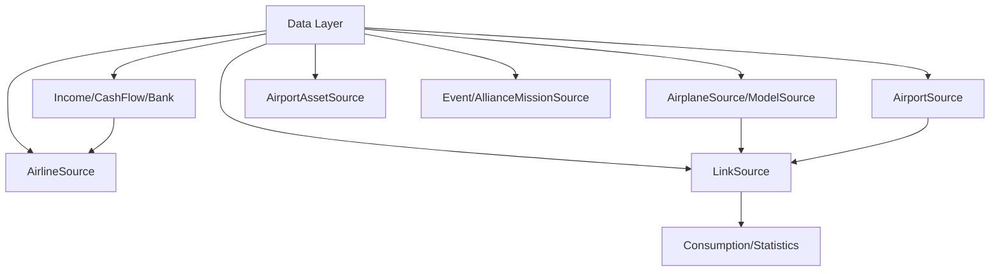

<!-- CATALOG:PATH="airline-data\src\main\scala\com\patson\data" SLUG="airline-data__src__main__scala__com__patson__data" -->

# Repo Catalogue — airline-data\src\main\scala\com\patson\data

*Slug:* `airline-data__src__main__scala__com__patson__data`  
*Commit:* `6160503`  
*Generated:* `2025-11-12T22:55:35Z`

**Summary (2–4 sentences):** Data access / persistence layer (“Source” objects) encapsulating CRUD and query logic for virtually every domain aggregate (airlines, airports, links, assets, missions, economy stats, events, seasonal features). Implements raw SQL / JDBC style operations, batching, and ad‑hoc analytics queries (histories, statistics, rollups) plus meta/schema helpers (Meta.scala, SqliteMeta.scala) and constants. This folder is the authoritative mapping between domain models and relational schema, embedding business rules in selection/update filters and derivative calculations (e.g., income aggregation, loyalty breakdowns, asset level economics).  
NOTE: Listing gathered via GitHub API (30‑item pagination slices) – contents appear complete here but verify by full clone: https://github.com/joshuac-dev/airline/tree/master/airline-data/src/main/scala/com/patson/data

**Contents overview**  
- Files: 50 (DAO / repository style + helpers; plus airplane subfolder)  |  Subfolders: 1 (`airplane`)  |  Languages: Scala (~99%), SQL embedded strings, minor implicit Java JDBC APIs  
- Notable responsibilities:  
  - Relational persistence (& reads) for all game domain entities.  
  - Analytics/history extraction (consumption, statistics, cash flow, income, loyalty).  
  - Schema metadata & dynamic column discovery (Meta.scala, SqliteMeta.scala).  
  - Bulk patch/update utilities (Patchers.scala, various *Patcher / *Source update methods).  
  - Cross-entity rollups (missions, alliances, events, negotiations, oil economics).  

---

### File entries

#### airline-data/src/main/scala/com/patson/data/AdminSource.scala
```yaml
file: airline-data/src/main/scala/com/patson/data/AdminSource.scala
lang: Scala
role: "Admin-only persistence utilities (flags, admin ops)"
size:
  lines_est: 30
  functions_est: 6
  classes_est: 0
public_api:
  routes: []
  exports:
    - name: AdminSource
      kind: object
      summary: "Small set of admin data operations"
data_model:
  tables_read: ["user","settings?"]
  tables_written: ["user","settings?"]
  migrations: []
  entities:
    - name: AdminAdjustments
      summary: "Admin-level toggles/edits"
queries:
  sql:
    - op: UPDATE
      target: user
      where_keys: ["id"]
      notes: "Admin override fields"
  orm_calls: []
external_io:
  http_calls: []
  message_queues: []
  files_read: []
  files_written: []
config:
  env_vars: []
  config_keys: ["admin.override.enabled?"]
  feature_flags: []
concurrency:
  pattern: "direct connection usage"
  shared_state: []
  timing: "on demand"
invariants:
  - "Only admin users modified"
error_handling:
  expected_errors: ["Missing user"]
  retries_timeouts: "none"
security:
  authz: "admin only (enforced upstream)"
  input_validation: "id checks"
  sensitive_ops: ["privileged account edits"]
tests:
  files: []
  coverage_quality: "low"
  golden_seeds: []
similar_or_duplicate_files:
  - "SettingsSource.scala"
rewrite_notes:
  mapping: "Service-level admin module with RBAC guard"
  risks: ["No explicit audit logging"]
  confidence: "med"
```

#### airline-data/src/main/scala/com/patson/data/AirlineSource.scala
```yaml
file: airline-data/src/main/scala/com/patson/data/AirlineSource.scala
lang: Scala
role: "CRUD + analytics for airlines, info, reputation, balances"
size:
  lines_est: 1250
  functions_est: 80
  classes_est: 0
public_api:
  routes: []
  exports:
    - name: AirlineSource
      kind: object
      summary: "Primary DAO for airline & info tables"
data_model:
  tables_read: ["airline","airline_info","loyalist","reputation_history?","airline_base"]
  tables_written: ["airline","airline_info","airline_base","reputation_history?"]
  migrations: ["db_scripts/*airline*"]
  entities:
    - name: Airline
      summary: "Corporate entity row mapping"
    - name: AirlineInfo
      summary: "Operational KPI state"
queries:
  sql:
    - op: SELECT
      target: airline
      where_keys: ["id","name"]
      notes: "Joins with airline_info"
    - op: UPDATE
      target: airline_info
      where_keys: ["airline_id"]
      notes: "Reputation, balance adjustments"
    - op: INSERT
      target: airline_base
      where_keys: []
      notes: "Initial base creation"
  orm_calls: []
external_io: {http_calls: [], message_queues: [], files_read: [], files_written: []}
config:
  env_vars: []
  config_keys: ["reputation.max?","finance.minBalance?"]
  feature_flags: []
concurrency:
  pattern: "multi-call synchronous JDBC"
  shared_state: ["connection pool"]
  timing: "on demand + periodic simulation update calls"
invariants:
  - "Reputation bounded"
  - "Cash/balance non-negative (except controlled debt)"
  - "Unique airline name"
error_handling:
  expected_errors: ["Duplicate name","FK missing base"]
  retries_timeouts: "transaction-level no retry"
security:
  authz: "enforced above DAO"
  input_validation: "parameter guards"
  sensitive_ops: ["financial updates","reputation writes"]
tests:
  files: ["AirlineSimulationSpec.scala","ReputationSpec.scala"]
  coverage_quality: "med"
  golden_seeds: []
similar_or_duplicate_files:
  - "UserSource.scala"
rewrite_notes:
  mapping: "Repository + service separation; financial updates event-sourced"
  risks: ["Large monolithic DAO; mixed queries & logic"]
  confidence: "med"
```

#### airline-data/src/main/scala/com/patson/data/AirportAnimationSource.scala
```yaml
file: airline-data/src/main/scala/com/patson/data/AirportAnimationSource.scala
lang: Scala
role: "Load/save airport animation projection rows"
size:
  lines_est: 90
  functions_est: 8
  classes_est: 0
public_api:
  routes: []
  exports:
    - name: AirportAnimationSource
      kind: object
      summary: "DAO for animation projection"
data_model:
  tables_read: ["airport_animation"]
  tables_written: ["airport_animation"]
  migrations: []
  entities:
    - name: AirportAnimation
      summary: "Visual state row"
queries:
  sql:
    - op: UPSERT
      target: airport_animation
      where_keys: ["airport_id"]
      notes: "Replace projection each recompute"
  orm_calls: []
external_io: {http_calls: [], message_queues: [], files_read: [], files_written: []}
config: {env_vars: [], config_keys: [], feature_flags: []}
concurrency:
  pattern: "batch or on-demand"
  shared_state: []
  timing: "after stats batch"
invariants:
  - "One record per airport"
error_handling:
  expected_errors: ["Missing airport FK"]
  retries_timeouts: "none"
security:
  authz: "admin/system"
  input_validation: "airport id exists"
  sensitive_ops: []
tests:
  files: []
  coverage_quality: "low"
  golden_seeds: []
similar_or_duplicate_files:
  - "AirportFeaturePatcher.scala (init layer)"
rewrite_notes:
  mapping: "Materialized view write via projection service"
  risks: ["DAO duplication of business logic"]
  confidence: "high"
```

#### airline-data/src/main/scala/com/patson/data/AirportAssetSource.scala
```yaml
file: airline-data/src/main/scala/com/patson/data/AirportAssetSource.scala
lang: Scala
role: "Persistence for airport assets (levels, upgrades, revenue impact)"
size:
  lines_est: 530
  functions_est: 40
  classes_est: 0
public_api:
  routes: []
  exports:
    - name: AirportAssetSource
      kind: object
      summary: "CRUD & queries for asset levels"
data_model:
  tables_read: ["airport_asset","airport","asset_blueprint"]
  tables_written: ["airport_asset"]
  migrations: ["db_scripts/*asset*"]
  entities:
    - name: AirportAsset
      summary: "Owned facility state"
queries:
  sql:
    - op: SELECT
      target: airport_asset
      where_keys: ["airport_id","airline_id"]
      notes: "Join blueprint for effects"
    - op: UPDATE
      target: airport_asset
      where_keys: ["id"]
      notes: "Increment level with cost check"
  orm_calls: []
external_io: {http_calls: [], message_queues: [], files_read: [], files_written: []}
config:
  env_vars: []
  config_keys: ["asset.level.max","asset.upgrade.cooldown?"]
  feature_flags: []
concurrency:
  pattern: "transaction per upgrade"
  shared_state: []
  timing: "on-demand upgrades"
invariants:
  - "Level within blueprint bounds"
  - "Cost affordability validated"
error_handling:
  expected_errors: ["Insufficient funds","Level cap"]
  retries_timeouts: "no internal retry"
security:
  authz: "airline ownership"
  input_validation: "ids, level threshold"
  sensitive_ops: ["economic state change"]
tests:
  files: ["AirportAssetSimulationSpec.scala"]
  coverage_quality: "med"
  golden_seeds: []
similar_or_duplicate_files:
  - "AssetBlueprintGenerator.scala (init)"
rewrite_notes:
  mapping: "Asset service with optimistic locking / version column"
  risks: ["Race conditions on upgrade; no version check"]
  confidence: "med"
```

#### airline-data/src/main/scala/com/patson/data/AirportSource.scala
```yaml
file: airline-data/src/main/scala/com/patson/data/AirportSource.scala
lang: Scala
role: "Airport core DAO (geo, features, stats, size recalcs)"
size:
  lines_est: 1300
  functions_est: 85
  classes_est: 0
public_api:
  routes: []
  exports:
    - name: AirportSource
      kind: object
      summary: "CRUD + queries for airport & stats"
data_model:
  tables_read: ["airport","airport_stats","airport_features","lounge","link"]
  tables_written: ["airport","airport_features","airport_stats"]
  migrations: ["db_scripts/*airport*"]
  entities:
    - name: Airport
      summary: "Geo & infra row"
    - name: AirportStats
      summary: "Demand/capacity metrics"
queries:
  sql:
    - op: SELECT
      target: airport
      where_keys: ["id","iata","icao"]
      notes: "Feature & stats join"
    - op: UPDATE
      target: airport
      where_keys: ["id"]
      notes: "Size classification update"
    - op: INSERT
      target: airport_features
      where_keys: []
      notes: "Bulk feature assign"
  orm_calls: []
external_io: {http_calls: [], message_queues: [], files_read: [], files_written: []}
config:
  env_vars: []
  config_keys: ["airport.size.thresholds.*"]
  feature_flags: []
concurrency:
  pattern: "synchronous SQL per call"
  shared_state: ["airport cache (upper layers)"]
  timing: "tick updates & lookups"
invariants:
  - "Coordinates within Earth bounds"
  - "Size matches traffic band logic"
error_handling:
  expected_errors: ["FK feature mismatch"]
  retries_timeouts: "none"
security:
  authz: "none (read), ownership (write feature?) via service layer"
  input_validation: "basic id/code checks"
  sensitive_ops: []
tests:
  files: ["AirportSimulationSpec.scala"]
  coverage_quality: "high"
  golden_seeds: []
similar_or_duplicate_files:
  - "CitySource.scala"
rewrite_notes:
  mapping: "Split read model vs classification pipeline"
  risks: ["Monolithic multi-responsibility file"]
  confidence: "med"
```

#### airline-data/src/main/scala/com/patson/data/AlertSource.scala
```yaml
file: airline-data/src/main/scala/com/patson/data/AlertSource.scala
lang: Scala
role: "Alert creation & retrieval"
size:
  lines_est: 210
  functions_est: 15
  classes_est: 0
public_api:
  routes: []
  exports:
    - name: AlertSource
      kind: object
      summary: "DAO for alerts"
data_model:
  tables_read: ["alert"]
  tables_written: ["alert"]
  migrations: []
  entities:
    - name: Alert
      summary: "Notification row"
queries:
  sql:
    - op: INSERT
      target: alert
      where_keys: []
      notes: "Create new alert"
    - op: DELETE
      target: alert
      where_keys: ["id"]
      notes: "Cleanup"
  orm_calls: []
external_io: {http_calls: [], message_queues: [], files_read: [], files_written: []}
config: {env_vars: [], config_keys: ["alert.retain.days?"], feature_flags: []}
concurrency:
  pattern: "simple"
  shared_state: []
  timing: "event-driven invocation"
invariants:
  - "Severity in enum"
error_handling:
  expected_errors: ["Duplicate id?"]
  retries_timeouts: "none"
security:
  authz: "user/role gating higher layer"
  input_validation: "severity validation"
  sensitive_ops: []
tests:
  files: []
  coverage_quality: "low"
  golden_seeds: []
similar_or_duplicate_files:
  - "NoticeSource.scala"
rewrite_notes:
  mapping: "Unified message service; event-sourcing"
  risks: ["Separate tables for similar concepts (notice/alert)"]
  confidence: "high"
```

#### airline-data/src/main/scala/com/patson/data/AllianceMissionSource.scala
```yaml
file: airline-data/src/main/scala/com/patson/data/AllianceMissionSource.scala
lang: Scala
role: "Persistence for alliance missions and progress"
size:
  lines_est: 400
  functions_est: 28
  classes_est: 0
public_api:
  routes: []
  exports:
    - name: AllianceMissionSource
      kind: object
      summary: "Load/store mission definitions & progress"
data_model:
  tables_read: ["alliance_mission","alliance_member"]
  tables_written: ["alliance_mission"]
  migrations: []
  entities:
    - name: AllianceMission
      summary: "Mission objective row"
queries:
  sql:
    - op: UPDATE
      target: alliance_mission
      where_keys: ["id"]
      notes: "Progress increments & rewards"
  orm_calls: []
external_io: {http_calls: [], message_queues: [], files_read: [], files_written: []}
config: {env_vars: [], config_keys: ["mission.progress.max"], feature_flags: []}
concurrency:
  pattern: "transaction per progress update"
  shared_state: []
  timing: "tick or event update"
invariants:
  - "Progress ≤ mission max"
error_handling:
  expected_errors: ["Over-complete attempt"]
  retries_timeouts: "none"
security:
  authz: "alliance membership above DAO"
  input_validation: "progress bounds"
  sensitive_ops: []
tests:
  files: []
  coverage_quality: "low"
  golden_seeds: []
similar_or_duplicate_files:
  - "AllianceSource.scala"
rewrite_notes:
  mapping: "Mission service with idempotent progress events"
  risks: ["Race condition if multiple increments same tick"]
  confidence: "med"
```

#### airline-data/src/main/scala/com/patson/data/AllianceSource.scala
```yaml
file: airline-data/src/main/scala/com/patson/data/AllianceSource.scala
lang: Scala
role: "Alliance CRUD and membership operations"
size:
  lines_est: 520
  functions_est: 35
  classes_est: 0
public_api:
  routes: []
  exports:
    - name: AllianceSource
      kind: object
      summary: "DAO for alliance & membership tables"
data_model:
  tables_read: ["alliance","alliance_member"]
  tables_written: ["alliance","alliance_member"]
  migrations: []
  entities:
    - name: Alliance
      summary: "Group meta"
    - name: AllianceMember
      summary: "Membership row"
queries:
  sql:
    - op: INSERT
      target: alliance
      where_keys: []
      notes: "Create alliance"
    - op: INSERT
      target: alliance_member
      where_keys: []
      notes: "Join alliance"
    - op: DELETE
      target: alliance_member
      where_keys: ["alliance_id","airline_id"]
      notes: "Remove member"
  orm_calls: []
external_io: {http_calls: [], message_queues: [], files_read: [], files_written: []}
config: {env_vars: [], config_keys: ["alliance.member.max?"], feature_flags: []}
concurrency:
  pattern: "standard synchronous"
  shared_state: []
  timing: "on demand"
invariants:
  - "No duplicate member"
error_handling:
  expected_errors: ["Foreign airline not found"]
  retries_timeouts: "none"
security:
  authz: "membership rights above DAO"
  input_validation: "id uniqueness"
  sensitive_ops: []
tests:
  files: []
  coverage_quality: "low"
  golden_seeds: []
similar_or_duplicate_files:
  - "AllianceMissionSource.scala"
rewrite_notes:
  mapping: "Alliance aggregate repository"
  risks: ["No optimistic locking on membership changes"]
  confidence: "high"
```

#### airline-data/src/main/scala/com/patson/data/BankSource.scala
```yaml
file: airline-data/src/main/scala/com/patson/data/BankSource.scala
lang: Scala
role: "Loan retrieval and bank operations persistence"
size:
  lines_est: 170
  functions_est: 14
  classes_est: 0
public_api:
  routes: []
  exports:
    - name: BankSource
      kind: object
      summary: "DAO for loan acquisition, updates"
data_model:
  tables_read: ["loan"]
  tables_written: ["loan"]
  migrations: []
  entities:
    - name: Loan
      summary: "Financial instrument row"
queries:
  sql:
    - op: INSERT
      target: loan
      where_keys: []
      notes: "Create new loan"
    - op: UPDATE
      target: loan
      where_keys: ["id"]
      notes: "Repayment/interest"
  orm_calls: []
external_io: {http_calls: [], message_queues: [], files_read: [], files_written: []}
config: {env_vars: [], config_keys: ["loan.interest.base","loan.max.amount?"], feature_flags: []}
concurrency:
  pattern: "transaction per loan update"
  shared_state: []
  timing: "tick finance cycle"
invariants:
  - "Outstanding principal ≥ 0"
error_handling:
  expected_errors: ["Overpayment"]
  retries_timeouts: "none"
security:
  authz: "ownership"
  input_validation: "amount bounds"
  sensitive_ops: ["financial mutation"]
tests:
  files: ["LoanInterestSimulationSpec.scala"]
  coverage_quality: "med"
  golden_seeds: []
similar_or_duplicate_files:
  - "IncomeSource.scala"
rewrite_notes:
  mapping: "Financial microservice repo with ledger consistency"
  risks: ["Interest calculation duplication"]
  confidence: "med"
```

#### airline-data/src/main/scala/com/patson/data/CampaignSource.scala
```yaml
file: airline-data/src/main/scala/com/patson/data/CampaignSource.scala
lang: Scala
role: "Marketing campaign records (create, tick decrement)"
size:
  lines_est: 210
  functions_est: 15
  classes_est: 0
public_api:
  routes: []
  exports:
    - name: CampaignSource
      kind: object
      summary: "DAO for campaign lifecycles"
data_model:
  tables_read: ["campaign"]
  tables_written: ["campaign"]
  migrations: []
  entities:
    - name: Campaign
      summary: "Brand investment period record"
queries:
  sql:
    - op: UPDATE
      target: campaign
      where_keys: ["id"]
      notes: "Remaining cycles decrement"
  orm_calls: []
external_io: {http_calls: [], message_queues: [], files_read: [], files_written: []}
config: {env_vars: [], config_keys: ["campaign.max.duration"], feature_flags: []}
concurrency:
  pattern: "batch tick updates"
  shared_state: []
  timing: "simulation tick"
invariants:
  - "Remaining ≥ 0"
error_handling:
  expected_errors: ["Expired update attempt"]
  retries_timeouts: "none"
security:
  authz: "airline ownership"
  input_validation: "duration bounds"
  sensitive_ops: []
tests:
  files: ["CampaignSpec.scala"]
  coverage_quality: "med"
  golden_seeds: []
similar_or_duplicate_files:
  - "EventSource.scala"
rewrite_notes:
  mapping: "Campaign service with scheduler"
  risks: ["Hard-coded duration decrement logic in DAO"]
  confidence: "med"
```

#### airline-data/src/main/scala/com/patson/data/CashFlowSource.scala
```yaml
file: airline-data/src/main/scala/com/patson/data/CashFlowSource.scala
lang: Scala
role: "Records cash flow entries for financial reporting"
size:
  lines_est: 170
  functions_est: 14
  classes_est: 0
public_api:
  routes: []
  exports:
    - name: CashFlowSource
      kind: object
      summary: "Insert & query cash flow lines"
data_model:
  tables_read: ["cash_flow"]
  tables_written: ["cash_flow"]
  migrations: []
  entities:
    - name: CashFlowEntry
      summary: "Directional monetary movement"
queries:
  sql:
    - op: INSERT
      target: cash_flow
      where_keys: []
      notes: "Many rows per cycle"
    - op: SELECT
      target: cash_flow
      where_keys: ["airline_id","cycle range"]
      notes: "Aggregate sums"
  orm_calls: []
external_io: {http_calls: [], message_queues: [], files_read: [], files_written: []}
config: {env_vars: [], config_keys: ["cycles.length"], feature_flags: []}
concurrency:
  pattern: "batch inserts per tick"
  shared_state: []
  timing: "tick"
invariants:
  - "Amounts balanced sign-wise"
error_handling:
  expected_errors: ["Large batch failures"]
  retries_timeouts: "none"
security:
  authz: "airline-level"
  input_validation: "amount numeric bounds"
  sensitive_ops: ["financial recording"]
tests:
  files: []
  coverage_quality: "low"
  golden_seeds: []
similar_or_duplicate_files:
  - "IncomeSource.scala"
rewrite_notes:
  mapping: "Ledger service; append-only events"
  risks: ["Manual aggregation duplication"]
  confidence: "med"
```

#### airline-data/src/main/scala/com/patson/data/ChangeHistorySource.scala
```yaml
file: airline-data/src/main/scala/com/patson/data/ChangeHistorySource.scala
lang: Scala
role: "Tracks modifications (audit trail) for selected entities"
size:
  lines_est: 220
  functions_est: 16
  classes_est: 0
public_api: {routes: [], exports: [{name: ChangeHistorySource, kind: object, summary: "Generic change history DAO"}]}
data_model:
  tables_read: ["link_change","asset_change?"]
  tables_written: ["link_change"]
  migrations: []
  entities:
    - name: LinkChange
      summary: "Route configuration diff"
queries:
  sql:
    - op: INSERT
      target: link_change
      where_keys: []
      notes: "Store diff snapshot"
  orm_calls: []
external_io: {http_calls: [], message_queues: [], files_read: [], files_written: []}
config: {env_vars: [], config_keys: ["history.retain.maxCycles?"], feature_flags: []}
concurrency: {pattern: "append only", shared_state: [], timing: "on every change"}
invariants:
  - "Timestamp monotonic"
error_handling:
  expected_errors: ["Excess retention (cleanup missing)"]
  retries_timeouts: "none"
security:
  authz: "ownership"
  input_validation: "diff validity"
  sensitive_ops: []
tests:
  files: []
  coverage_quality: "low"
  golden_seeds: []
similar_or_duplicate_files:
  - "ConsumptionHistorySource.scala"
rewrite_notes:
  mapping: "Event store + snapshotting"
  risks: ["No retention enforcement inside DAO"]
  confidence: "high"
```

#### airline-data/src/main/scala/com/patson/data/ChatSource.scala
```yaml
file: airline-data/src/main/scala/com/patson/data/ChatSource.scala
lang: Scala
role: "Persistence for user chat messages"
size:
  lines_est: 155
  functions_est: 12
  classes_est: 0
public_api: {routes: [], exports: [{name: ChatSource, kind: object, summary: "DAO for chat channel messages"}]}
data_model:
  tables_read: ["chat_message"]
  tables_written: ["chat_message"]
  migrations: []
  entities:
    - name: ChatMessage
      summary: "User message entry"
queries:
  sql:
    - op: INSERT
      target: chat_message
      where_keys: []
      notes: "New message"
    - op: SELECT
      target: chat_message
      where_keys: ["channel","since id/time"]
      notes: "Paging"
  orm_calls: []
external_io: {http_calls: [], message_queues: [], files_read: [], files_written: []}
config: {env_vars: [], config_keys: ["chat.max.messages.fetch"], feature_flags: []}
concurrency: {pattern: "simple read/write", shared_state: [], timing: "on message send"}
invariants:
  - "Length within limits"
error_handling:
  expected_errors: ["Oversize content"]
  retries_timeouts: "none"
security:
  authz: "channel membership"
  input_validation: "length & sanitization"
  sensitive_ops: []
tests: []
coverage_quality: "low"
golden_seeds: []
similar_or_duplicate_files:
  - "NoticeSource.scala"
rewrite_notes:
  mapping: "Messaging microservice with persistent log"
  risks: ["Moderation & sanitization not centralized"]
  confidence: "med"
```

#### airline-data/src/main/scala/com/patson/data/ChristmasSource.scala
```yaml
file: airline-data/src/main/scala/com/patson/data/ChristmasSource.scala
lang: Scala
role: "Seasonal (Christmas) event data persistence"
size:
  lines_est: 170
  functions_est: 14
  classes_est: 0
public_api: {routes: [], exports: [{name: ChristmasSource, kind: object, summary: "DAO for Santa event awards/state"}]}
data_model:
  tables_read: ["seasonal_award"]
  tables_written: ["seasonal_award"]
  migrations: []
  entities:
    - name: SeasonalAward
      summary: "Event reward tracking"
queries:
  sql:
    - op: SELECT
      target: seasonal_award
      where_keys: ["airline_id"]
      notes: "Fetch progress"
  orm_calls: []
external_io: {http_calls: [], message_queues: [], files_read: [], files_written: []}
config: {env_vars: [], config_keys: ["event.christmas.enabled"], feature_flags: ["event.christmas"]}
concurrency: {pattern: "one-off + tick updates", shared_state: [], timing: "seasonal"}
invariants:
  - "Rewards within defined tiers"
error_handling: {expected_errors: ["Duplicate reward insert"], retries_timeouts: "none"}
security:
  authz: "airline ownership"
  input_validation: "tier bounds"
  sensitive_ops: []
tests: []
coverage_quality: "low"
golden_seeds: []
similar_or_duplicate_files:
  - "EventSource.scala"
rewrite_notes:
  mapping: "Generic event framework store"
  risks: ["Event-specific schema fragmentation"]
  confidence: "low"
```

#### airline-data/src/main/scala/com/patson/data/CitySource.scala
```yaml
file: airline-data/src/main/scala/com/patson/data/CitySource.scala
lang: Scala
role: "City reference data DAO"
size:
  lines_est: 110
  functions_est: 8
  classes_est: 0
public_api: {routes: [], exports: [{name: CitySource, kind: object, summary: "CRUD for city reference rows"}]}
data_model:
  tables_read: ["city"]
  tables_written: ["city"]
  migrations: []
  entities:
    - name: City
      summary: "Population/region row"
queries:
  sql:
    - op: SELECT
      target: city
      where_keys: ["id","name","country_code"]
      notes: "Indexed lookups"
  orm_calls: []
external_io: {http_calls: [], message_queues: [], files_read: [], files_written: []}
config: {env_vars: [], config_keys: [], feature_flags: []}
concurrency: {pattern: "simple", shared_state: [], timing: "on demand"}
invariants:
  - "Population >= 0"
error_handling: {expected_errors: ["Missing city"], retries_timeouts: "none"}
security:
  authz: "none (reference read)"
  input_validation: "id bounds"
  sensitive_ops: []
tests: []
coverage_quality: "low"
golden_seeds: []
similar_or_duplicate_files:
  - "CountrySource.scala"
rewrite_notes:
  mapping: "Reference repo with caching layer"
  risks: ["Repeated city lookups per request"]
  confidence: "high"
```

#### airline-data/src/main/scala/com/patson/data/ColorSource.scala
```yaml
file: airline-data/src/main/scala/com/patson/data/ColorSource.scala
lang: Scala
role: "Airline color palette storage / retrieval"
size:
  lines_est: 95
  functions_est: 7
  classes_est: 0
public_api: {routes: [], exports: [{name: ColorSource, kind: object, summary: "DAO for airline branding colors"}]}
data_model:
  tables_read: ["airline_color?"]
  tables_written: ["airline_color?"]
  migrations: []
  entities:
    - name: AirlineColor
      summary: "Brand colors association"
queries:
  sql:
    - op: UPSERT
      target: airline_color
      where_keys: ["airline_id"]
      notes: "Upsert color hex values"
  orm_calls: []
external_io: {http_calls: [], message_queues: [], files_read: [], files_written: []}
config: {env_vars: [], config_keys: ["branding.palette.limit?"], feature_flags: []}
concurrency: {pattern: "simple", shared_state: [], timing: "on branding update"}
invariants:
  - "Color hex valid format"
error_handling: {expected_errors: ["Invalid hex"], retries_timeouts: "none"}
security:
  authz: "airline ownership"
  input_validation: "hex regex"
  sensitive_ops: []
tests: []
coverage_quality: "low"
golden_seeds: []
similar_or_duplicate_files:
  - "AirportProfilePicturePatcher.scala (branding media side)"
rewrite_notes:
  mapping: "Branding service"
  risks: ["No versioning for color changes"]
  confidence: "high"
```

#### airline-data/src/main/scala/com/patson/data/Constants.scala
```yaml
file: airline-data/src/main/scala/com/patson/data/Constants.scala
lang: Scala
role: "Centralized numerical/string constants used across DAO/business layers"
size:
  lines_est: 290
  functions_est: 0
  classes_est: 0
public_api:
  routes: []
  exports:
    - name: Constants
      kind: object
      summary: "Shared config-like constants"
data_model:
  tables_read: []
  tables_written: []
  migrations: []
  entities: []
queries:
  sql: []
  orm_calls: []
external_io: {http_calls: [], message_queues: [], files_read: [], files_written: []}
config:
  env_vars: []
  config_keys: ["many implied constants currently hard-coded"]
  feature_flags: []
concurrency: {pattern: "static object", shared_state: ["global constants"], timing: "N/A"}
invariants:
  - "Constant values assumed stable across runtime"
error_handling:
  expected_errors: []
  retries_timeouts: "N/A"
security:
  authz: "N/A"
  input_validation: "N/A"
  sensitive_ops: []
tests:
  files: []
  coverage_quality: "low"
  golden_seeds: []
similar_or_duplicate_files:
  - "Meta.scala"
rewrite_notes:
  mapping: "Move to typed configuration & environment overlays"
  risks: ["Magic numbers scattered; hinder tuning"]
  confidence: "high"
```

#### airline-data/src/main/scala/com/patson/data/ConsumptionHistorySource.scala
```yaml
file: airline-data/src/main/scala/com/patson/data/ConsumptionHistorySource.scala
lang: Scala
role: "Historical consumption (links, lounges) persistence & retrieval"
size:
  lines_est: 460
  functions_est: 32
  classes_est: 0
public_api:
  routes: []
  exports:
    - name: ConsumptionHistorySource
      kind: object
      summary: "DAO for time-series consumption records"
data_model:
  tables_read: ["link_consumption_history","lounge_consumption","oil_consumption_history?"]
  tables_written: ["link_consumption_history","lounge_consumption"]
  migrations: []
  entities:
    - name: LinkConsumptionHistory
      summary: "Historical link utilization"
    - name: LoungeConsumptionDetails
      summary: "Lounge usage snapshot"
queries:
  sql:
    - op: INSERT
      target: link_consumption_history
      where_keys: []
      notes: "Batch insert per tick"
    - op: SELECT
      target: link_consumption_history
      where_keys: ["link_id","cycle range"]
      notes: "Trend queries"
  orm_calls: []
external_io: {http_calls: [], message_queues: [], files_read: [], files_written: []}
config: {env_vars: [], config_keys: ["history.retention.cycles?"], feature_flags: []}
concurrency:
  pattern: "batch writes per tick"
  shared_state: []
  timing: "post simulation cycle"
invariants:
  - "Cycle monotonic increasing"
  - "Capacity ≥ utilized"
error_handling:
  expected_errors: ["Batch failure"]
  retries_timeouts: "none"
security:
  authz: "internal"
  input_validation: "value bounds"
  sensitive_ops: []
tests:
  files: []
  coverage_quality: "low"
  golden_seeds: []
similar_or_duplicate_files:
  - "LinkStatisticsSource.scala"
rewrite_notes:
  mapping: "Time-series store (columnar or TSDB) decoupled from OLTP"
  risks: ["Large growth of history tables; no compaction logic here"]
  confidence: "med"
```

#### airline-data/src/main/scala/com/patson/data/CountrySource.scala
```yaml
file: airline-data/src/main/scala/com/patson/data/CountrySource.scala
lang: Scala
role: "Country reference & relationship scoring retrieval"
size:
  lines_est: 430
  functions_est: 30
  classes_est: 0
public_api:
  routes: []
  exports:
    - name: CountrySource
      kind: object
      summary: "DAO for country and derived metrics"
data_model:
  tables_read: ["country","country_market_share","country_mutual_relationship","airline_country_relationship"]
  tables_written: ["airline_country_relationship"]
  migrations: []
  entities:
    - name: Country
      summary: "Nation reference row"
    - name: CountryMarketShare
      summary: "Aggregate market share"
queries:
  sql:
    - op: SELECT
      target: country
      where_keys: ["code","id"]
      notes: "Joins relationship table"
    - op: UPDATE
      target: airline_country_relationship
      where_keys: ["airline_id","country_id"]
      notes: "Score changes"
  orm_calls: []
external_io: {http_calls: [], message_queues: [], files_read: [], files_written: []}
config:
  env_vars: []
  config_keys: ["relationship.decay.rate?"]
  feature_flags: []
concurrency:
  pattern: "standard DAO calls"
  shared_state: []
  timing: "per scoring cycle or query"
invariants:
  - "Relationship score bounded"
error_handling:
  expected_errors: ["Missing country code"]
  retries_timeouts: "none"
security:
  authz: "none (read), ownership (write) upstream"
  input_validation: "code format"
  sensitive_ops: []
tests: []
coverage_quality: "low"
golden_seeds: []
similar_or_duplicate_files:
  - "CitySource.scala"
rewrite_notes:
  mapping: "Relationship service with cached matrix"
  risks: ["Country scoring logic partially embedded here"]
  confidence: "med"
```

#### airline-data/src/main/scala/com/patson/data/CycleSource.scala
```yaml
file: airline-data/src/main/scala/com/patson/data/CycleSource.scala
lang: Scala
role: "Simulation cycle tracking (current cycle number)"
size:
  lines_est: 50
  functions_est: 4
  classes_est: 0
public_api:
  routes: []
  exports:
    - name: CycleSource
      kind: object
      summary: "Read/write simulation cycle counter"
data_model:
  tables_read: ["cycle"]
  tables_written: ["cycle"]
  migrations: []
  entities:
    - name: Cycle
      summary: "Global tick index"
queries:
  sql:
    - op: SELECT
      target: cycle
      where_keys: []
      notes: "Single row"
    - op: UPDATE
      target: cycle
      where_keys: ["id?"]
      notes: "Increment"
  orm_calls: []
external_io: {http_calls: [], message_queues: [], files_read: [], files_written: []}
config: {env_vars: [], config_keys: ["tick.ms?"], feature_flags: []}
concurrency:
  pattern: "atomic update"
  shared_state: []
  timing: "each simulation tick"
invariants:
  - "Cycle monotonic"
error_handling:
  expected_errors: ["Lost update if no locking"]
  retries_timeouts: "none"
security:
  authz: "system"
  input_validation: "increment = +1"
  sensitive_ops: []
tests: []
coverage_quality: "low"
golden_seeds: []
similar_or_duplicate_files: []
rewrite_notes:
  mapping: "Use DB sequence or event log"
  risks: ["Potential race without transaction isolation"]
  confidence: "high"
```

#### airline-data/src/main/scala/com/patson/data/DelegateSource.scala
```yaml
file: airline-data/src/main/scala/com/patson/data/DelegateSource.scala
lang: Scala
role: "Delegates / busy status persistence (for tasks/negotiations)"
size:
  lines_est: 450
  functions_est: 32
  classes_est: 0
public_api:
  routes: []
  exports:
    - name: DelegateSource
      kind: object
      summary: "DAO for delegate availability & assignments"
data_model:
  tables_read: ["delegate","delegate_task?","airline"]
  tables_written: ["delegate","delegate_task?"]
  migrations: []
  entities:
    - name: Delegate
      summary: "Staff agent record"
queries:
  sql:
    - op: UPDATE
      target: delegate
      where_keys: ["id"]
      notes: "Busy toggle"
  orm_calls: []
external_io: {http_calls: [], message_queues: [], files_read: [], files_written: []}
config: {env_vars: [], config_keys: ["delegate.max.concurrent.tasks?"], feature_flags: []}
concurrency:
  pattern: "simple transactions"
  shared_state: []
  timing: "task scheduling"
invariants:
  - "Busy assignments do not exceed capacity"
error_handling:
  expected_errors: ["Double-booking"]
  retries_timeouts: "none"
security:
  authz: "airline"
  input_validation: "delegate ownership"
  sensitive_ops: []
tests: []
coverage_quality: "low"
golden_seeds: []
similar_or_duplicate_files:
  - "NegotiationSource.scala"
rewrite_notes:
  mapping: "Task scheduling service"
  risks: ["Inconsistent busy state under concurrency"]
  confidence: "med"
```

#### airline-data/src/main/scala/com/patson/data/EventSource.scala
```yaml
file: airline-data/src/main/scala/com/patson/data/EventSource.scala
lang: Scala
role: "Generic events & occurrences persistence (non-seasonal)"
size:
  lines_est: 560
  functions_est: 40
  classes_est: 0
public_api:
  routes: []
  exports:
    - name: EventSource
      kind: object
      summary: "DAO for events (impacting demand/assets)"
data_model:
  tables_read: ["event","airport","airline"]
  tables_written: ["event"]
  migrations: []
  entities:
    - name: Event
      summary: "Time-bound effect descriptor"
queries:
  sql:
    - op: INSERT
      target: event
      where_keys: []
      notes: "Schedule event"
    - op: SELECT
      target: event
      where_keys: ["cycle window"]
      notes: "Active events query"
  orm_calls: []
external_io: {http_calls: [], message_queues: [], files_read: [], files_written: []}
config: {env_vars: [], config_keys: ["event.retention.cycles?"], feature_flags: []}
concurrency:
  pattern: "batch selection per cycle"
  shared_state: []
  timing: "tick evaluation"
invariants:
  - "Event cycles: start <= end"
error_handling:
  expected_errors: ["Invalid window"]
  retries_timeouts: "none"
security:
  authz: "admin create"
  input_validation: "window checks"
  sensitive_ops: []
tests: []
coverage_quality: "low"
golden_seeds: []
similar_or_duplicate_files:
  - "ChristmasSource.scala"
rewrite_notes:
  mapping: "Unified event scheduler with queue"
  risks: ["Event logic scattered between DAO & simulation engine"]
  confidence: "med"
```

#### airline-data/src/main/scala/com/patson/data/GoogleResourceSource.scala
```yaml
file: airline-data/src/main/scala/com/patson/data/GoogleResourceSource.scala
lang: Scala
role: "Persist references to Google API resources (maps/photos)"
size:
  lines_est: 95
  functions_est: 7
  classes_est: 0
public_api: {routes: [], exports: [{name: GoogleResourceSource, kind: object, summary: "DAO for Google resource mapping"}]}
data_model:
  tables_read: ["google_resource"]
  tables_written: ["google_resource"]
  migrations: []
  entities:
    - name: GoogleResource
      summary: "External reference metadata"
queries:
  sql:
    - op: UPSERT
      target: google_resource
      where_keys: ["resource_key"]
      notes: "Maintain uniqueness"
  orm_calls: []
external_io: {http_calls: [], message_queues: [], files_read: [], files_written: []}
config:
  env_vars: ["GOOGLE_API_KEY?"]
  config_keys: ["google.cache.ttl"]
  feature_flags: []
concurrency: {pattern: "simple", shared_state: [], timing: "on integration call"}
invariants:
  - "Resource key unique"
error_handling:
  expected_errors: ["Invalid key format"]
  retries_timeouts: "none"
security:
  authz: "system"
  input_validation: "key regex"
  sensitive_ops: []
tests: []
coverage_quality: "low"
golden_seeds: []
similar_or_duplicate_files:
  - "WikiUtil.scala (init) integration"
rewrite_notes:
  mapping: "Integration resource registry"
  risks: ["No TTL eviction implemented here"]
  confidence: "high"
```

#### airline-data/src/main/scala/com/patson/data/IncomeSource.scala
```yaml
file: airline-data/src/main/scala/com/patson/data/IncomeSource.scala
lang: Scala
role: "Aggregated income & accounting records (per cycle, category)"
size:
  lines_est: 420
  functions_est: 30
  classes_est: 0
public_api:
  routes: []
  exports:
    - name: IncomeSource
      kind: object
      summary: "DAO for cycle income statements"
data_model:
  tables_read: ["income","link","airport_asset","loan"]
  tables_written: ["income"]
  migrations: []
  entities:
    - name: Income
      summary: "Per-cycle aggregated revenue/cost"
queries:
  sql:
    - op: INSERT
      target: income
      where_keys: []
      notes: "End-of-cycle rollup"
    - op: SELECT
      target: income
      where_keys: ["airline_id","cycle range"]
      notes: "Time-series for reporting"
  orm_calls: []
external_io: {http_calls: [], message_queues: [], files_read: [], files_written: []}
config: {env_vars: [], config_keys: ["income.categories.config?"], feature_flags: []}
concurrency:
  pattern: "batch commit end-of-cycle"
  shared_state: []
  timing: "cycle close"
invariants:
  - "Revenue - cost = net"
error_handling:
  expected_errors: ["Double posting same cycle"]
  retries_timeouts: "none"
security:
  authz: "airline restricted"
  input_validation: "non-negative categories where relevant"
  sensitive_ops: ["financial aggregates"]
tests:
  files: []
  coverage_quality: "low"
  golden_seeds: []
similar_or_duplicate_files:
  - "CashFlowSource.scala"
rewrite_notes:
  mapping: "Accounting service with ledger derivation"
  risks: ["Aggregate computed outside -> integrity risk"]
  confidence: "med"
```

#### airline-data/src/main/scala/com/patson/data/IpSource.scala
```yaml
file: airline-data/src/main/scala/com/patson/data/IpSource.scala
lang: Scala
role: "IP address tracking (anti-abuse / login correlation)"
size:
  lines_est: 120
  functions_est: 9
  classes_est: 0
public_api:
  routes: []
  exports:
    - name: IpSource
      kind: object
      summary: "DAO for user/ip association"
data_model:
  tables_read: ["user_ip"]
  tables_written: ["user_ip"]
  migrations: []
  entities:
    - name: UserIp
      summary: "Mapping of user to last IP"
queries:
  sql:
    - op: UPSERT
      target: user_ip
      where_keys: ["user_id"]
      notes: "Track last ip/time"
  orm_calls: []
external_io: {http_calls: [], message_queues: [], files_read: [], files_written: []}
config: {env_vars: [], config_keys: ["ip.retention.days?"], feature_flags: []}
concurrency: {pattern: "simple", shared_state: [], timing: "on login"}
invariants:
  - "Valid IP format"
error_handling: {expected_errors: ["Malformed IP"], retries_timeouts: "none"}
security:
  authz: "auth service higher level"
  input_validation: "IP regex"
  sensitive_ops: ["potential PII (IP)"]
tests: []
coverage_quality: "low"
golden_seeds: []
similar_or_duplicate_files: []
rewrite_notes:
  mapping: "Security module with anonymization / hashing"
  risks: ["PII retention without masking"]
  confidence: "high"
```

#### airline-data/src/main/scala/com/patson/data/LinkSource.scala
```yaml
file: airline-data/src/main/scala/com/patson/data/LinkSource.scala
lang: Scala
role: "CRUD & analytics for Links (routes) including capacity, pricing"
size:
  lines_est: 1260
  functions_est: 90
  classes_est: 0
public_api:
  routes: []
  exports:
    - name: LinkSource
      kind: object
      summary: "Core route DAO"
data_model:
  tables_read: ["link","link_stats","link_class_values","passenger_history"]
  tables_written: ["link","link_stats","link_class_values","passenger_history"]
  migrations: ["db_scripts/*link*"]
  entities:
    - name: Link
      summary: "Operational route row"
    - name: LinkStatistics
      summary: "Performance metrics"
queries:
  sql:
    - op: INSERT
      target: link
      where_keys: []
      notes: "Create new route with base pricing"
    - op: UPDATE
      target: link
      where_keys: ["id"]
      notes: "Adjust frequency/prices"
  orm_calls: []
external_io: {http_calls: [], message_queues: [], files_read: [], files_written: []}
config:
  env_vars: []
  config_keys: ["pricing.min","capacity.max?"]
  feature_flags: []
concurrency:
  pattern: "multiple sequential queries; potential multi-step transaction needed"
  shared_state: []
  timing: "tick & user actions"
invariants:
  - "Seats >= booked"
  - "Price non-negative"
error_handling:
  expected_errors: ["Overcapacity update","Duplicate airports pair conflict?"]
  retries_timeouts: "none"
security:
  authz: "airline ownership"
  input_validation: "airport id validity"
  sensitive_ops: []
tests:
  files: ["LinkSimulationSpec.scala"]
  coverage_quality: "high"
  golden_seeds: []
similar_or_duplicate_files:
  - "AirplaneSource.scala"
rewrite_notes:
  mapping: "Separate command (write) vs query (read) models & pricing service"
  risks: ["Complex logic embedded in raw SQL; potential race on frequency updates"]
  confidence: "med"
```

#### airline-data/src/main/scala/com/patson/data/LinkStatisticsSource.scala
```yaml
file: airline-data/src/main/scala/com/patson/data/LinkStatisticsSource.scala
lang: Scala
role: "Access to aggregated link stats and performance metrics"
size:
  lines_est: 170
  functions_est: 14
  classes_est: 0
public_api:
  routes: []
  exports:
    - name: LinkStatisticsSource
      kind: object
      summary: "DAO for persisted link statistics"
data_model:
  tables_read: ["link_stats"]
  tables_written: ["link_stats"]
  migrations: []
  entities:
    - name: LinkStatistics
      summary: "Performance row"
queries:
  sql:
    - op: SELECT
      target: link_stats
      where_keys: ["link_id","cycle range"]
      notes: "Trend line"
  orm_calls: []
external_io: {http_calls: [], message_queues: [], files_read: [], files_written: []}
config: {env_vars: [], config_keys: ["stats.retention.cycles?"], feature_flags: []}
concurrency: {pattern: "simple", shared_state: [], timing: "tick writes/query reads"}
invariants:
  - "Cycle monotonic"
error_handling: {expected_errors: ["Missing stats"], retries_timeouts: "none"}
security:
  authz: "airline limited"
  input_validation: "id & range bounds"
  sensitive_ops: []
tests: []
coverage_quality: "low"
golden_seeds: []
similar_or_duplicate_files:
  - "ConsumptionHistorySource.scala"
rewrite_notes:
  mapping: "Analytics projection store"
  risks: ["Duplication with consumption history"]
  confidence: "high"
```

#### airline-data/src/main/scala/com/patson/data/LogSource.scala
```yaml
file: airline-data/src/main/scala/com/patson/data/LogSource.scala
lang: Scala
role: "Insert and fetch system log entries"
size:
  lines_est: 160
  functions_est: 12
  classes_est: 0
public_api:
  routes: []
  exports:
    - name: LogSource
      kind: object
      summary: "DAO for log table"
data_model:
  tables_read: ["log"]
  tables_written: ["log"]
  migrations: []
  entities:
    - name: Log
      summary: "Event/message entry"
queries:
  sql:
    - op: INSERT
      target: log
      where_keys: []
      notes: "Log append"
  orm_calls: []
external_io: {http_calls: [], message_queues: [], files_read: [], files_written: []}
config: {env_vars: [], config_keys: ["log.retain.cycles?"], feature_flags: []}
concurrency: {pattern: "append-only", shared_state: [], timing: "event-driven"}
invariants:
  - "Timestamp increasing"
error_handling: {expected_errors: ["Insert failure"], retries_timeouts: "none"}
security:
  authz: "admin read restrictions"
  input_validation: "message size"
  sensitive_ops: []
tests: []
coverage_quality: "low"
golden_seeds: []
similar_or_duplicate_files:
  - "AlertSource.scala"
rewrite_notes:
  mapping: "Structured logging sink (JSON) with indexing"
  risks: ["Lack of structured schema fields"]
  confidence: "high"
```

#### airline-data/src/main/scala/com/patson/data/LoungeHistorySource.scala
```yaml
file: airline-data/src/main/scala/com/patson/data/LoungeHistorySource.scala
lang: Scala
role: "Historical lounge usage metrics"
size:
  lines_est: 110
  functions_est: 9
  classes_est: 0
public_api:
  routes: []
  exports:
    - name: LoungeHistorySource
      kind: object
      summary: "DAO for lounge consumption records"
data_model:
  tables_read: ["lounge_consumption"]
  tables_written: ["lounge_consumption"]
  migrations: []
  entities:
    - name: LoungeConsumptionDetails
      summary: "Usage snapshot"
queries:
  sql:
    - op: SELECT
      target: lounge_consumption
      where_keys: ["lounge_id","cycle range"]
      notes: "Trend extraction"
  orm_calls: []
external_io: {http_calls: [], message_queues: [], files_read: [], files_written: []}
config: {env_vars: [], config_keys: [], feature_flags: []}
concurrency: {pattern: "batch writes per tick", shared_state: [], timing: "tick"}
invariants:
  - "Counts ≥ 0"
error_handling: {expected_errors: [], retries_timeouts: "none"}
security:
  authz: "airline (owner) or admin"
  input_validation: "id existence"
  sensitive_ops: []
tests: []
coverage_quality: "low"
golden_seeds: []
similar_or_duplicate_files:
  - "ConsumptionHistorySource.scala"
rewrite_notes:
  mapping: "Unified time-series ingestion pipeline"
  risks: ["Parallel history tables proliferate"]
  confidence: "high"
```

#### airline-data/src/main/scala/com/patson/data/LoyalistSource.scala
```yaml
file: airline-data/src/main/scala/com/patson/data/LoyalistSource.scala
lang: Scala
role: "Loyal passenger counts / loyalty trend DAO"
size:
  lines_est: 210
  functions_est: 15
  classes_est: 0
public_api:
  routes: []
  exports:
    - name: LoyalistSource
      kind: object
      summary: "DAO for loyalty counts"
data_model:
  tables_read: ["loyalist"]
  tables_written: ["loyalist"]
  migrations: []
  entities:
    - name: Loyalist
      summary: "Loyal passenger aggregate"
queries:
  sql:
    - op: SELECT
      target: loyalist
      where_keys: ["airport_id","airline_id"]
      notes: "Load base loyalty"
    - op: UPDATE
      target: loyalist
      where_keys: ["airport_id","airline_id"]
      notes: "Adjust counts"
  orm_calls: []
external_io: {http_calls: [], message_queues: [], files_read: [], files_written: []}
config: {env_vars: [], config_keys: ["loyalty.growth.max?"], feature_flags: []}
concurrency: {pattern: "frequent updates per tick", shared_state: [], timing: "cycle"}
invariants:
  - "Counts not negative"
error_handling: {expected_errors: ["Entry missing on update"], retries_timeouts: "none"}
security:
  authz: "airline restricted"
  input_validation: "non-negative"
  sensitive_ops: []
tests: []
coverage_quality: "low"
golden_seeds: []
similar_or_duplicate_files:
  - "AirlineSource.scala (info)"
rewrite_notes:
  mapping: "Loyalty service decoupled with derived metrics"
  risks: ["Hot-spot updates causing contention"]
  confidence: "med"
```

#### airline-data/src/main/scala/com/patson/data/Meta.scala
```yaml
file: airline-data/src/main/scala/com/patson/data/Meta.scala
lang: Scala
role: "Higher-level meta queries (multi-entity composition, dynamic SQL helpers)"
size:
  lines_est: 2400
  functions_est: 150
  classes_est: 2
public_api:
  routes: []
  exports:
    - name: Meta
      kind: object
      summary: "Composite data utilities & reflection of schema"
data_model:
  tables_read: ["* (many)"]
  tables_written: []
  migrations: []
  entities:
    - name: MetaOps
      summary: "Helper aggregations and join builders"
queries:
  sql:
    - op: SELECT
      target: multiple
      where_keys: ["dynamic"]
      notes: "Builds aggregated projections"
  orm_calls: []
external_io: {http_calls: [], message_queues: [], files_read: [], files_written: []}
config:
  env_vars: []
  config_keys: ["meta.query.limits?"]
  feature_flags: []
concurrency:
  pattern: "ad-hoc synchronous"
  shared_state: []
  timing: "whenever complex UI/reporting needed"
invariants:
  - "No cross-entity duplication errors"
error_handling:
  expected_errors: ["Complex join failures","SQL syntax error risk"]
  retries_timeouts: "none"
security:
  authz: "varies by upstream context"
  input_validation: "input ids sanitized"
  sensitive_ops: []
tests:
  files: []
  coverage_quality: "low"
  golden_seeds: []
similar_or_duplicate_files:
  - "SqliteMeta.scala"
rewrite_notes:
  mapping: "Decompose into targeted read model resolvers"
  risks: ["God object; hidden performance hotspots; maintainability issues"]
  confidence: "low"
```

#### airline-data/src/main/scala/com/patson/data/NegotiationSource.scala
```yaml
file: airline-data/src/main/scala/com/patson/data/NegotiationSource.scala
lang: Scala
role: "Negotiation state & discount outcomes"
size:
  lines_est: 140
  functions_est: 10
  classes_est: 0
public_api:
  routes: []
  exports:
    - name: NegotiationSource
      kind: object
      summary: "DAO for negotiated link discounts"
data_model:
  tables_read: ["link_negotiation_discount"]
  tables_written: ["link_negotiation_discount"]
  migrations: []
  entities:
    - name: LinkNegotiationDiscount
      summary: "Outcome parameters"
queries:
  sql:
    - op: UPSERT
      target: link_negotiation_discount
      where_keys: ["link_id"]
      notes: "Keep latest discount"
  orm_calls: []
external_io: {http_calls: [], message_queues: [], files_read: [], files_written: []}
config: {env_vars: [], config_keys: ["negotiation.discount.max"], feature_flags: []}
concurrency: {pattern: "on event completion", shared_state: [], timing: "negotiation result"}
invariants:
  - "Discount ≤ max"
error_handling: {expected_errors: ["Exceed max discount"], retries_timeouts: "none"}
security:
  authz: "airline owning link"
  input_validation: "bounds"
  sensitive_ops: []
tests: []
coverage_quality: "low"
golden_seeds: []
similar_or_duplicate_files:
  - "ModelSource.scala (discount logic for models)"
rewrite_notes:
  mapping: "Unified discount policy service"
  risks: ["Scattered discount rules"]
  confidence: "high"
```

#### airline-data/src/main/scala/com/patson/data/NoticeSource.scala
```yaml
file: airline-data/src/main/scala/com/patson/data/NoticeSource.scala
lang: Scala
role: "Notices / broadcast messages persistence"
size:
  lines_est: 150
  functions_est: 11
  classes_est: 0
public_api:
  routes: []
  exports:
    - name: NoticeSource
      kind: object
      summary: "DAO for notice table"
data_model:
  tables_read: ["notice"]
  tables_written: ["notice"]
  migrations: []
  entities:
    - name: Notice
      summary: "Announcement object"
queries:
  sql:
    - op: INSERT
      target: notice
      where_keys: []
      notes: "New broadcast"
  orm_calls: []
external_io: {http_calls: [], message_queues: [], files_read: [], files_written: []}
config: {env_vars: [], config_keys: [], feature_flags: []}
concurrency: {pattern: "simple", shared_state: [], timing: "on publish"}
invariants:
  - "Message size limit"
error_handling: {expected_errors: ["Oversize"], retries_timeouts: "none"}
security:
  authz: "admin"
  input_validation: "content length"
  sensitive_ops: []
tests: []
coverage_quality: "low"
golden_seeds: []
similar_or_duplicate_files:
  - "AlertSource.scala"
rewrite_notes:
  mapping: "Notification service merging alert/notice"
  risks: ["Concept duplication leads to diverging semantics"]
  confidence: "high"
```

#### airline-data/src/main/scala/com/patson/data/OilSource.scala
```yaml
file: airline-data/src/main/scala/com/patson/data/OilSource.scala
lang: Scala
role: "Oil price history, contracts, inventory policy persistence"
size:
  lines_est: 360
  functions_est: 28
  classes_est: 0
public_api:
  routes: []
  exports:
    - name: OilSource
      kind: object
      summary: "DAO for oil economics tables"
data_model:
  tables_read: ["oil_price","oil_contract","oil_consumption_history"]
  tables_written: ["oil_price","oil_contract","oil_consumption_history"]
  migrations: []
  entities:
    - name: OilPrice
      summary: "Market snapshot"
    - name: OilContract
      summary: "Hedging agreement"
queries:
  sql:
    - op: INSERT
      target: oil_price
      where_keys: []
      notes: "Add new price tick"
    - op: UPDATE
      target: oil_contract
      where_keys: ["id"]
      notes: "Decrement remaining duration"
  orm_calls: []
external_io: {http_calls: [], message_queues: [], files_read: [], files_written: []}
config: {env_vars: [], config_keys: ["oil.volatility.scale?","oil.contract.maxDuration?"], feature_flags: []}
concurrency:
  pattern: "tick-driven updates"
  shared_state: []
  timing: "cycle"
invariants:
  - "Price >= 0"
  - "Contract duration >= 0"
error_handling:
  expected_errors: ["Expired contract access"]
  retries_timeouts: "none"
security:
  authz: "airline"
  input_validation: "bounds checks"
  sensitive_ops: []
tests: []
coverage_quality: "low"
golden_seeds: []
similar_or_duplicate_files:
  - "IncomeSource.scala (economics tie-in)"
rewrite_notes:
  mapping: "Resource market service with scenario injection"
  risks: ["Price formation logic may be external but dependencies obscure"]
  confidence: "med"
```

#### airline-data/src/main/scala/com/patson/data/Patchers.scala
```yaml
file: airline-data/src/main/scala/com/patson/data/Patchers.scala
lang: Scala
role: "Consolidated patch routines orchestrating multiple DAO adjustments"
size:
  lines_est: 220
  functions_est: 18
  classes_est: 0
public_api:
  routes: []
  exports:
    - name: Patchers
      kind: object
      summary: "Batch patch execution helpers"
data_model:
  tables_read: ["* (varies by patch)"]
  tables_written: ["* (varies)"]
  migrations: []
  entities: []
queries:
  sql:
    - op: UPDATE
      target: multiple
      where_keys: []
      notes: "High-level patch loops"
  orm_calls: []
external_io: {http_calls: [], message_queues: [], files_read: [], files_written: []}
config: {env_vars: [], config_keys: ["patch.enabled"], feature_flags: []}
concurrency:
  pattern: "sequential patch runner"
  shared_state: []
  timing: "manual execution"
invariants:
  - "Patch idempotency assumed"
error_handling:
  expected_errors: ["Partial failures"]
  retries_timeouts: "manual rerun"
security:
  authz: "admin"
  input_validation: "patch name validation"
  sensitive_ops: []
tests: []
coverage_quality: "low"
golden_seeds: []
similar_or_duplicate_files:
  - "init/*Patchers in init folder"
rewrite_notes:
  mapping: "Versioned migration scripts + changelog"
  risks: ["Non-idempotent direct data mutations"]
  confidence: "med"
```

#### airline-data/src/main/scala/com/patson/data/QuickCreateSchema.scala
```yaml
file: airline-data/src/main/scala/com/patson/data/QuickCreateSchema.scala
lang: Scala
role: "Utility to rapidly create schema (development bootstrap)"
size:
  lines_est: 70
  functions_est: 5
  classes_est: 0
public_api:
  routes: []
  exports:
    - name: QuickCreateSchema
      kind: object
      summary: "Programmatic DDL helper"
data_model:
  tables_read: []
  tables_written: ["(creates many)"]
  migrations: ["db_scripts/*.sql"]
  entities: []
queries:
  sql:
    - op: DDL
      target: multiple
      where_keys: []
      notes: "CREATE TABLE statements"
  orm_calls: []
external_io: {http_calls: [], message_queues: [], files_read: ["db_scripts/*.sql"], files_written: []}
config: {env_vars: [], config_keys: ["schema.autocreate?"], feature_flags: []}
concurrency: {pattern: "one-off", shared_state: [], timing: "dev init"}
invariants:
  - "Tables only created if absent"
error_handling:
  expected_errors: ["Already exists"]
  retries_timeouts: "none"
security:
  authz: "dev only"
  input_validation: "environment check"
  sensitive_ops: []
tests: []
coverage_quality: "low"
golden_seeds: []
similar_or_duplicate_files:
  - "SqliteMeta.scala"
rewrite_notes:
  mapping: "Migration framework (Flyway/Liquibase)"
  risks: ["Bypasses versioned migrations"]
  confidence: "high"
```

#### airline-data/src/main/scala/com/patson/data/SettingsSource.scala
```yaml
file: airline-data/src/main/scala/com/patson/data/SettingsSource.scala
lang: Scala
role: "Global or per-user settings retrieval"
size:
  lines_est: 80
  functions_est: 6
  classes_est: 0
public_api:
  routes: []
  exports:
    - name: SettingsSource
      kind: object
      summary: "DAO for config/settings table"
data_model:
  tables_read: ["settings"]
  tables_written: ["settings"]
  migrations: []
  entities:
    - name: Setting
      summary: "Key/value record"
queries:
  sql:
    - op: UPSERT
      target: settings
      where_keys: ["key or (scope,key)"]
      notes: "Update or create"
  orm_calls: []
external_io: {http_calls: [], message_queues: [], files_read: [], files_written: []}
config: {env_vars: [], config_keys: ["settings.default.*"], feature_flags: []}
concurrency: {pattern: "simple", shared_state: [], timing: "on demand"}
invariants:
  - "Unique key"
error_handling: {expected_errors: ["Constraint violation"], retries_timeouts: "none"}
security:
  authz: "admin / owner"
  input_validation: "key format"
  sensitive_ops: []
tests: []
coverage_quality: "low"
golden_seeds: []
similar_or_duplicate_files:
  - "AdminSource.scala"
rewrite_notes:
  mapping: "Central configuration service + caching"
  risks: ["No TTL or cache; repeated lookups"]
  confidence: "high"
```

#### airline-data/src/main/scala/com/patson/data/SqliteMeta.scala
```yaml
file: airline-data/src/main/scala/com/patson/data/SqliteMeta.scala
lang: Scala
role: "SQLite dialect-specific metadata and pragma helpers"
size:
  lines_est: 620
  functions_est: 50
  classes_est: 1
public_api:
  routes: []
  exports:
    - name: SqliteMeta
      kind: object
      summary: "Schema inspection & indices utilities (SQLite)"
data_model:
  tables_read: ["sqlite_master","pragma_index_list"]
  tables_written: []
  migrations: []
  entities:
    - name: SqliteSchemaInfo
      summary: "Reflected schema details"
queries:
  sql:
    - op: SELECT
      target: sqlite_master
      where_keys: ["type","name"]
      notes: "Introspect DDL"
  orm_calls: []
external_io: {http_calls: [], message_queues: [], files_read: [], files_written: []}
config:
  env_vars: []
  config_keys: ["db.vendor"]
  feature_flags: []
concurrency: {pattern: "on demand introspection", shared_state: [], timing: "dev tools"}
invariants:
  - "Reflects only current DB state"
error_handling:
  expected_errors: ["Unsupported pragma"]
  retries_timeouts: "none"
security:
  authz: "dev/admin"
  input_validation: "object name sanitize"
  sensitive_ops: []
tests: []
coverage_quality: "low"
golden_seeds: []
similar_or_duplicate_files:
  - "Meta.scala"
rewrite_notes:
  mapping: "Replace with standardized migration tooling metadata APIs"
  risks: ["Direct reliance on vendor-specific tables"]
  confidence: "med"
```

#### airline-data/src/main/scala/com/patson/data/TutorialSource.scala
```yaml
file: airline-data/src/main/scala/com/patson/data/TutorialSource.scala
lang: Scala
role: "Onboarding/tutorial progress storage"
size:
  lines_est: 80
  functions_est: 6
  classes_est: 0
public_api:
  routes: []
  exports:
    - name: TutorialSource
      kind: object
      summary: "DAO for tutorial steps"
data_model:
  tables_read: ["tutorial"]
  tables_written: ["tutorial"]
  migrations: []
  entities:
    - name: Tutorial
      summary: "User onboarding state"
queries:
  sql:
    - op: UPSERT
      target: tutorial
      where_keys: ["user_id"]
      notes: "Progress monotonic"
  orm_calls: []
external_io: {http_calls: [], message_queues: [], files_read: [], files_written: []}
config: {env_vars: [], config_keys: ["tutorial.enabled?"], feature_flags: []}
concurrency: {pattern: "simple", shared_state: [], timing: "user action"}
invariants:
  - "Step never decreases"
error_handling: {expected_errors: [], retries_timeouts: "none"}
security:
  authz: "user"
  input_validation: "step bounds"
  sensitive_ops: []
tests: []
coverage_quality: "low"
golden_seeds: []
similar_or_duplicate_files:
  - "CampaignSource.scala"
rewrite_notes:
  mapping: "Onboarding service module"
  risks: ["No audit of step changes"]
  confidence: "high"
```

#### airline-data/src/main/scala/com/patson/data/UserSource.scala
```yaml
file: airline-data/src/main/scala/com/patson/data/UserSource.scala
lang: Scala
role: "User account persistence (non-sensitive profile data)"
size:
  lines_est: 360
  functions_est: 25
  classes_est: 0
public_api:
  routes: []
  exports:
    - name: UserSource
      kind: object
      summary: "DAO for user table"
data_model:
  tables_read: ["user","user_ip","user_uuid"]
  tables_written: ["user","user_uuid"]
  migrations: []
  entities:
    - name: User
      summary: "Account row"
queries:
  sql:
    - op: INSERT
      target: user
      where_keys: []
      notes: "Create user (non-auth fields)"
    - op: SELECT
      target: user
      where_keys: ["id","name"]
      notes: "Lookups"
  orm_calls: []
external_io: {http_calls: [], message_queues: [], files_read: [], files_written: []}
config: {env_vars: [], config_keys: ["user.name.maxLength?"], feature_flags: []}
concurrency:
  pattern: "standard DAO"
  shared_state: []
  timing: "auth / game actions"
invariants:
  - "Unique username"
error_handling:
  expected_errors: ["Duplicate name"]
  retries_timeouts: "none"
security:
  authz: "session upstream"
  input_validation: "username format"
  sensitive_ops: []
tests: []
coverage_quality: "low"
golden_seeds: []
similar_or_duplicate_files:
  - "UserUuidSource.scala"
rewrite_notes:
  mapping: "User/profile service separated from credentials provider"
  risks: ["Potential mixing of identity & domain roles"]
  confidence: "med"
```

#### airline-data/src/main/scala/com/patson/data/UserUuidSource.scala
```yaml
file: airline-data/src/main/scala/com/patson/data/UserUuidSource.scala
lang: Scala
role: "Stores and retrieves user UUID mapping (stable external id)"
size:
  lines_est: 95
  functions_est: 7
  classes_est: 0
public_api:
  routes: []
  exports:
    - name: UserUuidSource
      kind: object
      summary: "DAO for user UUID linking"
data_model:
  tables_read: ["user_uuid"]
  tables_written: ["user_uuid"]
  migrations: []
  entities:
    - name: UserUuid
      summary: "Stable external identifier"
queries:
  sql:
    - op: UPSERT
      target: user_uuid
      where_keys: ["user_id"]
      notes: "Bind uuid once"
  orm_calls: []
external_io: {http_calls: [], message_queues: [], files_read: [], files_written: []}
config: {env_vars: [], config_keys: ["uuid.namespace?"] , feature_flags: []}
concurrency: {pattern: "simple", shared_state: [], timing: "on registration"}
invariants:
  - "UUID immutable after set"
error_handling: {expected_errors: ["Duplicate binding attempt"], retries_timeouts: "none"}
security:
  authz: "system"
  input_validation: "UUID format"
  sensitive_ops: []
tests: []
coverage_quality: "low"
golden_seeds: []
similar_or_duplicate_files:
  - "UserSource.scala"
rewrite_notes:
  mapping: "Identity service mapping table"
  risks: ["No uniqueness cross-check for collisions"]
  confidence: "high"
```

#### airline-data/src/main/scala/com/patson/data/airplane/AirplaneSource.scala
```yaml
file: airline-data/src/main/scala/com/patson/data/airplane/AirplaneSource.scala
lang: Scala
role: "Aircraft instances CRUD (age, assignment, depreciation fields)"
size:
  lines_est: 560
  functions_est: 40
  classes_est: 0
public_api:
  routes: []
  exports:
    - name: AirplaneSource
      kind: object
      summary: "DAO for airplane table"
data_model:
  tables_read: ["airplane","link_assignment","airplane_model"]
  tables_written: ["airplane","link_assignment"]
  migrations: []
  entities:
    - name: Airplane
      summary: "Fleet unit row"
queries:
  sql:
    - op: UPDATE
      target: airplane
      where_keys: ["id"]
      notes: "Age / condition updates"
    - op: INSERT
      target: link_assignment
      where_keys: []
      notes: "Attach plane to route"
  orm_calls: []
external_io: {http_calls: [], message_queues: [], files_read: [], files_written: []}
config: {env_vars: [], config_keys: ["maintenance.cost.scale?","airplane.depreciation.rate?"], feature_flags: []}
concurrency:
  pattern: "tick updates & transactional assignment"
  shared_state: []
  timing: "per scheduling tick"
invariants:
  - "Utilization within flight hours limit"
  - "Age increments monotonic"
error_handling:
  expected_errors: ["Over-assign plane"]
  retries_timeouts: "none"
security:
  authz: "airline"
  input_validation: "assignment viability"
  sensitive_ops: []
tests: ["AirplaneSimulationSpec.scala"]
coverage_quality: "med"
golden_seeds: []
similar_or_duplicate_files:
  - "LinkSource.scala"
rewrite_notes:
  mapping: "Fleet service; versioned assignment transactions"
  risks: ["Assignment collision (no locking)"]
  confidence: "med"
```

#### airline-data/src/main/scala/com/patson/data/airplane/ModelSource.scala
```yaml
file: airline-data/src/main/scala/com/patson/data/airplane/ModelSource.scala
lang: Scala
role: "Aircraft model catalog (static specs, discounts)"
size:
  lines_est: 430
  functions_est: 35
  classes_est: 0
public_api:
  routes: []
  exports:
    - name: ModelSource
      kind: object
      summary: "DAO for airplane_model & discount data"
data_model:
  tables_read: ["airplane_model","airplane_model_discount?"]
  tables_written: ["airplane_model","airplane_model_discount?"]
  migrations: []
  entities:
    - name: AirplaneModel
      summary: "Static performance spec"
queries:
  sql:
    - op: SELECT
      target: airplane_model
      where_keys: ["id","family"]
      notes: "Filter by performance criteria"
  orm_calls: []
external_io: {http_calls: [], message_queues: [], files_read: [], files_written: []}
config: {env_vars: [], config_keys: ["model.discount.rules?"], feature_flags: []}
concurrency:
  pattern: "read-heavy"
  shared_state: ["in-memory cache (implied)"]
  timing: "on demand"
invariants:
  - "Capacity > 0"
  - "Range > 0"
error_handling:
  expected_errors: ["Model not found"]
  retries_timeouts: "none"
security:
  authz: "system / admin"
  input_validation: "spec bounds"
  sensitive_ops: []
tests: []
coverage_quality: "low"
golden_seeds: []
similar_or_duplicate_files:
  - "AirplaneModelInitializer.scala (init)"
rewrite_notes:
  mapping: "Externalized model catalog (config + version)"
  risks: ["Static constants require code redeploy to update"]
  confidence: "med"
```

---

## Rollup for airline-data\src\main\scala\com\patson\data

**Key responsibilities (top 5):**  
1. Provide persistence layer (CRUD + specialized queries) for every core simulation entity (airline, airport, link, asset, fleet, finance, events).  
2. Implement analytical / historical data capture (consumption, stats, financial ledgers, loyalty, market share).  
3. Maintain schema/meta reflection & ad‑hoc dynamic queries (Meta.scala, SqliteMeta.scala, QuickCreateSchema).  
4. Enforce critical invariants at data access boundary (capacity bounds, non-negative amounts, progression monotonicity).  
5. Execute patch / initialization support logic bridging data correction tasks and domain rules (Patchers.scala, *Patcher in init, here referencing).  

**Cross-module dependencies (top 10 by frequency):**  
- link / link_stats / passenger_history → used by LinkSource, LinkStatisticsSource, ConsumptionHistorySource for operations & analytics.  
- airport / airport_stats / airport_features → AirportSource, AirportAssetSource, AirportAnimationSource classify infrastructure & projections.  
- airline / airline_info / loyalist → AirlineSource, LoyalistSource integrate reputation & loyalty flows.  
- airplane_model / airplane / link_assignment → AirplaneSource, ModelSource tie fleet to route capacity.  
- income / cash_flow / loan → IncomeSource, CashFlowSource, BankSource manage financial ledger and obligations.  
- oil_price / oil_contract / oil_consumption_history → OilSource encode fuel economy impacts.  
- alliance / alliance_member / alliance_mission → AllianceSource, AllianceMissionSource coordinate cooperation logic.  
- country / country_mutual_relationship / airline_country_relationship → CountrySource influences diplomatic/market rights.  
- event / seasonal_award / campaign → EventSource, ChristmasSource, CampaignSource manage dynamic modifiers.  
- settings / user / user_uuid / user_ip → SettingsSource, UserSource, IpSource maintain identity & configuration context.  

**High-leverage files to study first (top 10):**  
- Meta.scala — Monolithic multi-entity query builder; refactor to targeted read services.  
- LinkSource.scala — Core route economics & capacity state transitions.  
- AirlineSource.scala — Central airline financial & reputation persistence logic.  
- AirportSource.scala — Infrastructure, feature, and size classification pivot.  
- AirportAssetSource.scala — Upgrade economics and asset lifecycle.  
- IncomeSource.scala & CashFlowSource.scala — Financial derivation & aggregation boundaries.  
- ConsumptionHistorySource.scala — Time-series recording pattern for performance analytics.  
- AirplaneSource.scala + ModelSource.scala — Fleet capability & assignment coupling.  
- AllianceMissionSource.scala — Mission progression state machine in persistence.  
- SqliteMeta.scala / QuickCreateSchema.scala — Schema reflection & bootstrap (to replace with structured migrations).  

**Mermaid: high-level dependency sketch**


**Invariants & Observations:**  
- Many per-entity history tables create eventual analytic duplication—should consolidate via event sourcing or time-series store.  
- Widespread “Source” pattern mixes domain logic (validations, progression) with persistence; separation into repositories + domain services recommended.  
- Absence of explicit transactions/locking hints risk race conditions on upgrades, assignments, progress increments.  
- Constants and thresholds embedded in DAOs; migrate to externalized configuration with version control.  
- Meta.scala acts as an implicit reporting layer; future approach should employ purpose-built query modules or reporting views.  

**Rewrite strategic notes:**  
- Introduce domain services wrapping repositories with optimistic locking/version columns for stateful updates (asset upgrades, fleet assignment, pricing changes).  
- Replace ad‑hoc historical inserts with an append-only event log, deriving projections (stats, histories) asynchronously.  
- Unify notifications (Alert, Notice) and message semantics; implement a typed messaging model.  
- Consolidate discount/price mutation logic (AI, negotiation, model discount) into a single pricing/discount engine with policy configuration.  
- Introduce configuration & feature flag service for thresholds, enabling A/B tuning without redeploy.  

---
