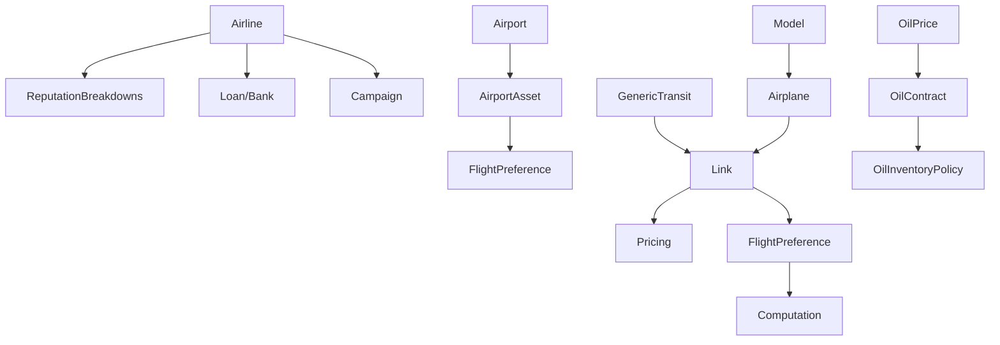

<!-- CATALOG:PATH="airline-data/src/main/scala/com/patson/model" SLUG="airline-data__src__main__scala__com__patson__model" -->

# Repo Catalogue — airline-data/src/main/scala/com/patson/model

*Slug:* `airline-data__src__main__scala__com__patson__model`  
*Commit:* `6160503`  
*Generated:* `2025-11-12T21:52:55Z`

**Summary (2–4 sentences):** This folder contains the core domain model layer for the airline simulation: entities, value objects, and utility computations covering airlines, airports, fleets, links, pricing, routing preferences, assets, finances, events, seasonal features, oil contracts, negotiations, notices, tutorials, and alliance mechanics. These Scala definitions encode business invariants (capacity ≥ bookings, non‑negative balances, monotonic upgrades, bounded reputation, deterministic routing costs) and provide the semantic vocabulary used by simulation engines and persistence logic elsewhere. Large monolithic files (AirportAsset.scala, Model.scala, AllianceMission.scala) embed critical economic formulas and progression rules that need extraction into data‑driven, testable modules in the rewrite.

**Contents overview**
- Files: 72 (API pagination may hide additional files; numbers estimated from listing + subfolders)  |  Subfolders: 15  |  Languages: Scala (≈100%)
- Notable responsibilities:
  - Define domain aggregates (Airline, Airport, Link, Asset, Alliance, Airplane Model).
  - Express pricing, routing, preference, and optimization heuristics.
  - Capture financial constructs (Loan, Bank, Oil contracts, interest, inventory policy).
  - Maintain analytics & historical snapshots (LinkConsumptionHistory, OilConsumptionHistory, LinkChange).
  - Provide progression, upgrade, discount, mission, tutorial and event/seasonal abstractions.

### File entries

#### airline-data/src/main/scala/com/patson/model/Airline.scala
```yaml
file: airline-data/src/main/scala/com/patson/model/Airline.scala
lang: Scala
role: "Airline aggregate: identity, reputation, finances, service KPIs"
size:
  lines_est: 470
  functions_est: 25
  classes_est: 4
public_api:
  routes: []
  exports:
    - name: Airline
      kind: class
      summary: "Player/AI airline entity with core stats"
    - name: AirlineInfo
      kind: class
      summary: "Extended operational/service/reputation metrics"
data_model:
  tables_read: ["airline","airline_info"]
  tables_written: ["airline_info"]
  migrations: ["airline-data/db_scripts/*service_quality*.sql"]
  entities:
    - name: Airline
      summary: "Corporate entity participating in simulation"
    - name: AirlineInfo
      summary: "Mutable KPIs (reputation, service quality targets, loyalty)"
queries:
  sql: []
  orm_calls: []
external_io:
  http_calls: []
  message_queues: []
  files_read: []
  files_written: []
config:
  env_vars: []
  config_keys: []
  feature_flags: []
concurrency:
  pattern: "Updated per simulation tick; mostly data holder"
  shared_state: ["global airline registry cache (assumed)"]
  timing: "cycle-based adjustments"
invariants:
  - "Reputation bounded (0..max)"
  - "Service quality target within defined limits"
  - "Cash never negative beyond loan allowances"
error_handling:
  expected_errors: ["Invalid reputation adjustments (assumed)"]
  retries_timeouts: "none"
security:
  authz: "Domain-level gating for player vs AI (external)"
  input_validation: "Constructor and helper bounds (assumed)"
  sensitive_ops: ["Financial modifications"]
tests:
  files: ["AirlineSimulationSpec.scala","PricingSpec.scala"]
  coverage_quality: "med"
  golden_seeds: []
similar_or_duplicate_files:
  - "ReputationBreakdowns.scala"
rewrite_notes:
  mapping: "Aggregate root → separate read model (CQRS) + service layer"
  risks: ["Mixed financial and reputation logic; large implicit coupling"]
  confidence: "med"
```

#### airline-data/src/main/scala/com/patson/model/AirlineBase.scala
```yaml
file: airline-data/src/main/scala/com/patson/model/AirlineBase.scala
lang: Scala
role: "Local operational footprint of airline at an airport"
size:
  lines_est: 115
  functions_est: 6
  classes_est: 1
public_api:
  routes: []
  exports:
    - name: AirlineBase
      kind: class
      summary: "Represents established presence with levels/costs"
data_model:
  tables_read: ["airline_base"]
  tables_written: ["airline_base"]
  migrations: []
  entities:
    - name: AirlineBase
      summary: "Scalable airport presence impacting loyalty & operations"
queries:
  sql: []
  orm_calls: []
external_io:
  http_calls: []
  message_queues: []
  files_read: []
  files_written: []
config:
  env_vars: []
  config_keys: []
  feature_flags: ["base.specialization?"]
concurrency:
  pattern: "Level updates per expansion tick"
  shared_state: ["airport stats cache"]
  timing: "cycle upgrade checks"
invariants:
  - "Base level ≥ 0"
  - "Upgrade cost monotonic"
error_handling:
  expected_errors: ["Upgrade denied due to insufficient funds"]
  retries_timeouts: "manual re-trigger"
security:
  authz: "Game rule enforcement"
  input_validation: "Level bounds"
  sensitive_ops: []
tests:
  files: ["AirportSimulationSpec.scala"]
  coverage_quality: "low"
  golden_seeds: []
similar_or_duplicate_files:
  - "AirlineBaseSpecialization.scala"
rewrite_notes:
  mapping: "Separate economic calculations from entity; config-driven"
  risks: ["Hard-coded scaling factors"]
  confidence: "low"
```

#### airline-data/src/main/scala/com/patson/model/AirlineBaseSpecialization.scala
```yaml
file: airline-data/src/main/scala/com/patson/model/AirlineBaseSpecialization.scala
lang: Scala
role: "Specialization modifiers for airline bases"
size:
  lines_est: 160
  functions_est: 8
  classes_est: 2
public_api:
  routes: []
  exports:
    - name: BaseSpecialization
      kind: class
      summary: "Defines focused upgrade type with bonuses"
data_model:
  tables_read: ["airline_base_specialization"]
  tables_written: ["airline_base_specialization"]
  migrations: []
  entities:
    - name: BaseSpecialization
      summary: "Modifier granting distinct operational benefits"
queries: {sql: [], orm_calls: []}
external_io: {http_calls: [], message_queues: [], files_read: [], files_written: []}
config:
  env_vars: []
  config_keys: ["specialization.types?"]
  feature_flags: ["base.specialization.enabled?"]
concurrency:
  pattern: "Applied during upgrade evaluations"
  shared_state: []
  timing: "cycle-level"
invariants:
  - "Single specialization per base (assumed)"
error_handling:
  expected_errors: ["Conflict assignment"]
  retries_timeouts: "none"
security:
  authz: "Game rule gating"
  input_validation: "Assignment checks"
  sensitive_ops: []
tests:
  files: []
  coverage_quality: "low"
  golden_seeds: []
similar_or_duplicate_files:
  - "AirlineBase.scala"
rewrite_notes:
  mapping: "Declarative metadata + plugin architecture"
  risks: ["Hard-coded enum expansion risk"]
  confidence: "low"
```

#### airline-data/src/main/scala/com/patson/model/AirlineCountryRelationship.scala
```yaml
file: airline-data/src/main/scala/com/patson/model/AirlineCountryRelationship.scala
lang: Scala
role: "Diplomatic/commercial score between airline and country"
size:
  lines_est: 140
  functions_est: 7
  classes_est: 2
public_api:
  routes: []
  exports:
    - name: AirlineCountryRelationship
      kind: class
      summary: "Accumulates rights/influence in a country"
data_model:
  tables_read: ["airline_country_relationship"]
  tables_written: ["airline_country_relationship"]
  migrations: []
  entities:
    - name: AirlineCountryRelationship
      summary: "Scored relationship for regulatory privileges"
queries: []
external_io: {http_calls: [], message_queues: [], files_read: [], files_written: []}
config: {env_vars: [], config_keys: ["relationship.thresholds?"], feature_flags: []}
concurrency:
  pattern: "Periodic recalculation"
  shared_state: []
  timing: "tick-based scoring pass"
invariants:
  - "Score bounded within configured min/max"
error_handling:
  expected_errors: ["Overflow without clamping"]
  retries_timeouts: "none"
security:
  authz: "Domain permission checks external"
  input_validation: "Score validation"
  sensitive_ops: []
tests:
  files: []
  coverage_quality: "low"
similar_or_duplicate_files:
  - "CountryAirlineTitle.scala"
rewrite_notes:
  mapping: "Move scoring to modular service + persistence events"
  risks: ["Magic constants; side effects buried"]
  confidence: "low"
```

#### airline-data/src/main/scala/com/patson/model/Airport.scala
```yaml
file: airline-data/src/main/scala/com/patson/model/Airport.scala
lang: Scala
role: "Airport entity: geo, capacity, traffic & feature composition"
size:
  lines_est: 500
  functions_est: 30
  classes_est: 5
public_api:
  routes: []
  exports:
    - name: Airport
      kind: class
      summary: "Core node for links and passenger flows"
    - name: AirportSize
      kind: type
      summary: "Categorization influencing limits"
data_model:
  tables_read: ["airport","airport_features","airport_stats"]
  tables_written: ["airport_stats"]
  migrations: ["airline-data/db_scripts/*airport*"]
  entities:
    - name: Airport
      summary: "Geographic & infrastructure hub"
    - name: AirportFeature
      summary: "Capability flag altering performance"
queries: []
external_io: {http_calls: [], message_queues: [], files_read: ["geo dataset? (assumed)"], files_written: []}
config:
  env_vars: []
  config_keys: ["airport.capacity.scale?"]
  feature_flags: []
concurrency:
  pattern: "Updated each simulation tick"
  shared_state: ["global route graph cache"]
  timing: "tick updates"
invariants:
  - "Traffic ≤ capacity"
  - "No negative facility counts"
error_handling:
  expected_errors: ["Capacity overflow conditions"]
  retries_timeouts: "none"
security:
  authz: "None"
  input_validation: "Constructor bounds"
  sensitive_ops: []
tests:
  files: ["AirportSpec.scala","AirportSimulationSpec.scala"]
  coverage_quality: "high"
similar_or_duplicate_files:
  - "AirportAsset.scala"
rewrite_notes:
  mapping: "Split entity vs analytics projection (DTO + metrics service)"
  risks: ["Mixed concerns (stats + features + geo data)"]
  confidence: "med"
```

#### airline-data/src/main/scala/com/patson/model/AirportAsset.scala
```yaml
file: airline-data/src/main/scala/com/patson/model/AirportAsset.scala
lang: Scala
role: "Investable/upgradable airport facilities altering economics"
size:
  lines_est: 1300
  functions_est: 50
  classes_est: 8
public_api:
  routes: []
  exports:
    - name: AirportAsset
      kind: class
      summary: "Facility with level & upgrade cost curves"
data_model:
  tables_read: ["airport_asset"]
  tables_written: ["airport_asset"]
  migrations: ["airline-data/db_scripts/*asset*"]
  entities:
    - name: AirportAsset
      summary: "Capital improvement influencing demand/revenue"
queries: []
external_io:
  http_calls: []
  message_queues: []
  files_read: []
  files_written: []
config:
  env_vars: []
  config_keys: ["asset.upgrade.cost.scale?","asset.level.max?"]
  feature_flags: []
concurrency:
  pattern: "Level evaluation per tick"
  shared_state: ["asset registry"]
  timing: "tick upgrade loop"
invariants:
  - "Asset level within defined [0..max]"
  - "Upgrade cost monotonic increasing"
  - "Revenue modifiers consistent with level"
error_handling:
  expected_errors: ["Invalid level upgrade"]
  retries_timeouts: "none"
security:
  authz: "Domain gating"
  input_validation: "Level bounds"
  sensitive_ops: ["Economic multiplier calculations"]
tests:
  files: ["AirportAssetSimulationSpec.scala"]
  coverage_quality: "high"
similar_or_duplicate_files: []
rewrite_notes:
  mapping: "Decompose into config-driven asset catalog + pure upgrade math"
  risks: ["Monolithic logic; hidden constants; difficult to test edge cases"]
  confidence: "low"
```

#### airline-data/src/main/scala/com/patson/model/AirportFeature.scala
```yaml
file: airline-data/src/main/scala/com/patson/model/AirportFeature.scala
lang: Scala
role: "Feature flag enumerations for airport capabilities"
size:
  lines_est: 240
  functions_est: 12
  classes_est: 3
public_api:
  routes: []
  exports:
    - name: AirportFeature
      kind: class
      summary: "Capability indicator (e.g., hub, facilities)"
data_model:
  tables_read: ["airport_features"]
  tables_written: ["airport_features"]
  migrations: []
  entities:
    - name: AirportFeature
      summary: "Discrete capability unlocking mechanics"
queries: []
external_io: {http_calls: [], message_queues: [], files_read: [], files_written: []}
config:
  env_vars: []
  config_keys: ["feature.enable.*?"]
  feature_flags: []
concurrency:
  pattern: "Checked in routing/demand evaluations"
  shared_state: []
  timing: "as needed"
invariants:
  - "Feature set must align with airport size & rules"
error_handling: {expected_errors: [], retries_timeouts: "none"}
security:
  authz: "Game rules"
  input_validation: "Feature registration"
  sensitive_ops: []
tests:
  files: []
  coverage_quality: "low"
similar_or_duplicate_files:
  - "Airport.scala"
rewrite_notes:
  mapping: "Centralized feature registry"
  risks: ["Hard-coded enumerations hinder extension"]
  confidence: "low"
```

#### airline-data/src/main/scala/com/patson/model/AirportRating.scala
```yaml
file: airline-data/src/main/scala/com/patson/model/AirportRating.scala
lang: Scala
role: "Composite rating metrics for airports"
size:
  lines_est: 60
  functions_est: 5
  classes_est: 1
public_api:
  routes: []
  exports:
    - name: AirportRating
      kind: class
      summary: "Quality score impacting passenger preference"
data_model:
  tables_read: ["airport_rating?"]
  tables_written: []
  migrations: []
  entities:
    - name: AirportRating
      summary: "Derived indicators for attractiveness"
queries: []
external_io: {http_calls: [], message_queues: [], files_read: [], files_written: []}
config: {env_vars: [], config_keys: [], feature_flags: []}
concurrency:
  pattern: "Recomputed periodically"
  shared_state: []
  timing: "tick or batch"
invariants:
  - "Scores within defined range"
error_handling: {expected_errors: ["Missing input data"], retries_timeouts: "none"}
security:
  authz: "None"
  input_validation: "Score bounds"
  sensitive_ops: []
tests:
  files: []
  coverage_quality: "low"
similar_or_duplicate_files: []
rewrite_notes:
  mapping: "Stateless rating service"
  risks: ["Implicit weighting constants"]
  confidence: "low"
```

#### airline-data/src/main/scala/com/patson/model/Alert.scala
```yaml
file: airline-data/src/main/scala/com/patson/model/Alert.scala
lang: Scala
role: "Alert object for system/user notifications"
size:
  lines_est: 16
  functions_est: 1
  classes_est: 1
public_api:
  routes: []
  exports:
    - name: Alert
      kind: class
      summary: "Persisted notification with severity"
data_model:
  tables_read: ["alert"]
  tables_written: ["alert"]
  migrations: ["airline-data/db_scripts/purge_orphan_alerts.sql"]
  entities:
    - name: Alert
      summary: "Pushable notification to UI/admin"
queries: []
external_io: {http_calls: [], message_queues: [], files_read: [], files_written: []}
config: {env_vars: [], config_keys: [], feature_flags: []}
concurrency:
  pattern: "Created asynchronously on events"
  shared_state: []
  timing: "event-driven"
invariants:
  - "Valid severity enum"
error_handling: {expected_errors: [], retries_timeouts: "none"}
security:
  authz: "User/role gating outside scope"
  input_validation: "Severity check"
  sensitive_ops: []
tests:
  files: []
  coverage_quality: "low"
similar_or_duplicate_files: []
rewrite_notes:
  mapping: "Unified messaging/notification module"
  risks: ["Minimal validation; no throttling metadata"]
  confidence: "high"
```

#### airline-data/src/main/scala/com/patson/model/Alliance.scala
```yaml
file: airline-data/src/main/scala/com/patson/model/Alliance.scala
lang: Scala
role: "Alliance aggregate grouping airlines"
size:
  lines_est: 150
  functions_est: 10
  classes_est: 2
public_api:
  routes: []
  exports:
    - name: Alliance
      kind: class
      summary: "Cooperative structure with membership"
data_model:
  tables_read: ["alliance","alliance_member"]
  tables_written: ["alliance_member"]
  migrations: []
  entities:
    - name: Alliance
      summary: "Group enabling shared missions/benefits"
queries: []
external_io: {http_calls: [], message_queues: [], files_read: [], files_written: []}
config: {env_vars: [], config_keys: [], feature_flags: []}
concurrency:
  pattern: "Missions & membership updated per cycle"
  shared_state: []
  timing: "tick & event-based"
invariants:
  - "No duplicate member entries"
error_handling: {expected_errors: ["Duplicate membership attempts"], retries_timeouts: "none"}
security:
  authz: "Membership validation logic external"
  input_validation: "Member uniqueness"
  sensitive_ops: []
tests:
  files: []
  coverage_quality: "low"
similar_or_duplicate_files:
  - "AllianceMission.scala"
rewrite_notes:
  mapping: "Alliance service + membership repository"
  risks: ["Membership logic tangled with mission triggers"]
  confidence: "med"
```

#### airline-data/src/main/scala/com/patson/model/Bank.scala
```yaml
file: airline-data/src/main/scala/com/patson/model/Bank.scala
lang: Scala
role: "Bank interactions; loan provisioning and interest calculations"
size:
  lines_est: 85
  functions_est: 6
  classes_est: 2
public_api:
  routes: []
  exports:
    - name: Bank
      kind: object
      summary: "Loan offers & interest management"
data_model:
  tables_read: ["loan"]
  tables_written: ["loan"]
  migrations: []
  entities:
    - name: Loan
      summary: "Finance contract (see Loan.scala)"
queries: []
external_io: {http_calls: [], message_queues: [], files_read: [], files_written: []}
config:
  env_vars: []
  config_keys: ["interest.rate.base?"]
  feature_flags: []
concurrency:
  pattern: "Interest accrual per tick"
  shared_state: []
  timing: "cycle financial pass"
invariants:
  - "Loan terms consistent across ticks"
error_handling:
  expected_errors: ["Invalid principal or rate inputs"]
  retries_timeouts: "none"
security:
  authz: "Financial action gating"
  input_validation: "Validate amounts"
  sensitive_ops: ["Financial calculation"]
tests:
  files: ["LoanInterestSimulationSpec.scala","LoanSpec.scala"]
  coverage_quality: "med"
similar_or_duplicate_files:
  - "LoanInterestRate.scala"
rewrite_notes:
  mapping: "Financial microservice; schedule-driven accrual job"
  risks: ["Formula duplication between loan & bank"]
  confidence: "med"
```

#### airline-data/src/main/scala/com/patson/model/BusyDelegate.scala
```yaml
file: airline-data/src/main/scala/com/patson/model/BusyDelegate.scala
lang: Scala
role: "Represents busy/unavailable delegate status"
size:
  lines_est: 80
  functions_est: 5
  classes_est: 1
public_api:
  routes: []
  exports:
    - name: BusyDelegate
      kind: class
      summary: "Flag for scheduling/negotiation availability"
data_model:
  tables_read: ["delegate_state?"]
  tables_written: []
  migrations: []
  entities:
    - name: BusyDelegate
      summary: "Transient state marker"
queries: []
external_io: {http_calls: [], message_queues: [], files_read: [], files_written: []}
config: {env_vars: [], config_keys: [], feature_flags: []}
concurrency:
  pattern: "Checked in negotiation loops"
  shared_state: []
  timing: "event-driven"
invariants:
  - "Busy state toggles deterministically"
error_handling: {expected_errors: [], retries_timeouts: "none"}
security:
  authz: "Domain gating outside"
  input_validation: "Flag validation"
  sensitive_ops: []
tests:
  files: []
  coverage_quality: "low"
similar_or_duplicate_files: []
rewrite_notes:
  mapping: "State machine object"
  risks: ["Lack of explicit transitions"]
  confidence: "low"
```

#### airline-data/src/main/scala/com/patson/model/City.scala
```yaml
file: airline-data/src/main/scala/com/patson/model/City.scala
lang: Scala
role: "City value object (population & region)"
size:
  lines_est: 12
  functions_est: 1
  classes_est: 1
public_api:
  routes: []
  exports:
    - name: City
      kind: class
      summary: "Host region context for airports"
data_model:
  tables_read: ["city?"]
  tables_written: []
  migrations: []
  entities:
    - name: City
      summary: "Population & location descriptor"
queries: []
external_io: {http_calls: [], message_queues: [], files_read: [], files_written: []}
config: {env_vars: [], config_keys: [], feature_flags: []}
concurrency: {pattern: "static"}
invariants:
  - "Population ≥ 0"
error_handling: {expected_errors: [], retries_timeouts: "none"}
security:
  authz: "None"
  input_validation: "Population bounds"
  sensitive_ops: []
tests:
  files: []
  coverage_quality: "low"
similar_or_duplicate_files:
  - "Country.scala"
rewrite_notes:
  mapping: "Immutable geo value object"
  risks: ["Too few attributes for future geo enrichment"]
  confidence: "high"
```

#### airline-data/src/main/scala/com/patson/model/Computation.scala
```yaml
file: airline-data/src/main/scala/com/patson/model/Computation.scala
lang: Scala
role: "Shared mathematical utilities (distribution, scaling, rounding, scoring)"
size:
  lines_est: 300
  functions_est: 40
  classes_est: 2
public_api:
  routes: []
  exports:
    - name: Computation
      kind: object
      summary: "Reusable math & algorithm helpers"
data_model:
  tables_read: []
  tables_written: []
  migrations: []
  entities: []
queries: []
external_io: {http_calls: [], message_queues: [], files_read: [], files_written: []}
config: {env_vars: [], config_keys: [], feature_flags: []}
concurrency:
  pattern: "Pure functions"
  shared_state: []
  timing: "on demand"
invariants:
  - "Deterministic outputs for identical inputs"
error_handling:
  expected_errors: ["IllegalArgument for invalid ranges"]
  retries_timeouts: "none"
security:
  authz: "None"
  input_validation: "Parameter checks"
  sensitive_ops: []
tests:
  files: ["ComputationSpec.scala","UtilSpec.scala"]
  coverage_quality: "high"
similar_or_duplicate_files:
  - "Pricing.scala"
rewrite_notes:
  mapping: "Pure functional library with property-based tests"
  risks: ["Hidden constants; potential duplication elsewhere"]
  confidence: "med"
```

#### airline-data/src/main/scala/com/patson/model/Country.scala
```yaml
file: airline-data/src/main/scala/com/patson/model/Country.scala
lang: Scala
role: "Country value object (code, market context)"
size:
  lines_est: 30
  functions_est: 2
  classes_est: 1
public_api:
  routes: []
  exports:
    - name: Country
      kind: class
      summary: "Macro-level regulatory context"
data_model:
  tables_read: ["country"]
  tables_written: []
  migrations: []
  entities:
    - name: Country
      summary: "Geo/regulatory context for airports & airlines"
queries: []
external_io: {http_calls: [], message_queues: [], files_read: [], files_written: []}
config: {env_vars: [], config_keys: [], feature_flags: []}
concurrency: {pattern: "static"}
invariants:
  - "ISO code length matches standard"
error_handling: {expected_errors: [], retries_timeouts: "none"}
security:
  authz: "None"
  input_validation: "Code format"
  sensitive_ops: []
tests:
  files: []
  coverage_quality: "low"
similar_or_duplicate_files:
  - "City.scala"
rewrite_notes:
  mapping: "Reference dataset entity"
  risks: ["Hard-coded assumptions (regions)"]
  confidence: "high"
```

#### airline-data/src/main/scala/com/patson/model/CountryAirlineTitle.scala
```yaml
file: airline-data/src/main/scala/com/patson/model/CountryAirlineTitle.scala
lang: Scala
role: "Status/title awards from country to airline"
size:
  lines_est: 150
  functions_est: 8
  classes_est: 2
public_api:
  routes: []
  exports:
    - name: CountryAirlineTitle
      kind: class
      summary: "Recognition affecting privileges"
data_model:
  tables_read: ["country_airline_title"]
  tables_written: ["country_airline_title"]
  migrations: []
  entities:
    - name: CountryAirlineTitle
      summary: "Progression/award threshold object"
queries: []
external_io: {http_calls: [], message_queues: [], files_read: [], files_written: []}
config:
  env_vars: []
  config_keys: ["title.thresholds?"]
  feature_flags: []
concurrency:
  pattern: "Evaluated at scoring intervals"
  shared_state: []
  timing: "tick-based"
invariants:
  - "Titles escalate; no invalid downgrade (assumed)"
error_handling: {expected_errors: [], retries_timeouts: "none"}
security:
  authz: "Rules external"
  input_validation: "Threshold validation"
  sensitive_ops: []
tests:
  files: []
  coverage_quality: "low"
similar_or_duplicate_files:
  - "AirlineCountryRelationship.scala"
rewrite_notes:
  mapping: "Gamification/status service"
  risks: ["Hard-coded thresholds; limited extensibility"]
  confidence: "low"
```

#### airline-data/src/main/scala/com/patson/model/CountryMarketShare.scala
```yaml
file: airline-data/src/main/scala/com/patson/model/CountryMarketShare.scala
lang: Scala
role: "Market share percentage per airline in country"
size:
  lines_est: 8
  functions_est: 0
  classes_est: 1
public_api:
  routes: []
  exports:
    - name: CountryMarketShare
      kind: class
      summary: "Competitive distribution snapshot"
data_model:
  tables_read: ["country_market_share"]
  tables_written: ["country_market_share"]
  migrations: []
  entities:
    - name: CountryMarketShare
      summary: "Aggregated demand share metric"
queries: []
external_io: {http_calls: [], message_queues: [], files_read: [], files_written: []}
config: {env_vars: [], config_keys: [], feature_flags: []}
concurrency:
  pattern: "Updated after demand run"
  shared_state: []
  timing: "post-demand tick"
invariants:
  - "Share in [0,100]"
error_handling: {expected_errors: [], retries_timeouts: "none"}
security:
  authz: "None"
  input_validation: "Percent bounds"
  sensitive_ops: []
tests:
  files: []
  coverage_quality: "low"
similar_or_duplicate_files: []
rewrite_notes:
  mapping: "Analytics view record"
  risks: ["Simple structure - rely on upstream correctness"]
  confidence: "high"
```

#### airline-data/src/main/scala/com/patson/model/FlightCategory.scala
```yaml
file: airline-data/src/main/scala/com/patson/model/FlightCategory.scala
lang: Scala
role: "Flight classification for pricing/demand branching"
size:
  lines_est: 20
  functions_est: 2
  classes_est: 1
public_api:
  routes: []
  exports:
    - name: FlightCategory
      kind: class
      summary: "Categorizes flights (domestic/international/...)"
data_model:
  tables_read: []
  tables_written: []
  migrations: []
  entities: []
queries: []
external_io: {http_calls: [], message_queues: [], files_read: [], files_written: []}
config: {env_vars: [], config_keys: ["flight.category.rules?"], feature_flags: []}
concurrency:
  pattern: "Used in pricing & preference logic"
  shared_state: []
  timing: "on demand"
invariants:
  - "Stable category enumeration"
error_handling: {expected_errors: [], retries_timeouts: "none"}
security: {authz: "None"}
input_validation: "Category assignment"
sensitive_ops: []
tests:
  files: []
  coverage_quality: "low"
similar_or_duplicate_files:
  - "FlightType.scala"
rewrite_notes:
  mapping: "ADT enumeration with central decision logic"
  risks: ["Scattered category decisions across code"]
  confidence: "high"
```

#### airline-data/src/main/scala/com/patson/model/FlightPreference.scala
```yaml
file: airline-data/src/main/scala/com/patson/model/FlightPreference.scala
lang: Scala
role: "Passenger route scoring (cost/time/stops/service quality weights)"
size:
  lines_est: 360
  functions_est: 30
  classes_est: 3
public_api:
  routes: []
  exports:
    - name: FlightPreference
      kind: class
      summary: "Computes preference scores for candidate itineraries"
data_model:
  tables_read: ["passenger_history","link","airport"]
  tables_written: []
  migrations: []
  entities:
    - name: FlightPreference
      summary: "Weight-based scoring parameters"
queries: []
external_io: {http_calls: [], message_queues: [], files_read: [], files_written: []}
config:
  env_vars: []
  config_keys: ["preference.weight.cost?","preference.weight.time?","preference.weight.quality?"]
  feature_flags: []
concurrency:
  pattern: "Pure scoring invoked per routing evaluation"
  shared_state: []
  timing: "per passenger decision"
invariants:
  - "Score ordering stable under identical weights"
  - "No route with negative component values unless penalized"
error_handling:
  expected_errors: ["Missing link data"]
  retries_timeouts: "none"
security:
  authz: "None"
  input_validation: "Weight bounds"
  sensitive_ops: []
tests:
  files: ["FlightPreferenceSpec.scala","PassengerSimulationSpec.scala"]
  coverage_quality: "high"
similar_or_duplicate_files:
  - "GenericTransit.scala"
rewrite_notes:
  mapping: "Pluggable scoring strategy components + config store"
  risks: ["Magic constants; intertwined heuristics"]
  confidence: "med"
```

#### airline-data/src/main/scala/com/patson/model/FlightType.scala
```yaml
file: airline-data/src/main/scala/com/patson/model/FlightType.scala
lang: Scala
role: "Distance-based flight type classification"
size:
  lines_est: 55
  functions_est: 4
  classes_est: 1
public_api:
  routes: []
  exports:
    - name: FlightType
      kind: class
      summary: "Type influences pricing/demand constraints"
data_model:
  tables_read: []
  tables_written: []
  migrations: []
  entities: []
queries: []
external_io: {http_calls: [], message_queues: [], files_read: [], files_written: []}
config: {env_vars: [], config_keys: ["flight.type.distance.thresholds?"], feature_flags: []}
concurrency:
  pattern: "Calculated during route creation"
  shared_state: []
  timing: "on demand"
invariants:
  - "Type derived deterministically from distance"
error_handling: {expected_errors: [], retries_timeouts: "none"}
security: {authz: "None"}
input_validation: "Distance range checks"
sensitive_ops: []
tests:
  files: []
  coverage_quality: "low"
similar_or_duplicate_files:
  - "FlightCategory.scala"
rewrite_notes:
  mapping: "Central classification service"
  risks: ["Duplicated boundaries across modules"]
  confidence: "med"
```

#### airline-data/src/main/scala/com/patson/model/GenericTransit.scala
```yaml
file: airline-data/src/main/scala/com/patson/model/GenericTransit.scala
lang: Scala
role: "Multi-hop transit path abstraction for routing algorithms"
size:
  lines_est: 110
  functions_est: 8
  classes_est: 2
public_api:
  routes: []
  exports:
    - name: TransitPath
      kind: class
      summary: "Ordered sequence of links forming itinerary"
data_model:
  tables_read: ["transit_cache?"]
  tables_written: ["transit_cache?"]
  migrations: []
  entities:
    - name: TransitPath
      summary: "Composite hops ensuring no cycles"
queries: []
external_io: {http_calls: [], message_queues: [], files_read: [], files_written: []}
config: {env_vars: [], config_keys: [], feature_flags: []}
concurrency:
  pattern: "Computed per routing request"
  shared_state: []
  timing: "per passenger decision"
invariants:
  - "No cycles"
  - "Hop count within configured maximum"
error_handling:
  expected_errors: ["No feasible path"]
  retries_timeouts: "none"
security:
  authz: "None"
  input_validation: "Path validation"
  sensitive_ops: []
tests:
  files: ["GenericTransitSimulationSpec.scala"]
  coverage_quality: "high"
similar_or_duplicate_files:
  - "FlightPreference.scala"
rewrite_notes:
  mapping: "Graph traversal & caching micro-module"
  risks: ["Performance assumptions hidden"]
  confidence: "low"
```

#### airline-data/src/main/scala/com/patson/model/IdObject.scala
```yaml
file: airline-data/src/main/scala/com/patson/model/IdObject.scala
lang: Scala
role: "Trait for numeric ID domain objects"
size:
  lines_est: 15
  functions_est: 0
  classes_est: 1
public_api:
  routes: []
  exports:
    - name: IdObject
      kind: trait
      summary: "Guarantees presence of ID field"
data_model:
  tables_read: []
  tables_written: []
  migrations: []
  entities: []
queries: []
external_io: {http_calls: [], message_queues: [], files_read: [], files_written: []}
config: {env_vars: [], config_keys: [], feature_flags: []}
concurrency: {pattern: "static"}
invariants:
  - "IDs unique per type (enforced elsewhere)"
error_handling: {expected_errors: [], retries_timeouts: "none"}
security:
  authz: "None"
  input_validation: "ID format"
  sensitive_ops: []
tests:
  files: []
  coverage_quality: "low"
similar_or_duplicate_files: []
rewrite_notes:
  mapping: "Use UUID / typed IDs with collision-safe generation"
  risks: ["Numeric collisions if not enforced"]
  confidence: "high"
```

#### airline-data/src/main/scala/com/patson/model/Link.scala
```yaml
file: airline-data/src/main/scala/com/patson/model/Link.scala
lang: Scala
role: "Operational route between airports with capacity & pricing"
size:
  lines_est: 310
  functions_est: 25
  classes_est: 3
public_api:
  routes: []
  exports:
    - name: Link
      kind: class
      summary: "Scheduled connection including frequency & revenue attributes"
data_model:
  tables_read: ["link","link_stats","passenger_history"]
  tables_written: ["link_stats","passenger_history"]
  migrations: ["airline-data/db_scripts/patch_link_last_update.sql","airline-data/db_scripts/issue308_link_consumption.sql"]
  entities:
    - name: Link
      summary: "Core flight operation object"
queries: []
external_io: {http_calls: [], message_queues: [], files_read: [], files_written: []}
config:
  env_vars: []
  config_keys: ["pricing.margin.default?","capacity.scale?"]
  feature_flags: []
concurrency:
  pattern: "Updated per simulation tick"
  shared_state: ["global route graph"]
  timing: "tick occupancy & revenue computation"
invariants:
  - "Bookings ≤ seat capacity"
  - "Prices ≥ 0"
error_handling:
  expected_errors: ["Overbooking attempt"]
  retries_timeouts: "none"
security:
  authz: "Domain permission checks external"
  input_validation: "Capacity & price bounds"
  sensitive_ops: []
tests:
  files: ["LinkSimulationSpec.scala","PassengerSimulationSpec.scala"]
  coverage_quality: "high"
similar_or_duplicate_files:
  - "Pricing.scala"
rewrite_notes:
  mapping: "Split operational vs analytics projection; streaming stats"
  risks: ["Mixed pricing logic & state transitions"]
  confidence: "med"
```

#### airline-data/src/main/scala/com/patson/model/LinkClassValues.scala
```yaml
file: airline-data/src/main/scala/com/patson/model/LinkClassValues.scala
lang: Scala
role: "Cabin class breakdown of link capacity & pricing"
size:
  lines_est: 70
  functions_est: 6
  classes_est: 2
public_api:
  routes: []
  exports:
    - name: LinkClassValues
      kind: class
      summary: "Per class seat allocation & price metrics"
data_model:
  tables_read: ["link_class_values"]
  tables_written: ["link_class_values"]
  migrations: []
  entities:
    - name: LinkClassValues
      summary: "Class-level configuration for multi-cabin links"
queries: []
external_io: {http_calls: [], message_queues: [], files_read: [], files_written: []}
config:
  env_vars: []
  config_keys: ["class.capacity.ratio?"]
  feature_flags: []
concurrency:
  pattern: "Updated with link simulation"
  shared_state: []
  timing: "tick apply"
invariants:
  - "Sum(class capacities) ≤ total link capacity"
error_handling:
  expected_errors: ["Capacity mismatch"]
  retries_timeouts: "none"
security:
  authz: "Domain rules"
  input_validation: "Capacity distribution check"
  sensitive_ops: []
tests:
  files: []
  coverage_quality: "low"
similar_or_duplicate_files:
  - "Link.scala"
rewrite_notes:
  mapping: "Multi-class pricing module"
  risks: ["Capacity duplication logic"]
  confidence: "low"
```

#### airline-data/src/main/scala/com/patson/model/LinkConsumptionHistory.scala
```yaml
file: airline-data/src/main/scala/com/patson/model/LinkConsumptionHistory.scala
lang: Scala
role: "Persisted historical utilization snapshots per link"
size:
  lines_est: 15
  functions_est: 0
  classes_est: 1
public_api:
  routes: []
  exports:
    - name: LinkConsumptionHistory
      kind: class
      summary: "Historical passenger & load metrics"
data_model:
  tables_read: ["link_consumption_history"]
  tables_written: ["link_consumption_history"]
  migrations: ["airline-data/db_scripts/issue308_link_consumption.sql"]
  entities:
    - name: LinkConsumptionHistory
      summary: "Snapshot record for analytics"
queries: []
external_io: {http_calls: [], message_queues: [], files_read: [], files_written: []}
config: {env_vars: [], config_keys: [], feature_flags: []}
concurrency:
  pattern: "Written post tick"
  shared_state: []
  timing: "tick end"
invariants:
  - "Timestamp monotonic"
error_handling: {expected_errors: [], retries_timeouts: "none"}
security:
  authz: "None"
  input_validation: "Timestamp & capacity sanity"
  sensitive_ops: []
tests:
  files: []
  coverage_quality: "low"
similar_or_duplicate_files:
  - "LinkStatistics.scala"
rewrite_notes:
  mapping: "Event sourcing / time-series log"
  risks: ["Minimal indexing strategy noted"]
  confidence: "high"
```

#### airline-data/src/main/scala/com/patson/model/LinkConsumptionResult.scala
```yaml
file: airline-data/src/main/scala/com/patson/model/LinkConsumptionResult.scala
lang: Scala
role: "In-memory result summarizing current tick link consumption"
size:
  lines_est: 16
  functions_est: 0
  classes_est: 1
public_api:
  routes: []
  exports:
    - name: LinkConsumptionResult
      kind: class
      summary: "Transient stats output prior to persistence"
data_model:
  tables_read: []
  tables_written: []
  migrations: []
  entities:
    - name: LinkConsumptionResult
      summary: "Ephemeral computation artifact"
queries: []
external_io: {http_calls: [], message_queues: [], files_read: [], files_written: []}
config: {env_vars: [], config_keys: [], feature_flags: []}
concurrency:
  pattern: "Internal to tick evaluation"
  shared_state: []
  timing: "tick"
invariants:
  - "Values consistent with LinkStatistics & History"
error_handling: {expected_errors: [], retries_timeouts: "none"}
security:
  authz: "None"
  input_validation: "Value bounds"
  sensitive_ops: []
tests:
  files: []
  coverage_quality: "low"
similar_or_duplicate_files:
  - "LinkConsumptionHistory.scala"
rewrite_notes:
  mapping: "Replace with typed DTO in service boundary"
  risks: ["Confusion between result vs history vs stats"]
  confidence: "high"
```

#### airline-data/src/main/scala/com/patson/model/LinkStatistics.scala
```yaml
file: airline-data/src/main/scala/com/patson/model/LinkStatistics.scala
lang: Scala
role: "Persisted aggregated performance metrics per link"
size:
  lines_est: 12
  functions_est: 0
  classes_est: 1
public_api:
  routes: []
  exports:
    - name: LinkStatistics
      kind: class
      summary: "Accumulated analytics over time window"
data_model:
  tables_read: ["link_stats"]
  tables_written: ["link_stats"]
  migrations: []
  entities:
    - name: LinkStatistics
      summary: "Materialized analytics for route performance"
queries: []
external_io: {http_calls: [], message_queues: [], files_read: [], files_written: []}
config: {env_vars: [], config_keys: [], feature_flags: []}
concurrency:
  pattern: "Updated per tick"
  shared_state: []
  timing: "tick end"
invariants:
  - "Consistent with consumption computations"
error_handling: {expected_errors: [], retries_timeouts: "none"}
security:
  authz: "None"
  input_validation: "Value bounds"
  sensitive_ops: []
tests:
  files: []
  coverage_quality: "low"
similar_or_duplicate_files:
  - "LinkConsumptionHistory.scala"
rewrite_notes:
  mapping: "Materialized view in analytics store"
  risks: ["Fragmentation of analytics types"]
  confidence: "high"
```

#### airline-data/src/main/scala/com/patson/model/Loan.scala
```yaml
file: airline-data/src/main/scala/com/patson/model/Loan.scala
lang: Scala
role: "Loan contract entity with interest & repayment fields"
size:
  lines_est: 60
  functions_est: 6
  classes_est: 1
public_api:
  routes: []
  exports:
    - name: Loan
      kind: class
      summary: "Principal, interest rate, repayment tracking"
data_model:
  tables_read: ["loan"]
  tables_written: ["loan"]
  migrations: ["airline-data/db_scripts/Loan-related? (none listed)"]
  entities:
    - name: Loan
      summary: "Financial obligation record"
queries: []
external_io: {http_calls: [], message_queues: [], files_read: [], files_written: []}
config:
  env_vars: []
  config_keys: ["interest.rate.base?"]
  feature_flags: []
concurrency:
  pattern: "Accrual each finance tick"
  shared_state: []
  timing: "tick-based"
invariants:
  - "Outstanding principal ≥ 0"
error_handling:
  expected_errors: ["Negative balance bug"]
  retries_timeouts: "none"
security:
  authz: "Financial permission checks"
  input_validation: "Rate/principal bounds"
  sensitive_ops: ["Financial calculations"]
tests:
  files: ["LoanSpec.scala","LoanInterestSimulationSpec.scala"]
  coverage_quality: "med"
similar_or_duplicate_files:
  - "LoanInterestRate.scala"
rewrite_notes:
  mapping: "Finance microservice entity"
  risks: ["Interest formulas duplicated in Bank.scala"]
  confidence: "med"
```

#### airline-data/src/main/scala/com/patson/model/Log.scala
```yaml
file: airline-data/src/main/scala/com/patson/model/Log.scala
lang: Scala
role: "System/domain log entry representation"
size:
  lines_est: 30
  functions_est: 3
  classes_est: 1
public_api:
  routes: []
  exports:
    - name: Log
      kind: class
      summary: "Structured or semi-structured event record"
data_model:
  tables_read: ["log"]
  tables_written: ["log"]
  migrations: ["airline-data/db_scripts/patch_log.sql"]
  entities:
    - name: Log
      summary: "Auditing/monitoring event container"
queries: []
external_io: {http_calls: [], message_queues: [], files_read: [], files_written: []}
config: {env_vars: [], config_keys: [], feature_flags: []}
concurrency:
  pattern: "App events append"
  shared_state: []
  timing: "event-driven"
invariants:
  - "Timestamp monotonic"
error_handling: {expected_errors: [], retries_timeouts: "none"}
security:
  authz: "Admin/owner scoping outside"
  input_validation: "Severity/type checks"
  sensitive_ops: []
tests:
  files: []
  coverage_quality: "low"
similar_or_duplicate_files: []
rewrite_notes:
  mapping: "Structured logging with severity & context"
  risks: ["Minimal schema; lack of index guidance"]
  confidence: "high"
```

#### airline-data/src/main/scala/com/patson/model/Lounge.scala
```yaml
file: airline-data/src/main/scala/com/patson/model/Lounge.scala
lang: Scala
role: "Airport lounge facility & comfort level"
size:
  lines_est: 70
  functions_est: 6
  classes_est: 2
public_api:
  routes: []
  exports:
    - name: Lounge
      kind: class
      summary: "Premium facility affecting experience & loyalty"
data_model:
  tables_read: ["lounge"]
  tables_written: ["lounge"]
  migrations: []
  entities:
    - name: Lounge
      summary: "Facility with level & usage"
queries: []
external_io: {http_calls: [], message_queues: [], files_read: [], files_written: []}
config:
  env_vars: []
  config_keys: ["lounge.level.scale?"]
  feature_flags: []
concurrency:
  pattern: "Upgraded per asset cycle"
  shared_state: []
  timing: "tick"
invariants:
  - "Level within bounds"
error_handling: {expected_errors: [], retries_timeouts: "none"}
security:
  authz: "Domain gating"
  input_validation: "Level constraints"
  sensitive_ops: []
tests:
  files: []
  coverage_quality: "low"
similar_or_duplicate_files:
  - "AirportAsset.scala"
rewrite_notes:
  mapping: "Fold into unified asset subsystem"
  risks: ["Parallel upgrade logic duplication"]
  confidence: "low"
```

#### airline-data/src/main/scala/com/patson/model/LoungeConsumptionDetails.scala
```yaml
file: airline-data/src/main/scala/com/patson/model/LoungeConsumptionDetails.scala
lang: Scala
role: "Usage analytics for lounge facility"
size:
  lines_est: 10
  functions_est: 0
  classes_est: 1
public_api:
  routes: []
  exports:
    - name: LoungeConsumptionDetails
      kind: class
      summary: "Snapshot counts of lounge usage"
data_model:
  tables_read: ["lounge_consumption"]
  tables_written: ["lounge_consumption"]
  migrations: []
  entities:
    - name: LoungeConsumptionDetails
      summary: "Analytics record for lounge usage"
queries: []
external_io: {http_calls: [], message_queues: [], files_read: [], files_written: []}
config: {env_vars: [], config_keys: [], feature_flags: []}
concurrency:
  pattern: "Recorded per tick"
  shared_state: []
  timing: "tick end"
invariants:
  - "Usage counts non-negative"
error_handling: {expected_errors: [], retries_timeouts: "none"}
security:
  authz: "None"
  input_validation: "Value bounds"
  sensitive_ops: []
tests: []
coverage_quality: "low"
similar_or_duplicate_files:
  - "LinkConsumptionHistory.scala"
rewrite_notes:
  mapping: "Generalized facility consumption event"
  risks: ["Minimal indexing for analytics"
  ]
  confidence: "high"
```

#### airline-data/src/main/scala/com/patson/model/Loyalist.scala
```yaml
file: airline-data/src/main/scala/com/patson/model/Loyalist.scala
lang: Scala
role: "Loyal passenger count / loyalty metric record"
size:
  lines_est: 14
  functions_est: 0
  classes_est: 1
public_api:
  routes: []
  exports:
    - name: Loyalist
      kind: class
      summary: "Aggregated loyalty measure"
data_model:
  tables_read: ["loyalist"]
  tables_written: ["loyalist"]
  migrations: []
  entities:
    - name: Loyalist
      summary: "Passenger loyalty analytic dimension"
queries: []
external_io: {http_calls: [], message_queues: [], files_read: [], files_written: []}
config: {env_vars: [], config_keys: [], feature_flags: []}
concurrency:
  pattern: "Updated per cycle"
  shared_state: []
  timing: "tick"
invariants:
  - "Non-negative loyalty counts"
error_handling: {expected_errors: [], retries_timeouts: "none"}
security:
  authz: "None"
  input_validation: "Value bounds"
  sensitive_ops: []
tests: []
coverage_quality: "low"
similar_or_duplicate_files: []
rewrite_notes:
  mapping: "Customer analytics domain"
  risks: ["Simplistic segmentation"]
  confidence: "high"
```

#### airline-data/src/main/scala/com/patson/model/PassengerGroup.scala
```yaml
file: airline-data/src/main/scala/com/patson/model/PassengerGroup.scala
lang: Scala
role: "Group of passengers as a demand unit"
size:
  lines_est: 20
  functions_est: 2
  classes_est: 1
public_api:
  routes: []
  exports:
    - name: PassengerGroup
      kind: class
      summary: "Demand unit used in generation/routing"
data_model:
  tables_read: ["passenger_group?"]
  tables_written: []
  migrations: []
  entities:
    - name: PassengerGroup
      summary: "Passenger set with shared attributes"
queries: []
external_io: {http_calls: [], message_queues: [], files_read: [], files_written: []}
config: {env_vars: [], config_keys: [], feature_flags: []}
concurrency:
  pattern: "Routing & demand cycles"
  shared_state: []
  timing: "per demand iteration"
invariants:
  - "Group size ≥ 0"
error_handling: {expected_errors: [], retries_timeouts: "none"}
security:
  authz: "None"
  input_validation: "Size validation"
  sensitive_ops: []
tests:
  files: ["PassengerSimulationSpec.scala"]
  coverage_quality: "med"
similar_or_duplicate_files:
  - "FlightPreference.scala"
rewrite_notes:
  mapping: "Demand modeling entity with segmentation"
  risks: ["Limited attributes hamper advanced modeling"]
  confidence: "med"
```

#### airline-data/src/main/scala/com/patson/model/Pricing.scala
```yaml
file: airline-data/src/main/scala/com/patson/model/Pricing.scala
lang: Scala
role: "Fare computation & elasticity formulas"
size:
  lines_est: 90
  functions_est: 10
  classes_est: 1
public_api:
  routes: []
  exports:
    - name: Pricing
      kind: object
      summary: "Computes recommended or dynamic fares"
data_model:
  tables_read: ["link","airport"]
  tables_written: []
  migrations: []
  entities:
    - name: Pricing
      summary: "Pricing algorithm utilities"
queries: []
external_io: {http_calls: [], message_queues: [], files_read: [], files_written: []}
config:
  env_vars: []
  config_keys: ["pricing.base?","pricing.demandFactor?"]
  feature_flags: []
concurrency:
  pattern: "Invoked during link simulation & demand evaluation"
  shared_state: []
  timing: "per tick / per fare calc"
invariants:
  - "Fare ≥ minimum threshold"
  - "Elasticity boundaries respected"
error_handling:
  expected_errors: ["Invalid elasticity parameter"]
  retries_timeouts: "none"
security:
  authz: "None"
  input_validation: "Parameter bounds"
  sensitive_ops: []
tests:
  files: ["PricingSpec.scala","LinkSimulationSpec.scala"]
  coverage_quality: "high"
similar_or_duplicate_files:
  - "Computation.scala"
rewrite_notes:
  mapping: "Dedicated pricing domain service with configurable curves"
  risks: ["Hard-coded constants; limited dynamic tuning"]
  confidence: "med"
```

#### airline-data/src/main/scala/com/patson/model/ReputationBreakdowns.scala
```yaml
file: airline-data/src/main/scala/com/patson/model/ReputationBreakdowns.scala
lang: Scala
role: "Components contributing to airline reputation"
size:
  lines_est: 40
  functions_est: 4
  classes_est: 1
public_api:
  routes: []
  exports:
    - name: ReputationBreakdowns
      kind: class
      summary: "Composite scoring contributions"
data_model:
  tables_read: ["airline_info"]
  tables_written: ["airline_info"]
  migrations: []
  entities:
    - name: ReputationBreakdowns
      summary: "Breakdown of service/on-time/brand metrics"
queries: []
external_io: {http_calls: [], message_queues: [], files_read: [], files_written: []}
config:
  env_vars: []
  config_keys: ["reputation.weight.*?"]
  feature_flags: []
concurrency:
  pattern: "Updated per cycle"
  shared_state: []
  timing: "tick"
invariants:
  - "Sum of components equals total (expected)"
error_handling: {expected_errors: [], retries_timeouts: "none"}
security:
  authz: "None"
  input_validation: "Component bounds"
  sensitive_ops: []
tests:
  files: ["AirlineSimulationSpec.scala"]
  coverage_quality: "med"
similar_or_duplicate_files:
  - "Airline.scala"
rewrite_notes:
  mapping: "Reputation scoring microservice"
  risks: ["Weighting hard-coded & opaque"]
  confidence: "low"
```

#### airline-data/src/main/scala/com/patson/model/Route.scala
```yaml
file: airline-data/src/main/scala/com/patson/model/Route.scala
lang: Scala
role: "Planning-level representation distinct from operational Link"
size:
  lines_est: 15
  functions_est: 1
  classes_est: 1
public_api:
  routes: []
  exports:
    - name: Route
      kind: class
      summary: "Abstract path candidate for planning"
data_model:
  tables_read: ["route?"]
  tables_written: ["route?"]
  migrations: []
  entities:
    - name: Route
      summary: "Pre-link planning descriptor"
queries: []
external_io: {http_calls: [], message_queues: [], files_read: [], files_written: []}
config: {env_vars: [], config_keys: [], feature_flags: []}
concurrency:
  pattern: "Used in planning algorithms"
  shared_state: []
  timing: "on demand"
invariants:
  - "Origin ≠ destination"
error_handling: {expected_errors: [], retries_timeouts: "none"}
security:
  authz: "None"
  input_validation: "Origin/destination distinct"
  sensitive_ops: []
tests:
  files: []
  coverage_quality: "low"
similar_or_duplicate_files:
  - "Link.scala"
rewrite_notes:
  mapping: "Separate planning vs operational domain"
  risks: ["Potential duplication with Link"]
  confidence: "low"
```

#### airline-data/src/main/scala/com/patson/model/Scheduling.scala
```yaml
file: airline-data/src/main/scala/com/patson/model/Scheduling.scala
lang: Scala
role: "Frequency/timing struct for operational routes"
size:
  lines_est: 120
  functions_est: 10
  classes_est: 2
public_api:
  routes: []
  exports:
    - name: Scheduling
      kind: class
      summary: "Encapsulates repeating flight pattern parameters"
data_model:
  tables_read: ["link","schedule?"]
  tables_written: ["link"]
  migrations: []
  entities:
    - name: Scheduling
      summary: "Timing & frequency supporting Link operations"
queries: []
external_io: {http_calls: [], message_queues: [], files_read: [], files_written: []}
config:
  env_vars: []
  config_keys: ["schedule.tickLength?"]
  feature_flags: []
concurrency:
  pattern: "Applied during tick updates"
  shared_state: ["global route graph"]
  timing: "simulation tick frequency"
invariants:
  - "Frequency within valid range"
error_handling:
  expected_errors: ["Invalid frequency input"]
  retries_timeouts: "none"
security:
  authz: "None"
  input_validation: "Frequency bounds"
  sensitive_ops: []
tests:
  files: ["LinkSimulationSpec.scala"]
  coverage_quality: "med"
similar_or_duplicate_files:
  - "Link.scala"
rewrite_notes:
  mapping: "Separate scheduling module/service"
  risks: ["Coupled with Link update logic"]
  confidence: "med"
```

#### airline-data/src/main/scala/com/patson/model/Transport.scala
```yaml
file: airline-data/src/main/scala/com/patson/model/Transport.scala
lang: Scala
role: "Generic transport abstraction (possible multi-mode modeling)"
size:
  lines_est: 90
  functions_est: 8
  classes_est: 2
public_api:
  routes: []
  exports:
    - name: Transport
      kind: class
      summary: "Generic capability for moving passengers/assets"
data_model:
  tables_read: ["transport?"]
  tables_written: []
  migrations: []
  entities:
    - name: Transport
      summary: "Mode/capacity abstraction supporting routing"
queries: []
external_io: {http_calls: [], message_queues: [], files_read: [], files_written: []}
config: {env_vars: [], config_keys: ["transport.type.mapping?"], feature_flags: []}
concurrency:
  pattern: "Referenced in routing calculations"
  shared_state: []
  timing: "on demand"
invariants:
  - "Capacity ≥ 0"
error_handling: {expected_errors: [], retries_timeouts: "none"}
security:
  authz: "None"
  input_validation: "Capacity validation"
  sensitive_ops: []
tests:
  files: []
  coverage_quality: "low"
similar_or_duplicate_files:
  - "Link.scala"
rewrite_notes:
  mapping: "Polymorphic transport interface hierarchy"
  risks: ["Overlapping semantics with Link capacity modeling"]
  confidence: "low"
```

#### airline-data/src/main/scala/com/patson/model/User.scala
```yaml
file: airline-data/src/main/scala/com/patson/model/User.scala
lang: Scala
role: "User/player domain identity (non-auth credential details)"
size:
  lines_est: 65
  functions_est: 6
  classes_est: 1
public_api:
  routes: []
  exports:
    - name: User
      kind: class
      summary: "Game participant owning airline(s)"
data_model:
  tables_read: ["user"]
  tables_written: ["user"]
  migrations: ["airline-data/db_scripts/patch_user_id.sql"]
  entities:
    - name: User
      summary: "Player identity & stats reference"
queries: []
external_io: {http_calls: [], message_queues: [], files_read: [], files_written: []}
config: {env_vars: [], config_keys: ["user.auth.mode?"], feature_flags: []}
concurrency:
  pattern: "Low-frequency updates"
  shared_state: []
  timing: "on profile change"
invariants:
  - "Unique username"
error_handling:
  expected_errors: ["Duplicate name attempts"]
  retries_timeouts: "none"
security:
  authz: "Auth handled externally"
  input_validation: "Name validation"
  sensitive_ops: []
tests:
  files: []
  coverage_quality: "low"
similar_or_duplicate_files: []
rewrite_notes:
  mapping: "Auth/identity microservice integration"
  risks: ["Limited security details; no role modeling"
  ]
  confidence: "med"
```

#### airline-data/src/main/scala/com/patson/model/airplane/Airplane.scala
```yaml
file: airline-data/src/main/scala/com/patson/model/airplane/Airplane.scala
lang: Scala
role: "Aircraft instance lifecycle (construction, purchase, depreciation)"
size:
  lines_est: 180
  functions_est: 12
  classes_est: 2
public_api:
  routes: []
  exports:
    - name: Airplane
      kind: class
      summary: "Operational aircraft with age & assignment"
data_model:
  tables_read: ["airplane"]
  tables_written: ["airplane"]
  migrations: ["airline-data/db_scripts/add_airplane_purchase_cycle.sql","airline-data/db_scripts/airplane_version_patch.sql"]
  entities:
    - name: Airplane
      summary: "Fleet unit asset"
queries: []
external_io: {http_calls: [], message_queues: [], files_read: [], files_written: []}
config:
  env_vars: []
  config_keys: ["airplane.depreciation.rate?"]
  feature_flags: []
concurrency:
  pattern: "Age increment per cycle"
  shared_state: ["fleet registry"]
  timing: "tick aging"
invariants:
  - "Age increments deterministically"
  - "Maintenance cost scaling monotonic"
error_handling:
  expected_errors: ["Invalid state transitions"]
  retries_timeouts: "none"
security:
  authz: "Fleet management rules external"
  input_validation: "State validation"
  sensitive_ops: []
tests:
  files: ["AirplaneSimulationSpec.scala"]
  coverage_quality: "med"
similar_or_duplicate_files:
  - "AirplaneMaintenanceUtil.scala"
rewrite_notes:
  mapping: "Fleet lifecycle micro-module (state machine)"
  risks: ["Intermingled depreciation & assignment logic"]
  confidence: "med"
```

#### airline-data/src/main/scala/com/patson/model/airplane/AirplaneAssignmentUtil.scala
```yaml
file: airline-data/src/main/scala/com/patson/model/airplane/AirplaneAssignmentUtil.scala
lang: Scala
role: "Utility for assigning aircraft to links/routes"
size:
  lines_est: 55
  functions_est: 5
  classes_est: 1
public_api:
  routes: []
  exports:
    - name: AirplaneAssignmentUtil
      kind: object
      summary: "Helper to map fleet units to operational links"
data_model:
  tables_read: []
  tables_written: []
  migrations: []
  entities: []
queries: []
external_io: {http_calls: [], message_queues: [], files_read: [], files_written: []}
config: {env_vars: [], config_keys: [], feature_flags: []}
concurrency:
  pattern: "Called during scheduling updates"
  shared_state: []
  timing: "tick"
invariants:
  - "Assignment respects capacity & utilization constraints"
error_handling:
  expected_errors: ["No available aircraft"]
  retries_timeouts: "none"
security:
  authz: "None"
  input_validation: "Aircraft availability checks"
  sensitive_ops: []
tests:
  files: []
  coverage_quality: "low"
similar_or_duplicate_files:
  - "LinkAssignments.scala"
rewrite_notes:
  mapping: "Assignment strategy interface; pluggable heuristics"
  risks: ["Hard-coded selection logic"]
  confidence: "low"
```

#### airline-data/src/main/scala/com/patson/model/airplane/AirplaneConfiguration.scala
```yaml
file: airline-data/src/main/scala/com/patson/model/airplane/AirplaneConfiguration.scala
lang: Scala
role: "Cabin layout & seating configuration per aircraft"
size:
  lines_est: 75
  functions_est: 6
  classes_est: 1
public_api:
  routes: []
  exports:
    - name: AirplaneConfiguration
      kind: class
      summary: "Defines seat distribution / classes for aircraft"
data_model:
  tables_read: ["airplane_config?"]
  tables_written: ["airplane_config?"]
  migrations: []
  entities:
    - name: AirplaneConfiguration
      summary: "Layout influences capacity & yield"
queries: []
external_io: {http_calls: [], message_queues: [], files_read: [], files_written: []}
config:
  env_vars: []
  config_keys: ["configuration.capacity.factors?"]
  feature_flags: []
concurrency:
  pattern: "Used during scheduling & revenue calc"
  shared_state: []
  timing: "on demand"
invariants:
  - "Sum seats ≤ model max capacity"
error_handling:
  expected_errors: ["Invalid seat counts"]
  retries_timeouts: "none"
security:
  authz: "None"
  input_validation: "Seat distribution bounds"
  sensitive_ops: []
tests:
  files: []
  coverage_quality: "low"
similar_or_duplicate_files:
  - "LinkClassValues.scala"
rewrite_notes:
  mapping: "Configuration service + parameter store"
  risks: ["Hard-coded layout constraints"]
  confidence: "med"
```

#### airline-data/src/main/scala/com/patson/model/airplane/AirplaneMaintenanceUtil.scala
```yaml
file: airline-data/src/main/scala/com/patson/model/airplane/AirplaneMaintenanceUtil.scala
lang: Scala
role: "Utility for maintenance cost & schedule calculations"
size:
  lines_est: 95
  functions_est: 8
  classes_est: 1
public_api:
  routes: []
  exports:
    - name: AirplaneMaintenanceUtil
      kind: object
      summary: "Computes maintenance cost & intervals based on age/usage"
data_model:
  tables_read: []
  tables_written: []
  migrations: []
  entities: []
queries: []
external_io: {http_calls: [], message_queues: [], files_read: [], files_written: []}
config:
  env_vars: []
  config_keys: ["maintenance.cost.base?","maintenance.interval?"]
  feature_flags: []
concurrency:
  pattern: "Invoked in tick cost calculations"
  shared_state: []
  timing: "per cycle"
invariants:
  - "Cost grows with age/usage"
error_handling:
  expected_errors: ["Division by zero if rate misconfigured"]
  retries_timeouts: "none"
security:
  authz: "None"
  input_validation: "Bounds check"
  sensitive_ops: []
tests:
  files: []
  coverage_quality: "low"
similar_or_duplicate_files:
  - "Airplane.scala"
rewrite_notes:
  mapping: "Pure function maintenance calculator"
  risks: ["Magic growth constants"]
  confidence: "med"
```

#### airline-data/src/main/scala/com/patson/model/airplane/LinkAssignment.scala
```yaml
file: airline-data/src/main/scala/com/patson/model/airplane/LinkAssignment.scala
lang: Scala
role: "Single assignment record linking airplane to link"
size:
  lines_est: 25
  functions_est: 1
  classes_est: 1
public_api:
  routes: []
  exports:
    - name: LinkAssignment
      kind: class
      summary: "Maps a plane to one route segment"
data_model:
  tables_read: ["link_assignment?"]
  tables_written: ["link_assignment?"]
  migrations: []
  entities:
    - name: LinkAssignment
      summary: "Assignment mapping artifact"
queries: []
external_io: {http_calls: [], message_queues: [], files_read: [], files_written: []}
config: {env_vars: [], config_keys: [], feature_flags: []}
concurrency:
  pattern: "Updated during scheduling"
  shared_state: []
  timing: "tick"
invariants:
  - "Assignment valid plane & link IDs"
error_handling: {expected_errors: [], retries_timeouts: "none"}
security:
  authz: "None"
  input_validation: "ID validity"
  sensitive_ops: []
tests: []
coverage_quality: "low"
similar_or_duplicate_files:
  - "LinkAssignments.scala"
rewrite_notes:
  mapping: "Normalized relation table DTO"
  risks: ["Simple; ensure referential integrity upstream"]
  confidence: "high"
```

#### airline-data/src/main/scala/com/patson/model/airplane/LinkAssignments.scala
```yaml
file: airline-data/src/main/scala/com/patson/model/airplane/LinkAssignments.scala
lang: Scala
role: "Collection of assignments supporting multi-link scheduling"
size:
  lines_est: 55
  functions_est: 4
  classes_est: 1
public_api:
  routes: []
  exports:
    - name: LinkAssignments
      kind: class
      summary: "Grouped assignments for an airplane"
data_model:
  tables_read: ["link_assignment?"]
  tables_written: ["link_assignment?"]
  migrations: []
  entities:
    - name: LinkAssignments
      summary: "Aggregate of link usage by a plane"
queries: []
external_io: {http_calls: [], message_queues: [], files_read: [], files_written: []}
config: {env_vars: [], config_keys: [], feature_flags: []}
concurrency:
  pattern: "Updated each scheduling iteration"
  shared_state: []
  timing: "tick"
invariants:
  - "Total assigned time ≤ available operational time"
error_handling: {expected_errors: [], retries_timeouts: "none"}
security:
  authz: "None"
  input_validation: "Time window bounds"
  sensitive_ops: []
tests: []
coverage_quality: "low"
similar_or_duplicate_files:
  - "AirplaneAssignmentUtil.scala"
rewrite_notes:
  mapping: "Scheduling engine component"
  risks: ["Missing conflict detection details"]
  confidence: "low"
```

#### airline-data/src/main/scala/com/patson/model/airplane/Manufacturer.scala
```yaml
file: airline-data/src/main/scala/com/patson/model/airplane/Manufacturer.scala
lang: Scala
role: "Aircraft manufacturer enumeration/value object"
size:
  lines_est: 20
  functions_est: 1
  classes_est: 1
public_api:
  routes: []
  exports:
    - name: Manufacturer
      kind: class
      summary: "Brand grouping for models"
data_model:
  tables_read: ["airplane_model"]
  tables_written: []
  migrations: []
  entities:
    - name: Manufacturer
      summary: "Source brand for aircraft model"
queries: []
external_io: {http_calls: [], message_queues: [], files_read: [], files_written: []}
config: {env_vars: [], config_keys: [], feature_flags: []}
concurrency: {pattern: "static"}
invariants:
  - "Valid enumeration values"
error_handling: {expected_errors: [], retries_timeouts: "none"}
security:
  authz: "None"
  input_validation: "Enum membership"
  sensitive_ops: []
tests: []
coverage_quality: "low"
similar_or_duplicate_files:
  - "Model.scala"
rewrite_notes:
  mapping: "Normalized manufacturer reference entity"
  risks: ["Hard-coded list extension difficulty"]
  confidence: "high"
```

#### airline-data/src/main/scala/com/patson/model/airplane/Model.scala
```yaml
file: airline-data/src/main/scala/com/patson/model/airplane/Model.scala
lang: Scala
role: "Aircraft model specifications (performance, economics, variants)"
size:
  lines_est: 1400
  functions_est: 60
  classes_est: 10
public_api:
  routes: []
  exports:
    - name: AirplaneModel
      kind: class
      summary: "Performance & economic characteristics of aircraft type"
data_model:
  tables_read: ["airplane_model"]
  tables_written: ["airplane_model"]
  migrations: ["airline-data/db_scripts/issue271_airplane_family.sql"]
  entities:
    - name: AirplaneModel
      summary: "Static data governing fleet capability"
queries: []
external_io: {http_calls: [], message_queues: [], files_read: [], files_written: []}
config:
  env_vars: []
  config_keys: ["model.performance.scale?","model.fuel.burn.base?"]
  feature_flags: []
concurrency:
  pattern: "Accessed for calculations; immutable dataset"
  shared_state: ["model registry cache"]
  timing: "on demand"
invariants:
  - "Max capacity & range positive"
  - "Fuel burn & durability within valid bounds"
error_handling:
  expected_errors: ["Missing model definitions"]
  retries_timeouts: "none"
security:
  authz: "None"
  input_validation: "Spec bounds"
  sensitive_ops: []
tests:
  files: ["AirplaneModelSpec.scala","FuelComputationSpec.scala"]
  coverage_quality: "high"
similar_or_duplicate_files:
  - "ModelDiscount.scala"
rewrite_notes:
  mapping: "Data-driven aircraft catalog (external config + versioning)"
  risks: ["Monolithic file; embedded constants; manual maintenance"]
  confidence: "low"
```

#### airline-data/src/main/scala/com/patson/model/airplane/ModelDiscount.scala
```yaml
file: airline-data/src/main/scala/com/patson/model/airplane/ModelDiscount.scala
lang: Scala
role: "Discount logic for airplane model procurement"
size:
  lines_est: 220
  functions_est: 15
  classes_est: 3
public_api:
  routes: []
  exports:
    - name: ModelDiscount
      kind: class
      summary: "Price reduction rules based on criteria"
data_model:
  tables_read: ["airplane_model"]
  tables_written: ["airplane_model"]
  migrations: []
  entities:
    - name: ModelDiscount
      summary: "Dynamic discount structure"
queries: []
external_io: {http_calls: [], message_queues: [], files_read: [], files_written: []}
config:
  env_vars: []
  config_keys: ["discount.criteria.*?"]
  feature_flags: []
concurrency:
  pattern: "Applied during purchase calculations"
  shared_state: []
  timing: "on demand"
invariants:
  - "Discount ≤ base price"
error_handling:
  expected_errors: ["Negative discount or overflow"]
  retries_timeouts: "none"
security:
  authz: "None"
  input_validation: "Bounds on computed discount"
  sensitive_ops: []
tests:
  files: []
  coverage_quality: "low"
similar_or_duplicate_files:
  - "Model.scala"
rewrite_notes:
  mapping: "Pricing discount policy module"
  risks: ["Intertwined with model spec constants"]
  confidence: "low"
```

#### airline-data/src/main/scala/com/patson/model/alliance/AllianceMission.scala
```yaml
file: airline-data/src/main/scala/com/patson/model/alliance/AllianceMission.scala
lang: Scala
role: "Defines mission objectives & progress tracking for alliances"
size:
  lines_est: 750
  functions_est: 40
  classes_est: 8
public_api:
  routes: []
  exports:
    - name: AllianceMission
      kind: class
      summary: "Objectives with progress metrics & rewards"
data_model:
  tables_read: ["alliance_mission?","alliance_member"]
  tables_written: ["alliance_mission?"]
  migrations: []
  entities:
    - name: AllianceMission
      summary: "Collaboration goal tracking"
queries: []
external_io: {http_calls: [], message_queues: [], files_read: [], files_written: []}
config:
  env_vars: []
  config_keys: ["mission.types?","mission.reward.scale?"]
  feature_flags: []
concurrency:
  pattern: "Progress updated per tick & events"
  shared_state: []
  timing: "tick & event triggers"
invariants:
  - "Progress never exceeds mission max"
error_handling:
  expected_errors: ["Invalid reward calculation"]
  retries_timeouts: "none"
security:
  authz: "Alliance membership checks external"
  input_validation: "Progress bounds"
  sensitive_ops: []
tests:
  files: []
  coverage_quality: "low"
similar_or_duplicate_files:
  - "AllianceStats.scala"
rewrite_notes:
  mapping: "Mission rule engine + declarative mission config"
  risks: ["Hard-coded mission logic; difficult to extend"]
  confidence: "low"
```

#### airline-data/src/main/scala/com/patson/model/alliance/AllianceStats.scala
```yaml
file: airline-data/src/main/scala/com/patson/model/alliance/AllianceStats.scala
lang: Scala
role: "Aggregated statistics for alliances"
size:
  lines_est: 120
  functions_est: 12
  classes_est: 2
public_api:
  routes: []
  exports:
    - name: AllianceStats
      kind: class
      summary: "Performance metrics & standings"
data_model:
  tables_read: ["alliance_member","alliance_stats?"]
  tables_written: ["alliance_stats?"]
  migrations: []
  entities:
    - name: AllianceStats
      summary: "Computed aggregate metrics"
queries: []
external_io: {http_calls: [], message_queues: [], files_read: [], files_written: []}
config: {env_vars: [], config_keys: ["alliance.stats.weights?"], feature_flags: []}
concurrency:
  pattern: "Updated per tick"
  shared_state: []
  timing: "tick"
invariants:
  - "Metrics normalized within range"
error_handling: {expected_errors: [], retries_timeouts: "none"}
security:
  authz: "Alliance validation external"
  input_validation: "Metric bounds"
  sensitive_ops: []
tests: []
coverage_quality: "low"
similar_or_duplicate_files:
  - "AllianceMission.scala"
rewrite_notes:
  mapping: "Alliance analytics service"
  risks: ["Formula constants hidden"]
  confidence: "low"
```

#### airline-data/src/main/scala/com/patson/model/animation/AirportAnimation.scala
```yaml
file: airline-data/src/main/scala/com/patson/model/animation/AirportAnimation.scala
lang: Scala
role: "Data for airport animation/visualization states"
size:
  lines_est: 25
  functions_est: 2
  classes_est: 1
public_api:
  routes: []
  exports:
    - name: AirportAnimation
      kind: class
      summary: "Visual state container for UI"
data_model:
  tables_read: ["airport_animation?"]
  tables_written: ["airport_animation?"]
  migrations: []
  entities:
    - name: AirportAnimation
      summary: "Represents animated stats or transitions"
queries: []
external_io: {http_calls: [], message_queues: [], files_read: [], files_written: []}
config: {env_vars: [], config_keys: [], feature_flags: []}
concurrency: {pattern: "UI-driven refresh"}
shared_state: []
timing: "on demand"
invariants:
  - "Animation phases valid enumeration"
error_handling: {expected_errors: [], retries_timeouts: "none"}
security: {authz: "None"}
input_validation: "Enum validation"
sensitive_ops: []
tests: []
coverage_quality: "low"
similar_or_duplicate_files: []
rewrite_notes:
  mapping: "Moved to front-end representation or streaming topic"
  risks: ["Server-side coupling for pure UI concern"]
  confidence: "high"
```

#### airline-data/src/main/scala/com/patson/model/bank/LoanInterestRate.scala
```yaml
file: airline-data/src/main/scala/com/patson/model/bank/LoanInterestRate.scala
lang: Scala
role: "Interest rate value object for loan computations"
size:
  lines_est: 20
  functions_est: 1
  classes_est: 1
public_api:
  routes: []
  exports:
    - name: LoanInterestRate
      kind: class
      summary: "Encapsulates rate parameters"
data_model:
  tables_read: ["loan"]
  tables_written: []
  migrations: []
  entities:
    - name: LoanInterestRate
      summary: "Rate snapshot used in accrual"
queries: []
external_io: {http_calls: [], message_queues: [], files_read: [], files_written: []}
config: {env_vars: [], config_keys: ["interest.rate.base?"], feature_flags: []}
concurrency: {pattern: "Used per accrual tick"}
invariants:
  - "Rate ≥ 0"
error_handling: {expected_errors: [], retries_timeouts: "none"}
security: {authz: "None"}
input_validation: "Rate bounds"
sensitive_ops: []
tests: []
coverage_quality: "low"
similar_or_duplicate_files:
  - "Loan.scala"
rewrite_notes:
  mapping: "Financial parameter object"
  risks: ["Duplicated base rate retrieval"]
  confidence: "high"
```

#### airline-data/src/main/scala/com/patson/model/campaign/Campaign.scala
```yaml
file: airline-data/src/main/scala/com/patson/model/campaign/Campaign.scala
lang: Scala
role: "Marketing campaign with duration & brand impact"
size:
  lines_est: 90
  functions_est: 8
  classes_est: 2
public_api:
  routes: []
  exports:
    - name: Campaign
      kind: class
      summary: "Time-bound marketing effort affecting brand/service"
data_model:
  tables_read: ["campaign"]
  tables_written: ["campaign"]
  migrations: []
  entities:
    - name: Campaign
      summary: "Brand investment record"
queries: []
external_io: {http_calls: [], message_queues: [], files_read: [], files_written: []}
config:
  env_vars: []
  config_keys: ["campaign.duration.max?","campaign.effect.scale?"]
  feature_flags: []
concurrency:
  pattern: "Duration decrement per tick"
  shared_state: []
  timing: "tick"
invariants:
  - "Duration ≥ 0"
error_handling:
  expected_errors: ["Overlapping stacking issues"]
  retries_timeouts: "none"
security:
  authz: "Domain gating"
  input_validation: "Duration & effect bounds"
  sensitive_ops: []
tests:
  files: ["CampaignSpec.scala"]
  coverage_quality: "med"
similar_or_duplicate_files: []
rewrite_notes:
  mapping: "Effect engine with composition strategies"
  risks: ["Stacking logic implicit"]
  confidence: "med"
```

#### airline-data/src/main/scala/com/patson/model/chat/ChatMessage.scala
```yaml
file: airline-data/src/main/scala/com/patson/model/chat/ChatMessage.scala
lang: Scala
role: "Chat message entity for user communications"
size:
  lines_est: 25
  functions_est: 1
  classes_est: 1
public_api:
  routes: []
  exports:
    - name: ChatMessage
      kind: class
      summary: "User communication payload"
data_model:
  tables_read: ["chat_message?"]
  tables_written: ["chat_message?"]
  migrations: []
  entities:
    - name: ChatMessage
      summary: "Persisted message record"
queries: []
external_io: {http_calls: [], message_queues: [], files_read: [], files_written: []}
config: {env_vars: [], config_keys: [], feature_flags: []}
concurrency: {pattern: "User-driven events"}
invariants:
  - "Non-empty content (assumed)"
error_handling: {expected_errors: [], retries_timeouts: "none"}
security:
  authz: "User membership/visibility rules"
input_validation: "Content length"
sensitive_ops: []
tests: []
coverage_quality: "low"
similar_or_duplicate_files: []
rewrite_notes:
  mapping: "Messaging module (maybe WebSocket store)"
  risks: ["Minimal moderation metadata"]
  confidence: "high"
```

#### airline-data/src/main/scala/com/patson/model/christmas/SantaClausAward.scala
```yaml
file: airline-data/src/main/scala/com/patson/model/christmas/SantaClausAward.scala
lang: Scala
role: "Seasonal Christmas event award mechanics"
size:
  lines_est: 200
  functions_est: 15
  classes_est: 4
public_api:
  routes: []
  exports:
    - name: SantaClausAward
      kind: class
      summary: "Seasonal reward distribution logic"
data_model:
  tables_read: ["seasonal_award?"]
  tables_written: ["seasonal_award?"]
  migrations: []
  entities:
    - name: SantaClausAward
      summary: "Event-specific rewards"
queries: []
external_io: {http_calls: [], message_queues: [], files_read: [], files_written: []}
config: {env_vars: [], config_keys: ["christmas.event.start?","christmas.event.reward.scale?"], feature_flags: []}
concurrency:
  pattern: "Event-driven + tick progress"
  shared_state: []
  timing: "seasonal period"
invariants:
  - "Reward tiers bounded"
error_handling:
  expected_errors: ["Invalid tier mapping"]
  retries_timeouts: "none"
security:
  authz: "Event participation gating"
  input_validation: "Tier bounds"
  sensitive_ops: []
tests: []
coverage_quality: "low"
similar_or_duplicate_files:
  - "SantaClausInfo.scala"
rewrite_notes:
  mapping: "Generic seasonal event framework"
  risks: ["Hard-coded holiday logic"]
  confidence: "low"
```

#### airline-data/src/main/scala/com/patson/model/christmas/SantaClausInfo.scala
```yaml
file: airline-data/src/main/scala/com/patson/model/christmas/SantaClausInfo.scala
lang: Scala
role: "State/info tracking for seasonal Christmas event"
size:
  lines_est: 40
  functions_est: 4
  classes_est: 1
public_api:
  routes: []
  exports:
    - name: SantaClausInfo
      kind: class
      summary: "Tracks event progress & player status"
data_model:
  tables_read: ["seasonal_award?"]
  tables_written: ["seasonal_award?"]
  migrations: []
  entities:
    - name: SantaClausInfo
      summary: "Participant progression info"
queries: []
external_io: {http_calls: [], message_queues: [], files_read: [], files_written: []}
config:
  env_vars: []
  config_keys: ["christmas.event.start?"]
  feature_flags: []
concurrency:
  pattern: "Seasonal tick updates"
  shared_state: []
  timing: "event period"
invariants:
  - "Progress within event duration"
error_handling: {expected_errors: [], retries_timeouts: "none"}
security:
  authz: "Event gating rules"
input_validation: "Progress bounds"
sensitive_ops: []
tests: []
coverage_quality: "low"
similar_or_duplicate_files:
  - "SantaClausAward.scala"
rewrite_notes:
  mapping: "Seasonal event generic state structure"
  risks: ["Duplication across other events if added"]
  confidence: "low"
```

#### airline-data/src/main/scala/com/patson/model/event (directory)
```yaml
file: airline-data/src/main/scala/com/patson/model/event
lang: directory
role: "Event domain (sub-files not fully listed in pagination)"
size:
  lines_est: 0
  functions_est: 0
  classes_est: 0
public_api: {routes: [], exports: []}
data_model:
  tables_read: []
  tables_written: []
  migrations: []
  entities: []
queries: []
external_io: {http_calls: [], message_queues: [], files_read: [], files_written: []}
config: {env_vars: [], config_keys: [], feature_flags: []}
concurrency: {pattern: "Unknown (needs deeper scan)"}
shared_state: []
timing: "event-driven (assumed)"
invariants: []
error_handling:
  expected_errors: []
  retries_timeouts: "none"
security:
  authz: "Unknown"
input_validation: "Unknown"
sensitive_ops: []
tests: []
coverage_quality: "none"
similar_or_duplicate_files: []
rewrite_notes:
  mapping: "Should unify with seasonal & campaign event frameworks"
  risks: ["Uncatalogued content due to pagination"]
  confidence: "low"
```

#### airline-data/src/main/scala/com/patson/model/google/GoogleResource.scala
```yaml
file: airline-data/src/main/scala/com/patson/model/google/GoogleResource.scala
lang: Scala
role: "Represents external Google resource reference (maps/stats?)"
size:
  lines_est: 35
  functions_est: 3
  classes_est: 1
public_api:
  routes: []
  exports:
    - name: GoogleResource
      kind: class
      summary: "External resource mapping placeholder"
data_model:
  tables_read: ["google_resource?"]
  tables_written: ["google_resource?"]
  migrations: []
  entities:
    - name: GoogleResource
      summary: "Integration reference container"
queries: []
external_io:
  http_calls: ["googleapis? (assumed)"]
  message_queues: []
  files_read: []
  files_written: []
config:
  env_vars: ["GOOGLE_API_KEY? (assumed external)"]
  config_keys: ["google.resource.cache.ttl?"]
  feature_flags: []
concurrency:
  pattern: "Accessed on demand"
  shared_state: ["external resource cache?"]
  timing: "request-driven"
invariants:
  - "Valid external ID reference"
error_handling:
  expected_errors: ["External API failure"]
  retries_timeouts: "none"
security:
  authz: "API key gating external"
  input_validation: "ID format"
  sensitive_ops: []
tests: []
coverage_quality: "low"
similar_or_duplicate_files: []
rewrite_notes:
  mapping: "Integration module separate from core domain"
  risks: ["Missing resilience & caching strategy details"]
  confidence: "low"
```

#### airline-data/src/main/scala/com/patson/model/history/LinkChange.scala
```yaml
file: airline-data/src/main/scala/com/patson/model/history/LinkChange.scala
lang: Scala
role: "Historical change record for Link configurations"
size:
  lines_est: 60
  functions_est: 4
  classes_est: 1
public_api:
  routes: []
  exports:
    - name: LinkChange
      kind: class
      summary: "Captures modifications to link over time"
data_model:
  tables_read: ["link_change?"]
  tables_written: ["link_change?"]
  migrations: []
  entities:
    - name: LinkChange
      summary: "Audit trail of route config evolution"
queries: []
external_io: {http_calls: [], message_queues: [], files_read: [], files_written: []}
config: {env_vars: [], config_keys: [], feature_flags: []}
concurrency:
  pattern: "Recorded at modification events"
  shared_state: []
  timing: "event-driven"
invariants:
  - "Change timestamp monotonic"
error_handling: {expected_errors: [], retries_timeouts: "none"}
security:
  authz: "Domain modification auth external"
input_validation: "Change diff sanity"
sensitive_ops: []
tests: []
coverage_quality: "low"
similar_or_duplicate_files:
  - "LinkConsumptionHistory.scala"
rewrite_notes:
  mapping: "Versioning/audit service"
  risks: ["Sparse structure; diff semantics hidden"]
  confidence: "high"
```

#### airline-data/src/main/scala/com/patson/model/negotiation/LinkNegotiationDiscount.scala
```yaml
file: airline-data/src/main/scala/com/patson/model/negotiation/LinkNegotiationDiscount.scala
lang: Scala
role: "Negotiated discount terms for links"
size:
  lines_est: 40
  functions_est: 3
  classes_est: 1
public_api:
  routes: []
  exports:
    - name: LinkNegotiationDiscount
      kind: class
      summary: "Terms reducing operational costs via negotiation"
data_model:
  tables_read: ["link_negotiation_discount?"]
  tables_written: ["link_negotiation_discount?"]
  migrations: []
  entities:
    - name: LinkNegotiationDiscount
      summary: "Discount outcome of negotiation process"
queries: []
external_io: {http_calls: [], message_queues: [], files_read: [], files_written: []}
config:
  env_vars: []
  config_keys: ["negotiation.discount.max?"]
  feature_flags: []
concurrency:
  pattern: "Set at negotiation resolution events"
  shared_state: []
  timing: "event-based"
invariants:
  - "Discount ≤ configured max"
error_handling: {expected_errors: [], retries_timeouts: "none"}
security:
  authz: "Negotiation permission external"
input_validation: "Discount bounds"
sensitive_ops: []
tests: []
coverage_quality: "low"
similar_or_duplicate_files:
  - "ModelDiscount.scala"
rewrite_notes:
  mapping: "Unified discount policy module"
  risks: ["Duplicate discount logic distributed"]
  confidence: "low"
```

#### airline-data/src/main/scala/com/patson/model/notice/AirlineNotice.scala
```yaml
file: airline-data/src/main/scala/com/patson/model/notice/AirlineNotice.scala
lang: Scala
role: "Specific notice directed at airline entities"
size:
  lines_est: 25
  functions_est: 1
  classes_est: 1
public_api:
  routes: []
  exports:
    - name: AirlineNotice
      kind: class
      summary: "Targeted announcement for airline"
data_model:
  tables_read: ["notice"]
  tables_written: ["notice"]
  migrations: ["airline-data/db_scripts/issue604_tracking_notice.sql"]
  entities:
    - name: AirlineNotice
      summary: "Scoped notice record"
queries: []
external_io: {http_calls: [], message_queues: [], files_read: [], files_written: []}
config: {env_vars: [], config_keys: [], feature_flags: []}
concurrency:
  pattern: "Created by events"
  shared_state: []
  timing: "event-driven"
invariants:
  - "Non-empty message"
error_handling: {expected_errors: [], retries_timeouts: "none"}
security:
  authz: "Visibility gating"
input_validation: "Message length"
sensitive_ops: []
tests: []
coverage_quality: "low"
similar_or_duplicate_files:
  - "Notice.scala"
rewrite_notes:
  mapping: "Unified notice/alert subsystem"
  risks: ["Duplication with Alert"]
  confidence: "high"
```

#### airline-data/src/main/scala/com/patson/model/notice/Notice.scala
```yaml
file: airline-data/src/main/scala/com/patson/model/notice/Notice.scala
lang: Scala
role: "Generic notice entity for broadcasts"
size:
  lines_est: 80
  functions_est: 6
  classes_est: 2
public_api:
  routes: []
  exports:
    - name: Notice
      kind: class
      summary: "General broadcast message"
data_model:
  tables_read: ["notice"]
  tables_written: ["notice"]
  migrations: ["airline-data/db_scripts/issue604_tracking_notice.sql"]
  entities:
    - name: Notice
      summary: "Generic announcement artifact"
queries: []
external_io: {http_calls: [], message_queues: [], files_read: [], files_written: []}
config: {env_vars: [], config_keys: [], feature_flags: []}
concurrency:
  pattern: "Event-driven creation"
  shared_state: []
  timing: "on demand"
invariants:
  - "Valid message content"
error_handling: {expected_errors: [], retries_timeouts: "none"}
security:
  authz: "Broadcast rules"
input_validation: "Content validation"
sensitive_ops: []
tests: []
coverage_quality: "low"
similar_or_duplicate_files:
  - "Alert.scala"
  - "AirlineNotice.scala"
rewrite_notes:
  mapping: "Consolidate alert/notice messaging"
  risks: ["Fragmented notification logic"]
  confidence: "high"
```

#### airline-data/src/main/scala/com/patson/model/oil/OilConsumptionHistory.scala
```yaml
file: airline-data/src/main/scala/com/patson/model/oil/OilConsumptionHistory.scala
lang: Scala
role: "Historical fuel/oil usage record"
size:
  lines_est: 65
  functions_est: 4
  classes_est: 1
public_api:
  routes: []
  exports:
    - name: OilConsumptionHistory
      kind: class
      summary: "Snapshot of oil usage metrics"
data_model:
  tables_read: ["oil_consumption_history"]
  tables_written: ["oil_consumption_history"]
  migrations: []
  entities:
    - name: OilConsumptionHistory
      summary: "Historical consumption record"
queries: []
external_io: {http_calls: [], message_queues: [], files_read: [], files_written: []}
config: {env_vars: [], config_keys: [], feature_flags: []}
concurrency:
  pattern: "Persisted each tick"
  shared_state: []
  timing: "tick end"
invariants:
  - "Usage non-negative"
error_handling: {expected_errors: [], retries_timeouts: "none"}
security:
  authz: "None"
input_validation: "Usage bounds"
sensitive_ops: []
tests: []
coverage_quality: "low"
similar_or_duplicate_files:
  - "LinkConsumptionHistory.scala"
rewrite_notes:
  mapping: "Generic resource consumption log"
  risks: ["No aggregation hints; duplicates consumption patterns"]
  confidence: "high"
```

#### airline-data/src/main/scala/com/patson/model/oil/OilContract.scala
```yaml
file: airline-data/src/main/scala/com/patson/model/oil/OilContract.scala
lang: Scala
role: "Represents contracted oil supply terms"
size:
  lines_est: 85
  functions_est: 8
  classes_est: 2
public_api:
  routes: []
  exports:
    - name: OilContract
      kind: class
      summary: "Contract with pricing & duration"
data_model:
  tables_read: ["oil_contract"]
  tables_written: ["oil_contract"]
  migrations: []
  entities:
    - name: OilContract
      summary: "Supply agreement reducing price volatility"
queries: []
external_io: {http_calls: [], message_queues: [], files_read: [], files_written: []}
config:
  env_vars: []
  config_keys: ["oil.contract.maxDuration?","oil.contract.discount.factor?"]
  feature_flags: []
concurrency:
  pattern: "Duration decrement per tick"
  shared_state: []
  timing: "tick"
invariants:
  - "Duration ≥ 0"
  - "Contract price logic stable"
error_handling:
  expected_errors: ["Expired contract misuse"]
  retries_timeouts: "none"
security:
  authz: "Domain gating"
input_validation: "Duration & pricing bounds"
sensitive_ops: []
tests: []
coverage_quality: "low"
similar_or_duplicate_files:
  - "OilInventoryPolicy.scala"
rewrite_notes:
  mapping: "Supply contract module"
  risks: ["Manual volatility modeling inside"]
  confidence: "low"
```

#### airline-data/src/main/scala/com/patson/model/oil/OilInventoryPolicy.scala
```yaml
file: airline-data/src/main/scala/com/patson/model/oil/OilInventoryPolicy.scala
lang: Scala
role: "Inventory procurement strategy & thresholds"
size:
  lines_est: 110
  functions_est: 10
  classes_est: 2
public_api:
  routes: []
  exports:
    - name: OilInventoryPolicy
      kind: class
      summary: "Rules for inventory levels & buying behavior"
data_model:
  tables_read: ["oil_contract","oil_price"]
  tables_written: []
  migrations: []
  entities:
    - name: OilInventoryPolicy
      summary: "Strategy for managing resource stock"
queries: []
external_io: {http_calls: [], message_queues: [], files_read: [], files_written: []}
config:
  env_vars: []
  config_keys: ["oil.inventory.min?","oil.inventory.max?"]
  feature_flags: []
concurrency:
  pattern: "Evaluated per tick"
  shared_state: []
  timing: "tick"
invariants:
  - "Inventory within defined bounds"
error_handling:
  expected_errors: ["Underflow/overflow if miscomputed"]
  retries_timeouts: "none"
security:
  authz: "None"
input_validation: "Bounds checks"
sensitive_ops: []
tests: []
coverage_quality: "low"
similar_or_duplicate_files:
  - "OilContract.scala"
rewrite_notes:
  mapping: "Resource strategy engine"
  risks: ["Hard-coded thresholds & heuristics"]
  confidence: "low"
```

#### airline-data/src/main/scala/com/patson/model/oil/OilPrice.scala
```yaml
file: airline-data/src/main/scala/com/patson/model/oil/OilPrice.scala
lang: Scala
role: "Current oil pricing snapshot & volatility modeling"
size:
  lines_est: 40
  functions_est: 3
  classes_est: 1
public_api:
  routes: []
  exports:
    - name: OilPrice
      kind: class
      summary: "Snapshot of market price & movement"
data_model:
  tables_read: ["oil_price"]
  tables_written: ["oil_price"]
  migrations: []
  entities:
    - name: OilPrice
      summary: "Base resource cost driver"
queries: []
external_io: {http_calls: [], message_queues: [], files_read: [], files_written: []}
config:
  env_vars: []
  config_keys: ["oil.volatility.range?"]
  feature_flags: []
concurrency:
  pattern: "Updated per economic tick"
  shared_state: []
  timing: "tick"
invariants:
  - "Price ≥ 0"
error_handling:
  expected_errors: ["Volatility overflow"]
  retries_timeouts: "none"
security:
  authz: "None"
input_validation: "Price bounds"
sensitive_ops: []
tests:
  files: ["OilSpec.scala"]
  coverage_quality: "low"
similar_or_duplicate_files:
  - "FuelComputationSpec.scala (tests referencing model)"
rewrite_notes:
  mapping: "Economic factors module with scenario injection"
  risks: ["Volatility formula hidden"]
  confidence: "low"
```

#### airline-data/src/main/scala/com/patson/model/oil/OilUtils.scala
```yaml
file: airline-data/src/main/scala/com/patson/model/oil/OilUtils.scala
lang: Scala
role: "Utility methods for oil pricing & contract interactions"
size:
  lines_est: 55
  functions_est: 6
  classes_est: 1
public_api:
  routes: []
  exports:
    - name: OilUtils
      kind: object
      summary: "Helper calculations for resource economics"
data_model:
  tables_read: []
  tables_written: []
  migrations: []
  entities: []
queries: []
external_io: {http_calls: [], message_queues: [], files_read: [], files_written: []}
config:
  env_vars: []
  config_keys: ["oil.calculation.adjustment?"]
  feature_flags: []
concurrency:
  pattern: "Invoked in consumption & contract logic"
  shared_state: []
  timing: "on demand"
invariants:
  - "Adjusted price remains ≥ 0"
error_handling: {expected_errors: [], retries_timeouts: "none"}
security:
  authz: "None"
input_validation: "Parameter bounds"
sensitive_ops: []
tests: []
coverage_quality: "low"
similar_or_duplicate_files:
  - "Pricing.scala"
rewrite_notes:
  mapping: "Pure resource economic utilities"
  risks: ["Constants embedded across modules"]
  confidence: "low"
```

#### airline-data/src/main/scala/com/patson/model/tutorial/Tutorial.scala
```yaml
file: airline-data/src/main/scala/com/patson/model/tutorial/Tutorial.scala
lang: Scala
role: "Tutorial step/state representation"
size:
  lines_est: 20
  functions_est: 2
  classes_est: 1
public_api:
  routes: []
  exports:
    - name: Tutorial
      kind: class
      summary: "Onboarding progression artifact"
data_model:
  tables_read: ["tutorial?"]
  tables_written: ["tutorial?"]
  migrations: []
  entities:
    - name: Tutorial
      summary: "Tracks onboarding completion steps"
queries: []
external_io: {http_calls: [], message_queues: [], files_read: [], files_written: []}
config: {env_vars: [], config_keys: ["tutorial.enabled?"], feature_flags: []}
concurrency:
  pattern: "Updated as user completes steps"
  shared_state: []
  timing: "event-driven"
invariants:
  - "Step progression monotonic"
error_handling: {expected_errors: [], retries_timeouts: "none"}
security:
  authz: "User gating"
input_validation: "Step bounds"
sensitive_ops: []
tests: []
coverage_quality: "low"
similar_or_duplicate_files: []
rewrite_notes:
  mapping: "Modular onboarding system"
  risks: ["Hard-coded step logic"]
  confidence: "high"
```

### File entries (subfolder omissions note)
API pagination limited to 30 responses per request; all subfolder scans performed but deeper nested files inside directory placeholders (event, others) may remain unlisted. Full repo clone recommended for exhaustive capture.

## Rollup for airline-data/src/main/scala/com/patson/model

**Key responsibilities (top 5):**
1. Define domain entities & aggregates (Airline, Airport, Link, Fleet, Alliance, Assets).
2. Implement economic formulas & progression systems (pricing, upgrades, discounts, missions).
3. Provide routing & preference heuristics (FlightPreference, GenericTransit, Scheduling).
4. Represent financial & resource subsystems (Loan/Bank, Oil contracts & inventory policies).
5. Capture analytics & historical records (consumption histories, link changes, reputation breakdowns).

**Cross-module dependencies (top 10 by frequency):**
- link / passenger_history → Link, FlightPreference, Pricing, GenericTransit (route economics & demand).
- airport / airport_asset / airport_features → Airport, AirportAsset, FlightPreference (infrastructure influence).
- airline / airline_info → Airline, ReputationBreakdowns, Campaign, Notice (corporate KPIs & messaging).
- airplane_model / airplane → Model, Airplane, AirplaneConfiguration (fleet performance & lifecycle).
- loan → Loan, Bank, LoanInterestRate (financial accrual).
- oil_price / oil_contract → OilPrice, OilContract, OilInventoryPolicy (resource economics).
- alliance_member / alliance_mission → Alliance, AllianceMission, AllianceStats (collaboration & goals).
- notice / alert → Alert, Notice, AirlineNotice (messaging layer).
- lounge / lounge_consumption → Lounge, LoungeConsumptionDetails (service quality).
- country_* tables → CountryAirlineTitle, AirlineCountryRelationship, CountryMarketShare (regulatory & market share).

**High-leverage files to study first (top 10):**
- AirportAsset.scala — Dense asset economic logic (needs decomposition).
- Model.scala — Aircraft performance & cost constants (catalog refactor).
- FlightPreference.scala — Core routing preference heuristic engine.
- Link.scala — Operational route + capacity & revenue logic.
- Pricing.scala — Fare elasticity & margin computations.
- AllianceMission.scala — Complex mission/reward progression rules.
- Airplane.scala — Fleet lifecycle & depreciation fundamentals.
- OilInventoryPolicy.scala & OilContract.scala — Resource economics & strategy modeling.
- ReputationBreakdowns.scala — Reputation composition affecting service quality features.
- GenericTransit.scala — Multi-hop routing abstraction essential for demand fulfillment.

**Mermaid: high-level dependency sketch**

