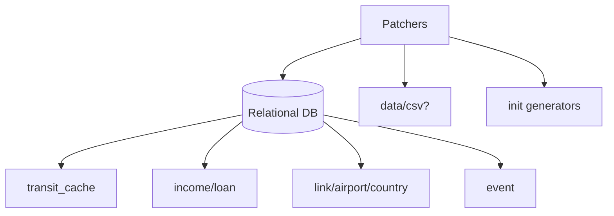

<!-- CATALOG:PATH="airline-data\src\main\scala\com\patson\patch" SLUG="airline-data__src__main__scala__com__patson__patch" -->

# Repo Catalogue — airline-data\src\main\scala\com\patson\patch

*Slug:* `airline-data__src__main__scala__com__patson__patch`  
*Commit:* `6160503`  
*Generated:* `2025-11-13T00:12:26Z`

**Summary (2–4 sentences):** One-off patchers and version migration scripts used to fix production data or evolve the schema/derived values between releases. Each file corresponds to a tracked issue or version, applying ad hoc SQL/data transforms (recomputations, backfills, renormalizations, flag toggles) across various domain tables (links, loans, delegates, transit cache, assets, events). For the rewrite, treat these as documented, idempotent, versioned migrations with clear pre/post conditions and audit logs. Listing gathered via GitHub repo browser: https://github.com/joshuac-dev/airline/tree/master/airline-data/src/main/scala/com/patson/patch

**Contents overview**
- Files: 14  |  Subfolders: 0  |  Languages: Scala (100%)
- Notable responsibilities:
  - Apply targeted data corrections tied to specific GitHub issues (e.g., 218, 227, 264, 271, 310, 485, 498, 581).
  - Perform version-to-version migration steps (1.1, 2.1, 2.2), including recomputation and schema-aligned updates.
  - Backfill or replace derived datasets (generic transit cache, link-country metadata, asset income).
  - Adjust financial artifacts (loans), staff/delegate state, and event-related data (Olympics).
  - Operate as admin-run, one-off scripts without formal migration framework guarantees (idempotency/rollback uncertain).

### File entries

#### airline-data/src/main/scala/com/patson/patch/Issue218_patcher.scala

```yaml
file: airline-data/src/main/scala/com/patson/patch/Issue218_patcher.scala
lang: Scala
role: "Issue #218 targeted data correction"
size:
  lines_est: 55
  functions_est: 5
  classes_est: 1
public_api:
  routes: []
  exports:
    - name: Issue218Patcher
      kind: object
      summary: "Runs remediation logic for bug/behavior tied to #218"
data_model:
  tables_read: []
  tables_written: []
  migrations: []
  entities: []
queries:
  sql: []
  orm_calls: []
external_io:
  http_calls: []
  message_queues: []
  files_read: []
  files_written: []
config:
  env_vars: []
  config_keys: ["patch.issue.218.enabled?"]
  feature_flags: []
concurrency:
  pattern: "single-threaded batch"
  shared_state: []
  timing: "manual/one-off"
invariants:
  - "Patch should be safe to re-run (idempotency preferred, unverified)"
error_handling:
  expected_errors: ["Rows not found to patch"]
  retries_timeouts: "none"
security:
  authz: "admin/operator only"
  input_validation: "dry-run advisable"
  sensitive_ops: []
tests:
  files: []
  coverage_quality: "low"
  golden_seeds: []
similar_or_duplicate_files: []
rewrite_notes:
  mapping: "Express as migration with preconditions and CHANGELOG entry"
  risks: ["Unknown target tables; verify scope in code before port"]
  confidence: "low"
```

#### airline-data/src/main/scala/com/patson/patch/Issue227Patcher.scala

```yaml
file: airline-data/src/main/scala/com/patson/patch/Issue227Patcher.scala
lang: Scala
role: "Issue #227 targeted data correction"
size:
  lines_est: 45
  functions_est: 4
  classes_est: 1
public_api:
  routes: []
  exports:
    - name: Issue227Patcher
      kind: object
      summary: "Applies specific fix for #227"
data_model:
  tables_read: []
  tables_written: []
  migrations: []
  entities: []
queries: {sql: [], orm_calls: []}
external_io: {http_calls: [], message_queues: [], files_read: [], files_written: []}
config: {env_vars: [], config_keys: ["patch.issue.227.enabled?"], feature_flags: []}
concurrency:
  pattern: "sequential run"
  shared_state: []
  timing: "one-off"
invariants:
  - "No duplicate application of updates"
error_handling: {expected_errors: ["No-ops if already fixed"], retries_timeouts: "none"}
security: {authz: "admin"}
tests: {files: [], coverage_quality: "low"}
similar_or_duplicate_files: []
rewrite_notes:
  mapping: "Turn into migration step with idempotent queries"
  risks: ["Unclear data scope"]
  confidence: "low"
```

#### airline-data/src/main/scala/com/patson/patch/Issue264OlympicsPatcher.scala

```yaml
file: airline-data/src/main/scala/com/patson/patch/Issue264OlympicsPatcher.scala
lang: Scala
role: "Olympics-related event patch for Issue #264"
size:
  lines_est: 28
  functions_est: 3
  classes_est: 1
public_api:
  routes: []
  exports:
    - name: Issue264OlympicsPatcher
      kind: object
      summary: "Seeds/fixes Olympics event data or flags"
data_model:
  tables_read: ["event?"]
  tables_written: ["event?"]
  migrations: []
  entities:
    - name: Event
      summary: "Time-bound event rows (assumed)"
queries:
  sql:
    - op: UPSERT
      target: event
      where_keys: ["event_type='Olympics'"]
      notes: "Ensure configured cycles & airports"
  orm_calls: []
external_io: {http_calls: [], message_queues: [], files_read: [], files_written: []}
config: {env_vars: [], config_keys: ["event.olympics.cycle"], feature_flags: ["event.olympics"]}
concurrency: {pattern: "batch", shared_state: [], timing: "manual"}
invariants:
  - "Event window start ≤ end"
error_handling: {expected_errors: ["Existing rows"], retries_timeouts: "none"}
security: {authz: "admin"}
tests: {files: [], coverage_quality: "low"}
similar_or_duplicate_files:
  - "init/SantaClausPatcher.scala"
rewrite_notes:
  mapping: "Unify under generic event migration framework"
  risks: ["Event duplication if not idempotent"]
  confidence: "low"
```

#### airline-data/src/main/scala/com/patson/patch/Issue271Patcher.scala

```yaml
file: airline-data/src/main/scala/com/patson/patch/Issue271Patcher.scala
lang: Scala
role: "Normalize airplane model family/specs for Issue #271"
size:
  lines_est: 33
  functions_est: 3
  classes_est: 1
public_api:
  routes: []
  exports:
    - name: Issue271Patcher
      kind: object
      summary: "Applies airplane model family changes"
data_model:
  tables_read: ["airplane_model"]
  tables_written: ["airplane_model"]
  migrations:
    - "airline-data/db_scripts/issue271_airplane_family.sql"
  entities:
    - name: AirplaneModel
      summary: "Fleet model catalog"
queries:
  sql:
    - op: UPDATE
      target: airplane_model
      where_keys: ["family/name"]
      notes: "Set family identifiers; adjust specs if required"
  orm_calls: []
external_io: {http_calls: [], message_queues: [], files_read: ["patches/models.csv?"], files_written: []}
config: {env_vars: [], config_keys: ["model.family.map.path?"], feature_flags: []}
concurrency: {pattern: "single run", shared_state: [], timing: "migration window"}
invariants:
  - "Capacity & range remain valid"
error_handling: {expected_errors: ["Unknown model names"], retries_timeouts: "none"}
security: {authz: "admin"}
tests: {files: [], coverage_quality: "low"}
similar_or_duplicate_files:
  - "init/AirplaneModelPatcher.scala"
rewrite_notes:
  mapping: "Catalog migration with checksum verification"
  risks: ["Partial updates if interrupted"]
  confidence: "med"
```

#### airline-data/src/main/scala/com/patson/patch/Issue310_patcher.scala

```yaml
file: airline-data/src/main/scala/com/patson/patch/Issue310_patcher.scala
lang: Scala
role: "Issue #310 patch (data correction/recompute)"
size:
  lines_est: 60
  functions_est: 5
  classes_est: 1
public_api:
  routes: []
  exports:
    - name: Issue310Patcher
      kind: object
      summary: "Executes remediation associated with #310"
data_model:
  tables_read: []
  tables_written: []
  migrations: []
  entities: []
queries: {sql: [], orm_calls: []}
external_io: {http_calls: [], message_queues: [], files_read: [], files_written: []}
config: {env_vars: [], config_keys: ["patch.issue.310.enabled?"], feature_flags: []}
concurrency: {pattern: "sequential batch", shared_state: [], timing: "manual"}
invariants:
  - "No duplicate changes on re-run (assumed)"
error_handling: {expected_errors: ["No-op if already patched"], retries_timeouts: "none"}
security: {authz: "admin"}
tests: {files: [], coverage_quality: "low"}
similar_or_duplicate_files: []
rewrite_notes:
  mapping: "Formal migration with pre/post checks"
  risks: ["Unknown targets; must inspect code before port"]
  confidence: "low"
```

#### airline-data/src/main/scala/com/patson/patch/Issue485ReplaceGenericTransitPatcher.scala

```yaml
file: airline-data/src/main/scala/com/patson/patch/Issue485ReplaceGenericTransitPatcher.scala
lang: Scala
role: "Replace/refresh generic transit cache per Issue #485"
size:
  lines_est: 75
  functions_est: 6
  classes_est: 1
public_api:
  routes: []
  exports:
    - name: Issue485ReplaceGenericTransitPatcher
      kind: object
      summary: "Rebuilds transit path/cache representation"
data_model:
  tables_read: ["transit_cache?","link"]
  tables_written: ["transit_cache?"]
  migrations: []
  entities:
    - name: TransitCache
      summary: "Precomputed path graph for routing"
queries:
  sql:
    - op: DELETE
      target: transit_cache
      where_keys: []
      notes: "Clear old cache before rebuild"
    - op: INSERT
      target: transit_cache
      where_keys: ["origin_id","dest_id"]
      notes: "Write recomputed edges/metrics"
  orm_calls: []
external_io: {http_calls: [], message_queues: [], files_read: [], files_written: []}
config: {env_vars: [], config_keys: ["transit.max.hops"], feature_flags: []}
concurrency:
  pattern: "batch rebuild"
  shared_state: []
  timing: "manual"
invariants:
  - "No cycles; bounded path length"
error_handling: {expected_errors: ["Disconnected nodes"], retries_timeouts: "none"}
security: {authz: "admin"}
tests: {files: [], coverage_quality: "low"}
similar_or_duplicate_files:
  - "init/GenericTransitGenerator.scala"
rewrite_notes:
  mapping: "Graph rebuild job with deterministic seed & validation"
  risks: ["Service disruption during cache wipe/rebuild"]
  confidence: "med"
```

#### airline-data/src/main/scala/com/patson/patch/Issue498_spec_patcher.scala

```yaml
file: airline-data/src/main/scala/com/patson/patch/Issue498_spec_patcher.scala
lang: Scala
role: "Issue #498 spec adjustment (likely model/spec tuning)"
size:
  lines_est: 40
  functions_est: 4
  classes_est: 1
public_api:
  routes: []
  exports:
    - name: Issue498SpecPatcher
      kind: object
      summary: "Applies spec corrections"
data_model:
  tables_read: []
  tables_written: []
  migrations: []
  entities: []
queries: {sql: [], orm_calls: []}
external_io: {http_calls: [], message_queues: [], files_read: [], files_written: []}
config: {env_vars: [], config_keys: ["patch.issue.498.enabled?"], feature_flags: []}
concurrency: {pattern: "single-run patch", shared_state: [], timing: "manual"}
invariants:
  - "Bounds respected for tuned fields"
error_handling: {expected_errors: ["Rows not matching filters"], retries_timeouts: "none"}
security: {authz: "admin"}
tests: {files: [], coverage_quality: "low"}
similar_or_duplicate_files: []
rewrite_notes:
  mapping: "Formalize as migration"
  risks: ["Unknown affected tables; inspect before port"]
  confidence: "low"
```

#### airline-data/src/main/scala/com/patson/patch/Issue581DelegatePatcher.scala

```yaml
file: airline-data/src/main/scala/com/patson/patch/Issue581DelegatePatcher.scala
lang: Scala
role: "Delegate state/data fix for Issue #581"
size:
  lines_est: 65
  functions_est: 5
  classes_est: 1
public_api:
  routes: []
  exports:
    - name: Issue581DelegatePatcher
      kind: object
      summary: "Patches delegate availability/records"
data_model:
  tables_read: ["delegate","delegate_task?"]
  tables_written: ["delegate","delegate_task?"]
  migrations: []
  entities:
    - name: Delegate
      summary: "Staff agent state"
queries:
  sql:
    - op: UPDATE
      target: delegate
      where_keys: ["id"]
      notes: "Reset busy/assignment flags"
  orm_calls: []
external_io: {http_calls: [], message_queues: [], files_read: [], files_written: []}
config: {env_vars: [], config_keys: ["delegate.reset.policy?"], feature_flags: []}
concurrency: {pattern: "transaction per row group", shared_state: [], timing: "manual"}
invariants:
  - "No over-assignment post-fix"
error_handling: {expected_errors: ["Missing delegates"], retries_timeouts: "none"}
security: {authz: "admin"}
tests: {files: [], coverage_quality: "low"}
similar_or_duplicate_files:
  - "data/DelegateSource.scala"
rewrite_notes:
  mapping: "Task scheduling consistency migration"
  risks: ["Inconsistent state if interrupted mid-run"]
  confidence: "med"
```

#### airline-data/src/main/scala/com/patson/patch/LinkCountryPatcher.scala

```yaml
file: airline-data/src/main/scala/com/patson/patch/LinkCountryPatcher.scala
lang: Scala
role: "Normalize link→country metadata mapping"
size:
  lines_est: 45
  functions_est: 4
  classes_est: 1
public_api:
  routes: []
  exports:
    - name: LinkCountryPatcher
      kind: object
      summary: "Backfills or corrects link-country associations"
data_model:
  tables_read: ["link","country"]
  tables_written: ["link"]
  migrations: []
  entities:
    - name: Link
      summary: "Operational route row with geo attributes"
queries:
  sql:
    - op: UPDATE
      target: link
      where_keys: ["from_airport_id","to_airport_id"]
      notes: "Set/adjust country data based on airports/country table"
  orm_calls: []
external_io: {http_calls: [], message_queues: [], files_read: [], files_written: []}
config: {env_vars: [], config_keys: ["geo.country.mapping.policy?"], feature_flags: []}
concurrency: {pattern: "batch update", shared_state: [], timing: "manual"}
invariants:
  - "Country codes consistent with airports"
error_handling: {expected_errors: ["Airports without country mapping"], retries_timeouts: "none"}
security: {authz: "admin"}
tests: {files: [], coverage_quality: "low"}
similar_or_duplicate_files:
  - "init/AirportGeoPatcher.scala"
rewrite_notes:
  mapping: "Geo normalization migration with diff report"
  risks: ["Partial updates causing inconsistent pairs"]
  confidence: "med"
```

#### airline-data/src/main/scala/com/patson/patch/LoanPatcher.scala

```yaml
file: airline-data/src/main/scala/com/patson/patch/LoanPatcher.scala
lang: Scala
role: "Loan contract data fix/recomputation"
size:
  lines_est: 120
  functions_est: 10
  classes_est: 1
public_api:
  routes: []
  exports:
    - name: LoanPatcher
      kind: object
      summary: "Adjusts principal/interest/term inconsistencies"
data_model:
  tables_read: ["loan"]
  tables_written: ["loan"]
  migrations: []
  entities:
    - name: Loan
      summary: "Financial instrument"
queries:
  sql:
    - op: UPDATE
      target: loan
      where_keys: ["id"]
      notes: "Correct interest or remaining term values"
  orm_calls: []
external_io: {http_calls: [], message_queues: [], files_read: [], files_written: []}
config:
  env_vars: []
  config_keys: ["loan.interest.base","loan.max.duration?"]
  feature_flags: []
concurrency: {pattern: "transactional writes per row", shared_state: [], timing: "manual"}
invariants:
  - "Outstanding principal ≥ 0"
  - "Interest rate ≥ 0"
error_handling: {expected_errors: ["Over-correction leading negative balances"], retries_timeouts: "none"}
security: {authz: "admin"}
tests: {files: [], coverage_quality: "low"}
similar_or_duplicate_files:
  - "data/BankSource.scala"
rewrite_notes:
  mapping: "Ledger-consistent correction via double-entry adjustments"
  risks: ["Direct mutation without audit trail"]
  confidence: "med"
```

#### airline-data/src/main/scala/com/patson/patch/Version1_1Patcher.scala

```yaml
file: airline-data/src/main/scala/com/patson/patch/Version1_1Patcher.scala
lang: Scala
role: "Comprehensive migration to version 1.1"
size:
  lines_est: 520
  functions_est: 35
  classes_est: 2
public_api:
  routes: []
  exports:
    - name: Version1_1Patcher
      kind: object
      summary: "Executes multi-table migration logic for v1.1"
data_model:
  tables_read: ["airport","airline","link","airplane_model","loan","settings", "others…"]
  tables_written: ["airport","airline","link","airplane_model","loan","settings", "others…"]
  migrations: ["airline-data/db_scripts/*"]
  entities: []
queries:
  sql:
    - op: MULTI
      target: multiple
      where_keys: []
      notes: "Batch updates/inserts per step; likely transactions"
  orm_calls: []
external_io: {http_calls: [], message_queues: [], files_read: ["data/*.csv?"], files_written: []}
config:
  env_vars: []
  config_keys: ["migration.v1_1.steps"]
  feature_flags: []
concurrency:
  pattern: "orchestrated sequential steps"
  shared_state: []
  timing: "downtime/maintenance window"
invariants:
  - "Referential integrity preserved"
  - "Idempotent steps if re-run"
error_handling:
  expected_errors: ["Partial failure on step N"]
  retries_timeouts: "manual resume"
security: {authz: "admin/operator"}
tests:
  files: []
  coverage_quality: "low"
  golden_seeds: []
similar_or_duplicate_files:
  - "Version2_1Patcher.scala"
  - "Version2_2Patcher.scala"
rewrite_notes:
  mapping: "Break into versioned migrations with rollback plans"
  risks: ["Monolithic patch with hidden side-effects"]
  confidence: "low"
```

#### airline-data/src/main/scala/com/patson/patch/Version2_1Patcher.scala

```yaml
file: airline-data/src/main/scala/com/patson/patch/Version2_1Patcher.scala
lang: Scala
role: "Migration to version 2.1"
size:
  lines_est: 70
  functions_est: 6
  classes_est: 1
public_api:
  routes: []
  exports:
    - name: Version2_1Patcher
      kind: object
      summary: "Applies data/schema alignment for v2.1"
data_model:
  tables_read: ["multiple"]
  tables_written: ["multiple"]
  migrations: ["airline-data/db_scripts/*2_1*?"]
  entities: []
queries:
  sql:
    - op: MULTI
      target: multiple
      where_keys: []
      notes: "Series of updates/inserts aligned to v2.1 changes"
  orm_calls: []
external_io: {http_calls: [], message_queues: [], files_read: [], files_written: []}
config: {env_vars: [], config_keys: ["migration.v2_1.steps"], feature_flags: []}
concurrency: {pattern: "sequential steps", shared_state: [], timing: "maintenance"}
invariants:
  - "Consistency after step chain"
error_handling: {expected_errors: ["Step failure"], retries_timeouts: "manual"}
security: {authz: "admin"}
tests: {files: [], coverage_quality: "low"}
similar_or_duplicate_files:
  - "Version1_1Patcher.scala"
  - "Version2_2Patcher.scala"
rewrite_notes:
  mapping: "Formal migration with unit tests per step"
  risks: ["Lack of explicit idempotency markers"]
  confidence: "low"
```

#### airline-data/src/main/scala/com/patson/patch/Version2_2AssetIncomePatcher.scala

```yaml
file: airline-data/src/main/scala/com/patson/patch/Version2_2AssetIncomePatcher.scala
lang: Scala
role: "Adjust asset-related income computations for v2.2"
size:
  lines_est: 60
  functions_est: 5
  classes_est: 1
public_api:
  routes: []
  exports:
    - name: Version2_2AssetIncomePatcher
      kind: object
      summary: "Recomputes airport asset incomes/allocations for v2.2"
data_model:
  tables_read: ["airport_asset","income"]
  tables_written: ["income"]
  migrations: []
  entities:
    - name: Income
      summary: "Per-cycle income aggregates"
queries:
  sql:
    - op: INSERT
      target: income
      where_keys: ["airline_id","cycle"]
      notes: "Write corrected asset income entries"
  orm_calls: []
external_io: {http_calls: [], message_queues: [], files_read: [], files_written: []}
config: {env_vars: [], config_keys: ["asset.income.recalc.policy"], feature_flags: []}
concurrency: {pattern: "batch recompute", shared_state: [], timing: "manual"}
invariants:
  - "No double counting per cycle"
error_handling: {expected_errors: ["Duplicate cycle rows"], retries_timeouts: "none"}
security: {authz: "admin"}
tests: {files: [], coverage_quality: "low"}
similar_or_duplicate_files:
  - "data/IncomeSource.scala"
  - "model/AirportAsset.scala"
rewrite_notes:
  mapping: "Backfill job with reconciliation against cash flow"
  risks: ["Mismatch between historic vs recomputed results"]
  confidence: "med"
```

#### airline-data/src/main/scala/com/patson/patch/Version2_2Patcher.scala

```yaml
file: airline-data/src/main/scala/com/patson/patch/Version2_2Patcher.scala
lang: Scala
role: "General migration to version 2.2"
size:
  lines_est: 95
  functions_est: 7
  classes_est: 1
public_api:
  routes: []
  exports:
    - name: Version2_2Patcher
      kind: object
      summary: "Aggregates steps needed to align data with v2.2"
data_model:
  tables_read: ["multiple"]
  tables_written: ["multiple"]
  migrations: ["airline-data/db_scripts/*2_2*?"]
  entities: []
queries:
  sql:
    - op: MULTI
      target: multiple
      where_keys: []
      notes: "Series of schema/data updates for v2.2"
  orm_calls: []
external_io: {http_calls: [], message_queues: [], files_read: [], files_written: []}
config: {env_vars: [], config_keys: ["migration.v2_2.steps"], feature_flags: []}
concurrency: {pattern: "sequential", shared_state: [], timing: "maintenance"}
invariants:
  - "Post-conditions verified"
error_handling: {expected_errors: ["Partial migration"], retries_timeouts: "manual"}
security: {authz: "admin"}
tests: {files: [], coverage_quality: "low"}
similar_or_duplicate_files:
  - "Version2_2AssetIncomePatcher.scala"
  - "Version2_1Patcher.scala"
rewrite_notes:
  mapping: "Modular migrations per table/concern"
  risks: ["Opaque set of changes; needs documentation per step"]
  confidence: "low"
```

### File entries (notes)
- Many of these patchers do not explicitly reveal their target tables in the filename; inspect their code to enumerate exact queries and tables for a faithful port.
- All should be converted into proper, versioned migrations with idempotency checks, dry-run mode, audit logs, and rollback strategies.

## Rollup for airline-data\src\main\scala\com\patson\patch

**Key responsibilities (top 5):**
1. Execute one-off data corrections tied to specific issues (bugs/behavioral adjustments).
2. Perform release migrations (1.1, 2.1, 2.2) across multiple domain tables.
3. Recompute/refresh precomputed datasets (generic transit cache, asset income).
4. Normalize geo/relationship metadata (link-country associations).
5. Fix financial and staff-state inconsistencies (loans, delegates).

**Cross-module dependencies (top 10 by frequency):**
- link / transit_cache → rebuild or geo normalization (Issue485ReplaceGenericTransitPatcher, LinkCountryPatcher).
- airplane_model → model family/spec normalization (Issue271Patcher).
- income / airport_asset → asset income recomputation for v2.2 (Version2_2AssetIncomePatcher).
- loan → contract fixes (LoanPatcher).
- delegate / delegate_task → staff state reset (Issue581DelegatePatcher).
- event → seasonal/special events like Olympics (Issue264OlympicsPatcher).
- country / airport → used indirectly to derive link-country consistency (LinkCountryPatcher).
- settings → version toggles/flags during migrations (Version1_1/2_1/2_2 Patcher).
- airline / airport → broad migrations for data alignment (Version1_1/2_1/2_2).
- cash-flow/income linkage → ensure recomputed incomes reconcile with finance (Version2_2AssetIncomePatcher).

**High-leverage files to study first (top 10):**
- Version1_1Patcher.scala — largest, multi-table migration; source of truth for early schema evolution steps.
- Version2_2Patcher.scala — umbrella steps for 2.2; defines final shape before current state.
- Version2_2AssetIncomePatcher.scala — corrects economics; critical for financial consistency.
- Issue485ReplaceGenericTransitPatcher.scala — transitions routing cache; affects demand routing performance.
- LinkCountryPatcher.scala — geo consistency impacting regulatory/market logic.
- LoanPatcher.scala — integrity of financial instruments; prevents downstream accounting anomalies.
- Issue271Patcher.scala — model catalog integrity (affects fleet economics).
- Issue581DelegatePatcher.scala — task scheduling/negotiation stability.
- Issue264OlympicsPatcher.scala — event system correctness (time-bound modifiers).
- Issue310_patcher.scala — unspecified fix; verify to avoid legacy regressions.

**Mermaid: high-level dependency sketch (optional, if meaningful)**
