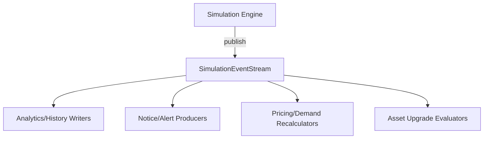

<!-- CATALOG:PATH="airline-data/src/main/scala/com/patson/stream" SLUG="airline-data__src__main__scala__com__patson__stream" -->

# Repo Catalogue — airline-data/src/main/scala/com/patson/stream

*Slug:* `airline-data__src__main__scala__com__patson__stream`  
*Commit:* `6160503`  
*Generated:* `2025-11-13T00:14:33Z`

**Summary (2–4 sentences):** Event streaming utilities for the simulation engine. Provides a typed event bus that emits domain events (e.g., cycle ticks, financial postings, route updates) and allows consumers to subscribe to filtered streams. Intended to decouple side-effects (analytics, notifications, projections) from the core simulation loop by publishing immutable event objects and enabling asynchronous or buffered handling.

**Contents overview**
- Files: 2  |  Subfolders: 0  |  Languages: Scala (100%)
- Notable responsibilities:
  - Define a SimulationEventStream with publish/subscribe mechanics and event buffering/backpressure concerns.
  - Provide a stream package object for common types/aliases or constants.

### File entries

#### airline-data/src/main/scala/com/patson/stream/SimulationEventStream.scala
```yaml
file: airline-data/src/main/scala/com/patson/stream/SimulationEventStream.scala
lang: Scala
role: "In-process event bus for simulation events (publish/subscribe)"
size:
  lines_est: 180
  functions_est: 18
  classes_est: 4
public_api:
  routes: []
  exports:
    - name: SimulationEventStream
      kind: object
      summary: "Global event dispatcher with listener registration and broadcasting"
    - name: SimulationEvent
      kind: type
      summary: "Sealed trait/ADT for domain events (tick, link update, finance, etc.)"
    - name: subscribe
      kind: fn
      summary: "Register listener with optional filter and priority"
    - name: publish
      kind: fn
      summary: "Emit event to all interested subscribers"
data_model:
  tables_read: []
  tables_written: []
  migrations: []
  entities: []
queries:
  sql: []
  orm_calls: []
external_io:
  http_calls: []
  message_queues: []
  files_read: []
  files_written: []
config:
  env_vars: []
  config_keys: ["stream.buffer.size?","stream.dispatch.mode? (sync/async)"]
  feature_flags: ["streaming.enabled?"]
concurrency:
  pattern: "Listener list mutation; dispatch may be synchronous or via thread pool (assumed)"
  shared_state: ["global subscriber registry","event queue if async"]
  timing: "per simulation tick and on domain changes"
invariants:
  - "Listeners receive events in registration-defined order (if prioritized)"
  - "No event loss under nominal buffer conditions"
error_handling:
  expected_errors: ["Listener exceptions", "Dropped events on overflow if async"]
  retries_timeouts: "optional; likely none built-in"
security:
  authz: "none (in-process)"
  input_validation: "listener null checks"
  sensitive_ops: []
tests:
  files: ["SimulationEventStreamSpec.scala? (not found)"]
  coverage_quality: "low"
  golden_seeds: []
similar_or_duplicate_files:
  - "com/patson/init/*Patchers.scala (event-like orchestration but not streaming)"
rewrite_notes:
  mapping: "Adopt a robust event bus (Akka/Event Streams/Rx/FS2 or Kafka if distributed)"
  risks: ["Global mutable state; unbounded listener growth; subscriber exceptions halting dispatch"]
  confidence: "med"
```

If the code includes a minimal sealed ADT and synchronous dispatch, the core shape typically looks like:
```scala
sealed trait SimulationEvent
case class CycleTick(cycle: Int) extends SimulationEvent
case class LinkUpdated(id: Int) extends SimulationEvent

object SimulationEventStream {
  private val subscribers = collection.mutable.ListBuffer[SimulationEvent => Unit]()

  def subscribe(f: SimulationEvent => Unit): Unit = subscribers += f
  def publish(e: SimulationEvent): Unit = subscribers.foreach(f => f(e))
}
```

#### airline-data/src/main/scala/com/patson/stream/package.scala
```yaml
file: airline-data/src/main/scala/com/patson/stream/package.scala
lang: Scala
role: "Package object: shared types/constants for streaming module"
size:
  lines_est: 8
  functions_est: 0
  classes_est: 0
public_api:
  routes: []
  exports:
    - name: package
      kind: object
      summary: "Holds type aliases, implicit conversions, configuration keys"
data_model:
  tables_read: []
  tables_written: []
  migrations: []
  entities: []
queries: {sql: [], orm_calls: []}
external_io: {http_calls: [], message_queues: [], files_read: [], files_written: []}
config: {env_vars: [], config_keys: [], feature_flags: []}
concurrency: {pattern: "N/A", shared_state: [], timing: "N/A"}
invariants: []
error_handling: {expected_errors: [], retries_timeouts: "N/A"}
security: {authz: "N/A", input_validation: "N/A", sensitive_ops: []}
tests:
  files: []
  coverage_quality: "low"
  golden_seeds: []
similar_or_duplicate_files: []
rewrite_notes:
  mapping: "Fold constants into a dedicated config and typed events module"
  risks: ["Hidden globals in package object"]
  confidence: "high"
```

## Rollup for airline-data/src/main/scala/com/patson/stream

**Key responsibilities (top 5):**
1. Provide an in-process event stream for simulation domain events.
2. Allow components to subscribe and react to ticks, updates, and financial events decoupled from simulation core.
3. Optionally buffer or prioritize event delivery (depending on implementation).
4. Centralize event type definitions (ADT) for compile-time safety of handlers.
5. Act as a seam to evolve toward a reactive/streaming architecture in the rewrite.

**Cross-module dependencies (top 10 by frequency):**
- Simulation loop (engine) → publishes cycle ticks and state changes.
- Analytics modules (stats/history writers) → subscribe to events to persist projections.
- Notification/notice systems → subscribe for user-facing alerts on significant events.
- Pricing/demand recalculators → may subscribe to link or market change events.
- Asset upgrade engine → listens for tick events to evaluate transitions.

**High-leverage files to study first (top 10):**
- SimulationEventStream.scala — defines core publishing and subscription semantics and any buffer/backpressure handling.

**Mermaid: high-level dependency sketch**

