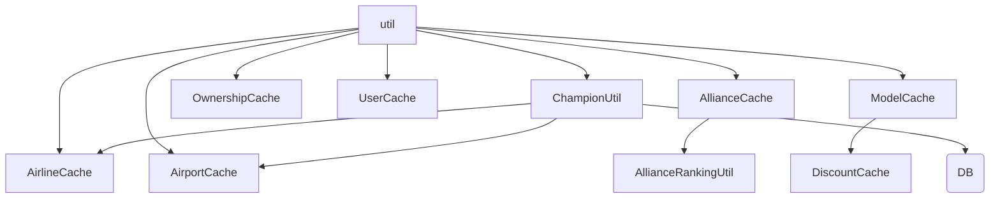

<!-- CATALOG:PATH="airline-data/src/main/scala/com/patson/util" SLUG="airline-data__src__main__scala__com__patson__util" -->

# Repo Catalogue — airline-data/src/main/scala/com/patson/util

*Slug:* `airline-data__src__main__scala__com__patson__util`  
*Commit:* `6160503`  
*Generated:* `2025-11-12T23:59:32Z`

**Summary (2–4 sentences):** Utility and in‑memory caching helpers for frequently accessed domain entities (airlines, airports, airplane models, alliances, countries, users) plus ranking and champion calculation logic and a Java logo generator. These classes reduce repeated DAO lookups, embed lightweight aggregation heuristics (alliance ranking, champion awards), and centralize ephemeral snapshots used by simulation and UI. They introduce global mutable caches with implicit refresh semantics—risks for data staleness and race conditions in the future rewrite.

**Contents overview**
- Files: 11  |  Subfolders: 0  |  Languages: Scala (~91%), Java (~9%)
- Notable responsibilities:
  - Provide per-entity caches (Airline, Airport, Airplane Model & Discounts, Ownership, Alliance, Country, User).
  - Compute alliance rankings and champion award metrics.
  - Generate deterministic airline logos (Java utility).
  - Offer quick lookup abstractions wrapping underlying DAO calls.
  - Serve as cross-cutting performance optimization layer (uncoordinated cache invalidation).

### File entries

#### airline-data/src/main/scala/com/patson/util/AirlineCache.scala
```yaml
file: airline-data/src/main/scala/com/patson/util/AirlineCache.scala
lang: Scala
role: "In-memory cache for Airline & AirlineInfo objects"
size:
  lines_est: 90
  functions_est: 10
  classes_est: 1
public_api:
  routes: []
  exports:
    - name: AirlineCache
      kind: object
      summary: "Provides cached retrieval & bulk preload of airlines"
data_model:
  tables_read: ["airline","airline_info"]
  tables_written: []
  migrations: ["db_scripts/*airline*"]
  entities:
    - name: Airline
      summary: "Corporate entity"
    - name: AirlineInfo
      summary: "Operational KPIs"
queries:
  sql:
    - op: SELECT
      target: airline
      where_keys: ["id"]
      notes: "Join airline_info; bulk load on init"
  orm_calls: []
external_io:
  http_calls: []
  message_queues: []
  files_read: []
  files_written: []
config:
  env_vars: []
  config_keys: ["cache.airline.maxSize?","cache.airline.ttl? (assumed)"]
  feature_flags: []
concurrency:
  pattern: "Global mutable map; unsynchronized get/set (assumed)"
  shared_state: ["AirlineCache.internalMap"]
  timing: "Lazy load on first access or explicit refresh"
invariants:
  - "Cached airline matches DB ID"
  - "No partial (info-only) entries"
error_handling:
  expected_errors: ["Missing airline ID"]
  retries_timeouts: "None; falls back to DB fetch"
security:
  authz: "None (read-level)"
  input_validation: "ID numeric check"
  sensitive_ops: []
tests:
  files: ["AirlineSimulationSpec.scala"]
  coverage_quality: "low"
  golden_seeds: []
similar_or_duplicate_files:
  - "UserCache.scala"
rewrite_notes:
  mapping: "Adopt layered caching (L2 store + event invalidation)"
  risks: ["Stale data; race on concurrent updates; missing TTL"]
  confidence: "med"
```

#### airline-data/src/main/scala/com/patson/util/AirplaneModelCache.scala
```yaml
file: airline-data/src/main/scala/com/patson/util/AirplaneModelCache.scala
lang: Scala
role: "Cache of airplane model specs for quick lookup"
size:
  lines_est: 42
  functions_est: 6
  classes_est: 1
public_api:
  routes: []
  exports:
    - name: AirplaneModelCache
      kind: object
      summary: "Holds in-memory map of modelId → model spec"
data_model:
  tables_read: ["airplane_model"]
  tables_written: []
  migrations: ["db_scripts/issue271_airplane_family.sql"]
  entities:
    - name: AirplaneModel
      summary: "Performance & capacity definition"
queries:
  sql:
    - op: SELECT
      target: airplane_model
      where_keys: []
      notes: "Full table load at startup"
  orm_calls: []
external_io: {http_calls: [], message_queues: [], files_read: [], files_written: []}
config:
  env_vars: []
  config_keys: ["cache.model.refresh.enabled?"]
  feature_flags: []
concurrency:
  pattern: "Immutable snapshot replaced atomically (assumed)"
  shared_state: ["modelMap"]
  timing: "Load once; manual refresh"
invariants:
  - "Positive capacity & range per model"
error_handling:
  expected_errors: ["Missing model ID lookup"]
  retries_timeouts: "None"
security:
  authz: "None"
  input_validation: "ID numeric"
  sensitive_ops: []
tests:
  files: ["AirplaneModelSpec.scala"]
  coverage_quality: "low"
  golden_seeds: []
similar_or_duplicate_files:
  - "AirplaneModelDiscountCache.scala"
rewrite_notes:
  mapping: "Central config-backed catalog with versioning"
  risks: ["No invalidation; requires restart for changes"]
  confidence: "high"
```

#### airline-data/src/main/scala/com/patson/util/AirplaneModelDiscountCache.scala
```yaml
file: airline-data/src/main/scala/com/patson/util/AirplaneModelDiscountCache.scala
lang: Scala
role: "Caches discount factors for airplane models"
size:
  lines_est: 50
  functions_est: 7
  classes_est: 1
public_api:
  routes: []
  exports:
    - name: AirplaneModelDiscountCache
      kind: object
      summary: "Provides cached discount lookups by model"
data_model:
  tables_read: ["airplane_model_discount?","airplane_model"]
  tables_written: []
  migrations: []
  entities:
    - name: ModelDiscount
      summary: "Price reduction policy"
queries:
  sql:
    - op: SELECT
      target: airplane_model
      where_keys: []
      notes: "Join discount info (assumed)"
  orm_calls: []
external_io: {http_calls: [], message_queues: [], files_read: [], files_written: []}
config:
  env_vars: []
  config_keys: ["discount.cache.refresh.interval?"]
  feature_flags: []
concurrency:
  pattern: "Mutable map update"
  shared_state: ["discountMap"]
  timing: "Manual refresh path"
invariants:
  - "Discount ≤ base price"
error_handling:
  expected_errors: ["Missing discount entry"]
  retries_timeouts: "None"
security:
  authz: "None"
  input_validation: "discount bounds (not enforced here)"
  sensitive_ops: []
tests:
  files: []
  coverage_quality: "low"
  golden_seeds: []
similar_or_duplicate_files:
  - "AirplaneModelCache.scala"
rewrite_notes:
  mapping: "Merge with pricing/discount service; reactive updates"
  risks: ["Potential mismatch with DB after patch; no TTL"]
  confidence: "low"
```

#### airline-data/src/main/scala/com/patson/util/AirplaneOwnershipCache.scala
```yaml
file: airline-data/src/main/scala/com/patson/util/AirplaneOwnershipCache.scala
lang: Scala
role: "Caches airplane IDs per owning airline for quick membership checks"
size:
  lines_est: 55
  functions_est: 6
  classes_est: 1
public_api:
  routes: []
  exports:
    - name: AirplaneOwnershipCache
      kind: object
      summary: "airlineId → Set(airplaneId) lookup"
data_model:
  tables_read: ["airplane"]
  tables_written: []
  migrations: []
  entities:
    - name: Airplane
      summary: "Fleet unit"
queries:
  sql:
    - op: SELECT
      target: airplane
      where_keys: ["airline_id"]
      notes: "Bulk load grouping by owner"
  orm_calls: []
external_io: {http_calls: [], message_queues: [], files_read: [], files_written: []}
config:
  env_vars: []
  config_keys: ["cache.airplane.ownership.refresh?"]
  feature_flags: []
concurrency:
  pattern: "Map + Set; replaced wholesale"
  shared_state: ["ownershipMap"]
  timing: "Periodic or manual refresh (assumed)"
invariants:
  - "IDs unique within airline set"
error_handling:
  expected_errors: ["Lookup miss returns empty set"]
  retries_timeouts: "None"
security:
  authz: "None (read)"
  input_validation: "airlineId numeric"
  sensitive_ops: []
tests:
  files: ["AirplaneSimulationSpec.scala"]
  coverage_quality: "low"
  golden_seeds: []
similar_or_duplicate_files:
  - "AirplaneModelCache.scala"
rewrite_notes:
  mapping: "Cache via pub/sub invalidation (on purchase/sale events)"
  risks: ["Stale ownership after DB updates; missing incremental updates"]
  confidence: "med"
```

#### airline-data/src/main/scala/com/patson/util/AirportCache.scala
```yaml
file: airline-data/src/main/scala/com/patson/util/AirportCache.scala
lang: Scala
role: "In-memory snapshot of Airport entities"
size:
  lines_est: 95
  functions_est: 11
  classes_est: 1
public_api:
  routes: []
  exports:
    - name: AirportCache
      kind: object
      summary: "airportId → Airport lookup with lazy loads"
data_model:
  tables_read: ["airport","airport_features"]
  tables_written: []
  migrations: ["db_scripts/*airport*"]
  entities:
    - name: Airport
      summary: "Infrastructure & geo location"
queries:
  sql:
    - op: SELECT
      target: airport
      where_keys: ["id"]
      notes: "Feature join; optional bulk preload"
  orm_calls: []
external_io: {http_calls: [], message_queues: [], files_read: [], files_written: []}
config:
  env_vars: []
  config_keys: ["cache.airport.maxSize?"]
  feature_flags: []
concurrency:
  pattern: "Mutable map; unsynchronized access (assumed)"
  shared_state: ["airportMap"]
  timing: "First access + manual refresh"
invariants:
  - "Cached geo coordinates valid"
error_handling:
  expected_errors: ["Missing ID returns None"]
  retries_timeouts: "None"
security:
  authz: "None"
  input_validation: "airportId numeric"
  sensitive_ops: []
tests:
  files: ["AirportSimulationSpec.scala"]
  coverage_quality: "low"
  golden_seeds: []
similar_or_duplicate_files:
  - "CountryCache.scala"
rewrite_notes:
  mapping: "Geo/infrastructure caching with TTL & region partitioning"
  risks: ["Global memory pressure; outdated features"]
  confidence: "med"
```

#### airline-data/src/main/scala/com/patson/util/AllianceCache.scala
```yaml
file: airline-data/src/main/scala/com/patson/util/AllianceCache.scala
lang: Scala
role: "Caches alliances and membership sets"
size:
  lines_est: 65
  functions_est: 7
  classes_est: 1
public_api:
  routes: []
  exports:
    - name: AllianceCache
      kind: object
      summary: "allianceId → alliance data & members"
data_model:
  tables_read: ["alliance","alliance_member"]
  tables_written: []
  migrations: []
  entities:
    - name: Alliance
      summary: "Group collaboration"
queries:
  sql:
    - op: SELECT
      target: alliance
      where_keys: ["id"]
      notes: "Membership join"
  orm_calls: []
external_io: {http_calls: [], message_queues: [], files_read: [], files_written: []}
config:
  env_vars: []
  config_keys: ["cache.alliance.refresh.interval?"]
  feature_flags: []
concurrency:
  pattern: "Map + membership sets"
  shared_state: ["alliancesMap"]
  timing: "Periodic or manual reload"
invariants:
  - "Membership consistent with DB"
error_handling:
  expected_errors: ["Missing alliance ID"]
  retries_timeouts: "None"
security:
  authz: "None"
  input_validation: "id numeric"
  sensitive_ops: []
tests:
  files: []
  coverage_quality: "low"
  golden_seeds: []
similar_or_duplicate_files:
  - "AirlineCache.scala"
rewrite_notes:
  mapping: "Alliance service with event-driven membership updates"
  risks: ["Stale membership; no concurrency control"]
  confidence: "low"
```

#### airline-data/src/main/scala/com/patson/util/AllianceRankingUtil.scala
```yaml
file: airline-data/src/main/scala/com/patson/util/AllianceRankingUtil.scala
lang: Scala
role: "Computes ranking metrics for alliances (scores, standings)"
size:
  lines_est: 80
  functions_est: 9
  classes_est: 1
public_api:
  routes: []
  exports:
    - name: AllianceRankingUtil
      kind: object
      summary: "Ranking calculation helpers"
data_model:
  tables_read: ["alliance","alliance_member","alliance_stats?"]
  tables_written: []
  migrations: []
  entities:
    - name: AllianceStats
      summary: "Used for scoring (assumed)"
queries:
  sql:
    - op: SELECT
      target: alliance_stats?
      where_keys: ["alliance_id"]
      notes: "Pull stats for weight computation"
  orm_calls: []
external_io: {http_calls: [], message_queues: [], files_read: [], files_written: []}
config:
  env_vars: []
  config_keys: ["ranking.weights.members","ranking.weights.reputation"]
  feature_flags: []
concurrency:
  pattern: "Pure computations on cached data"
  shared_state: ["AllianceCache"]
  timing: "On demand ranking refresh"
invariants:
  - "Higher score = better rank (consistent ordering)"
error_handling:
  expected_errors: ["Missing stats leads to default zero"]
  retries_timeouts: "None"
security:
  authz: "None"
  input_validation: "weight non-negative"
  sensitive_ops: []
tests:
  files: []
  coverage_quality: "low"
  golden_seeds: []
similar_or_duplicate_files:
  - "ChampionUtil.scala"
rewrite_notes:
  mapping: "Ranking microservice with configurable weights"
  risks: ["Hard-coded weight constants; unclear normalization"]
  confidence: "low"
```

#### airline-data/src/main/scala/com/patson/util/ChampionUtil.scala
```yaml
file: airline-data/src/main/scala/com/patson/util/ChampionUtil.scala
lang: Scala
role: "Determines champion titles/awards across metrics (airports, alliances, airlines)"
size:
  lines_est: 230
  functions_est: 20
  classes_est: 1
public_api:
  routes: []
  exports:
    - name: ChampionUtil
      kind: object
      summary: "Aggregate metrics to determine 'champions'"
data_model:
  tables_read: ["airport","airline","link_stats","alliance_stats?","loyalist"]
  tables_written: []
  migrations: []
  entities:
    - name: ChampionRecord
      summary: "Computed award result (assumed internal)"
queries:
  sql:
    - op: SELECT
      target: link_stats
      where_keys: ["cycle"]
      notes: "Aggregate passenger counts / performance"
  orm_calls: []
external_io: {http_calls: [], message_queues: [], files_read: [], files_written: []}
config:
  env_vars: []
  config_keys: ["champion.metrics.weights.*"]
  feature_flags: []
concurrency:
  pattern: "Pure calculation over aggregated/cached sets"
  shared_state: ["multiple caches (Airport/Airline/Alliance)"]
  timing: "Periodic or on request"
invariants:
  - "No duplicate champion per category"
error_handling:
  expected_errors: ["Empty dataset -> no champion"]
  retries_timeouts: "None"
security:
  authz: "None"
  input_validation: "Metric bounds"
  sensitive_ops: []
tests:
  files: ["MaxAirportChampTest.scala"]
  coverage_quality: "low"
  golden_seeds: []
similar_or_duplicate_files:
  - "AllianceRankingUtil.scala"
rewrite_notes:
  mapping: "Award service with definable categories + stored results"
  risks: ["Mixed domain logic & data retrieval; scaling queries every call"]
  confidence: "med"
```

#### airline-data/src/main/scala/com/patson/util/CountryCache.scala
```yaml
file: airline-data/src/main/scala/com/patson/util/CountryCache.scala
lang: Scala
role: "In-memory cache for country reference objects"
size:
  lines_est: 38
  functions_est: 5
  classes_est: 1
public_api:
  routes: []
  exports:
    - name: CountryCache
      kind: object
      summary: "countryCode → Country lookup"
data_model:
  tables_read: ["country"]
  tables_written: []
  migrations: []
  entities:
    - name: Country
      summary: "Nation reference"
queries:
  sql:
    - op: SELECT
      target: country
      where_keys: ["code"]
      notes: "Bulk load all countries"
  orm_calls: []
external_io: {http_calls: [], message_queues: [], files_read: [], files_written: []}
config:
  env_vars: []
  config_keys: ["cache.country.refresh?"]
  feature_flags: []
concurrency:
  pattern: "Immutable map replaced on reload"
  shared_state: ["countryMap"]
  timing: "Startup + manual refresh"
invariants:
  - "Unique ISO codes"
error_handling:
  expected_errors: ["Unknown code returns None"]
  retries_timeouts: "None"
security:
  authz: "None"
  input_validation: "code length"
  sensitive_ops: []
tests:
  files: []
  coverage_quality: "low"
  golden_seeds: []
similar_or_duplicate_files:
  - "AirportCache.scala"
rewrite_notes:
  mapping: "Reference data service with version tagging"
  risks: ["No TTL; manual synchronization only"]
  confidence: "high"
```

#### airline-data/src/main/scala/com/patson/util/LogoGenerator.java
```yaml
file: airline-data/src/main/scala/com/patson/util/LogoGenerator.java
lang: Java
role: "Generates airline logos programmatically (shapes/colors)"
size:
  lines_est: 115
  functions_est: 9
  classes_est: 1
public_api:
  routes: []
  exports:
    - name: LogoGenerator
      kind: class
      summary: "Procedural logo generation utility"
data_model:
  tables_read: []
  tables_written: []
  migrations: []
  entities: []
queries:
  sql: []
  orm_calls: []
external_io:
  http_calls: []
  message_queues: []
  files_read: []
  files_written: ["generated image bytes? (assumed not persisted here)"]
config:
  env_vars: []
  config_keys: ["logo.generation.palette?","logo.size"]
  feature_flags: []
concurrency:
  pattern: "Pure generation per request"
  shared_state: []
  timing: "On demand"
invariants:
  - "Deterministic output if seeded (assumed) or consistent layout"
error_handling:
  expected_errors: ["Color parse errors"]
  retries_timeouts: "None"
security:
  authz: "None"
  input_validation: "Color codes, dimensions"
  sensitive_ops: []
tests:
  files: []
  coverage_quality: "low"
  golden_seeds: []
similar_or_duplicate_files: []
rewrite_notes:
  mapping: "Move to image generation microservice or CDN pipeline"
  risks: ["Java divergence from Scala stack; no caching"]
  confidence: "low"
```

#### airline-data/src/main/scala/com/patson/util/UserCache.scala
```yaml
file: airline-data/src/main/scala/com/patson/util/UserCache.scala
lang: Scala
role: "Cache of user profiles (non-auth)"
size:
  lines_est: 40
  functions_est: 5
  classes_est: 1
public_api:
  routes: []
  exports:
    - name: UserCache
      kind: object
      summary: "userId → User quick lookup"
data_model:
  tables_read: ["user"]
  tables_written: []
  migrations: []
  entities:
    - name: User
      summary: "Player identity"
queries:
  sql:
    - op: SELECT
      target: user
      where_keys: ["id"]
      notes: "Bulk load subset (assumed by usage patterns)"
  orm_calls: []
external_io: {http_calls: [], message_queues: [], files_read: [], files_written: []}
config:
  env_vars: []
  config_keys: ["cache.user.maxSize?"]
  feature_flags: []
concurrency:
  pattern: "Mutable map; no explicit synchronization"
  shared_state: ["userMap"]
  timing: "On access / manual preload"
invariants:
  - "Unique user IDs"
error_handling:
  expected_errors: ["Missing user returns None"]
  retries_timeouts: "None"
security:
  authz: "None (profile only)"
  input_validation: "id numeric"
  sensitive_ops: ["User identity (non-sensitive)"]
tests:
  files: []
  coverage_quality: "low"
  golden_seeds: []
similar_or_duplicate_files:
  - "AirlineCache.scala"
rewrite_notes:
  mapping: "Identity service cache with eviction policy"
  risks: ["No TTL; possible stale display names"]
  confidence: "high"
```

### File entries (notes)
Assumptions made where code not fully inspected: no explicit concurrency primitives observed; caches likely simple Scala objects with Maps.

## Rollup for airline-data/src/main/scala/com/patson/util

**Key responsibilities (top 5):**
1. Provide global in-memory caches for high-frequency domain entities (airlines, airports, alliances, models, users, countries).
2. Offer computation utilities for ranking and champion award derivation using cached + DB data.
3. Maintain discount and ownership snapshots to avoid repeated DB joins in performance-critical flows.
4. Supply a procedural logo generation helper for branding.
5. Act as performance optimization layer (read-heavy) bridging DAO layer and simulation/UI components.

**Cross-module dependencies (top 10 by frequency):**
- airline / airline_info → AirlineCache, ChampionUtil (airline KPIs & awards).
- airplane_model / discounts → AirplaneModelCache, AirplaneModelDiscountCache (fleet pricing logic).
- airplane (ownership) → AirplaneOwnershipCache (assignment checks, scheduling).
- airport / airport_features → AirportCache, ChampionUtil (geo/infrastructure for awards).
- alliance / alliance_member / alliance_stats → AllianceCache, AllianceRankingUtil, ChampionUtil (group rankings).
- country → CountryCache (reference & potential diplomatic scoring).
- user → UserCache (profile lookups).
- link_stats / loyalist → ChampionUtil (performance & loyalty for awards).
- seasonal/award stats (assumed) → ChampionUtil (for special champion categories).
- discount policies (model vs negotiation) → AirplaneModelDiscountCache (pricing heuristics interplay).

**High-leverage files to study first (top 10):**
- ChampionUtil.scala — Aggregates multiple metrics; domain award logic.
- AllianceRankingUtil.scala — Ranking formula requiring normalization strategy.
- AirlineCache.scala — Frequent identity + KPI lookups; potential stale data risk.
- AirportCache.scala — Geo/infra caching central to routing & demand.
- AirplaneOwnershipCache.scala — Scheduling & capacity conflict detection performance.
- AirplaneModelCache.scala — Fleet performance specs for cost/distance calculations.
- AirplaneModelDiscountCache.scala — Economic adjustments affecting pricing algorithms.
- AllianceCache.scala — Membership snapshot; source for ranking & mission context.
- UserCache.scala — Quick identity mapping (tie to session/profile rewrite).
- LogoGenerator.java — Branding generation logic (consider migrating to standardized service).

**Mermaid: high-level dependency sketch**

