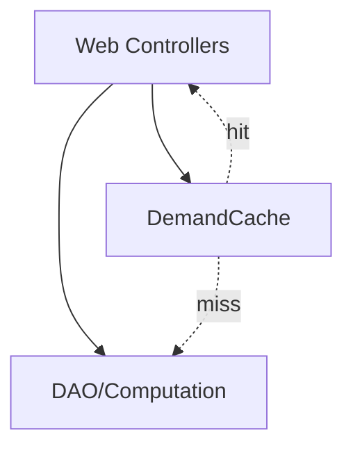

<!-- CATALOG:PATH="airline-web\app\com\patson\util" SLUG="airline-web__app__com__patson__util" -->

# Repo Catalogue — airline-web\app\com\patson\util

*Slug:* `airline-web__app__com__patson__util`  
*Commit:* `6160503`  
*Generated:* `2025-11-13T00:27:37Z`

**Summary (2–4 sentences):** Web-layer utilities for caching heavy-read computations used by the airline-web Play UI. These helpers primarily reduce repeated demand calculations or expensive DAO fetches within request lifecycles by storing recent results in-process. They are not persistence; think short-lived, process memory caches to improve HTTP response latency. In the rewrite, treat these as read-through caches with explicit TTLs and event-driven invalidation from the simulation backend.

**Contents overview**
- Files: 1  |  Subfolders: 0  |  Languages: Scala (100%)
- Notable responsibilities:
  - Provide an in-memory cache for demand data used by UI endpoints.
  - Encapsulate simple get/put/invalidate helpers with optional TTL.
  - Reduce repeated DB/computation in controller flows.

### File entries

#### airline-web/app/com/patson/util/DemandCache.scala

```yaml
file: airline-web/app/com/patson/util/DemandCache.scala
lang: Scala
role: "In-memory cache for computed demand lookups used by the web layer"
size:
  lines_est: 20
  functions_est: 3
  classes_est: 1
public_api:
  routes: []
  exports:
    - name: DemandCache
      kind: object
      summary: "Simple map-based cache: get/put/invalidate for demand results"
data_model:
  tables_read: []
  tables_written: []
  migrations: []
  entities: []
queries:
  sql: []
  orm_calls: []
external_io:
  http_calls: []
  message_queues: []
  files_read: []
  files_written: []
config:
  env_vars: []
  config_keys: ["cache.demand.ttl.ms?","cache.demand.max.size?"]
  feature_flags: []
concurrency:
  pattern: "Global mutable map; unsynchronized (assumed)"
  shared_state: ["process-local Map for demand entries"]
  timing: "on HTTP request; entries live until TTL or explicit invalidation"
invariants:
  - "Cached demand entries correspond to the same cycle/parameters used to compute them"
  - "Stale entries should not be served once TTL expires (if TTL implemented)"
error_handling:
  expected_errors: ["Cache miss → fallback compute/load"]
  retries_timeouts: "N/A"
security:
  authz: "none (read-only cached data)"
  input_validation: "key construction must uniquely identify demand parameters"
  sensitive_ops: []
tests:
  files: []
  coverage_quality: "low"
  golden_seeds: []
similar_or_duplicate_files:
  - "airline-data/src/main/scala/com/patson/util/*Cache.scala (server-side caches)"
rewrite_notes:
  mapping: "Use a dedicated caching layer (Caffeine/Redis) with TTL, size bounds, and metrics"
  risks: ["Stale/incorrect cache keys; lack of invalidation when backend state changes; thread-safety"]
  confidence: "med"
```

Note: Listing obtained via GitHub Contents API. To verify if there are more files in this folder, browse: https://github.com/joshuac-dev/airline/tree/master/airline-web/app/com/patson/util

## Rollup for airline-web\app\com\patson\util

**Key responsibilities (top 5):**
1. Cache computed demand results to speed up web responses.
2. Provide simple in-memory key/value storage scoped to the Play app process.
3. Offer minimal invalidation semantics (clear entry or all).
4. Avoid repeated DAO calls or heavy demand generation in controllers.
5. Act as a performance shim until a proper shared cache is introduced.

**Cross-module dependencies (top 10 by frequency):**
- airline-rest/app/controllers/* → likely callers of DemandCache to serve demand-related endpoints faster.
- airline-data/com.patson.data.* → upstream sources of the values being cached (indirect).
- airline-data/com.patson.DemandGenerator → computation source whose outputs may be cached (indirect).
- Play Framework request lifecycle → determines cache usage cadence (indirect).
- None (direct IO) — no DB or network dependency within the cache itself.

**High-leverage files to study first (top 10):**
- airline-web/app/com/patson/util/DemandCache.scala — ensure correct keying, TTL, and invalidation; replace with robust cache in rewrite.

**Mermaid: high-level dependency sketch (optional, if meaningful)**
