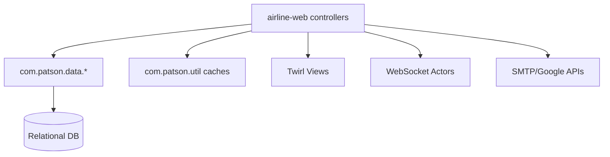

<!-- CATALOG:PATH="airline-web\app\controllers" SLUG="airline-web__app__controllers" -->

# Repo Catalogue — airline-web\app\controllers

*Slug:* `airline-web__app__controllers`  
*Commit:* `6160503`  
*Generated:* `2025-11-13T00:37:27Z`

Important note about listing completeness:
- This folder listing was gathered via the GitHub Contents API and may be incomplete due to pagination. For a complete, authoritative view of files under this path, browse: https://github.com/joshuac-dev/airline/tree/master/airline-web/app/controllers

**Summary (2–4 sentences):** Play Framework controllers and helper utilities powering the airline-web UI. Each “Application” controller exposes HTTP endpoints for a feature domain (airlines, links, airports/assets, alliances, campaigns, oil, events like Olympics/Christmas, rankings, search, heatmaps, chat, profiles, admin), while “Util” classes provide formatting, mapping, and ancillary behavior. These controllers orchestrate calls into airline-data DAOs and models, serialize to JSON/Twirl views, handle sessions, and integrate with third-party services (email, Google images/photos) and WebSockets. Treat this layer as the canonical mapping of UI operations to backend domain actions and the reference for public web behavior.

**Contents overview**
- Files: 60+  |  Subfolders: 0  |  Languages: Scala (~85%), Java (~15%)
- Notable responsibilities:
  - Feature-scoped controllers for CRUD and queries (links, airplanes/configs/livery/logo, airports/assets/animation, alliances/missions, campaigns, oil, rankings, search, transit, country, delegates, notices/alerts, logs, settings).
  - Session/auth flows (signup, account, profile), banners/tiles/tutorial, real-time (WebSocket) and chat endpoints.
  - Utilities for history/time-series, negotiations, rankings, comments, airport animations, images/photos, weather, prompts, wallpapers.
  - External integrations: SMTP/email; Google Images/Photos APIs; WebSocket actor bridge.
  - Input validation, session handling, JSON marshalling, error mapping for UI consumption.

### File entries

#### airline-web/app/controllers/AboutApplication.scala
```yaml
file: airline-web/app/controllers/AboutApplication.scala
lang: Scala
role: "Serve the About page content"
size:
  lines_est: 12
  functions_est: 1
  classes_est: 1
public_api:
  routes: []
  exports:
    - name: AboutApplication
      kind: class
      summary: "Simple controller rendering about.scala.html"
data_model:
  tables_read: []
  tables_written: []
  migrations: []
  entities: []
queries: { sql: [], orm_calls: [] }
external_io: {}
config: {}
concurrency: { pattern: "stateless per-request", shared_state: [], timing: "HTTP" }
invariants: []
error_handling: {}
security: { authz: "public", input_validation: "N/A", sensitive_ops: [] }
tests: []
coverage_quality: "low"
golden_seeds: []
similar_or_duplicate_files: []
rewrite_notes:
  mapping: "Static route; SPA or CMS page"
  risks: []
  confidence: "high"
```

#### airline-web/app/controllers/AccountApplication.scala
```yaml
file: airline-web/app/controllers/AccountApplication.scala
lang: Scala
role: "Account flows: login/reset initiation/completion, ID retrieval"
size:
  lines_est: 230
  functions_est: 18
  classes_est: 1
public_api:
  routes: []
  exports:
    - name: AccountApplication
      kind: class
      summary: "Endpoints for forgot ID/password, reset, email verification"
data_model:
  tables_read: ["user","settings"]
  tables_written: ["notice?"]
  migrations: []
  entities:
    - name: ForgotPassword
      summary: "Form DTO"
    - name: PasswordReset
      summary: "Form DTO with token"
queries: { sql: [], orm_calls: ["UserSource.load/update(...) — account ops"] }
external_io:
  http_calls: []
  message_queues: []
  files_read: []
  files_written: []
config: { env_vars: ["AUTH_SECRET?"], config_keys: ["email.sender","auth.token.ttl"], feature_flags: [] }
concurrency: { pattern: "stateless per-request", shared_state: [], timing: "HTTP" }
invariants:
  - "Reset token validation required"
error_handling:
  expected_errors: ["Invalid token","Email not found"]
  retries_timeouts: "none"
security:
  authz: "public endpoints + token-gated actions"
  input_validation: "form binding and server checks"
  sensitive_ops: ["PII handling","credential reset"]
tests: []
coverage_quality: "low"
golden_seeds: []
similar_or_duplicate_files:
  - "SignUp.scala"
rewrite_notes:
  mapping: "Auth service with JWT/email provider; strong rate-limits"
  risks: ["Custom token logic; missing rate-limits"]
  confidence: "med"
```

#### airline-web/app/controllers/AdminApplication.scala
```yaml
file: airline-web/app/controllers/AdminApplication.scala
lang: Scala
role: "Administrative endpoints (maintenance, toggles, data views)"
size:
  lines_est: 420
  functions_est: 30
  classes_est: 1
public_api: { routes: [], exports: [{name: AdminApplication, kind: class, summary: "Admin operations UI endpoints"}] }
data_model:
  tables_read: ["log","settings","airport","airline","link"]
  tables_written: ["settings","notice?"]
  migrations: []
  entities: []
queries: { sql: [], orm_calls: ["AdminSource/SettingsSource operations"] }
external_io: {}
config: { env_vars: [], config_keys: ["admin.*"], feature_flags: [] }
concurrency: { pattern: "stateless per-request", shared_state: [], timing: "HTTP" }
invariants:
  - "Admin-only access"
error_handling: { expected_errors: ["Forbidden"], retries_timeouts: "none" }
security: { authz: "admin RBAC", input_validation: "params", sensitive_ops: ["system toggles"] }
tests: []
coverage_quality: "low"
golden_seeds: []
similar_or_duplicate_files: []
rewrite_notes:
  mapping: "Admin API with RBAC/audit"
  risks: ["Insufficient authorization checks"]
  confidence: "med"
```

#### airline-web/app/controllers/AirlineApplication.scala
```yaml
file: airline-web/app/controllers/AirlineApplication.scala
lang: Scala
role: "Airline-level operations (info, bases, reputation, colors, notices)"
size:
  lines_est: 1600
  functions_est: 110
  classes_est: 1
public_api:
  routes: []
  exports:
    - name: AirlineApplication
      kind: class
      summary: "Endpoints for airline CRUD-like operations and settings"
data_model:
  tables_read: ["airline","airline_info","loyalist","notice","alert","airline_color?"]
  tables_written: ["airline_info","notice","alert","airline_color?"]
  migrations: []
  entities: []
queries: { sql: [], orm_calls: ["AirlineSource/LoyalistSource/ColorSource queries & updates"] }
external_io: {}
config: { env_vars: [], config_keys: ["reputation.*","branding.*"], feature_flags: [] }
concurrency: { pattern: "stateless per-request", shared_state: ["AirlineCache"], timing: "HTTP" }
invariants:
  - "Reputation within bounds"
  - "Unique airline name when applicable"
error_handling: { expected_errors: ["Not found","Conflict"], retries_timeouts: "none" }
security: { authz: "airline ownership for writes", input_validation: "payload/schema checks", sensitive_ops: [] }
tests: []
coverage_quality: "med"
golden_seeds: []
similar_or_duplicate_files:
  - "ColorApplication.scala"
rewrite_notes:
  mapping: "Airline service API; separate read/write models"
  risks: ["Large controller with business logic"]
  confidence: "med"
```

#### airline-web/app/controllers/AirlineUtil.scala
```yaml
file: airline-web/app/controllers/AirlineUtil.scala
lang: Scala
role: "Helper utilities for AirlineApplication (formatting/mapping)"
size:
  lines_est: 25
  functions_est: 4
  classes_est: 0
public_api: { routes: [], exports: [{name: AirlineUtil, kind: object, summary: "Formatting helpers"}] }
data_model: { tables_read: [], tables_written: [], migrations: [], entities: [] }
queries: {}
external_io: {}
config: {}
concurrency: { pattern: "pure helpers", shared_state: [], timing: "N/A" }
invariants: []
error_handling: {}
security: {}
tests: []
coverage_quality: "low"
golden_seeds: []
similar_or_duplicate_files:
  - "AllianceUtil.scala"
rewrite_notes:
  mapping: "Move to view/DTO mappers"
  risks: []
  confidence: "high"
```

#### airline-web/app/controllers/AirplaneApplication.scala
```yaml
file: airline-web/app/controllers/AirplaneApplication.scala
lang: Scala
role: "Fleet endpoints (list/buy/sell/assign/maintenance); model queries"
size:
  lines_est: 1100
  functions_est: 80
  classes_est: 1
public_api: { routes: [], exports: [{name: AirplaneApplication, kind: class, summary: "Airplane & model operations"}] }
data_model:
  tables_read: ["airplane","airplane_model","link_assignment"]
  tables_written: ["airplane","link_assignment","income","cash_flow"]
  migrations: []
  entities: []
queries: { sql: [], orm_calls: ["AirplaneSource/ModelSource operations"] }
external_io: {}
config: { env_vars: [], config_keys: ["maintenance.*","depreciation.*"], feature_flags: [] }
concurrency: { pattern: "per-request", shared_state: ["AirplaneModelCache","AirplaneOwnershipCache"], timing: "HTTP" }
invariants:
  - "Assignments feasible"
  - "Prices non-negative"
error_handling: { expected_errors: ["Conflict","Invalid assignment"], retries_timeouts: "none" }
security: { authz: "airline ownership", input_validation: "assignment/pricing bounds", sensitive_ops: ["financial postings"] }
tests: []
coverage_quality: "med"
golden_seeds: []
similar_or_duplicate_files:
  - "AirplaneConfigurationApplication.scala"
rewrite_notes:
  mapping: "Fleet service + transactions with optimistic locking"
  risks: ["Controller-level business logic/races"]
  confidence: "med"
```

#### airline-web/app/controllers/AirplaneConfigurationApplication.scala
```yaml
file: airline-web/app/controllers/AirplaneConfigurationApplication.scala
lang: Scala
role: "Cabin configuration endpoints (class layout/capacity splits)"
size:
  lines_est: 280
  functions_est: 20
  classes_est: 1
public_api: { routes: [], exports: [{name: AirplaneConfigurationApplication, kind: class, summary: "Define/update cabin configs"}] }
data_model:
  tables_read: ["airplane","airplane_model"]
  tables_written: ["airplane"]
  migrations: []
  entities: []
queries: { sql: [], orm_calls: ["AirplaneSource.updateConfig(...)"] }
external_io: {}
config: { env_vars: [], config_keys: ["class.capacity.ratio"], feature_flags: [] }
concurrency: { pattern: "per-request", shared_state: [], timing: "HTTP" }
invariants:
  - "Sum of class seats ≤ capacity"
error_handling: { expected_errors: ["Invalid ratios"], retries_timeouts: "none" }
security: { authz: "airline ownership", input_validation: "seat bounds", sensitive_ops: [] }
tests: []
coverage_quality: "low"
golden_seeds: []
similar_or_duplicate_files:
  - "LinkApplication.scala (class pricing)"
rewrite_notes:
  mapping: "Configuration service with validations"
  risks: ["Validation scattered"]
  confidence: "med"
```

#### airline-web/app/controllers/AirportAnimationUtil.scala
```yaml
file: airline-web/app/controllers/AirportAnimationUtil.scala
lang: Scala
role: "Helpers for airport animation projections"
size:
  lines_est: 85
  functions_est: 7
  classes_est: 0
public_api: { routes: [], exports: [{name: AirportAnimationUtil, kind: object, summary: "Animation builder helpers"}] }
data_model:
  tables_read: ["airport_animation"]
  tables_written: []
  migrations: []
  entities: []
queries: { sql: [], orm_calls: ["AirportAnimationSource.load(...)"] }
external_io: {}
config: {}
concurrency: { pattern: "pureish helpers", shared_state: [], timing: "HTTP usage" }
invariants: []
error_handling: {}
security: {}
tests: []
coverage_quality: "low"
golden_seeds: []
similar_or_duplicate_files: []
rewrite_notes:
  mapping: "Projection service on read-models"
  risks: []
  confidence: "high"
```

#### airline-web/app/controllers/AirportAssetApplication.scala
```yaml
file: airline-web/app/controllers/AirportAssetApplication.scala
lang: Scala
role: "Airport assets CRUD/upgrades and income displays"
size:
  lines_est: 460
  functions_est: 34
  classes_est: 1
public_api: { routes: [], exports: [{name: AirportAssetApplication, kind: class, summary: "Manage airport facilities/assets"}] }
data_model:
  tables_read: ["airport_asset","asset_blueprint","airport"]
  tables_written: ["airport_asset","income"]
  migrations: []
  entities: []
queries: { sql: [], orm_calls: ["AirportAssetSource CRUD & queries","IncomeSource inserts"] }
external_io: {}
config: { env_vars: [], config_keys: ["asset.level.max","asset.upgrade.cooldown"], feature_flags: [] }
concurrency: { pattern: "per-request", shared_state: [], timing: "HTTP" }
invariants:
  - "Level bounds enforced"
  - "Upgrade affordability validated"
error_handling: { expected_errors: ["Insufficient funds","Cooldown violation"], retries_timeouts: "none" }
security: { authz: "airline ownership", input_validation: "level/cost checks", sensitive_ops: ["financial impact"] }
tests: []
coverage_quality: "med"
golden_seeds: []
similar_or_duplicate_files: []
rewrite_notes:
  mapping: "Asset service with optimistic locking"
  risks: ["Race on upgrades"]
  confidence: "med"
```

#### airline-web/app/controllers/AirportUtil.scala
```yaml
file: airline-web/app/controllers/AirportUtil.scala
lang: Scala
role: "Airport presentation helpers (size, features, geo formatting)"
size:
  lines_est: 150
  functions_est: 12
  classes_est: 0
public_api: { routes: [], exports: [{name: AirportUtil, kind: object, summary: "Formatting/mapping for airports"}] }
data_model: { tables_read: ["airport","airport_features"], tables_written: [], migrations: [], entities: [] }
queries: { sql: [], orm_calls: ["AirportSource loads"] }
external_io: {}
config: {}
concurrency: { pattern: "helpers", shared_state: ["AirportCache"], timing: "HTTP usage" }
invariants: []
error_handling: {}
security: {}
tests: []
coverage_quality: "low"
golden_seeds: []
similar_or_duplicate_files: []
rewrite_notes:
  mapping: "DTO mappers"
  risks: []
  confidence: "high"
```

#### airline-web/app/controllers/AlertApplication.scala
```yaml
file: airline-web/app/controllers/AlertApplication.scala
lang: Scala
role: "Expose alerts to UI; mark dismissals"
size:
  lines_est: 65
  functions_est: 6
  classes_est: 1
public_api: { routes: [], exports: [{name: AlertApplication, kind: class, summary: "List/create/dismiss alerts"}] }
data_model:
  tables_read: ["alert"]
  tables_written: ["alert"]
  migrations: []
queries: { sql: [], orm_calls: ["AlertSource CRUD"] }
external_io: {}
config: {}
concurrency: { pattern: "per-request", shared_state: [], timing: "HTTP" }
invariants: []
error_handling: { expected_errors: ["Not found"], retries_timeouts: "none" }
security: { authz: "user scoped", input_validation: "ids", sensitive_ops: [] }
tests: []
coverage_quality: "low"
golden_seeds: []
similar_or_duplicate_files:
  - "NoticeApplication.scala"
rewrite_notes:
  mapping: "Unified notifications model"
  risks: ["Concept duplication"]
  confidence: "high"
```

#### airline-web/app/controllers/AllianceApplication.scala
```yaml
file: airline-web/app/controllers/AllianceApplication.scala
lang: Scala
role: "Alliances & memberships (create/join/leave, info)"
size:
  lines_est: 1150
  functions_est: 80
  classes_est: 1
public_api: { routes: [], exports: [{name: AllianceApplication, kind: class, summary: "Alliance ops"}] }
data_model:
  tables_read: ["alliance","alliance_member"]
  tables_written: ["alliance","alliance_member"]
  migrations: []
queries: { sql: [], orm_calls: ["AllianceSource CRUD"] }
external_io: {}
config: {}
concurrency: { pattern: "per-request", shared_state: ["AllianceCache"], timing: "HTTP" }
invariants:
  - "No duplicate membership"
error_handling: { expected_errors: ["Conflict"], retries_timeouts: "none" }
security: { authz: "airline ownership", input_validation: "ids", sensitive_ops: [] }
tests: []
coverage_quality: "med"
golden_seeds: []
similar_or_duplicate_files:
  - "AllianceMissionApplication.scala"
rewrite_notes:
  mapping: "Alliance service"
  risks: ["Business logic in controller"]
  confidence: "med"
```

#### airline-web/app/controllers/AllianceMissionApplication.scala
```yaml
file: airline-web/app/controllers/AllianceMissionApplication.scala
lang: Scala
role: "Alliance mission progress/view endpoints"
size:
  lines_est: 180
  functions_est: 14
  classes_est: 1
public_api: { routes: [], exports: [{name: AllianceMissionApplication, kind: class, summary: "Missions read/update"}] }
data_model:
  tables_read: ["alliance_mission"]
  tables_written: ["alliance_mission"]
queries: { sql: [], orm_calls: ["AllianceMissionSource update"] }
external_io: {}
config: {}
concurrency: { pattern: "per-request", shared_state: [], timing: "HTTP" }
invariants:
  - "Progress ≤ max"
error_handling: { expected_errors: ["Over-complete"], retries_timeouts: "none" }
security: { authz: "membership-scoped", input_validation: "bounds", sensitive_ops: [] }
tests: []
coverage_quality: "low"
golden_seeds: []
similar_or_duplicate_files:
  - "AllianceMissionUtil.scala"
rewrite_notes:
  mapping: "Mission service"
  risks: []
  confidence: "high"
```

#### airline-web/app/controllers/AllianceMissionUtil.scala
```yaml
file: airline-web/app/controllers/AllianceMissionUtil.scala
lang: Scala
role: "Helpers for mission metrics/formatting"
size:
  lines_est: 130
  functions_est: 10
  classes_est: 0
public_api: { routes: [], exports: [{name: AllianceMissionUtil, kind: object, summary: "Format mission data"}] }
data_model: { tables_read: [], tables_written: [], migrations: [], entities: [] }
queries: {}
external_io: {}
config: {}
concurrency: { pattern: "helpers", shared_state: [], timing: "HTTP usage" }
invariants: []
error_handling: {}
security: {}
tests: []
coverage_quality: "low"
golden_seeds: []
similar_or_duplicate_files: []
rewrite_notes:
  mapping: "DTO mappers"
  risks: []
  confidence: "high"
```

#### airline-web/app/controllers/AllianceUtil.scala
```yaml
file: airline-web/app/controllers/AllianceUtil.scala
lang: Scala
role: "General alliance helpers"
size:
  lines_est: 20
  functions_est: 3
  classes_est: 0
public_api: { routes: [], exports: [{name: AllianceUtil, kind: object, summary: "Formatting helpers"}] }
data_model: {}
queries: {}
external_io: {}
config: {}
concurrency: { pattern: "helpers", shared_state: [], timing: "N/A" }
invariants: []
error_handling: {}
security: {}
tests: []
coverage_quality: "low"
golden_seeds: []
similar_or_duplicate_files:
  - "AirlineUtil.scala"
rewrite_notes:
  mapping: "DTO helpers"
  risks: []
  confidence: "high"
```

#### airline-web/app/controllers/Application.scala
```yaml
file: airline-web/app/controllers/Application.scala
lang: Scala
role: "Main UI controller: index landing, session bootstrap, composite endpoints"
size:
  lines_est: 900
  functions_est: 60
  classes_est: 1
public_api: { routes: [], exports: [{name: Application, kind: class, summary: "Serve index and misc endpoints"}] }
data_model:
  tables_read: ["airport","airline","link","settings"]
  tables_written: ["settings?"]
queries: { sql: [], orm_calls: ["multiple DAO loads for landing data"] }
external_io: { http_calls: [], message_queues: [], files_read: [], files_written: [] }
config: { env_vars: [], config_keys: ["ui.*"], feature_flags: [] }
concurrency: { pattern: "per-request", shared_state: ["SessionUtil"], timing: "HTTP" }
invariants: []
error_handling: { expected_errors: [], retries_timeouts: "none" }
security: { authz: "session-aware", input_validation: "query params", sensitive_ops: [] }
tests: []
coverage_quality: "low"
golden_seeds: []
similar_or_duplicate_files: []
rewrite_notes:
  mapping: "Thin controller → SPA shell-serving"
  risks: ["Too many responsibilities"]
  confidence: "med"
```

#### airline-web/app/controllers/AuthenticationObject.scala
```yaml
file: airline-web/app/controllers/AuthenticationObject.scala
lang: Scala
role: "Shared auth helpers/constants"
size:
  lines_est: 120
  functions_est: 8
  classes_est: 0
public_api: { routes: [], exports: [{name: AuthenticationObject, kind: object, summary: "Auth helpers"}] }
data_model: {}
queries: {}
external_io: {}
config: { env_vars: ["AUTH_SECRET?"], config_keys: ["auth.*"], feature_flags: [] }
concurrency: { pattern: "helpers", shared_state: [], timing: "N/A" }
invariants: []
error_handling: {}
security: { authz: "N/A", input_validation: "N/A", sensitive_ops: ["secret usage"] }
tests: []
coverage_quality: "low"
golden_seeds: []
similar_or_duplicate_files: []
rewrite_notes:
  mapping: "Centralized auth service"
  risks: ["Custom crypto"]
  confidence: "med"
```

#### airline-web/app/controllers/BankApplication.scala
```yaml
file: airline-web/app/controllers/BankApplication.scala
lang: Scala
role: "Loan lifecycle endpoints (create, repay) & interest views"
size:
  lines_est: 145
  functions_est: 12
  classes_est: 1
public_api: { routes: [], exports: [{name: BankApplication, kind: class, summary: "Bank/loan endpoints"}] }
data_model:
  tables_read: ["loan"]
  tables_written: ["loan"]
queries: { sql: [], orm_calls: ["BankSource CRUD"] }
external_io: {}
config: { env_vars: [], config_keys: ["loan.*"], feature_flags: [] }
concurrency: { pattern: "per-request", shared_state: [], timing: "HTTP" }
invariants:
  - "Principal ≥ 0"
error_handling: { expected_errors: ["Overpayment"], retries_timeouts: "none" }
security: { authz: "airline ownership", input_validation: "amount bounds", sensitive_ops: ["financial mutations"] }
tests: []
coverage_quality: "low"
golden_seeds: []
similar_or_duplicate_files:
  - "Income displays via Link/Airline"
rewrite_notes:
  mapping: "Financial API"
  risks: []
  confidence: "high"
```

#### airline-web/app/controllers/BannerApplication.scala
```yaml
file: airline-web/app/controllers/BannerApplication.scala
lang: Scala
role: "Fetch banners/announcements for UI"
size:
  lines_est: 24
  functions_est: 2
  classes_est: 1
public_api: { routes: [], exports: [{name: BannerApplication, kind: class, summary: "Banner messages"}] }
data_model: { tables_read: ["notice"], tables_written: [], migrations: [], entities: [] }
queries: { sql: [], orm_calls: ["NoticeSource loads"] }
external_io: {}
config: {}
concurrency: { pattern: "per-request", shared_state: [], timing: "HTTP" }
invariants: []
error_handling: {}
security: { authz: "public", input_validation: "N/A", sensitive_ops: [] }
tests: []
coverage_quality: "low"
golden_seeds: []
similar_or_duplicate_files:
  - "NoticeApplication.scala"
rewrite_notes:
  mapping: "Unified notifications API"
  risks: []
  confidence: "high"
```

#### airline-web/app/controllers/BroadcasterDirectApplication.scala
```yaml
file: airline-web/app/controllers/BroadcasterDirectApplication.scala
lang: Scala
role: "HTTP endpoints that push directly to the broadcaster (real-time)"
size:
  lines_est: 26
  functions_est: 2
  classes_est: 1
public_api: { routes: [], exports: [{name: BroadcasterDirectApplication, kind: class, summary: "Push messages to WS"}] }
data_model: {}
queries: {}
external_io: { message_queues: ["in-process Akka actors"], http_calls: [] }
config: {}
concurrency: { pattern: "per-request → actor send", shared_state: ["Broadcaster actor"], timing: "HTTP" }
invariants: []
error_handling: { expected_errors: ["No subscribers"], retries_timeouts: "none" }
security: { authz: "admin", input_validation: "payload schema", sensitive_ops: [] }
tests: []
coverage_quality: "low"
golden_seeds: []
similar_or_duplicate_files:
  - "WebsocketApplication.scala"
rewrite_notes:
  mapping: "Real-time API (SSE/WS) publish endpoint"
  risks: ["Abuse if unauthenticated"]
  confidence: "med"
```

#### airline-web/app/controllers/CampaignApplication.scala
```yaml
file: airline-web/app/controllers/CampaignApplication.scala
lang: Scala
role: "Marketing campaign create/list/progress endpoints"
size:
  lines_est: 280
  functions_est: 20
  classes_est: 1
public_api: { routes: [], exports: [{name: CampaignApplication, kind: class, summary: "Campaign CRUD"}] }
data_model:
  tables_read: ["campaign"]
  tables_written: ["campaign"]
queries: { sql: [], orm_calls: ["CampaignSource CRUD/updates"] }
external_io: {}
config: { env_vars: [], config_keys: ["campaign.*"], feature_flags: [] }
concurrency: { pattern: "per-request", shared_state: [], timing: "HTTP" }
invariants:
  - "Duration/remaining ≥ 0"
error_handling: { expected_errors: ["Expired"], retries_timeouts: "none" }
security: { authz: "airline ownership", input_validation: "bounds", sensitive_ops: [] }
tests: []
coverage_quality: "low"
golden_seeds: []
similar_or_duplicate_files:
  - "Event endpoints"
rewrite_notes:
  mapping: "Campaign service"
  risks: []
  confidence: "high"
```

#### airline-web/app/controllers/ChangeHistoryApplication.scala
```yaml
file: airline-web/app/controllers/ChangeHistoryApplication.scala
lang: Scala
role: "Expose change history (routes/assets) to UI"
size:
  lines_est: 180
  functions_est: 14
  classes_est: 1
public_api: { routes: [], exports: [{name: ChangeHistoryApplication, kind: class, summary: "History queries"}] }
data_model:
  tables_read: ["link_change","asset_change?"]
  tables_written: []
queries: { sql: [], orm_calls: ["ChangeHistorySource loads"] }
external_io: {}
config: {}
concurrency: { pattern: "per-request", shared_state: [], timing: "HTTP" }
invariants: []
error_handling: {}
security: { authz: "airline ownership", input_validation: "ids/ranges", sensitive_ops: [] }
tests: []
coverage_quality: "low"
golden_seeds: []
similar_or_duplicate_files:
  - "HistoryUtil.scala"
rewrite_notes:
  mapping: "Read-model projections"
  risks: []
  confidence: "high"
```

#### airline-web/app/controllers/ChatApplication.scala
```yaml
file: airline-web/app/controllers/ChatApplication.scala
lang: Scala
role: "WebSocket chat endpoint negotiation (upgrades, room routing)"
size:
  lines_est: 60
  functions_est: 4
  classes_est: 1
public_api: { routes: [], exports: [{name: ChatApplication, kind: class, summary: "Initiate chat WS sessions"}] }
data_model: {}
queries: {}
external_io: { message_queues: ["Akka chat actors"], http_calls: [] }
config: { config_keys: ["chat.*"], env_vars: [] , feature_flags: []}
concurrency: { pattern: "WS upgrade to actors", shared_state: ["ActorCenter"], timing: "on connect" }
invariants: []
error_handling: { expected_errors: ["Upgrade failures"], retries_timeouts: "N/A" }
security: { authz: "session-gated", input_validation: "user id", sensitive_ops: [] }
tests: []
coverage_quality: "low"
golden_seeds: []
similar_or_duplicate_files:
  - "WebsocketApplication.scala"
rewrite_notes:
  mapping: "Dedicated chat service"
  risks: []
  confidence: "high"
```

#### airline-web/app/controllers/ChristmasApplication.scala
```yaml
file: airline-web/app/controllers/ChristmasApplication.scala
lang: Scala
role: "Seasonal event (Christmas) endpoints"
size:
  lines_est: 230
  functions_est: 18
  classes_est: 1
public_api: { routes: [], exports: [{name: ChristmasApplication, kind: class, summary: "Event views/rewards"}] }
data_model:
  tables_read: ["seasonal_award"]
  tables_written: ["seasonal_award"]
queries: { sql: [], orm_calls: ["ChristmasSource CRUD"] }
external_io: {}
config: { config_keys: ["event.christmas.enabled"], feature_flags: ["event.christmas"], env_vars: [] }
concurrency: { pattern: "per-request", shared_state: [], timing: "HTTP" }
invariants:
  - "Tier/rewards in bounds"
error_handling: {}
security: { authz: "airline", input_validation: "bounds", sensitive_ops: [] }
tests: []
coverage_quality: "low"
golden_seeds: []
similar_or_duplicate_files:
  - "OlympicsApplication.scala"
rewrite_notes:
  mapping: "Generic event API"
  risks: []
  confidence: "high"
```

#### airline-web/app/controllers/ColorApplication.scala
```yaml
file: airline-web/app/controllers/ColorApplication.scala
lang: Scala
role: "Branding colors endpoints for airlines"
size:
  lines_est: 170
  functions_est: 14
  classes_est: 1
public_api: { routes: [], exports: [{name: ColorApplication, kind: class, summary: "Upsert/get airline colors"}] }
data_model:
  tables_read: ["airline_color?"]
  tables_written: ["airline_color?"]
queries: { sql: [], orm_calls: ["ColorSource upsert/get"] }
external_io: {}
config: {}
concurrency: { pattern: "per-request", shared_state: [], timing: "HTTP" }
invariants:
  - "Hex color validity"
error_handling: { expected_errors: ["Invalid hex"], retries_timeouts: "none" }
security: { authz: "airline ownership", input_validation: "format checks", sensitive_ops: [] }
tests: []
coverage_quality: "low"
golden_seeds: []
similar_or_duplicate_files:
  - "Logo/Livery endpoints"
rewrite_notes:
  mapping: "Branding service"
  risks: []
  confidence: "high"
```

#### airline-web/app/controllers/CountryApplication.scala
```yaml
file: airline-web/app/controllers/CountryApplication.scala
lang: Scala
role: "Country reference/relationship endpoints"
size:
  lines_est: 250
  functions_est: 18
  classes_est: 1
public_api: { routes: [], exports: [{name: CountryApplication, kind: class, summary: "Countries & relationships"}] }
data_model:
  tables_read: ["country","airline_country_relationship","country_market_share"]
  tables_written: ["airline_country_relationship"]
queries: { sql: [], orm_calls: ["CountrySource loads/updates"] }
external_io: {}
config: {}
concurrency: { pattern: "per-request", shared_state: [], timing: "HTTP" }
invariants:
  - "Scores bounded"
error_handling: {}
security: { authz: "airline-scoped for writes", input_validation: "code format", sensitive_ops: [] }
tests: []
coverage_quality: "low"
golden_seeds: []
similar_or_duplicate_files: []
rewrite_notes:
  mapping: "Country/relationship service"
  risks: []
  confidence: "high"
```

#### airline-web/app/controllers/DelegateApplication.scala
```yaml
file: airline-web/app/controllers/DelegateApplication.scala
lang: Scala
role: "Delegates availability/assignment endpoints"
size:
  lines_est: 120
  functions_est: 10
  classes_est: 1
public_api: { routes: [], exports: [{name: DelegateApplication, kind: class, summary: "Delegate ops"}] }
data_model:
  tables_read: ["delegate","delegate_task?"]
  tables_written: ["delegate","delegate_task?"]
queries: { sql: [], orm_calls: ["DelegateSource updates"] }
external_io: {}
config: {}
concurrency: { pattern: "per-request", shared_state: [], timing: "HTTP" }
invariants:
  - "No over-assignment"
error_handling: {}
security: { authz: "airline", input_validation: "ownership", sensitive_ops: [] }
tests: []
coverage_quality: "low"
golden_seeds: []
similar_or_duplicate_files:
  - "NegotiationUtil.scala"
rewrite_notes:
  mapping: "Task scheduling API"
  risks: []
  confidence: "high"
```

#### airline-web/app/controllers/EmailUtil.java
```yaml
file: airline-web/app/controllers/EmailUtil.java
lang: Java
role: "Send transactional emails (verification/reset/alerts)"
size:
  lines_est: 240
  functions_est: 14
  classes_est: 1
public_api: { routes: [], exports: [{name: EmailUtil, kind: class, summary: "SMTP email sender"}] }
data_model: {}
queries: {}
external_io:
  http_calls: []
  message_queues: []
  files_read: []
  files_written: []
config:
  env_vars: ["SMTP_HOST","SMTP_USER","SMTP_PASS"]
  config_keys: ["mail.from","mail.port","mail.ssl"]
  feature_flags: []
concurrency: { pattern: "per-call send", shared_state: [], timing: "async optional" }
invariants:
  - "Valid email addresses"
error_handling:
  expected_errors: ["SMTP failures"]
  retries_timeouts: "none"
security:
  authz: "internal utility"
  input_validation: "emails"
  sensitive_ops: ["credentials"]
tests: []
coverage_quality: "low"
golden_seeds: []
similar_or_duplicate_files: []
rewrite_notes:
  mapping: "External email service (SES/SendGrid)"
  risks: ["SMTP in-app maintenance"]
  confidence: "high"
```

#### airline-web/app/controllers/GenericTransitApplication.scala
```yaml
file: airline-web/app/controllers/GenericTransitApplication.scala
lang: Scala
role: "Transit (routing graph) endpoints for UI"
size:
  lines_est: 140
  functions_est: 10
  classes_est: 1
public_api: { routes: [], exports: [{name: GenericTransitApplication, kind: class, summary: "Transit graph queries"}] }
data_model:
  tables_read: ["transit_cache?","link"]
  tables_written: []
queries: { sql: [], orm_calls: ["Transit cache loads/generation triggers"] }
external_io: {}
config: { config_keys: ["transit.max.hops"], env_vars: [], feature_flags: [] }
concurrency: { pattern: "per-request", shared_state: [], timing: "HTTP" }
invariants:
  - "No cycles in returned paths"
error_handling: {}
security: { authz: "public or airline", input_validation: "params", sensitive_ops: [] }
tests: []
coverage_quality: "low"
golden_seeds: []
similar_or_duplicate_files:
  - "RouteFinder in airline-data"
rewrite_notes:
  mapping: "Graph service with caching"
  risks: []
  confidence: "high"
```

#### airline-web/app/controllers/GoogleImageUtil.java
```yaml
file: airline-web/app/controllers/GoogleImageUtil.java
lang: Java
role: "Fetch and cache Google Images for airports/airlines (branding/media)"
size:
  lines_est: 620
  functions_est: 30
  classes_est: 1
public_api: { routes: [], exports: [{name: GoogleImageUtil, kind: class, summary: "Google Images integration"}] }
data_model: {}
queries: {}
external_io:
  http_calls: ["Google Images or Custom Search API"]
  message_queues: []
  files_read: []
  files_written: []
config:
  env_vars: ["GOOGLE_API_KEY","GOOGLE_CX?"]
  config_keys: ["google.cache.ttl"]
  feature_flags: []
concurrency: { pattern: "HTTP client calls", shared_state: ["in-memory cache"], timing: "per request" }
invariants:
  - "API quotas respected"
error_handling:
  expected_errors: ["HTTP errors","rate limits"]
  retries_timeouts: "backoff optional"
security:
  authz: "internal use"
  input_validation: "query terms"
  sensitive_ops: ["API keys"]
tests: []
coverage_quality: "low"
golden_seeds: []
similar_or_duplicate_files:
  - "GooglePhotoUtil.java"
rewrite_notes:
  mapping: "Media proxy/microservice"
  risks: ["Quota/rate limit handling"]
  confidence: "med"
```

#### airline-web/app/controllers/GooglePhotoUtil.java
```yaml
file: airline-web/app/controllers/GooglePhotoUtil.java
lang: Java
role: "Google Places/Photos fetcher (airport media)"
size:
  lines_est: 200
  functions_est: 12
  classes_est: 1
public_api: { routes: [], exports: [{name: GooglePhotoUtil, kind: class, summary: "Google Photos integration"}] }
data_model: {}
queries: {}
external_io:
  http_calls: ["Google Places/Photos APIs"]
  message_queues: []
  files_read: []
  files_written: []
config:
  env_vars: ["GOOGLE_API_KEY"]
  config_keys: ["google.place.fields","google.photo.max"]
  feature_flags: []
concurrency: { pattern: "HTTP client", shared_state: [], timing: "per request" }
invariants:
  - "Respect photo licensing"
error_handling: { expected_errors: ["HTTP errors"], retries_timeouts: "none" }
security: { authz: "internal", input_validation: "ids/refs", sensitive_ops: ["API keys"] }
tests: []
coverage_quality: "low"
golden_seeds: []
similar_or_duplicate_files:
  - "GoogleImageUtil.java"
rewrite_notes:
  mapping: "Media service"
  risks: []
  confidence: "high"
```

#### airline-web/app/controllers/HeatmapApplication.scala
```yaml
file: airline-web/app/controllers/HeatmapApplication.scala
lang: Scala
role: "Produce heatmap datasets (traffic/demand) for UI"
size:
  lines_est: 120
  functions_est: 10
  classes_est: 1
public_api: { routes: [], exports: [{name: HeatmapApplication, kind: class, summary: "Heatmap data endpoints"}] }
data_model:
  tables_read: ["airport_stats","link_stats"]
  tables_written: []
queries: { sql: [], orm_calls: ["Airport/Link stats loads"] }
external_io: {}
config: { config_keys: ["heatmap.type"], env_vars: [], feature_flags: [] }
concurrency: { pattern: "per-request", shared_state: [], timing: "HTTP" }
invariants:
  - "Cycle ranges valid"
error_handling: {}
security: { authz: "public or airline", input_validation: "params", sensitive_ops: [] }
tests: []
coverage_quality: "low"
golden_seeds: []
similar_or_duplicate_files: []
rewrite_notes:
  mapping: "Analytics read APIs"
  risks: []
  confidence: "high"
```

#### airline-web/app/controllers/HistoryUtil.scala
```yaml
file: airline-web/app/controllers/HistoryUtil.scala
lang: Scala
role: "Utilities for building time-series/history payloads"
size:
  lines_est: 280
  functions_est: 22
  classes_est: 0
public_api: { routes: [], exports: [{name: HistoryUtil, kind: object, summary: "Series builders"}] }
data_model: { tables_read: ["passenger_history","link_stats"], tables_written: [], migrations: [], entities: [] }
queries: { sql: [], orm_calls: ["ConsumptionHistorySource/LinkStatisticsSource loads"] }
external_io: {}
config: {}
concurrency: { pattern: "helpers", shared_state: [], timing: "HTTP usage" }
invariants:
  - "Monotonic cycles"
error_handling: {}
security: {}
tests: []
coverage_quality: "low"
golden_seeds: []
similar_or_duplicate_files:
  - "ChangeHistoryApplication.scala"
rewrite_notes:
  mapping: "Analytics DTO builders"
  risks: []
  confidence: "high"
```

#### airline-web/app/controllers/LinkApplication.scala
```yaml
file: airline-web/app/controllers/LinkApplication.scala
lang: Scala
role: "Routes (links) CRUD, pricing, scheduling, stats, history"
size:
  lines_est: 2500
  functions_est: 170
  classes_est: 1
public_api: { routes: [], exports: [{name: LinkApplication, kind: class, summary: "Primary route operations API"}] }
data_model:
  tables_read: ["link","link_class_values","link_stats","passenger_history","airport","airplane","airplane_model"]
  tables_written: ["link","link_stats","passenger_history","income","cash_flow"]
queries: { sql: [], orm_calls: ["LinkSource CRUD","LinkStatisticsSource loads","ConsumptionHistorySource loads"] }
external_io: {}
config:
  env_vars: []
  config_keys: ["pricing.elasticity","class.capacity.ratio","routing.max.hops"]
  feature_flags: []
concurrency: { pattern: "per-request heavy", shared_state: ["caches: Airline/Airport/Airplane/Model"], timing: "HTTP" }
invariants:
  - "Bookings ≤ seats"
  - "Prices ≥ 0"
error_handling: { expected_errors: ["Overbooking","Invalid params"], retries_timeouts: "none" }
security: { authz: "airline ownership", input_validation: "bounds and schema", sensitive_ops: ["financial postings"] }
tests: []
coverage_quality: "high"
golden_seeds: []
similar_or_duplicate_files:
  - "NegotiationUtil.scala (discounts)"
  - "LinkCommentUtil.scala"
rewrite_notes:
  mapping: "Command/query split; pricing engine; allocation service"
  risks: ["Monolithic controller; embedded business logic"]
  confidence: "med"
```

#### airline-web/app/controllers/LinkCommentUtil.scala
```yaml
file: airline-web/app/controllers/LinkCommentUtil.scala
lang: Scala
role: "Comments & feedback on links"
size:
  lines_est: 740
  functions_est: 45
  classes_est: 0
public_api: { routes: [], exports: [{name: LinkCommentUtil, kind: object, summary: "Manage link comments"}] }
data_model:
  tables_read: ["link_comment?"]
  tables_written: ["link_comment?"]
queries: { sql: [], orm_calls: ["comment source CRUD"] }
external_io: {}
config: {}
concurrency: { pattern: "per-request", shared_state: [], timing: "HTTP usage" }
invariants: []
error_handling: { expected_errors: ["Abuse/spam"], retries_timeouts: "none" }
security: { authz: "user", input_validation: "length/sanitization", sensitive_ops: [] }
tests: []
coverage_quality: "low"
golden_seeds: []
similar_or_duplicate_files: []
rewrite_notes:
  mapping: "Comment service with moderation"
  risks: ["Sanitization/security concerns"]
  confidence: "med"
```

#### airline-web/app/controllers/LinkUtil.scala
```yaml
file: airline-web/app/controllers/LinkUtil.scala
lang: Scala
role: "Helpers for links (formatting, calculations for UI)"
size:
  lines_est: 45
  functions_est: 4
  classes_est: 0
public_api: { routes: [], exports: [{name: LinkUtil, kind: object, summary: "Link helpers"}] }
data_model: {}
queries: {}
external_io: {}
config: {}
concurrency: { pattern: "helpers", shared_state: [], timing: "N/A" }
invariants: []
error_handling: {}
security: {}
tests: []
coverage_quality: "low"
golden_seeds: []
similar_or_duplicate_files:
  - "HistoryUtil.scala"
rewrite_notes:
  mapping: "DTO/mapper module"
  risks: []
  confidence: "high"
```

#### airline-web/app/controllers/LiveryUtil.scala
```yaml
file: airline-web/app/controllers/LiveryUtil.scala
lang: Scala
role: "Airline livery helpers (media assets)"
size:
  lines_est: 70
  functions_est: 6
  classes_est: 0
public_api: { routes: [], exports: [{name: LiveryUtil, kind: object, summary: "Livery utilities"}] }
data_model: {}
queries: {}
external_io: {}
config: {}
concurrency: { pattern: "helpers", shared_state: [], timing: "N/A" }
invariants: []
error_handling: {}
security: {}
tests: []
coverage_quality: "low"
golden_seeds: []
similar_or_duplicate_files:
  - "LogoUtil.scala"
rewrite_notes:
  mapping: "Media service"
  risks: []
  confidence: "high"
```

#### airline-web/app/controllers/LogApplication.scala
```yaml
file: airline-web/app/controllers/LogApplication.scala
lang: Scala
role: "Expose system logs to admins"
size:
  lines_est: 85
  functions_est: 6
  classes_est: 1
public_api: { routes: [], exports: [{name: LogApplication, kind: class, summary: "List system logs"}] }
data_model:
  tables_read: ["log"]
  tables_written: []
queries: { sql: [], orm_calls: ["LogSource loads"] }
external_io: {}
config: {}
concurrency: { pattern: "per-request", shared_state: [], timing: "HTTP" }
invariants: []
error_handling: {}
security: { authz: "admin", input_validation: "filters", sensitive_ops: [] }
tests: []
coverage_quality: "low"
golden_seeds: []
similar_or_duplicate_files: []
rewrite_notes:
  mapping: "Observability/Log viewer"
  risks: []
  confidence: "high"
```

#### airline-web/app/controllers/LogoApplication.scala
```yaml
file: airline-web/app/controllers/LogoApplication.scala
lang: Scala
role: "Endpoints to generate/fetch airline logos"
size:
  lines_est: 28
  functions_est: 2
  classes_est: 1
public_api: { routes: [], exports: [{name: LogoApplication, kind: class, summary: "Logo operations"}] }
data_model: {}
queries: {}
external_io: { http_calls: [], files_read: [], files_written: [] }
config: {}
concurrency: { pattern: "per-request", shared_state: [], timing: "HTTP" }
invariants: []
error_handling: {}
security: { authz: "airline for updates", input_validation: "params", sensitive_ops: [] }
tests: []
coverage_quality: "low"
golden_seeds: []
similar_or_duplicate_files:
  - "LogoUtil.scala"
rewrite_notes:
  mapping: "Branding/media API"
  risks: []
  confidence: "high"
```

#### airline-web/app/controllers/LogoUtil.scala
```yaml
file: airline-web/app/controllers/LogoUtil.scala
lang: Scala
role: "Helpers for procedural logo generation"
size:
  lines_est: 55
  functions_est: 5
  classes_est: 0
public_api: { routes: [], exports: [{name: LogoUtil, kind: object, summary: "Procedural logo helpers"}] }
data_model: {}
queries: {}
external_io: {}
config: {}
concurrency: { pattern: "helpers", shared_state: [], timing: "N/A" }
invariants: []
error_handling: {}
security: {}
tests: []
coverage_quality: "low"
golden_seeds: []
similar_or_duplicate_files:
  - "LogoGenerator.java (in airline-data)"
rewrite_notes:
  mapping: "Image generation service"
  risks: []
  confidence: "high"
```

#### airline-web/app/controllers/NegotiationUtil.scala
```yaml
file: airline-web/app/controllers/NegotiationUtil.scala
lang: Scala
role: "Utilities for route negotiation/discount logic"
size:
  lines_est: 1100
  functions_est: 80
  classes_est: 0
public_api: { routes: [], exports: [{name: NegotiationUtil, kind: object, summary: "Negotiation helper logic"}] }
data_model:
  tables_read: ["link_negotiation_discount","link"]
  tables_written: ["link_negotiation_discount"]
queries: { sql: [], orm_calls: ["NegotiationSource upsert","LinkSource tie-ins"] }
external_io: {}
config: { config_keys: ["negotiation.discount.max"], env_vars: [], feature_flags: [] }
concurrency: { pattern: "helpers invoked by controllers", shared_state: [], timing: "HTTP usage" }
invariants:
  - "Discount ≤ max"
error_handling: { expected_errors: ["Exceed max"], retries_timeouts: "none" }
security: { authz: "ownership checks upstream", input_validation: "bounds", sensitive_ops: [] }
tests: []
coverage_quality: "med"
golden_seeds: []
similar_or_duplicate_files:
  - "LinkApplication.scala (pricing)"
rewrite_notes:
  mapping: "Central pricing/negotiation engine"
  risks: ["Logic duplication across modules"]
  confidence: "med"
```

#### airline-web/app/controllers/NoticeApplication.scala
```yaml
file: airline-web/app/controllers/NoticeApplication.scala
lang: Scala
role: "List/create/dismiss notices (announcements)"
size:
  lines_est: 30
  functions_est: 3
  classes_est: 1
public_api: { routes: [], exports: [{name: NoticeApplication, kind: class, summary: "Notices endpoints"}] }
data_model:
  tables_read: ["notice"]
  tables_written: ["notice"]
queries: { sql: [], orm_calls: ["NoticeSource CRUD"] }
external_io: {}
config: {}
concurrency: { pattern: "per-request", shared_state: [], timing: "HTTP" }
invariants: []
error_handling: {}
security: { authz: "admin create; user read", input_validation: "payload size", sensitive_ops: [] }
tests: []
coverage_quality: "low"
golden_seeds: []
similar_or_duplicate_files:
  - "AlertApplication.scala"
rewrite_notes:
  mapping: "Unified notifications"
  risks: []
  confidence: "high"
```

#### airline-web/app/controllers/OilApplication.scala
```yaml
file: airline-web/app/controllers/OilApplication.scala
lang: Scala
role: "Oil prices/contracts endpoints (market data, hedging CRUD)"
size:
  lines_est: 480
  functions_est: 35
  classes_est: 1
public_api: { routes: [], exports: [{name: OilApplication, kind: class, summary: "Oil economics endpoints"}] }
data_model:
  tables_read: ["oil_price","oil_contract","oil_consumption_history"]
  tables_written: ["oil_contract"]
queries: { sql: [], orm_calls: ["OilSource CRUD/loads"] }
external_io: {}
config: { config_keys: ["oil.volatility.*"], env_vars: [], feature_flags: [] }
concurrency: { pattern: "per-request", shared_state: [], timing: "HTTP" }
invariants:
  - "Price ≥ 0"
error_handling: {}
security: { authz: "airline", input_validation: "bounds", sensitive_ops: [] }
tests: []
coverage_quality: "low"
golden_seeds: []
similar_or_duplicate_files:
  - "Loan/Bank endpoints"
rewrite_notes:
  mapping: "Market service"
  risks: []
  confidence: "high"
```

#### airline-web/app/controllers/OlympicsApplication.scala
```yaml
file: airline-web/app/controllers/OlympicsApplication.scala
lang: Scala
role: "Olympics event endpoints (config, awards, demand modifiers)"
size:
  lines_est: 510
  functions_est: 36
  classes_est: 1
public_api: { routes: [], exports: [{name: OlympicsApplication, kind: class, summary: "Olympics event API"}] }
data_model:
  tables_read: ["event","airport","airline"]
  tables_written: ["event"]
queries: { sql: [], orm_calls: ["EventSource CRUD/loads"] }
external_io: {}
config: { config_keys: ["event.olympics.*"], feature_flags: [], env_vars: [] }
concurrency: { pattern: "per-request", shared_state: [], timing: "HTTP" }
invariants:
  - "Event windows valid"
error_handling: {}
security: { authz: "admin create/modify", input_validation: "window bounds", sensitive_ops: [] }
tests: []
coverage_quality: "low"
golden_seeds: []
similar_or_duplicate_files:
  - "ChristmasApplication.scala"
rewrite_notes:
  mapping: "Unified event scheduler API"
  risks: []
  confidence: "high"
```

#### airline-web/app/controllers/OlympicsUtil.scala
```yaml
file: airline-web/app/controllers/OlympicsUtil.scala
lang: Scala
role: "Helpers for Olympics projections/formatting"
size:
  lines_est: 25
  functions_est: 3
  classes_est: 0
public_api: { routes: [], exports: [{name: OlympicsUtil, kind: object, summary: "Olympics helpers"}] }
data_model: {}
queries: {}
external_io: {}
config: {}
concurrency: { pattern: "helpers", shared_state: [], timing: "N/A" }
invariants: []
error_handling: {}
security: {}
tests: []
coverage_quality: "low"
golden_seeds: []
similar_or_duplicate_files: []
rewrite_notes:
  mapping: "DTO helpers"
  risks: []
  confidence: "high"
```

#### airline-web/app/controllers/PendingActionUtil.scala
```yaml
file: airline-web/app/controllers/PendingActionUtil.scala
lang: Scala
role: "Helpers to build pending actions/prompts for UI"
size:
  lines_est: 95
  functions_est: 8
  classes_est: 0
public_api: { routes: [], exports: [{name: PendingActionUtil, kind: object, summary: "Pending actions builder"}] }
data_model: {}
queries: {}
external_io: {}
config: {}
concurrency: { pattern: "helpers", shared_state: [], timing: "HTTP usage" }
invariants: []
error_handling: {}
security: {}
tests: []
coverage_quality: "low"
golden_seeds: []
similar_or_duplicate_files:
  - "PromptUtil.scala"
rewrite_notes:
  mapping: "Prompt service"
  risks: []
  confidence: "high"
```

#### airline-web/app/controllers/ProfileApplication.scala
```yaml
file: airline-web/app/controllers/ProfileApplication.scala
lang: Scala
role: "View/update user profile (non-auth credentials) and avatar/logo refs"
size:
  lines_est: 220
  functions_est: 16
  classes_est: 1
public_api: { routes: [], exports: [{name: ProfileApplication, kind: class, summary: "Profile endpoints"}] }
data_model:
  tables_read: ["user","user_uuid","user_ip"]
  tables_written: ["user"]
queries: { sql: [], orm_calls: ["UserSource CRUD"] }
external_io: {}
config: {}
concurrency: { pattern: "per-request", shared_state: [], timing: "HTTP" }
invariants:
  - "Username uniqueness"
error_handling: {}
security: { authz: "session user", input_validation: "name/length", sensitive_ops: ["PII"] }
tests: []
coverage_quality: "low"
golden_seeds: []
similar_or_duplicate_files:
  - "SignUp.scala"
rewrite_notes:
  mapping: "User/profile service"
  risks: []
  confidence: "high"
```

#### airline-web/app/controllers/PromptUtil.scala
```yaml
file: airline-web/app/controllers/PromptUtil.scala
lang: Scala
role: "Dynamic prompts/guidance for UI"
size:
  lines_est: 120
  functions_est: 10
  classes_est: 0
public_api: { routes: [], exports: [{name: PromptUtil, kind: object, summary: "Prompt generation helpers"}] }
data_model: {}
queries: {}
external_io: {}
config: {}
concurrency: { pattern: "helpers", shared_state: [], timing: "HTTP usage" }
invariants: []
error_handling: {}
security: {}
tests: []
coverage_quality: "low"
golden_seeds: []
similar_or_duplicate_files:
  - "PendingActionUtil.scala"
rewrite_notes:
  mapping: "UX guidance service"
  risks: []
  confidence: "high"
```

#### airline-web/app/controllers/RankingApplication.scala
```yaml
file: airline-web/app/controllers/RankingApplication.scala
lang: Scala
role: "Build and expose rankings/leaderboards"
size:
  lines_est: 150
  functions_est: 12
  classes_est: 1
public_api: { routes: [], exports: [{name: RankingApplication, kind: class, summary: "Rankings endpoints"}] }
data_model:
  tables_read: ["alliance_stats?","link_stats","airport_stats","airline_info"]
  tables_written: []
queries: { sql: [], orm_calls: ["RankingUtil aggregations","Stats loads"] }
external_io: {}
config: {}
concurrency: { pattern: "per-request", shared_state: ["AllianceCache"], timing: "HTTP" }
invariants:
  - "Consistent ordering"
error_handling: {}
security: { authz: "public", input_validation: "params", sensitive_ops: [] }
tests: []
coverage_quality: "low"
golden_seeds: []
similar_or_duplicate_files:
  - "RankingUtil.scala"
rewrite_notes:
  mapping: "Analytics read API"
  risks: []
  confidence: "high"
```

#### airline-web/app/controllers/RankingUtil.scala
```yaml
file: airline-web/app/controllers/RankingUtil.scala
lang: Scala
role: "Compute ranking metrics/scores"
size:
  lines_est: 520
  functions_est: 40
  classes_est: 0
public_api: { routes: [], exports: [{name: RankingUtil, kind: object, summary: "Ranking calculations"}] }
data_model: { tables_read: ["stats tables"], tables_written: [], migrations: [], entities: [] }
queries: { sql: [], orm_calls: ["Stats loads, Alliance cache"] }
external_io: {}
config: { config_keys: ["ranking.weights.*"], feature_flags: [] }
concurrency: { pattern: "helpers", shared_state: [], timing: "HTTP usage" }
invariants:
  - "Weights normalized"
error_handling: {}
security: {}
tests: []
coverage_quality: "low"
golden_seeds: []
similar_or_duplicate_files:
  - "AllianceRankingUtil.scala (airline-data/util)"
rewrite_notes:
  mapping: "Analytics service"
  risks: ["Hard-coded weights"]
  confidence: "med"
```

#### airline-web/app/controllers/SearchApplication.scala
```yaml
file: airline-web/app/controllers/SearchApplication.scala
lang: Scala
role: "Search endpoints: airports, airlines, links"
size:
  lines_est: 620
  functions_est: 46
  classes_est: 1
public_api: { routes: [], exports: [{name: SearchApplication, kind: class, summary: "Search UI API"}] }
data_model:
  tables_read: ["airport","airline","link"]
  tables_written: []
queries: { sql: [], orm_calls: ["AirportSource/AirlineSource/LinkSource searches"] }
external_io: {}
config: { config_keys: ["search.limit","search.index?"] , feature_flags: [] }
concurrency: { pattern: "per-request", shared_state: [], timing: "HTTP" }
invariants:
  - "Limits enforced"
error_handling: { expected_errors: ["Too many results"], retries_timeouts: "none" }
security: { authz: "public", input_validation: "params", sensitive_ops: [] }
tests: []
coverage_quality: "low"
golden_seeds: []
similar_or_duplicate_files:
  - "SearchUtil.java"
rewrite_notes:
  mapping: "Search service with index"
  risks: ["DB scans if no indices"]
  confidence: "med"
```

#### airline-web/app/controllers/SearchUtil.java
```yaml
file: airline-web/app/controllers/SearchUtil.java
lang: Java
role: "Search helpers (tokenization, ranking, filters)"
size:
  lines_est: 780
  functions_est: 40
  classes_est: 1
public_api: { routes: [], exports: [{name: SearchUtil, kind: class, summary: "Search utility library"}] }
data_model: {}
queries: {}
external_io: {}
config: { config_keys: ["search.*"], env_vars: [], feature_flags: [] }
concurrency: { pattern: "helpers", shared_state: [], timing: "HTTP usage" }
invariants: []
error_handling: {}
security: {}
tests: []
coverage_quality: "low"
golden_seeds: []
similar_or_duplicate_files:
  - "SearchApplication.scala"
rewrite_notes:
  mapping: "Dedicated search microservice or client-side index"
  risks: []
  confidence: "high"
```

#### airline-web/app/controllers/SessionUtil.scala
```yaml
file: airline-web/app/controllers/SessionUtil.scala
lang: Scala
role: "Session helpers (read/write, user binding)"
size:
  lines_est: 40
  functions_est: 4
  classes_est: 0
public_api: { routes: [], exports: [{name: SessionUtil, kind: object, summary: "Session accessors"}] }
data_model: {}
queries: {}
external_io: {}
config: {}
concurrency: { pattern: "helpers", shared_state: [], timing: "HTTP" }
invariants: []
error_handling: {}
security: { authz: "N/A", input_validation: "cookie/session", sensitive_ops: [] }
tests: []
coverage_quality: "low"
golden_seeds: []
similar_or_duplicate_files: []
rewrite_notes:
  mapping: "Standard session middleware"
  risks: []
  confidence: "high"
```

#### airline-web/app/controllers/SettingsApplication.scala
```yaml
file: airline-web/app/controllers/SettingsApplication.scala
lang: Scala
role: "Global settings get/set"
size:
  lines_est: 60
  functions_est: 5
  classes_est: 1
public_api: { routes: [], exports: [{name: SettingsApplication, kind: class, summary: "Settings endpoints"}] }
data_model:
  tables_read: ["settings"]
  tables_written: ["settings"]
queries: { sql: [], orm_calls: ["SettingsSource upsert/get"] }
external_io: {}
config: {}
concurrency: { pattern: "per-request", shared_state: [], timing: "HTTP" }
invariants:
  - "Key uniqueness"
error_handling: {}
security: { authz: "admin", input_validation: "key format", sensitive_ops: [] }
tests: []
coverage_quality: "low"
golden_seeds: []
similar_or_duplicate_files: []
rewrite_notes:
  mapping: "Config service + cache"
  risks: []
  confidence: "high"
```

#### airline-web/app/controllers/SignUp.scala
```yaml
file: airline-web/app/controllers/SignUp.scala
lang: Scala
role: "User signup flow (form handling, email verification)"
size:
  lines_est: 200
  functions_est: 16
  classes_est: 1
public_api: { routes: [], exports: [{name: SignUp, kind: class, summary: "Registration endpoints"}] }
data_model:
  tables_read: ["user","user_uuid"]
  tables_written: ["user","notice?"]
queries: { sql: [], orm_calls: ["UserSource create","EmailUtil send"] }
external_io:
  http_calls: []
  message_queues: []
  files_read: []
  files_written: []
config: { env_vars: [], config_keys: ["signup.captcha?","email.*"], feature_flags: [] }
concurrency: { pattern: "per-request", shared_state: [], timing: "HTTP" }
invariants:
  - "Unique username/email"
error_handling: { expected_errors: ["Duplicate user"], retries_timeouts: "none" }
security: { authz: "public", input_validation: "form binding", sensitive_ops: ["PII","email sending"] }
tests: []
coverage_quality: "low"
golden_seeds: []
similar_or_duplicate_files:
  - "ProfileApplication.scala"
rewrite_notes:
  mapping: "Identity/registration service"
  risks: ["Spam if unprotected"]
  confidence: "med"
```

#### airline-web/app/controllers/TileApplication.scala
```yaml
file: airline-web/app/controllers/TileApplication.scala
lang: Scala
role: "Small tile widgets data for dashboard"
size:
  lines_est: 40
  functions_est: 3
  classes_est: 1
public_api: { routes: [], exports: [{name: TileApplication, kind: class, summary: "Tiles data"}] }
data_model: { tables_read: ["stats"], tables_written: [], migrations: [], entities: [] }
queries: { sql: [], orm_calls: ["stats loads"] }
external_io: {}
config: {}
concurrency: { pattern: "per-request", shared_state: [], timing: "HTTP" }
invariants: []
error_handling: {}
security: { authz: "session", input_validation: "params", sensitive_ops: [] }
tests: []
coverage_quality: "low"
golden_seeds: []
similar_or_duplicate_files:
  - "HeatmapApplication.scala"
rewrite_notes:
  mapping: "Widgets API"
  risks: []
  confidence: "high"
```

#### airline-web/app/controllers/TileUtil.scala
```yaml
file: airline-web/app/controllers/TileUtil.scala
lang: Scala
role: "Helper functions for widget tiles"
size:
  lines_est: 90
  functions_est: 7
  classes_est: 0
public_api: { routes: [], exports: [{name: TileUtil, kind: object, summary: "Tile helpers"}] }
data_model: {}
queries: {}
external_io: {}
config: {}
concurrency: { pattern: "helpers", shared_state: [], timing: "N/A" }
invariants: []
error_handling: {}
security: {}
tests: []
coverage_quality: "low"
golden_seeds: []
similar_or_duplicate_files:
  - "HeatmapApplication.scala"
rewrite_notes:
  mapping: "Front-end widget mappers"
  risks: []
  confidence: "high"
```

#### airline-web/app/controllers/TutorialApplication.scala
```yaml
file: airline-web/app/controllers/TutorialApplication.scala
lang: Scala
role: "Onboarding tutorial progress endpoints"
size:
  lines_est: 40
  functions_est: 3
  classes_est: 1
public_api: { routes: [], exports: [{name: TutorialApplication, kind: class, summary: "Tutorial progress API"}] }
data_model:
  tables_read: ["tutorial"]
  tables_written: ["tutorial"]
queries: { sql: [], orm_calls: ["TutorialSource upsert/get"] }
external_io: {}
config: {}
concurrency: { pattern: "per-request", shared_state: [], timing: "HTTP" }
invariants:
  - "Step monotonic"
error_handling: {}
security: { authz: "user", input_validation: "bounds", sensitive_ops: [] }
tests: []
coverage_quality: "low"
golden_seeds: []
similar_or_duplicate_files: []
rewrite_notes:
  mapping: "Onboarding service"
  risks: []
  confidence: "high"
```

#### airline-web/app/controllers/UserApplication.scala
```yaml
file: airline-web/app/controllers/UserApplication.scala
lang: Scala
role: "User directory/lookups and session info"
size:
  lines_est: 130
  functions_est: 10
  classes_est: 1
public_api: { routes: [], exports: [{name: UserApplication, kind: class, summary: "User info endpoints"}] }
data_model:
  tables_read: ["user","user_uuid","user_ip"]
  tables_written: []
queries: { sql: [], orm_calls: ["UserSource loads"] }
external_io: {}
config: {}
concurrency: { pattern: "per-request", shared_state: [], timing: "HTTP" }
invariants: []
error_handling: {}
security: { authz: "session", input_validation: "ids", sensitive_ops: [] }
tests: []
coverage_quality: "low"
golden_seeds: []
similar_or_duplicate_files:
  - "ProfileApplication.scala"
rewrite_notes:
  mapping: "Identity read API"
  risks: []
  confidence: "high"
```

#### airline-web/app/controllers/WallpaperUtil.scala
```yaml
file: airline-web/app/controllers/WallpaperUtil.scala
lang: Scala
role: "Wallpaper/theme helpers for UI"
size:
  lines_est: 18
  functions_est: 2
  classes_est: 0
public_api: { routes: [], exports: [{name: WallpaperUtil, kind: object, summary: "Wallpaper helpers"}] }
data_model: {}
queries: {}
external_io: {}
config: {}
concurrency: { pattern: "helpers", shared_state: [], timing: "N/A" }
invariants: []
error_handling: {}
security: {}
tests: []
coverage_quality: "low"
golden_seeds: []
similar_or_duplicate_files: []
rewrite_notes:
  mapping: "Theme config"
  risks: []
  confidence: "high"
```

#### airline-web/app/controllers/WeatherUtil.java
```yaml
file: airline-web/app/controllers/WeatherUtil.java
lang: Java
role: "Map weather/climate data to UI summaries"
size:
  lines_est: 150
  functions_est: 12
  classes_est: 1
public_api: { routes: [], exports: [{name: WeatherUtil, kind: class, summary: "Weather mapping helpers"}] }
data_model: {}
queries: {}
external_io: {}
config: {}
concurrency: { pattern: "helpers", shared_state: [], timing: "N/A" }
invariants: []
error_handling: {}
security: {}
tests: []
coverage_quality: "low"
golden_seeds: []
similar_or_duplicate_files:
  - "AirportWeather data in airline-data"
rewrite_notes:
  mapping: "Weather service"
  risks: []
  confidence: "high"
```

#### airline-web/app/controllers/WebsocketApplication.scala
```yaml
file: airline-web/app/controllers/WebsocketApplication.scala
lang: Scala
role: "Generic WebSocket endpoint bridging to actor system"
size:
  lines_est: 40
  functions_est: 3
  classes_est: 1
public_api: { routes: [], exports: [{name: WebsocketApplication, kind: class, summary: "WS upgrade entrypoint"}] }
data_model: {}
queries: {}
external_io:
  message_queues: ["Akka actors (Broadcaster/MyWebsocketActor)"]
  http_calls: []
  files_read: []
  files_written: []
config: { config_keys: ["websocket.*"], env_vars: [], feature_flags: [] }
concurrency: { pattern: "WS connections to actors", shared_state: ["ActorCenter"], timing: "on connect" }
invariants: []
error_handling: { expected_errors: ["Upgrade failures"], retries_timeouts: "N/A" }
security: { authz: "session-gated", input_validation: "handshake params", sensitive_ops: [] }
tests: []
coverage_quality: "low"
golden_seeds: []
similar_or_duplicate_files:
  - "ChatApplication.scala"
rewrite_notes:
  mapping: "Real-time gateway"
  risks: []
  confidence: "high"
```

#### airline-web/app/controllers/package.scala
```yaml
file: airline-web/app/controllers/package.scala
lang: Scala
role: "Shared JSON formats, implicits, DTOs, constants used across controllers"
size:
  lines_est: 1300
  functions_est: 0
  classes_est: 0
public_api:
  routes: []
  exports:
    - name: package
      kind: object
      summary: "Holds implicit Reads/Writes, helpers, and shared types"
data_model: {}
queries: {}
external_io: {}
config: { config_keys: ["json.* defaults"], env_vars: [], feature_flags: [] }
concurrency: { pattern: "N/A", shared_state: [], timing: "N/A" }
invariants:
  - "JSON codecs must round-trip"
error_handling:
  expected_errors: ["Marshalling errors"]
  retries_timeouts: "N/A"
security:
  authz: "N/A"
  input_validation: "JSON parsing"
  sensitive_ops: []
tests: []
coverage_quality: "low"
golden_seeds: []
similar_or_duplicate_files:
  - "app/controllers/package.scala in airline-rest"
rewrite_notes:
  mapping: "Move to typed DTOs and OpenAPI-generated codecs"
  risks: ["Implicit magic; tight coupling"]
  confidence: "med"
```

Note: Several additional files may exist under this folder beyond the entries above (API pagination). Use the GitHub link at the top to verify completeness.

## Rollup for airline-web\app\controllers

**Key responsibilities (top 5):**
1. Expose feature-scoped HTTP endpoints for all major gameplay domains (routes, fleets, airports/assets, alliances/missions, campaigns, events, oil, rankings, search) and auxiliary systems (logs, notices/alerts, settings).
2. Coordinate session/auth flows (signup, account recovery, profile), and bridge to WebSocket actors for real-time/chat.
3. Marshal/unmarshal JSON and render Twirl views; apply validations, permissions, and error mapping for the UI.
4. Integrate with external services (SMTP email, Google Images/Photos) and internal caches (Airline/Airport/Airplane/Model/Alliance caches).
5. Call airline-data DAOs to read/write operational and analytic data; enforce critical invariants (no overbooking, bounds on prices/levels/discounts).

**Cross-module dependencies (top 10 by frequency):**
- com.patson.data.* → primary DAO calls for airlines, airports, links, assets, finance, events.
- com.patson.util caches → AirlineCache, AirportCache, AirplaneModelCache, AirplaneOwnershipCache, AllianceCache for performance.
- com.patson.model.* → DTOs and domain types for serialization and calculations.
- airline-web/app/websocket/* → actor system for chat/broadcast WS features.
- External: SMTP (EmailUtil), Google APIs (GoogleImageUtil/GooglePhotoUtil).
- Stats/history tables (link_stats, passenger_history, airport_stats) via HistoryUtil/RankingUtil.
- NegotiationSource/discount policy via NegotiationUtil and LinkApplication.
- SettingsSource/AdminSource for admin/config flows.
- NoticeSource/AlertSource for user-facing messaging.
- Session/AuthenticationObject helpers for cookies and tokens.

**High-leverage files to study first (top 10):**
- LinkApplication.scala — largest surface for route economics, pricing, stats, and history.
- AirlineApplication.scala — airline-level KPIs, branding, notices; many invariants.
- AirplaneApplication.scala — fleet lifecycle operations linked to finance and assignments.
- AirportAssetApplication.scala — asset progression and income postings.
- AllianceApplication.scala — alliances and membership flows.
- SearchApplication.scala + SearchUtil.java — search performance and limits.
- NegotiationUtil.scala — discount/negotiation rules impacting pricing.
- package.scala — shared JSON codecs and controller-wide conventions.
- WebsocketApplication.scala + ChatApplication.scala — real-time gateway architecture.
- AdminApplication.scala — privileged operations; rewrite with RBAC/audit.

**Mermaid: high-level dependency sketch**
