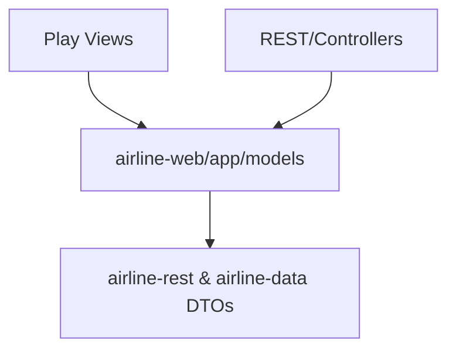

<!-- CATALOG:PATH="airline-web\app\models" SLUG="airline-web__app__models" -->

# Repo Catalogue — airline-web\app\models

*Slug:* `airline-web__app__models`  
*Commit:* `6160503`  
*Generated:* `2025-11-13T00:35:08Z`

Important note about listing completeness:
- The directory listing was retrieved via the GitHub Contents API, which pages results. Some items might not appear here due to pagination limits. For a complete view, browse the folder in GitHub: https://github.com/joshuac-dev/airline/tree/master/airline-web/app/models

**Summary (2–4 sentences):** Thin Play/Scala model layer for the airline-web UI, defining form DTOs and view models used by templates and controllers for auth flows, user profile, charting, and airport widgets. These types do not directly access the database; they structure request/response payloads and template bindings. Treat them as the public-facing contract between the web UI and backend endpoints in the rewrite, to be replaced with typed API DTOs (e.g., OpenAPI-generated models).

**Contents overview**
- Files: 10  |  Subfolders: 0  |  Languages: Scala (100%)
- Notable responsibilities:
  - Define forms for signup, password reset, forgot ID/password (validation elsewhere).
  - Provide simple view models for airport facilities, champions, link history charts, pending actions, and profile displays.
  - Encapsulate minimal UI-facing state without persistence or business logic.

### File entries

#### airline-web/app/models/AirportFacility.scala

```yaml
file: airline-web/app/models/AirportFacility.scala
lang: Scala
role: "View model for an airport facility (type, level, effects) for UI rendering"
size:
  lines_est: 25
  functions_est: 0
  classes_est: 1
public_api:
  routes: []
  exports:
    - name: AirportFacility
      kind: class
      summary: "Case class used by views to display facility details/levels"
data_model:
  tables_read: []
  tables_written: []
  migrations: []
  entities:
    - name: AirportFacility
      summary: "UI-facing snapshot of a facility at an airport"
queries:
  sql: []
  orm_calls: []
external_io:
  http_calls: []
  message_queues: []
  files_read: []
  files_written: []
config: {env_vars: [], config_keys: [], feature_flags: []}
concurrency:
  pattern: "N/A (immutable DTO)"
  shared_state: []
  timing: "on render"
invariants:
  - "Level within expected bounds when passed from backend"
error_handling:
  expected_errors: []
  retries_timeouts: "N/A"
security:
  authz: "N/A"
  input_validation: "N/A (validated upstream)"
  sensitive_ops: []
tests:
  files: []
  coverage_quality: "low"
  golden_seeds: []
similar_or_duplicate_files: []
rewrite_notes:
  mapping: "API DTO for facilities; typed enums for facility types"
  risks: ["Hidden assumptions about value ranges from server"]
  confidence: "high"
```

#### airline-web/app/models/AirportWithChampion.scala

```yaml
file: airline-web/app/models/AirportWithChampion.scala
lang: Scala
role: "View model combining an airport with its 'champion' (top airline)"
size:
  lines_est: 10
  functions_est: 0
  classes_est: 1
public_api:
  routes: []
  exports:
    - name: AirportWithChampion
      kind: class
      summary: "Airport + champion airline metadata for display blocks"
data_model:
  tables_read: []
  tables_written: []
  migrations: []
  entities:
    - name: AirportWithChampion
      summary: "Composite view of airport and leading carrier"
queries: {sql: [], orm_calls: []}
external_io: {http_calls: [], message_queues: [], files_read: [], files_written: []}
config: {env_vars: [], config_keys: [], feature_flags: []}
concurrency: {pattern: "N/A", shared_state: [], timing: "render"}
invariants:
  - "Champion fields may be optional if none"
error_handling: {}
security: {authz: "N/A", input_validation: "N/A", sensitive_ops: []}
tests: []
coverage_quality: "low"
golden_seeds: []
similar_or_duplicate_files: []
rewrite_notes:
  mapping: "DTO with explicit nullability/optional fields"
  risks: ["Assumes champion exists; handle empty state"]
  confidence: "high"
```

#### airline-web/app/models/Consideration.scala

```yaml
file: airline-web/app/models/Consideration.scala
lang: Scala
role: "Small model to capture a consideration/option (likely UI selection or suggestion)"
size:
  lines_est: 12
  functions_est: 0
  classes_est: 1
public_api:
  routes: []
  exports:
    - name: Consideration
      kind: class
      summary: "Label/value pair(s) for UI decisions"
data_model: {tables_read: [], tables_written: [], migrations: [], entities: [{name: Consideration, summary: "Generic UI model"}]}
queries: {sql: [], orm_calls: []}
external_io: {}
config: {env_vars: [], config_keys: [], feature_flags: []}
concurrency: {pattern: "N/A", shared_state: [], timing: "N/A"}
invariants: []
error_handling: {}
security: {authz: "N/A", input_validation: "N/A", sensitive_ops: []}
tests: []
coverage_quality: "low"
golden_seeds: []
similar_or_duplicate_files: []
rewrite_notes:
  mapping: "Use typed discriminated unions or explicit DTO types"
  risks: ["Over-generic; unclear domain meaning"]
  confidence: "low"
```

#### airline-web/app/models/ForgotId.scala

```yaml
file: airline-web/app/models/ForgotId.scala
lang: Scala
role: "Form DTO for requesting a forgotten user ID"
size:
  lines_est: 6
  functions_est: 0
  classes_est: 1
public_api:
  routes: []
  exports:
    - name: ForgotId
      kind: class
      summary: "Carries email or identifier to trigger ID reminder"
data_model: {tables_read: [], tables_written: [], migrations: [], entities: [{name: ForgotId, summary: "Auth recovery form"}]}
queries: {sql: [], orm_calls: []}
external_io: {}
config: {env_vars: [], config_keys: [], feature_flags: []}
concurrency: {pattern: "N/A", shared_state: [], timing: "request binding"}
invariants:
  - "Email format validated server-side"
error_handling: {}
security:
  authz: "Public form"
  input_validation: "Controller/form binding"
  sensitive_ops: ["PII (email)"]
tests: []
coverage_quality: "low"
golden_seeds: []
similar_or_duplicate_files:
  - "ForgotPassword.scala"
rewrite_notes:
  mapping: "OpenAPI form schema with validation"
  risks: ["PII handling and rate-limiting omitted here"]
  confidence: "high"
```

#### airline-web/app/models/ForgotPassword.scala

```yaml
file: airline-web/app/models/ForgotPassword.scala
lang: Scala
role: "Form DTO to initiate password reset (email input)"
size:
  lines_est: 8
  functions_est: 0
  classes_est: 1
public_api:
  routes: []
  exports:
    - name: ForgotPassword
      kind: class
      summary: "Captures email for reset flow"
data_model: {tables_read: [], tables_written: [], migrations: [], entities: [{name: ForgotPassword, summary: "Auth recovery form"}]}
queries: {sql: [], orm_calls: []}
external_io: {}
config: {}
concurrency: {pattern: "N/A", shared_state: [], timing: "request binding"}
invariants:
  - "Email required"
error_handling: {}
security:
  authz: "Public form"
  input_validation: "Server-side"
  sensitive_ops: ["PII (email)"]
tests: []
coverage_quality: "low"
golden_seeds: []
similar_or_duplicate_files:
  - "PasswordReset.scala"
rewrite_notes:
  mapping: "REST DTO + server rate-limit"
  risks: ["Spam if unprotected"]
  confidence: "high"
```

#### airline-web/app/models/LinkHistory.scala

```yaml
file: airline-web/app/models/LinkHistory.scala
lang: Scala
role: "Charting/summary DTO for link (route) history and trends"
size:
  lines_est: 18
  functions_est: 0
  classes_est: 1
public_api:
  routes: []
  exports:
    - name: LinkHistory
      kind: class
      summary: "Holds per-cycle series for charts (e.g., pax, revenue)"
data_model:
  tables_read: []
  tables_written: []
  migrations: []
  entities:
    - name: LinkHistory
      summary: "Time-series payload for UI graphs"
queries: {sql: [], orm_calls: []}
external_io: {}
config: {}
concurrency: {pattern: "N/A", shared_state: [], timing: "render"}
invariants:
  - "Cycle indices monotonic in series"
error_handling: {}
security: {authz: "N/A", input_validation: "N/A", sensitive_ops: []}
tests: []
coverage_quality: "low"
golden_seeds: []
similar_or_duplicate_files: []
rewrite_notes:
  mapping: "API DTO with typed units and categories"
  risks: ["Implicit units/scales undocumented"]
  confidence: "med"
```

#### airline-web/app/models/NewUser.scala

```yaml
file: airline-web/app/models/NewUser.scala
lang: Scala
role: "Signup form DTO for new account creation"
size:
  lines_est: 14
  functions_est: 0
  classes_est: 1
public_api:
  routes: []
  exports:
    - name: NewUser
      kind: class
      summary: "Carries username, email, password (and possibly display name)"
data_model: {tables_read: [], tables_written: [], migrations: [], entities: [{name: NewUser, summary: "Signup payload"}]}
queries: {sql: [], orm_calls: []}
external_io: {}
config: {}
concurrency: {pattern: "N/A", shared_state: [], timing: "request binding"}
invariants:
  - "Password complexity enforced upstream"
  - "Unique username validated upstream"
error_handling: {}
security:
  authz: "Public form"
  input_validation: "Server-side form binding"
  sensitive_ops: ["PII", "credential handling"]
tests: []
coverage_quality: "low"
golden_seeds: []
similar_or_duplicate_files:
  - "Profile.scala"
rewrite_notes:
  mapping: "OpenAPI DTO + server validations; include CAPTCHA"
  risks: ["Credential handling hygiene not represented here"]
  confidence: "high"
```

#### airline-web/app/models/PasswordReset.scala

```yaml
file: airline-web/app/models/PasswordReset.scala
lang: Scala
role: "Form DTO to reset password using token"
size:
  lines_est: 8
  functions_est: 0
  classes_est: 1
public_api:
  routes: []
  exports:
    - name: PasswordReset
      kind: class
      summary: "Carries reset token and new password"
data_model: {tables_read: [], tables_written: [], migrations: [], entities: [{name: PasswordReset, summary: "Reset payload"}]}
queries: {sql: [], orm_calls: []}
external_io: {}
config: {}
concurrency: {pattern: "N/A", shared_state: [], timing: "request binding"}
invariants:
  - "Token must be valid and unexpired (validated upstream)"
error_handling: {}
security:
  authz: "Token-gated"
  input_validation: "Server-side"
  sensitive_ops: ["credential handling"]
tests: []
coverage_quality: "low"
golden_seeds: []
similar_or_duplicate_files:
  - "ForgotPassword.scala"
rewrite_notes:
  mapping: "DTO with password policy; avoid logging"
  risks: ["Token leakage if mishandled by callers"]
  confidence: "high"
```

#### airline-web/app/models/PendingAction.scala

```yaml
file: airline-web/app/models/PendingAction.scala
lang: Scala
role: "View model for pending actions/notifications awaiting user input"
size:
  lines_est: 18
  functions_est: 0
  classes_est: 1
public_api:
  routes: []
  exports:
    - name: PendingAction
      kind: class
      summary: "Represents UI tasks (e.g., verify email, complete profile)"
data_model: {tables_read: [], tables_written: [], migrations: [], entities: [{name: PendingAction, summary: "UI task item"}]}
queries: {sql: [], orm_calls: []}
external_io: {}
config: {}
concurrency: {pattern: "N/A", shared_state: [], timing: "render"}
invariants:
  - "Status enumerations aligned with backend"
error_handling: {}
security: {authz: "N/A", input_validation: "N/A", sensitive_ops: []}
tests: []
coverage_quality: "low"
golden_seeds: []
similar_or_duplicate_files: []
rewrite_notes:
  mapping: "Define enum and status workflow in API"
  risks: ["Stringly-typed statuses cause drift"]
  confidence: "med"
```

#### airline-web/app/models/Profile.scala

```yaml
file: airline-web/app/models/Profile.scala
lang: Scala
role: "Profile DTO for displaying/editing user information"
size:
  lines_est: 16
  functions_est: 0
  classes_est: 1
public_api:
  routes: []
  exports:
    - name: Profile
      kind: class
      summary: "Display name, contact info, and preferences (non-auth)"
data_model: {tables_read: [], tables_written: [], migrations: [], entities: [{name: Profile, summary: "User profile view model"}]}
queries: {sql: [], orm_calls: []}
external_io: {}
config: {}
concurrency: {pattern: "N/A", shared_state: [], timing: "render/edit"}
invariants:
  - "Fields sanitized before display"
error_handling: {}
security:
  authz: "User session"
  input_validation: "Server-side when editing"
  sensitive_ops: ["PII"]
tests: []
coverage_quality: "low"
golden_seeds: []
similar_or_duplicate_files:
  - "NewUser.scala"
rewrite_notes:
  mapping: "Profile DTO with privacy/redaction policies"
  risks: ["PII exposure if echoed unsafely"]
  confidence: "high"
```

## Rollup for airline-web\app\models

**Key responsibilities (top 5):**
1. Define web-layer DTOs for forms (signup, recovery, password reset) and simple view models (profile, facilities, champions, link charts).
2. Provide type-safe bindings between Play controllers/views and backend services without direct DB access.
3. Encapsulate UI-facing state with minimal invariants (validation in controllers/services).
4. Act as the implicit API contract for the legacy web app.
5. Carry PII/credential-related inputs that must be validated and protected by upstream code.

**Cross-module dependencies (top 10 by frequency):**
- airline-web/app/views → templates import these models for rendering/binding (forms, profile, widgets).
- airline-rest → controllers serialize/deserialize equivalent payloads; models should align with REST schemas.
- airline-data/com.patson.data → backend sources generating series (LinkHistory) and airport meta (AirportFacility, champion).
- Authentication/session middleware → governs who can edit/view Profile and invoke reset flows.
- Validation utilities (in controllers or forms) → enforce email/password policies for NewUser/Forgot*/PasswordReset.

**High-leverage files to study first (top 10):**
- models/NewUser.scala — onboarding constraints and required fields.
- models/PasswordReset.scala — reset token + password policy implications.
- models/ForgotPassword.scala — rate limiting and abuse prevention concerns.
- models/Profile.scala — PII footprint and edit pathways.
- models/LinkHistory.scala — expected time-series shape for charts.
- models/AirportFacility.scala — mapping from backend asset/facility schema.
- models/AirportWithChampion.scala — optional champion semantics and source.
- models/PendingAction.scala — lifecycle and enum values for tasks.
- models/ForgotId.scala — email-only recovery form.
- models/Consideration.scala — generic model; firm up semantics in rewrite.

**Mermaid: high-level dependency sketch**
