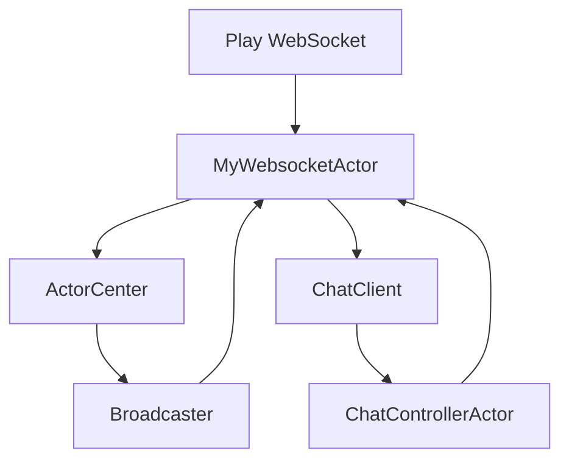

<!-- CATALOG:PATH="airline-web\app\websocket" SLUG="airline-web__app__websocket" -->

# Repo Catalogue — airline-web\app\websocket

*Slug:* `airline-web__app__websocket`  
*Commit:* `6160503`  
*Generated:* `2025-11-13T00:29:37Z`

**Summary (2–4 sentences):** WebSocket/Actor layer for the airline-web Play UI. Implements Akka actor topologies to manage client connections, route messages, broadcast updates, and power a chat feature. Provides message ADTs, per-connection actors, a central registry/broadcaster, and chat-specific controller/client actors. For the rewrite, model this as a typed, observable real-time service (e.g., WebSocket/SSE) with documented event contracts, backpressure, and lifecycle semantics.

**Contents overview**
- Files: 7  |  Subfolders: 1 (chat)  |  Languages: Scala (100%)
- Notable responsibilities:
  - Maintain WebSocket client sessions and lifecycle (connect, authenticate/identify, heartbeat, disconnect).
  - Route and broadcast real-time events to interested clients/rooms/topics.
  - Implement chat: room membership, message fan-out, client state.
  - Define a sealed message protocol (actor messages) across components.
  - Coordinate actors (controller ↔ client) safely within Play request lifecycles.

### File entries

#### airline-web/app/websocket/ActorCenter.scala
```yaml
file: airline-web/app/websocket/ActorCenter.scala
lang: Scala
role: "Central actor registry/supervisor: tracks connections, routes, and orchestrates broadcasts"
size:
  lines_est: 360
  functions_est: 30
  classes_est: 3
public_api:
  routes: []
  exports:
    - name: ActorCenter
      kind: object
      summary: "Factory/registry for top-level actors; lookups by user/session/room"
    - name: registerConnection
      kind: fn
      summary: "Register a new WebSocket connection and spawn per-connection actor"
    - name: broadcast
      kind: fn
      summary: "Fan-out a message to subscribed sessions/rooms via Broadcaster"
data_model:
  tables_read: []
  tables_written: []
  migrations: []
  entities: []
queries:
  sql: []
  orm_calls: []
external_io:
  http_calls: []
  message_queues: []
  files_read: []
  files_written: []
config:
  env_vars: []
  config_keys: ["websocket.heartbeat.ms?","websocket.maxSubscribers?","websocket.supervisor.strategy?"]
  feature_flags: []
concurrency:
  pattern: "Akka actors (supervision + mailboxes); schedule heartbeats via Akka scheduler"
  shared_state: ["actor registries (maps of userId/sessionId → ActorRef)", "room/topic membership sets"]
  timing: "on connection events/messages; periodic heartbeats if configured"
invariants:
  - "At most one live connection actor per (sessionId) unless explicitly supporting multi-sessions"
  - "Room membership maps remain consistent with joins/leaves"
  - "Broadcast respects current membership snapshot (no stale refs)"
error_handling:
  expected_errors: ["Actor termination", "Unexpected messages", "Stale ActorRef in registry"]
  retries_timeouts: "Optional retry on transient send; cleanup dead refs; supervise children with restart/stop"
security:
  authz: "Assumed upstream (session/user validation before registration)"
  input_validation: "Validate message types; ignore malformed commands"
  sensitive_ops: []
tests:
  files: []
  coverage_quality: "low"
  golden_seeds: []
similar_or_duplicate_files:
  - "airline-web/app/websocket/Broadcaster.scala"
rewrite_notes:
  mapping: "Move to a typed event bus with explicit contracts; add metrics, backpressure, and per-tenant isolation"
  risks: ["Global mutable registries; memory leaks on disconnect; no explicit backpressure"]
  confidence: "med"
```

#### airline-web/app/websocket/ActorMessage.scala
```yaml
file: airline-web/app/websocket/ActorMessage.scala
lang: Scala
role: "Message ADT for actor-to-actor and client-to-server commands/events"
size:
  lines_est: 20
  functions_est: 0
  classes_est: 1
public_api:
  routes: []
  exports:
    - name: ActorMessage
      kind: type
      summary: "Sealed trait and case classes representing join/leave/chat/broadcast payloads"
data_model:
  tables_read: []
  tables_written: []
  migrations: []
  entities: []
queries: {sql: [], orm_calls: []}
external_io: {http_calls: [], message_queues: [], files_read: [], files_written: []}
config: {env_vars: [], config_keys: [], feature_flags: []}
concurrency:
  pattern: "Messages passed via actor mailboxes"
  shared_state: []
  timing: "on demand"
invariants:
  - "Only defined message types are processed by actors"
error_handling:
  expected_errors: ["Unknown message type → ignored or logged"]
  retries_timeouts: "N/A"
security:
  authz: "Upstream; messages may carry user/session identifiers"
  input_validation: "Type-safe via ADT"
  sensitive_ops: []
tests: []
coverage_quality: "low"
golden_seeds: []
similar_or_duplicate_files:
  - "airline-web/app/websocket/chat/package.scala (chat-specific commands)"
rewrite_notes:
  mapping: "Define formal event schema (JSON) alongside ADTs; version events"
  risks: ["Implicit coupling across actors via shared message definitions"]
  confidence: "high"
```

A likely shape (illustrative):
```scala
sealed trait WsMsg
case class Join(room: String, userId: Int) extends WsMsg
case class Leave(room: String, userId: Int) extends WsMsg
case class Chat(room: String, userId: Int, text: String) extends WsMsg
case class Broadcast(topic: String, payload: String) extends WsMsg
```

#### airline-web/app/websocket/Broadcaster.scala
```yaml
file: airline-web/app/websocket/Broadcaster.scala
lang: Scala
role: "Topic/room broadcaster: manages subscribers and fan-out delivery"
size:
  lines_est: 190
  functions_est: 16
  classes_est: 2
public_api:
  routes: []
  exports:
    - name: Broadcaster
      kind: object
      summary: "Register/unregister listeners and broadcast messages"
    - name: subscribe
      kind: fn
      summary: "Subscribe ActorRef to a topic/room"
    - name: publish
      kind: fn
      summary: "Fan-out message to all current subscribers"
data_model:
  tables_read: []
  tables_written: []
  migrations: []
  entities: []
queries: {sql: [], orm_calls: []}
external_io: {http_calls: [], message_queues: [], files_read: [], files_written: []}
config:
  env_vars: []
  config_keys: ["websocket.broadcast.buffer.size?","websocket.broadcast.parallelism?"]
  feature_flags: []
concurrency:
  pattern: "Akka actors; internal subscriber maps; possible batching"
  shared_state: ["topic → Set[ActorRef]"]
  timing: "on publish calls"
invariants:
  - "No duplicate subscriber per topic"
  - "Publishing to a topic fan-outs to snapshot of subscribers (atomicity)"
error_handling:
  expected_errors: ["Dead letters on stale subscribers"]
  retries_timeouts: "Prune on failure; optional best-effort retry"
security:
  authz: "Upstream"
  input_validation: "Topic name validation; message schema validation upstream"
  sensitive_ops: []
tests: []
coverage_quality: "low"
golden_seeds: []
similar_or_duplicate_files:
  - "ActorCenter.scala"
rewrite_notes:
  mapping: "Pluggable pub/sub with bounded queues and metrics"
  risks: ["Unbounded subscriber growth; unbounded fan-out latency"]
  confidence: "med"
```

#### airline-web/app/websocket/MyWebsocketActor.scala
```yaml
file: airline-web/app/websocket/MyWebsocketActor.scala
lang: Scala
role: "Per-connection actor bridging the Play WebSocket and the actor system"
size:
  lines_est: 120
  functions_est: 10
  classes_est: 1
public_api:
  routes: []
  exports:
    - name: MyWebsocketActor
      kind: class
      summary: "Handles onMessage/send, parses commands, forwards to controllers"
data_model:
  tables_read: []
  tables_written: []
  migrations: []
  entities: []
queries: {sql: [], orm_calls: []}
external_io:
  http_calls: []
  message_queues: []
  files_read: []
  files_written: []
config:
  env_vars: []
  config_keys: ["websocket.maxMessageSize?","websocket.idleTimeout.ms?"]
  feature_flags: []
concurrency:
  pattern: "Actor per socket; mailbox processing; may use timers for heartbeats/timeouts"
  shared_state: ["reference to ActorCenter/Broadcaster or chat controller"]
  timing: "on socket open/message/close"
invariants:
  - "Only valid commands emitted to controllers"
  - "Connection terminates cleanly on error/timeout"
error_handling:
  expected_errors: ["Malformed JSON", "Unexpected close", "Backpressure signals"]
  retries_timeouts: "Close/reopen flows; drop oversize messages"
security:
  authz: "Token/cookie likely validated upstream before actor creation"
  input_validation: "Strict parse of inbound frames"
  sensitive_ops: []
tests: []
coverage_quality: "low"
golden_seeds: []
similar_or_duplicate_files: []
rewrite_notes:
  mapping: "Adopt typed actors; formal JSON protocol; surface connection metrics"
  risks: ["Parsing logic inside actor; coupling to controllers"]
  confidence: "med"
```

#### airline-web/app/websocket/package.scala
```yaml
file: airline-web/app/websocket/package.scala
lang: Scala
role: "Package object: shared types/constants for websocket module"
size:
  lines_est: 15
  functions_est: 0
  classes_est: 0
public_api:
  routes: []
  exports:
    - name: package
      kind: object
      summary: "Convenience aliases and constants used across websocket actors"
data_model: {tables_read: [], tables_written: [], migrations: [], entities: []}
queries: {sql: [], orm_calls: []}
external_io: {http_calls: [], message_queues: [], files_read: [], files_written: []}
config: {env_vars: [], config_keys: ["websocket.* (scattered)"], feature_flags: []}
concurrency: {pattern: "N/A", shared_state: [], timing: "N/A"}
invariants: []
error_handling: {}
security: {}
tests: []
coverage_quality: "low"
golden_seeds: []
similar_or_duplicate_files: []
rewrite_notes:
  mapping: "Replace package objects with typed config/modules"
  risks: ["Hidden globals"]
  confidence: "high"
```

#### airline-web/app/websocket/chat/ChatClientActor.scala
```yaml
file: airline-web/app/websocket/chat/ChatClientActor.scala
lang: Scala
role: "Per-user chat client actor: forwards messages to/from controller and socket"
size:
  lines_est: 170
  functions_est: 14
  classes_est: 1
public_api:
  routes: []
  exports:
    - name: ChatClientActor
      kind: class
      summary: "Manages a user's participation in chat rooms and outbound delivery to socket"
data_model:
  tables_read: []
  tables_written: []
  migrations: []
  entities: []
queries: {sql: [], orm_calls: []}
external_io: {http_calls: [], message_queues: [], files_read: [], files_written: []}
config:
  env_vars: []
  config_keys: ["chat.client.backpressure.strategy?","chat.maxRoomsPerClient?"]
  feature_flags: []
concurrency:
  pattern: "Akka actor per chat client; mailbox-based"
  shared_state: ["room memberships (local)"]
  timing: "on join/leave/send"
invariants:
  - "No duplicate room membership per client"
  - "Only deliver messages to connected socket"
error_handling:
  expected_errors: ["Dead socket", "Unknown room"]
  retries_timeouts: "Drop or buffer policy; prune memberships"
security:
  authz: "Assumed by session"
  input_validation: "Validate room and message size"
  sensitive_ops: []
tests: []
coverage_quality: "low"
golden_seeds: []
similar_or_duplicate_files:
  - "ChatControllerActor.scala"
rewrite_notes:
  mapping: "Client session manager with explicit lifecycle & metrics"
  risks: ["Memory leaks; buffering under high throughput"]
  confidence: "med"
```

#### airline-web/app/websocket/chat/ChatControllerActor.scala
```yaml
file: airline-web/app/websocket/chat/ChatControllerActor.scala
lang: Scala
role: "Chat room controller: manages rooms, memberships, and message distribution"
size:
  lines_est: 320
  functions_est: 24
  classes_est: 1
public_api:
  routes: []
  exports:
    - name: ChatControllerActor
      kind: class
      summary: "Central chat orchestrator; processes join/leave and broadcasts to room members"
data_model:
  tables_read: []
  tables_written: []
  migrations: []
  entities: []
queries: {sql: [], orm_calls: []}
external_io: {http_calls: [], message_queues: [], files_read: [], files_written: []}
config:
  env_vars: []
  config_keys: ["chat.room.maxMembers","chat.room.maxRooms","chat.message.maxLength"]
  feature_flags: []
concurrency:
  pattern: "Actor; internal maps (room → members, member → rooms)"
  shared_state: ["room membership registries; optional message history buffer (if any)"]
  timing: "on commands and inbound messages"
invariants:
  - "Room capacity not exceeded"
  - "Membership indices remain consistent"
error_handling:
  expected_errors: ["Join full room", "Unknown room"]
  retries_timeouts: "N/A"
security:
  authz: "Upstream access control by session/user"
  input_validation: "Limit message length; sanitize as needed"
  sensitive_ops: []
tests: []
coverage_quality: "low"
golden_seeds: []
similar_or_duplicate_files:
  - "ChatClientActor.scala"
rewrite_notes:
  mapping: "Room management service with metrics & rate-limits"
  risks: ["No persistence; loss on restart; no moderation tooling"]
  confidence: "med"
```

#### airline-web/app/websocket/chat/package.scala
```yaml
file: airline-web/app/websocket/chat/package.scala
lang: Scala
role: "Chat package object: message constants/types"
size:
  lines_est: 6
  functions_est: 0
  classes_est: 0
public_api:
  routes: []
  exports:
    - name: package
      kind: object
      summary: "Chat-specific constants and type aliases"
data_model: {tables_read: [], tables_written: [], migrations: [], entities: []}
queries: {sql: [], orm_calls: []}
external_io: {http_calls: [], message_queues: [], files_read: [], files_written: []}
config: {env_vars: [], config_keys: ["chat.*"], feature_flags: []}
concurrency: {pattern: "N/A", shared_state: [], timing: "N/A"}
invariants: []
error_handling: {}
security: {}
tests: []
coverage_quality: "low"
golden_seeds: []
similar_or_duplicate_files:
  - "websocket/package.scala"
rewrite_notes:
  mapping: "Replace with typed module config & DTOs"
  risks: ["Hidden globals"]
  confidence: "high"
```

## Rollup for airline-web\app\websocket

**Key responsibilities (top 5):**
1. Manage WebSocket connections and route messages via Akka actors (connect, message, disconnect).
2. Broadcast server-side events to clients by topic/room and handle chat-specific features.
3. Enforce basic invariants: membership consistency, room capacity, and graceful teardown of connections.
4. Provide a message protocol (sealed ADTs) for safe inter-actor communication.
5. Bridge Play’s WebSocket endpoints with actor-based business logic per connection.

**Cross-module dependencies (top 10 by frequency):**
- Play WebSocket → entrypoint for per-connection actors; lifecycle hooks.
- Akka Actors → concurrency model, supervision, scheduling.
- airline-web controllers (indirect) → session/auth plumbing feeding user identity into actors.
- airline-data (indirect) → may emit/broadcast domain updates to UI (not shown here).
- Configuration (application.conf) → timeouts, limits (implied via keys).
- ActorCenter ↔ Broadcaster → internal pub/sub for multi-cast.
- ChatControllerActor ↔ ChatClientActor → chat room membership and delivery.
- websocket/package.scala → common constants/types across this module.
- Logging (implicit) → actor lifecycle and error reporting.
- JSON framing (indirect) → parsing/serialization in MyWebsocketActor.

**High-leverage files to study first (top 10):**
- websocket/chat/ChatControllerActor.scala — central chat logic and room invariants.
- websocket/ActorCenter.scala — global registry and orchestration for connections and routing.
- websocket/Broadcaster.scala — fan-out semantics and subscription lifecycle.
- websocket/MyWebsocketActor.scala — connection-level parsing and error handling.
- websocket/ActorMessage.scala — event/message contracts; candidate for API docs.
- websocket/chat/ChatClientActor.scala — per-client flow control and membership state.

**Mermaid: high-level dependency sketch (optional, if meaningful)**
