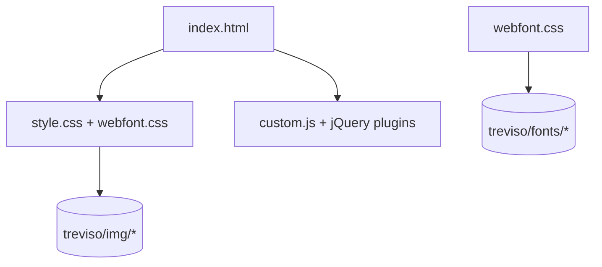

<!-- CATALOG:PATH="airline-web\public\css-templates" SLUG="airline-web__public__css-templates" -->

# Repo Catalogue — airline-web\public\css-templates

*Slug:* `airline-web__public__css-templates`  
*Commit:* `n/a`  
*Generated:* `2025-11-13T01:08:48Z`

**Summary (2–4 sentences):** Legacy, third‑party HTML/CSS template bundle (“Treviso”) included under public assets. It contains a standalone landing page (index.html), page styles, webfont CSS, and a set of vendored jQuery plugins for carousels, filtering, and responsive slides, plus fonts and images. This appears to be an example/template site unrelated to the airline gameplay UI and likely unused by core pages. Treat it as sample/marketing template; in the rewrite, either drop it or migrate any reusable visual patterns into the design system.

**Contents overview**
- Files: 12+ (excluding binary assets and OS metadata)  |  Subfolders: 1 (treviso)  |  Languages: HTML (~20%), CSS (~25%), JavaScript (~55%), Binary assets (fonts/images)
- Notable responsibilities:
  - Standalone landing/demo page (index.html) styled by template CSS.
  - Template-specific styles (style.css, webfont.css) and web fonts/images.
  - Vendored jQuery and plugins for UI effects (carousel, mixitup filtering, responsive slides).
  - Design artifacts (PSD) and macOS metadata; not needed for production.

### File entries

#### airline-web/public/css-templates/treviso/index.html

```yaml
file: airline-web/public/css-templates/treviso/index.html
lang: HTML
role: "Standalone template landing page (unrelated to main app UI)"
size:
  lines_est: 550
  functions_est: 0
  classes_est: 0
public_api:
  routes: []
  exports: []
data_model:
  tables_read: []
  tables_written: []
  migrations: []
  entities: []
queries: { sql: [], orm_calls: [] }
external_io: {}
config: {}
concurrency:
  pattern: "N/A (static markup)"
  shared_state: []
  timing: "N/A"
invariants:
  - "References template CSS/JS under treviso/css and treviso/js"
error_handling: {}
security: { authz: "public asset", input_validation: "N/A", sensitive_ops: [] }
tests: { files: [], coverage_quality: "low" }
similar_or_duplicate_files: []
rewrite_notes:
  mapping: "Do not port as-is; if a marketing page is needed, rebuild with the new design system and remove template dependencies"
  risks: ["Drift from main app look/feel; unused in production"]
  confidence: "med"
```

#### airline-web/public/css-templates/treviso/css/style.css

```yaml
file: airline-web/public/css-templates/treviso/css/style.css
lang: CSS
role: "Template page styles (layout, typography, components)"
size:
  lines_est: 500
  functions_est: 0
  classes_est: 0
public_api: {}
data_model: {}
queries: {}
external_io: {}
config: {}
concurrency: { pattern: "N/A" }
invariants:
  - "Coupled to template HTML structure"
rewrite_notes:
  mapping: "Discard or selectively migrate patterns into design tokens/components"
  risks: ["Global selectors; specificity clashes if mixed with app CSS"]
  confidence: "high"
```

#### airline-web/public/css-templates/treviso/css/webfont.css

```yaml
file: airline-web/public/css-templates/treviso/css/webfont.css
lang: CSS
role: "Webfont @font-face declarations for the template"
size:
  lines_est: 130
  functions_est: 0
  classes_est: 0
public_api: {}
data_model: {}
queries: {}
external_io: { files_read: ["../fonts/*"] }
config: {}
concurrency: { pattern: "N/A" }
invariants:
  - "Font URLs resolve to treviso/fonts/*"
rewrite_notes:
  mapping: "Use app-wide font strategy; ensure licensing for fonts, or replace with open alternatives"
  risks: ["Font licensing; redundant font stacks"]
  confidence: "high"
```

#### airline-web/public/css-templates/treviso/js/custom.js

```yaml
file: airline-web/public/css-templates/treviso/js/custom.js
lang: JavaScript
role: "Template-specific initialization (carousels, filters, sliders)"
size:
  lines_est: 150
  functions_est: 10
  classes_est: 0
public_api: {}
data_model: {}
queries: {}
external_io: {}
config: {}
concurrency:
  pattern: "DOM ready handlers (jQuery)"
  shared_state: []
  timing: "on page load"
invariants:
  - "Assumes jQuery and vendor plugins present"
rewrite_notes:
  mapping: "Omit; use framework components for any needed effects"
  risks: ["jQuery dependency; tight coupling to template HTML"]
  confidence: "high"
```

#### airline-web/public/css-templates/treviso/js/jquery.min.js

```yaml
file: airline-web/public/css-templates/treviso/js/jquery.min.js
lang: JavaScript (minified vendor)
role: "Vendored jQuery runtime (template dependency)"
size:
  lines_est: 3000
  functions_est: 200
  classes_est: 0
public_api: {}
rewrite_notes:
  mapping: "Remove; do not vendor jQuery in the rewrite"
  risks: ["Legacy patterns creep into new stack"]
  confidence: "high"
```

#### airline-web/public/css-templates/treviso/js/jquery.jcarousel.js

```yaml
file: airline-web/public/css-templates/treviso/js/jquery.jcarousel.js
lang: JavaScript
role: "Carousel plugin (unminified) for jQuery"
size:
  lines_est: 1050
  functions_est: 60
  classes_est: 0
public_api: {}
rewrite_notes:
  mapping: "Replace with native/carousel component in new UI"
  risks: ["Vendor coupling; accessibility gaps"]
  confidence: "high"
```

#### airline-web/public/css-templates/treviso/js/jquery.jcarousel.min.js

```yaml
file: airline-web/public/css-templates/treviso/js/jquery.jcarousel.min.js
lang: JavaScript (minified vendor)
role: "Carousel plugin (minified) for jQuery"
size:
  lines_est: 450
  functions_est: 30
  classes_est: 0
public_api: {}
rewrite_notes:
  mapping: "Do not carry forward; use accessible carousel component"
  risks: []
  confidence: "high"
```

#### airline-web/public/css-templates/treviso/js/jquery.mixitup.js

```yaml
file: airline-web/public/css-templates/treviso/js/jquery.mixitup.js
lang: JavaScript
role: "Filtering/sorting plugin for galleries/grids"
size:
  lines_est: 1050
  functions_est: 55
  classes_est: 0
public_api: {}
rewrite_notes:
  mapping: "Use framework-driven filtering/sorting; avoid jQuery plugin"
  risks: ["Performance; accessibility"]
  confidence: "high"
```

#### airline-web/public/css-templates/treviso/js/jquery.mixitup.min.js

```yaml
file: airline-web/public/css-templates/treviso/js/jquery.mixitup.min.js
lang: JavaScript (minified vendor)
role: "Minified build of mixitup plugin"
size:
  lines_est: 400
  functions_est: 20
  classes_est: 0
public_api: {}
rewrite_notes:
  mapping: "Drop"
  risks: []
  confidence: "high"
```

#### airline-web/public/css-templates/treviso/js/responsiveslides.js

```yaml
file: airline-web/public/css-templates/treviso/js/responsiveslides.js
lang: JavaScript
role: "Responsive slideshow plugin (unminified)"
size:
  lines_est: 350
  functions_est: 25
  classes_est: 0
public_api: {}
rewrite_notes:
  mapping: "Use a11y-first slideshow component in new stack"
  risks: ["Keyboard & ARIA coverage unclear"]
  confidence: "high"
```

#### airline-web/public/css-templates/treviso/js/responsiveslides.min.js

```yaml
file: airline-web/public/css-templates/treviso/js/responsiveslides.min.js
lang: JavaScript (minified vendor)
role: "Minified slideshow plugin"
size:
  lines_est: 120
  functions_est: 10
  classes_est: 0
public_api: {}
rewrite_notes:
  mapping: "Drop; replace with modern component"
  risks: []
  confidence: "high"
```

#### airline-web/public/css-templates/treviso/fonts (aggregated assets)

```yaml
file: airline-web/public/css-templates/treviso/fonts
lang: Binary assets (fonts)
role: "Webfont files referenced by webfont.css"
size:
  lines_est: 0
  functions_est: 0
  classes_est: 0
public_api: {}
external_io: { files_read: ["*.woff|*.ttf|*.eot|*.svg"] }
rewrite_notes:
  mapping: "Verify licensing; consolidate fonts under app-wide strategy"
  risks: ["License violations; payload size"]
  confidence: "high"
```

#### airline-web/public/css-templates/treviso/img (aggregated assets)

```yaml
file: airline-web/public/css-templates/treviso/img
lang: Images (PNG/JPG/SVG)
role: "Template-specific imagery (banners, icons)"
size:
  lines_est: 0
  functions_est: 0
  classes_est: 0
public_api: {}
rewrite_notes:
  mapping: "Do not port; replace with app brand assets if needed"
  risks: ["Bloat; inconsistent style"]
  confidence: "high"
```

#### airline-web/public/css-templates/treviso/PSD (aggregated assets)

```yaml
file: airline-web/public/css-templates/treviso/PSD
lang: Binary design assets (PSD)
role: "Photoshop source files for the template"
size:
  lines_est: 0
  functions_est: 0
  classes_est: 0
public_api: {}
rewrite_notes:
  mapping: "Exclude from product; archive separately if needed"
  risks: ["Large binaries; irrelevant to runtime"]
  confidence: "high"
```

#### airline-web/public/css-templates/treviso/__MACOSX (system metadata)

```yaml
file: airline-web/public/css-templates/treviso/__MACOSX
lang: System metadata
role: "macOS archive metadata; safe to remove"
size:
  lines_est: 0
  functions_est: 0
  classes_est: 0
public_api: {}
rewrite_notes:
  mapping: "Delete"
  risks: []
  confidence: "high"
```

### Skipped OS metadata
- .DS_Store files in treviso and subfolders — ignored; remove from repo.

## Rollup for airline-web\public\css-templates

**Key responsibilities (top 5):**
1. Provide a standalone, third‑party template site (HTML/CSS/JS) unrelated to core application flows.
2. Bundle vendored jQuery and plugins for carousels, galleries, and slideshows.
3. Include template-specific webfonts and images referenced by the template.
4. Ship design artifacts (PSD) and macOS archive metadata (unnecessary in repo).
5. Serve as visual reference only; no integration with the airline domain logic.

**Cross-module dependencies (top 10 by frequency):**
- None detected across the main app; template stack is self-contained and jQuery-based.
- webfont.css → treviso/fonts/* — font pipeline for the template only.
- custom.js → jQuery + plugin files in treviso/js — initialization coupling.

**High-leverage files to study first (top 10):**
- treviso/index.html — verify if this template is linked or referenced anywhere; likely safe to remove.
- treviso/css/style.css — identify any patterns worth migrating into new design tokens (if any).
- treviso/css/webfont.css — check font licensing before considering reuse.
- treviso/js/custom.js — confirms jQuery plugin dependencies and usage scope.
- treviso/js/jquery.* and responsiveslides* — vendor footprint to eliminate.

**Mermaid: high-level dependency sketch (optional, if meaningful)**
