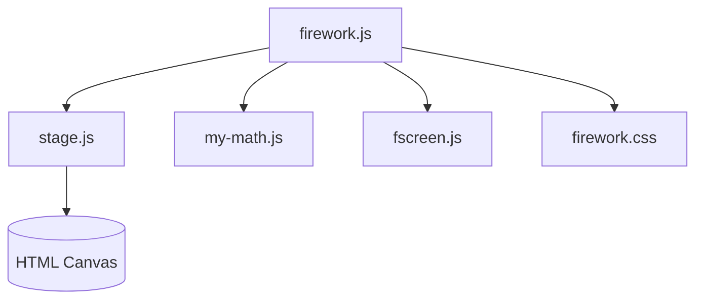

<!-- CATALOG:PATH="airline-web\public\firework" SLUG="airline-web__public__firework" -->

# Repo Catalogue — airline-web\public\firework

*Slug:* `airline-web__public__firework`  
*Commit:* `6160503`  
*Generated:* `2025-11-13T01:04:28Z`

**Summary (2–4 sentences):** Canvas-based fireworks animation shown for celebrations (e.g., event rewards) in the web UI. This module contains the rendering engine (particle system), stage/canvas orchestration, math helpers, and a fullscreen utility, plus minimal CSS for layout and overlay. It runs entirely in-browser via requestAnimationFrame with no backend calls, and should be gated by "reduced motion" accessibility preferences in the rewrite.

**Contents overview**
- Files: 5  |  Subfolders: 0  |  Languages: JavaScript (~95%), CSS (~5%)
- Notable responsibilities:
  - Particle-based fireworks rendering and scheduling on an HTML canvas.
  - Stage management (canvas sizing, DPR scaling, RAF loop, lifecycle).
  - Cross-browser fullscreen helper for immersive effects.
  - Math utilities for particle trajectories, bursts, easing, and randomness.
  - Styles for overlay placement and visibility.

### File entries

#### airline-web/public/firework/firework.css

```yaml
file: airline-web/public/firework/firework.css
lang: CSS
role: "Overlay and canvas styling for the fireworks effect"
size:
  lines_est: 40
  functions_est: 0
  classes_est: 0
public_api:
  routes: []
  exports: []
data_model:
  tables_read: []
  tables_written: []
  migrations: []
  entities: []
queries:
  sql: []
  orm_calls: []
external_io:
  http_calls: []
  message_queues: []
  files_read: []
  files_written: []
config:
  env_vars: []
  config_keys: []
  feature_flags: []
concurrency:
  pattern: "N/A (static stylesheet)"
  shared_state: []
  timing: "applies when effect mounts"
invariants:
  - "Canvas overlay does not block essential UI controls unless intended (e.g., modal/showcase)"
  - "Z-index consistent with modals/alerts"
error_handling:
  expected_errors: []
  retries_timeouts: "N/A"
security:
  authz: "N/A"
  input_validation: "N/A"
  sensitive_ops: []
tests:
  files: []
  coverage_quality: "low"
  golden_seeds: []
similar_or_duplicate_files:
  - "airline-web/public/javascripts/confetti.js (visual celebration overlap)"
rewrite_notes:
  mapping: "Component-scoped styles; integrate with design tokens; honor prefers-reduced-motion"
  risks: ["Global selectors colliding with app overlays"]
  confidence: "high"
```

#### airline-web/public/firework/firework.js

```yaml
file: airline-web/public/firework/firework.js
lang: JavaScript
role: "Main fireworks engine: particles, bursts, scheduling, rendering"
size:
  lines_est: 1800
  functions_est: 120
  classes_est: 0
public_api:
  routes: []
  exports:
    - name: initFireworks
      kind: fn
      summary: "Initialize the fireworks display on a given canvas or container"
    - name: start
      kind: fn
      summary: "Begin the animation loop and schedule bursts"
    - name: stop
      kind: fn
      summary: "Stop the loop and cleanup resources"
    - name: triggerBurst
      kind: fn
      summary: "Manually spawn a new firework/burst at position with options"
data_model:
  tables_read: []
  tables_written: []
  migrations: []
  entities: []
queries:
  sql: []
  orm_calls: []
external_io:
  http_calls: []
  message_queues: []
  files_read: []
  files_written: []
config:
  env_vars: []
  config_keys:
    - "firework.density"
    - "firework.maxParticles"
    - "firework.palette"
    - "firework.fpsCap"
  feature_flags:
    - "fx.fireworks.enabled"
concurrency:
  pattern: "Browser event loop with requestAnimationFrame; no workers"
  shared_state:
    - "Global RAF handle"
    - "Particle arrays/pools"
    - "Timing/scheduling state"
  timing: "Frame updates (~60Hz); optional FPS cap via time delta"
invariants:
  - "Particle lifetime must expire and recycle to avoid leaks"
  - "Particle count ≤ configured max at all times"
  - "Delta time integration keeps motion stable across FPS variance"
error_handling:
  expected_errors: ["Canvas/context unavailable", "Out-of-memory if particle cap not enforced"]
  retries_timeouts: "Re-init on context loss; skip frame on errors"
security:
  authz: "N/A"
  input_validation: "Clamp user-provided parameters (density, size, speed) to safe bounds"
  sensitive_ops: []
tests:
  files: []
  coverage_quality: "low"
  golden_seeds: []
similar_or_duplicate_files:
  - "airline-web/public/javascripts/confetti.js"
rewrite_notes:
  mapping: "Encapsulate as a UI component (e.g., React/Vue/Svelte) using Canvas or WebGL; add prefers-reduced-motion guard and visibility/power heuristics; consider OffscreenCanvas/worker for heavy scenes"
  risks:
    - "Large monolithic script; hidden globals"
    - "Performance on low-end devices without FPS cap"
  confidence: "med"
```

#### airline-web/public/firework/fscreen.js

```yaml
file: airline-web/public/firework/fscreen.js
lang: JavaScript
role: "Cross-browser Fullscreen API wrapper"
size:
  lines_est: 70
  functions_est: 6
  classes_est: 0
public_api:
  routes: []
  exports:
    - name: requestFullscreen
      kind: fn
      summary: "Enter fullscreen on an element using vendor-prefixed APIs as needed"
    - name: exitFullscreen
      kind: fn
      summary: "Exit fullscreen mode"
    - name: onFullscreenChange
      kind: fn
      summary: "Register fullscreenchange listener"
data_model:
  tables_read: []
  tables_written: []
  migrations: []
  entities: []
queries:
  sql: []
  orm_calls: []
external_io: []
config:
  env_vars: []
  config_keys: []
  feature_flags: []
concurrency:
  pattern: "Browser events + DOM"
  shared_state: []
  timing: "Event-driven (fullscreenchange)"
invariants:
  - "Promise rejections handled when user gestures are required"
error_handling:
  expected_errors: ["API not supported", "User gesture missing"]
  retries_timeouts: "Prompt user for gesture; fallback to non-fullscreen"
security:
  authz: "N/A"
  input_validation: "N/A"
  sensitive_ops: []
tests:
  files: []
  coverage_quality: "low"
  golden_seeds: []
similar_or_duplicate_files: []
rewrite_notes:
  mapping: "Use standards-based Fullscreen API and feature-detect"
  risks: ["Relying on legacy prefixes"]
  confidence: "high"
```

#### airline-web/public/firework/my-math.js

```yaml
file: airline-web/public/firework/my-math.js
lang: JavaScript
role: "Math helpers: ranges, easing, vector ops, randomness"
size:
  lines_est: 85
  functions_est: 14
  classes_est: 0
public_api:
  routes: []
  exports:
    - name: clamp
      kind: fn
      summary: "Clamp a number to a range"
    - name: randRange
      kind: fn
      summary: "Random float/int in range"
    - name: lerp
      kind: fn
      summary: "Linear interpolation"
    - name: easeOut
      kind: fn
      summary: "Basic easing function for particle motion"
data_model:
  tables_read: []
  tables_written: []
  migrations: []
  entities: []
queries:
  sql: []
  orm_calls: []
external_io: []
config:
  env_vars: []
  config_keys: []
  feature_flags: []
concurrency:
  pattern: "Pure functions"
  shared_state: []
  timing: "N/A"
invariants:
  - "Deterministic output for same inputs (except RNG)"
error_handling:
  expected_errors: []
  retries_timeouts: "N/A"
security:
  authz: "N/A"
  input_validation: "N/A (callers clamp as needed)"
  sensitive_ops: []
tests:
  files: []
  coverage_quality: "low"
  golden_seeds: []
similar_or_duplicate_files: []
rewrite_notes:
  mapping: "Consolidate into a shared math/util module with typed signatures"
  risks: ["Duplicated math across modules if not centralized"]
  confidence: "high"
```

#### airline-web/public/firework/stage.js

```yaml
file: airline-web/public/firework/stage.js
lang: JavaScript
role: "Stage/canvas orchestrator: sizing, DPR, RAF loop, lifecycle"
size:
  lines_est: 170
  functions_est: 16
  classes_est: 0
public_api:
  routes: []
  exports:
    - name: createStage
      kind: fn
      summary: "Create and attach a canvas; set up DPR scaling and event handlers"
    - name: startLoop
      kind: fn
      summary: "Begin requestAnimationFrame loop with provided update/render callbacks"
    - name: stopLoop
      kind: fn
      summary: "Stop RAF and cleanup"
data_model: { tables_read: [], tables_written: [], migrations: [], entities: [] }
queries: { sql: [], orm_calls: [] }
external_io: []
config:
  env_vars: []
  config_keys: ["stage.fpsCap"]
  feature_flags: []
concurrency:
  pattern: "requestAnimationFrame"
  shared_state:
    - "RAF handle"
    - "Canvas/context references"
    - "Resize observers/listeners"
  timing: "On init; per frame (~16.7ms at 60Hz)"
invariants:
  - "Canvas scaled to devicePixelRatio"
  - "RAF stopped on unmount to avoid leaks"
  - "Resize events debounce to prevent jank"
error_handling:
  expected_errors: ["Context lost", "Resize oscillation"]
  retries_timeouts: "Recreate context on loss; debounce resize"
security:
  authz: "N/A"
  input_validation: "N/A"
  sensitive_ops: []
tests:
  files: []
  coverage_quality: "low"
  golden_seeds: []
similar_or_duplicate_files: []
rewrite_notes:
  mapping: "Generalized stage/loop utility (hook/provider) reused by other animations"
  risks: ["Hidden globals if not encapsulated"]
  confidence: "high"
```

## Rollup for airline-web\public\firework

**Key responsibilities (top 5):**
1. Render celebratory fireworks via a particle system on canvas, with burst scheduling and color palettes.
2. Manage canvas lifecycle (create, scale to device pixel ratio, resize, start/stop RAF).
3. Provide fullscreen helpers for immersive effects.
4. Offer math primitives used by the renderer (randomization, easing, interpolation).
5. Supply minimal CSS to position the overlay and maintain proper stacking context.

**Cross-module dependencies (top 10 by frequency):**
- airline-web/public/javascripts/confetti.js → alternative celebration effect; UX overlap.
- airline-web/public/stylesheets/main.css → global z-index/overlay conventions.
- airline-web/app/controllers/* → may trigger the effect indirectly via the UI (no direct import).
- Browser APIs (Canvas, Fullscreen, RAF) → core platform features used by this module.

**High-leverage files to study first (top 10):**
- public/firework/firework.js — core particle engine; identify configurable parameters and performance bounds.
- public/firework/stage.js — lifecycle and RAF control; ensure cleanup to avoid leaks.
- public/firework/fscreen.js — verify cross-browser coverage and fallbacks.
- public/firework/my-math.js — consolidate/commonize utilities for reuse in other effects.
- public/firework/firework.css — ensure overlay styling and accessibility (reduced motion).

**Mermaid: high-level dependency sketch (optional, if meaningful)**
