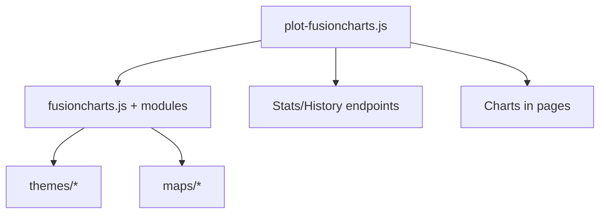

<!-- CATALOG:PATH="airline-web\public\fusioncharts" SLUG="airline-web__public__fusioncharts" -->

# Repo Catalogue — airline-web\public\fusioncharts

*Slug:* `airline-web__public__fusioncharts`  
*Commit:* `6160503`  
*Generated:* `2025-11-13T01:06:28Z`

Important note about listing completeness:
- Listing gathered via GitHub Contents API. For a complete, authoritative view of this folder, browse: https://github.com/joshuac-dev/airline/tree/master/airline-web/public/fusioncharts

**Summary (2–4 sentences):** Vendored FusionCharts library and modules (core, charts, widgets, maps, themes) used by the legacy UI for data visualization. These scripts expose the global FusionCharts runtime and specialized chart types (e.g., Gantt, Treemap, Zoomscatter) and include regional map packs (world/USA) and multiple themes. They are consumed by app-level adapters (e.g., public/javascripts/plot-fusioncharts.js) to render link histories, stats, heatmaps, and dashboards.

**Contents overview**
- Files: 17  |  Subfolders: 2  |  Languages: JavaScript (~98%), Text/CSS (~2%)
- Notable responsibilities:
  - Provide the FusionCharts runtime and chart modules used across the UI.
  - Supply map definitions (world/USA) and themes (carbon, fint, ocean, zune).
  - Expose a jQuery plugin bridge for embedding charts in DOM.
  - Serve as the visualization backend for analytics pages and time-series plots.

### File entries

#### airline-web/public/fusioncharts/fusioncharts.js

```yaml
file: airline-web/public/fusioncharts/fusioncharts.js
lang: JavaScript
role: "FusionCharts core runtime (global FusionCharts object, rendering engine, base chart APIs)"
size:
  lines_est: 30000
  functions_est: 800
  classes_est: 0
public_api:
  routes: []
  exports:
    - name: FusionCharts
      kind: const
      summary: "Global runtime for creating and rendering charts (FusionCharts(chartConfig))."
data_model:
  tables_read: []
  tables_written: []
  migrations: []
  entities: []
queries: { sql: [], orm_calls: [] }
external_io: {}
config:
  env_vars: []
  config_keys: ["FusionCharts.options.* (theme, creditLabel, etc.)"]
  feature_flags: []
concurrency:
  pattern: "Browser event loop; chart render cycles via timers/callbacks"
  shared_state: ["Global FusionCharts registry"]
  timing: "On demand when charts (re)render"
invariants:
  - "Chart instances bound to containers; destroyed on teardown"
error_handling:
  expected_errors: ["Container not found","Invalid data format"]
  retries_timeouts: "Internal redraws on container resize"
security:
  authz: "N/A"
  input_validation: "Chart config/data validation by library"
  sensitive_ops: []
tests: { files: [], coverage_quality: "low" }
similar_or_duplicate_files:
  - "public/javascripts/plot-fusioncharts.js (adapter over this lib)"
rewrite_notes:
  mapping: "Replace with modern charting (e.g., ECharts/Chart.js/Vega) and a thin adapter"
  risks: ["Large vendored payload; licensing; global state coupling"]
  confidence: "med"
```

#### airline-web/public/fusioncharts/fusioncharts.charts.js

```yaml
file: airline-web/public/fusioncharts/fusioncharts.charts.js
lang: JavaScript
role: "Standard chart modules (line, column, area, pie, etc.)"
size:
  lines_est: 4200
  functions_est: 120
  classes_est: 0
public_api:
  routes: []
  exports:
    - name: FusionCharts.modules['charts']
      kind: const
      summary: "Extends FusionCharts with standard chart types"
data_model: {}
queries: {}
external_io: {}
config: { env_vars: [], config_keys: ["default chart options"], feature_flags: [] }
concurrency: { pattern: "Event-driven renders", shared_state: ["FusionCharts registry"], timing: "on render" }
invariants:
  - "Series/categories align with datasets"
rewrite_notes:
  mapping: "Map used types to new chart lib equivalents; keep adapter surface"
  risks: ["Type-specific quirks scattered in adapter code"]
  confidence: "high"
```

#### airline-web/public/fusioncharts/fusioncharts.gantt.js

```yaml
file: airline-web/public/fusioncharts/fusioncharts.gantt.js
lang: JavaScript
role: "Gantt chart module (timelines, tasks, dependencies)"
size:
  lines_est: 2500
  functions_est: 80
  classes_est: 0
public_api:
  exports:
    - name: FusionCharts.modules['gantt']
      kind: const
      summary: "Adds Gantt charts to FusionCharts"
rewrite_notes:
  mapping: "If retained, ensure replacement lib supports Gantt or scope feature out"
  risks: ["Niche module; migration complexity if used"]
  confidence: "med"
```

#### airline-web/public/fusioncharts/fusioncharts.maps.js

```yaml
file: airline-web/public/fusioncharts/fusioncharts.maps.js
lang: JavaScript
role: "Maps base module (coordinates, regions handling)"
size:
  lines_est: 3200
  functions_est: 90
  classes_est: 0
public_api:
  exports:
    - name: FusionCharts.modules['maps']
      kind: const
      summary: "Enables map visualizations and consumes map packs"
rewrite_notes:
  mapping: "Prefer dedicated map libs (Leaflet/Mapbox GL) or new chart lib map plugin"
  risks: ["Mixed responsibilities with existing map UI (map-style.js)"]
  confidence: "med"
```

#### airline-web/public/fusioncharts/fusioncharts.powercharts.js

```yaml
file: airline-web/public/fusioncharts/fusioncharts.powercharts.js
lang: JavaScript
role: "Advanced chart types (multi-axis, radar, etc.)"
size:
  lines_est: 12500
  functions_est: 300
  classes_est: 0
public_api:
  exports:
    - name: FusionCharts.modules['powercharts']
      kind: const
      summary: "Adds advanced charts to FusionCharts"
rewrite_notes:
  mapping: "Audit which advanced types are actually used; avoid over-vendoring"
  risks: ["Large payload; low utilization risk"]
  confidence: "med"
```

#### airline-web/public/fusioncharts/fusioncharts.ssgrid.js

```yaml
file: airline-web/public/fusioncharts/fusioncharts.ssgrid.js
lang: JavaScript
role: "Scroll/Spreadsheet-like grid visual"
size:
  lines_est: 350
  functions_est: 20
  classes_est: 0
public_api:
  exports:
    - name: FusionCharts.modules['ssgrid']
      kind: const
      summary: "Adds spreadsheet/grid visualization"
rewrite_notes:
  mapping: "Replace with native table/grid or lightweight grid lib"
  risks: ["Unnecessary if rarely used"]
  confidence: "high"
```

#### airline-web/public/fusioncharts/fusioncharts.treemap.js

```yaml
file: airline-web/public/fusioncharts/fusioncharts.treemap.js
lang: JavaScript
role: "Treemap visualization module"
size:
  lines_est: 1500
  functions_est: 60
  classes_est: 0
public_api:
  exports:
    - name: FusionCharts.modules['treemap']
      kind: const
      summary: "Adds treemap charts"
rewrite_notes:
  mapping: "Use replacement lib treemap or drop if unused"
  risks: []
  confidence: "high"
```

#### airline-web/public/fusioncharts/fusioncharts.widgets.js

```yaml
file: airline-web/public/fusioncharts/fusioncharts.widgets.js
lang: JavaScript
role: "Widgets (gauges, funnels, etc.)"
size:
  lines_est: 8000
  functions_est: 220
  classes_est: 0
public_api:
  exports:
    - name: FusionCharts.modules['widgets']
      kind: const
      summary: "Adds widget chart types"
rewrite_notes:
  mapping: "Inventory actual widget usage; avoid migrating unused types"
  risks: ["Adapter complexity for specialized widgets"]
  confidence: "med"
```

#### airline-web/public/fusioncharts/fusioncharts.zoomscatter.js

```yaml
file: airline-web/public/fusioncharts/fusioncharts.zoomscatter.js
lang: JavaScript
role: "Zoomable scatter/bubble charts"
size:
  lines_est: 1400
  functions_est: 55
  classes_est: 0
public_api:
  exports:
    - name: FusionCharts.modules['zoomscatter']
      kind: const
      summary: "Adds zoomable scatter charts"
rewrite_notes:
  mapping: "Use lib with zoom/pan interactions"
  risks: []
  confidence: "high"
```

#### airline-web/public/fusioncharts/fusioncharts-jquery-plugin.js

```yaml
file: airline-web/public/fusioncharts/fusioncharts-jquery-plugin.js
lang: JavaScript
role: "jQuery bridge for embedding FusionCharts via $.fn"
size:
  lines_est: 700
  functions_est: 30
  classes_est: 0
public_api:
  exports:
    - name: $.fn.insertFusionCharts
      kind: fn
      summary: "Create and render a chart inside selected element(s)"
    - name: $.fn.updateFusionCharts
      kind: fn
      summary: "Update chart data/options"
    - name: $.fn.disposeFusionCharts
      kind: fn
      summary: "Destroy chart instance(s)"
similar_or_duplicate_files:
  - "public/javascripts/plot-fusioncharts.js (main adapter uses FusionCharts directly)"
rewrite_notes:
  mapping: "Remove jQuery dependency; call chart lib via framework components"
  risks: ["Legacy jQuery dependency footprint"]
  confidence: "high"
```

#### airline-web/public/fusioncharts/maps/fusioncharts.world.js

```yaml
file: airline-web/public/fusioncharts/maps/fusioncharts.world.js
lang: JavaScript
role: "World map pack (geo regions/paths)"
size:
  lines_est: 4800
  functions_est: 5
  classes_est: 0
public_api:
  exports:
    - name: FusionCharts.maps['world']
      kind: const
      summary: "Map definition for world regions"
rewrite_notes:
  mapping: "Prefer modern map libs or GeoJSON + renderer"
  risks: ["Heavy payload; static geometry"]
  confidence: "med"
```

#### airline-web/public/fusioncharts/maps/fusioncharts.usa.js

```yaml
file: airline-web/public/fusioncharts/maps/fusioncharts.usa.js
lang: JavaScript
role: "USA map pack (states regions/paths)"
size:
  lines_est: 4300
  functions_est: 5
  classes_est: 0
public_api:
  exports:
    - name: FusionCharts.maps['usa']
      kind: const
      summary: "Map definition for the USA"
rewrite_notes:
  mapping: "Use modern map library or vector tiles"
  risks: []
  confidence: "med"
```

#### airline-web/public/fusioncharts/maps/readme.txt

```yaml
file: airline-web/public/fusioncharts/maps/readme.txt
lang: Text
role: "Map module readme (usage notes, licensing pointers)"
size:
  lines_est: 10
  functions_est: 0
  classes_est: 0
public_api: {}
rewrite_notes:
  mapping: "Confirm map licensing; avoid bundling proprietary packs"
  risks: ["License compliance"]
  confidence: "high"
```

#### airline-web/public/fusioncharts/themes/fusioncharts.theme.carbon.js

```yaml
file: airline-web/public/fusioncharts/themes/fusioncharts.theme.carbon.js
lang: JavaScript
role: "Theme (Carbon) defining colors/typography for charts"
size:
  lines_est: 180
  functions_est: 6
  classes_est: 0
public_api:
  exports:
    - name: FusionCharts.register('theme','carbon')
      kind: fn
      summary: "Registers the 'carbon' theme for charts"
rewrite_notes:
  mapping: "Convert theme tokens to design system variables in new stack"
  risks: []
  confidence: "high"
```

#### airline-web/public/fusioncharts/themes/fusioncharts.theme.fint.js

```yaml
file: airline-web/public/fusioncharts/themes/fusioncharts.theme.fint.js
lang: JavaScript
role: "Theme (Fint) for FusionCharts"
size:
  lines_est: 180
  functions_est: 6
  classes_est: 0
public_api:
  exports:
    - name: FusionCharts.register('theme','fint')
      kind: fn
      summary: "Registers the 'fint' theme"
rewrite_notes:
  mapping: "Translate to design tokens; central theme provider"
  risks: []
  confidence: "high"
```

#### airline-web/public/fusioncharts/themes/fusioncharts.theme.ocean.js

```yaml
file: airline-web/public/fusioncharts/themes/fusioncharts.theme.ocean.js
lang: JavaScript
role: "Theme (Ocean) for FusionCharts"
size:
  lines_est: 180
  functions_est: 6
  classes_est: 0
public_api:
  exports:
    - name: FusionCharts.register('theme','ocean')
      kind: fn
      summary: "Registers the 'ocean' theme"
rewrite_notes:
  mapping: "Unify with app-wide theme system"
  risks: []
  confidence: "high"
```

#### airline-web/public/fusioncharts/themes/fusioncharts.theme.zune.js

```yaml
file: airline-web/public/fusioncharts/themes/fusioncharts.theme.zune.js
lang: JavaScript
role: "Theme (Zune) for FusionCharts"
size:
  lines_est: 180
  functions_est: 6
  classes_est: 0
public_api:
  exports:
    - name: FusionCharts.register('theme','zune')
      kind: fn
      summary: "Registers the 'zune' theme"
rewrite_notes:
  mapping: "Drop in favor of design token-driven theming"
  risks: []
  confidence: "high"
```

## Rollup for airline-web\public\fusioncharts

**Key responsibilities (top 5):**
1. Provide the FusionCharts runtime and chart modules (standard, advanced, widgets).
2. Enable map-based visualizations via base map module and specific packs (world, USA).
3. Supply chart themes and a jQuery embedding plugin.
4. Back analytics UIs (link history, rankings, heatmaps) via app adapters.
5. Centralize visualization capabilities used across the legacy UI.

**Cross-module dependencies (top 10 by frequency):**
- airline-web/public/javascripts/plot-fusioncharts.js → primary adapter using FusionCharts APIs for rendering.
- airline-web/public/javascripts/link-history.js → builds time-series series/options for charts.
- airline-web/public/javascripts/search.js / ranking.js / heatmap.js → may render charts using this lib.
- airline-web/public/javascripts/main.js → global bootstrap, likely loads themes/options.
- airline-web/public/javascripts/libs/highcharts.js → parallel chart lib used elsewhere; consider standardizing on one.
- airline-web/app/controllers/* → expose endpoints delivering chart data (stats, histories), consumed by adapters.
- airline-data stats tables (via airline-rest) → chart datasets originate here.
- airline-web/public/stylesheets/* → theme colors/typography should align with chart themes.
- jQuery (libs/jquery-2.1.4.js) → required for the jQuery plugin (legacy).
- Maps/geo UI (map-style.js) → potential overlap with FusionCharts maps.

**High-leverage files to study first (top 10):**
- public/javascripts/plot-fusioncharts.js — identify exact API surface and data shapes to preserve.
- public/fusioncharts/fusioncharts.js — heavyweight dependency; verify which features are actually used.
- public/fusioncharts/fusioncharts.powercharts.js — advanced types; confirm necessity.
- public/fusioncharts/fusioncharts.widgets.js — inventory widget usage (gauges, funnels).
- public/fusioncharts/fusioncharts.charts.js — core chart types likely used broadly.
- public/fusioncharts/fusioncharts.maps.js — assess conflicts with map stack; remove if unused.
- public/fusioncharts/maps/fusioncharts.world.js — large payload; verify map usage.
- public/fusioncharts/maps/fusioncharts.usa.js — as above.
- public/fusioncharts/themes/* — map theme tokens to new design system.
- public/fusioncharts/fusioncharts-jquery-plugin.js — plan to eliminate jQuery bridge.

**Mermaid: high-level dependency sketch**
