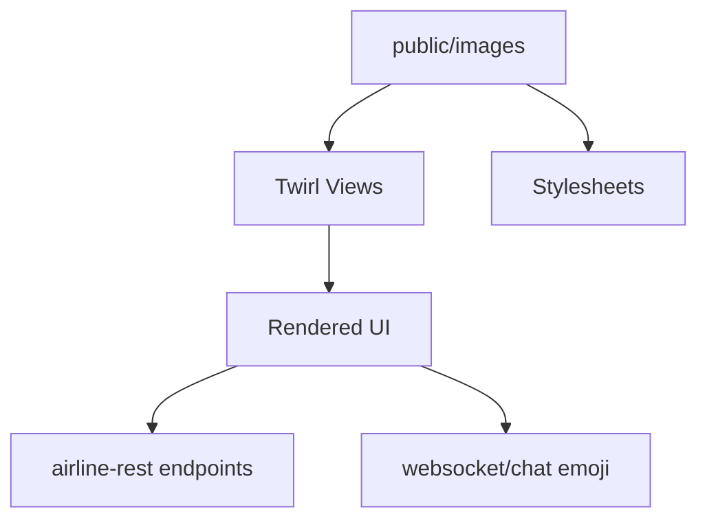

<!-- CATALOG:PATH="airline-web\public\images" SLUG="airline-web__public__images" -->

# Repo Catalogue — airline-web\public\images

*Slug:* `airline-web__public__images`  
*Commit:* `6160503`  
*Generated:* `2025-11-13T00:45:19Z`

Important note about listing completeness:
- This directory primarily contains binary image assets. The GitHub Contents API may not list all files within subfolders due to pagination. For a complete view, browse: https://github.com/joshuac-dev/airline/tree/master/airline-web/public/images

**Summary (2–4 sentences):** Static image assets used by the Play web UI: favicons, UI icons, country flags, map markers, aircraft thumbnails, airport asset illustrations, emoji sets, tutorial walkthrough images, and various page-specific backgrounds. These images are referenced by Twirl templates (views), CSS stylesheets, and client scripts to render branding, controls, and data visualizations. In the rewrite, plan to move these to a versioned assets pipeline/CDN with clear licensing, resolutions, and naming conventions, and replace sprites with vector/icon fonts or componentized SVGs where feasible.

**Contents overview**
- Files: 1 (direct)  |  Subfolders: 14  |  Languages: Images (PNG/SVG/GIF) (~100%)
- Notable responsibilities:
  - Provide visual assets for UI components (buttons, icons, tooltips, switches, prompts).
  - Supply map and chart visuals (markers, flags).
  - Brand and theme elements (backgrounds, favicon).
  - Feature-specific art (airplanes, airport assets, tutorial walkthroughs, seasonal/notice imagery).
  - Emoji/smiley sets used in chat.

### File entries

#### airline-web/public/images/favicon.png

```yaml
file: airline-web/public/images/favicon.png
lang: Image (PNG)
role: "Site favicon displayed in browser tabs and bookmarks"
size:
  lines_est: 0
  functions_est: 0
  classes_est: 0
public_api:
  routes: []
  exports: []
data_model:
  tables_read: []
  tables_written: []
  migrations: []
  entities: []
queries: { sql: [], orm_calls: [] }
external_io: { http_calls: [], message_queues: [], files_read: [], files_written: [] }
config: { env_vars: [], config_keys: [], feature_flags: [] }
concurrency:
  pattern: "N/A"
  shared_state: []
  timing: "Static asset served by web server"
invariants:
  - "Small file size; square aspect"
error_handling: { expected_errors: [], retries_timeouts: "N/A" }
security: { authz: "public", input_validation: "N/A", sensitive_ops: [] }
tests:
  files: []
  coverage_quality: "low"
  golden_seeds: []
similar_or_duplicate_files: []
rewrite_notes:
  mapping: "Provide multiple sizes and a web app manifest for PWA; serve via CDN"
  risks: ["Stale caches after branding changes"]
  confidence: "high"
```

### Subfolder overviews (aggregated assets)

- airline-web/public/images/about
  - Purpose: Backgrounds and illustrations used on the About page.
  - Typical files: PNG/JPG banners, decorative images.
  - Referenced by: views/about.scala.html, about*.css.

- airline-web/public/images/airplanes
  - Purpose: Aircraft thumbnails/illustrations per model or family.
  - Typical files: PNG/SVG silhouettes or detailed renders.
  - Referenced by: airplane model lists, fleet pages, tooltips.

- airline-web/public/images/airport-assets
  - Purpose: Visuals for airport facilities/assets (e.g., lounges, hubs, buildings).
  - Typical files: PNG/SVG icons or isometric building art.
  - Referenced by: AirportAsset UI, asset income displays.

- airline-web/public/images/background
  - Purpose: Generic/background textures used across pages.
  - Typical files: Large JPG/PNG backgrounds, gradients.
  - Referenced by: main.css, themed layouts.

- airline-web/public/images/buildings
  - Purpose: Building images used in asset/airport visuals.
  - Typical files: PNG/SVG building silhouettes or sprites.
  - Referenced by: Airport pages, asset views.

- airline-web/public/images/buttons
  - Purpose: Button skins/graphics (legacy) for UI controls.
  - Typical files: PNG sprites for hover/active states.
  - Referenced by: older views; consider replacing with CSS.

- airline-web/public/images/clips
  - Purpose: Clipart/illustrative icons used across the UI.
  - Typical files: PNG/SVG miscellaneous icons.
  - Referenced by: various pages and prompts.

- airline-web/public/images/emoji
  - Purpose: Emoji set used in chat/comments.
  - Typical files: PNG emoji images or sprite sheets.
  - Referenced by: websocket/chat UI, message rendering.

- airline-web/public/images/flags
  - Purpose: Country flags, used throughout country/airport/route UIs.
  - Typical files: PNG/SVG flags (by ISO code).
  - Referenced by: Country pages, search, link details; ensure ISO code mapping and consistent sizes.

- airline-web/public/images/icons
  - Purpose: General-purpose UI icons (settings, search, alerts).
  - Typical files: PNG/SVG; replace with a vector icon system in rewrite.
  - Referenced by: headers, menus, modals.

- airline-web/public/images/markers
  - Purpose: Map markers/pins for airports/routes.
  - Typical files: PNG/SVG marker variants by type/status.
  - Referenced by: map components (Leaflet/Google Maps or custom), heatmaps.

- airline-web/public/images/notice
  - Purpose: Notice/alert badges and illustrations.
  - Typical files: PNG/SVG notice icons (info/warn/error/success).
  - Referenced by: Notice/Alert UI.

- airline-web/public/images/smiley
  - Purpose: Legacy smiley set for chat/comments.
  - Typical files: PNG smileys; likely overlaps with emoji set.
  - Referenced by: Chat pages; consider consolidating with emoji.

- airline-web/public/images/tutorial
  - Purpose: Tutorial step illustrations and callouts.
  - Typical files: PNG/JPG annotated screenshots or diagrams.
  - Referenced by: TutorialApplication, onboarding flows.

## Rollup for airline-web\public\images

**Key responsibilities (top 5):**
1. Provide all static imagery for UI branding, controls, data indicators (flags/markers), and feature-specific views.
2. Support chat and social features with emoji/smiley assets.
3. Supply airplane and airport asset visuals to enhance domain comprehension in UI.
4. Deliver background and decorative images for pages (About, tutorials).
5. Serve notice/alert icons to ensure clear system messaging.

**Cross-module dependencies (top 10 by frequency):**
- airline-web/app/views → templates reference these images directly in markup.
- airline-web/public/stylesheets → CSS background-image rules and component skins.
- airline-web/app/controllers → select endpoints/pages render views that include these assets.
- airline-web/app/websocket/chat → uses emoji/smiley assets in message rendering.
- airline-web/app/controllers/CountryApplication.scala → displays country flags in UI.
- airline-web/app/controllers/HeatmapApplication.scala → markers/legends for maps (indirectly via views).
- airline-web/app/controllers/AirplaneApplication.scala → airplane thumbnails in fleet pages.
- airline-web/app/controllers/AirportAssetApplication.scala → asset imagery in facility pages.
- airline-web/app/controllers/NoticeApplication.scala / AlertApplication.scala → notice/alert icons.
- airline-rest/conf/routes → static asset serving (framework-level), no direct coupling.

**High-leverage files to study first (top 10):**
- images/flags/* — ensure ISO code mapping, size/ratio consistency; candidate for SVG sprite or icon font.
- images/markers/* — verify naming scheme and variants for map layers; consider vectorizing for scaling.
- images/airplanes/* — cross-reference model identifiers to avoid mismatch; standardize naming and resolutions.
- images/airport-assets/* — verify alignment with asset types/levels; document licensing/source.
- images/emoji/* and images/smiley/* — consolidate into a single emoji pipeline; consider Unicode-based rendering.
- images/background/* and images/about/* — define theme tokens and lazy-loading strategy.
- images/icons/* — replace with a unified icon set (SVG + component library) to reduce duplicates.
- images/buttons/* — eliminate bitmap buttons in favor of CSS components.
- images/tutorial/* — define content pipeline and localization strategy.
- favicon.png — expand to complete favicon/app-icon set (ico/png/svg + manifest).

**Mermaid: high-level dependency sketch (optional, if meaningful)**
