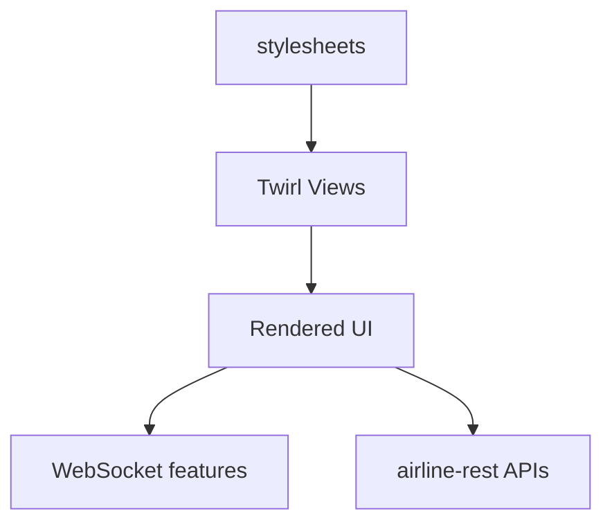

<!-- CATALOG:PATH="airline-web\public\stylesheets" SLUG="airline-web__public__stylesheets" -->

# Repo Catalogue — airline-web\public\stylesheets

*Slug:* `airline-web__public__stylesheets`  
*Commit:* `6160503`  
*Generated:* `2025-11-13T00:43:30Z`

Important note about listing completeness:
- This folder listing was gathered via the GitHub Contents API and may be incomplete due to pagination. For a complete, authoritative view of files under this path, browse: https://github.com/joshuac-dev/airline/tree/master/airline-web/public/stylesheets

**Summary (2–4 sentences):** Static CSS stylesheets for the airline-web UI, covering global layout/typography, component skins (search, chat, tooltips, prompts, switches), page-specific views (about, profile, country, campaign, departures) and theming (classic, modern) plus responsive overrides (mobile). These styles dictate look-and-feel and UX affordances across the Play-rendered pages and client scripts. In the rewrite, migrate these to a modern design system (tokens, CSS variables) and component-scoped styling (CSS Modules/Tailwind/Styled Components) with responsive breakpoints standardized.

**Contents overview**
- Files: 17  |  Subfolders: 0  |  Languages: CSS (100%)
- Notable responsibilities:
  - Global baseline and layout (main.css), mobile/responsive overrides (mobile.css).
  - Theme variants (classic.css, modern.css) and experimental/new overrides (new-style.css).
  - Feature/page-focused styling: search, chat, campaign, country, profile, departures.
  - UI controls/widgets: select dropdowns, tooltips, switches, prompts.
  - About page backgrounds and content styling.

### File entries

#### airline-web/public/stylesheets/about-background.css

```yaml
file: airline-web/public/stylesheets/about-background.css
lang: CSS
role: "Background imagery/gradient and layout for the About page backdrop"
size:
  lines_est: 15
  functions_est: 0
  classes_est: 0
public_api:
  routes: []
  exports: []
data_model:
  tables_read: []
  tables_written: []
  migrations: []
  entities: []
queries: { sql: [], orm_calls: [] }
external_io: {}
config: {}
concurrency:
  pattern: "N/A (static CSS)"
  shared_state: []
  timing: "applies on page render"
invariants:
  - "Background scales and positions consistently across viewports"
error_handling: {}
security: {}
tests:
  files: []
  coverage_quality: "low"
  golden_seeds: []
similar_or_duplicate_files:
  - "airline-web/public/stylesheets/about.css"
rewrite_notes:
  mapping: "Convert background assets/styles to theme tokens or component styles"
  risks: ["Hard-coded dimensions; potential duplication with about.css"]
  confidence: "high"
```

#### airline-web/public/stylesheets/about.css

```yaml
file: airline-web/public/stylesheets/about.css
lang: CSS
role: "Typography and content layout for About page"
size:
  lines_est: 140
  functions_est: 0
  classes_est: 0
public_api: { routes: [], exports: [] }
data_model: { tables_read: [], tables_written: [], migrations: [], entities: [] }
queries: {}
external_io: {}
config: {}
concurrency: { pattern: "N/A", shared_state: [], timing: "render-time" }
invariants:
  - "Readable contrast and spacing across devices"
error_handling: {}
security: {}
tests: { files: [], coverage_quality: "low" }
similar_or_duplicate_files:
  - "about-background.css"
rewrite_notes:
  mapping: "Move to componentized About page styles"
  risks: ["Specificity wars with main.css"]
  confidence: "high"
```

#### airline-web/public/stylesheets/campaign.css

```yaml
file: airline-web/public/stylesheets/campaign.css
lang: CSS
role: "UI styles for marketing campaign views (forms, progress, cards)"
size:
  lines_est: 40
  functions_est: 0
  classes_est: 0
public_api: {}
data_model: {}
queries: {}
external_io: {}
config: {}
concurrency: { pattern: "N/A" }
invariants:
  - "Campaign tiles/forms align in grid at different sizes"
error_handling: {}
security: {}
tests: {}
similar_or_duplicate_files: []
rewrite_notes:
  mapping: "Design-system variants for campaign components"
  risks: ["Ad hoc spacing vs global rhythm"]
  confidence: "high"
```

#### airline-web/public/stylesheets/chat.css

```yaml
file: airline-web/public/stylesheets/chat.css
lang: CSS
role: "Chat UI styles (message list, bubbles, input, presence indicators)"
size:
  lines_est: 120
  functions_est: 0
  classes_est: 0
public_api: {}
data_model: {}
queries: {}
external_io: {}
config: {}
concurrency: { pattern: "N/A" }
invariants:
  - "Message timestamps and bubbles remain legible at min width"
error_handling: {}
security: {}
tests: {}
similar_or_duplicate_files: []
rewrite_notes:
  mapping: "Map to chat components with dark/light themes"
  risks: ["Overflow/scroll behavior inconsistent across browsers"]
  confidence: "med"
```

#### airline-web/public/stylesheets/classic.css

```yaml
file: airline-web/public/stylesheets/classic.css
lang: CSS
role: "Legacy/classic theme overrides"
size:
  lines_est: 2
  functions_est: 0
  classes_est: 0
public_api: {}
data_model: {}
queries: {}
external_io: {}
config: {}
concurrency: { pattern: "N/A" }
invariants:
  - "Overrides do not break base token scales"
error_handling: {}
security: {}
tests: {}
similar_or_duplicate_files:
  - "modern.css"
rewrite_notes:
  mapping: "Theme token mapping in new design system"
  risks: ["Sparse and possibly diverged from modern.css"]
  confidence: "high"
```

#### airline-web/public/stylesheets/country.css

```yaml
file: airline-web/public/stylesheets/country.css
lang: CSS
role: "Country page styles (tables, badges, relationship indicators)"
size:
  lines_est: 35
  functions_est: 0
  classes_est: 0
public_api: {}
invariants:
  - "Flags/icons align with text baseline"
rewrite_notes:
  mapping: "Component styles for country detail modules"
  risks: ["Inline icons/asset dependencies"]
  confidence: "high"
```

#### airline-web/public/stylesheets/departures.css

```yaml
file: airline-web/public/stylesheets/departures.css
lang: CSS
role: "Departures/arrivals board styles (monospace grid, status color-coding)"
size:
  lines_est: 40
  functions_est: 0
  classes_est: 0
invariants:
  - "Monospace layout maintains column alignment"
rewrite_notes:
  mapping: "Table/grid components with status tokens"
  risks: ["Assumes fixed widths; check localization overflow"]
  confidence: "med"
```

#### airline-web/public/stylesheets/main.css

```yaml
file: airline-web/public/stylesheets/main.css
lang: CSS
role: "Global baseline styles: layout grid, typography, forms, buttons, modals"
size:
  lines_est: 900
  functions_est: 0
  classes_est: 0
public_api: {}
concurrency: { pattern: "N/A" }
invariants:
  - "Consistent spacing, color, and z-index scales across components"
  - "Accessible color contrast for text and UI controls"
rewrite_notes:
  mapping: "Extract tokens (spacing, color, typography) and component primitives"
  risks: ["Global selectors, high specificity; potential cascade conflicts"]
  confidence: "med"
```

#### airline-web/public/stylesheets/mobile.css

```yaml
file: airline-web/public/stylesheets/mobile.css
lang: CSS
role: "Responsive/mobile overrides via media queries"
size:
  lines_est: 95
  functions_est: 0
  classes_est: 0
invariants:
  - "Touch targets meet minimum sizes"
  - "Critical flows usable on small screens"
rewrite_notes:
  mapping: "Consolidate breakpoints; mobile-first strategy"
  risks: ["Breakpoints drift vs main.css"]
  confidence: "high"
```

#### airline-web/public/stylesheets/modern.css

```yaml
file: airline-web/public/stylesheets/modern.css
lang: CSS
role: "Modern theme overrides (colors, surfaces, elevation)"
size:
  lines_est: 360
  functions_est: 0
  classes_est: 0
invariants:
  - "Theme variables override base without breaking contrast ratios"
rewrite_notes:
  mapping: "Theme layer with CSS variables and prefers-color-scheme support"
  risks: ["Duplicated rules vs main.css; specificity issues"]
  confidence: "med"
```

#### airline-web/public/stylesheets/new-style.css

```yaml
file: airline-web/public/stylesheets/new-style.css
lang: CSS
role: "Experimental or transitional styleset"
size:
  lines_est: 60
  functions_est: 0
  classes_est: 0
invariants:
  - "Scoped selectors avoid leaking into legacy pages"
rewrite_notes:
  mapping: "Fold validated patterns into tokens/components; remove leftovers"
  risks: ["Unclear ownership; may conflict with main.css"]
  confidence: "low"
```

#### airline-web/public/stylesheets/profile.css

```yaml
file: airline-web/public/stylesheets/profile.css
lang: CSS
role: "User profile page styling (forms, avatar, lists)"
size:
  lines_est: 38
  functions_est: 0
  classes_est: 0
invariants:
  - "Form inputs consistent with global form styles"
rewrite_notes:
  mapping: "Profile component styles with shared form primitives"
  risks: ["Overrides global form styles locally"]
  confidence: "high"
```

#### airline-web/public/stylesheets/prompt.css

```yaml
file: airline-web/public/stylesheets/prompt.css
lang: CSS
role: "Prompt/notice widgets (inline prompts, banners)"
size:
  lines_est: 10
  functions_est: 0
  classes_est: 0
invariants:
  - "Prompts readable and non-obtrusive"
rewrite_notes:
  mapping: "Alert/notice components with variants"
  risks: ["Duplication with notice/alert styling elsewhere"]
  confidence: "high"
```

#### airline-web/public/stylesheets/search.css

```yaml
file: airline-web/public/stylesheets/search.css
lang: CSS
role: "Search UI styles: inputs, results list/grid, highlight matches"
size:
  lines_est: 170
  functions_est: 0
  classes_est: 0
invariants:
  - "Result rows wrap/ellipsis gracefully"
rewrite_notes:
  mapping: "Search components; consistent empty/loading states"
  risks: ["Hard-coded widths; performance with large lists"]
  confidence: "med"
```

#### airline-web/public/stylesheets/select.css

```yaml
file: airline-web/public/stylesheets/select.css
lang: CSS
role: "Custom select/dropdown styling (menus, options, focus)"
size:
  lines_est: 45
  functions_est: 0
  classes_est: 0
invariants:
  - "Accessible focus states; keyboard navigable"
rewrite_notes:
  mapping: "Accessible select components or native-enhanced styling"
  risks: ["Cross-browser inconsistencies"]
  confidence: "high"
```

#### airline-web/public/stylesheets/sign-up.css

```yaml
file: airline-web/public/stylesheets/sign-up.css
lang: CSS
role: "Placeholder for signup page styles (currently empty)"
size:
  lines_est: 1
  functions_est: 0
  classes_est: 0
invariants: []
rewrite_notes:
  mapping: "Remove or implement as part of profile/auth design system"
  risks: ["Empty file indicates drift or dead asset"]
  confidence: "high"
```

#### airline-web/public/stylesheets/switch.css

```yaml
file: airline-web/public/stylesheets/switch.css
lang: CSS
role: "Toggle switch controls (on/off states, animations)"
size:
  lines_est: 95
  functions_est: 0
  classes_est: 0
invariants:
  - "Hit area sufficient; state clearly distinguished"
rewrite_notes:
  mapping: "Form control component with ARIA states"
  risks: ["Contrast/visibility in different themes"]
  confidence: "high"
```

#### airline-web/public/stylesheets/tooltip.css

```yaml
file: airline-web/public/stylesheets/tooltip.css
lang: CSS
role: "Tooltip component styles (arrow, placement spacing, z-index)"
size:
  lines_est: 65
  functions_est: 0
  classes_est: 0
invariants:
  - "Tooltip above other UI (z-index stack); readable at small sizes"
rewrite_notes:
  mapping: "Tooltip component with portal/layer system in new UI"
  risks: ["Z-index conflicts; pointer-events quirks"]
  confidence: "high"
```

## Rollup for airline-web\public\stylesheets

**Key responsibilities (top 5):**
1. Provide global baseline styling and layout scaffolding for the entire web UI.
2. Implement theming variants (classic/modern) and responsive behavior (mobile).
3. Style feature-specific pages and widgets (search, chat, campaign, country, profile, departures).
4. Define reusable UI controls (selects, switches, tooltips, prompts) for consistent behavior.
5. Maintain visual consistency, accessibility (contrast, focus states), and responsive readability.

**Cross-module dependencies (top 10 by frequency):**
- airline-web/app/views → these styles are referenced by Twirl templates for page structure.
- airline-web/app/controllers → determine which pages and widgets are rendered/visible.
- airline-web/public/progress-bar → complementary UI asset used alongside these styles.
- airline-web/app/websocket → chat.css used by chat pages that open WS connections.
- airline-rest → indirectly affects content density and states styled by these CSS files.
- External fonts/assets (if any) → implied by typography rules in main.css (not inspected here).

**High-leverage files to study first (top 10):**
- public/stylesheets/main.css — baseline tokens, layout primitives, and global rules to extract.
- public/stylesheets/modern.css — theme overrides to translate into CSS variables/design tokens.
- public/stylesheets/mobile.css — breakpoints and responsive overrides to consolidate.
- public/stylesheets/search.css — complex list/grid patterns; ensure accessibility/performance.
- public/stylesheets/chat.css — real-time chat UX considerations.
- public/stylesheets/tooltip.css — layering/z-index model and accessibility of tooltips.
- public/stylesheets/switch.css — interactive control states and size targets.
- public/stylesheets/select.css — custom select styling and focus/keyboard behavior.
- public/stylesheets/country.css — table/list presentation standards.
- public/stylesheets/campaign.css — cards/forms patterns for marketing flows.

**Mermaid: high-level dependency sketch**
